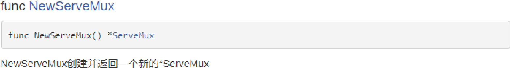

# 第1章 简介

## 1.1 Web 应用简介

Web 应用在我们的生活中无处不在。看看我们日常使用的各个应用程序，它们要么是 Web 应用，要么是移动 App 这类 Web 应用的变种。无论哪一种编程语言，只要它能够开发出与人类交互的软件，它就必然会支持 Web 应用开发。对一门崭新的编程语言来说，它的开发者首先要做的一件事，就是构建与互联网( Internet)和万维网( World Wide Web)交互的库( library)和框架，而那些更为成熟的编程语言还会有各种五花八门的 Web 开发工具。

Go 是一门刚开始崭露头角的语言，它是为了让人们能够简单而高效地编写后端系统而创建的。这门语言拥有众多的先进特性，如**函数式编程方面的特性**、内置了对**并发编程**的支持、现代化的**包管理系统**、**垃圾收集特性**、以及一些包罗万象威力**强大的标准库**，而且如果需要我们还可以引入第三方开源库。

使用 Go 语言进行 Web 开发正变得日益流行，很多大公司都在使用，如 Google、Facebook、腾讯、百度、阿里巴巴、京东、小米以及 360、美团、滴滴以及新浪等。

## 1.2 Web 应用的工作原理


## 1.3 Hello World

下面，就让我们使用 Go 语言创建一个简单的 Web 应用。

1. 在 GOPATH 下的 src 目录下创建一个 webapp 的文件夹，并在该目录中创建一个main.go 的文件，代码如下

   ```go
   package main
   
   import (
   	"fmt"
   	"net/http"
   )
   
   // 创建处理器函数
   func handler(w http.ResponseWriter, r *http.Request) {
   	fmt.Fprintln(w, "Hello World!", r.URL.Path)
   }
   
   func main() {
   	http.HandleFunc("/", handler)
   	http.ListenAndServe(":8080", nil)
   }
   ```

2. 在终端执行以下命令

   1. **方式一（建议使用）**：在 webapp 目录中**右键**→**在命令提示符中打开**执行 **go build main.go** 命令；然后在当前目录中就会生成一个 **main.exe** 的二进制可执行文件；最后再执行 **./main.exe** 就可以启动服务器

   2. 方式二：在 webapp 目录中**右键**→**在命令提示符中打开**执行 **go install webapp** 命令；然后在 bin 目录中会生成一个 **webapp.exe**的二进制可执行文件；进入 bin 目录之后再 bin 目录中执行 **./webapp.exe** 就可以启动服务器

   3. 在浏览器地址栏输入 http://localhost:8080，在浏览器中就会显示 Hello World! /

      在浏览器地址栏输入 http://localhost:8080/hello，在浏览器中就会显示 Hello World! /hello

   

# 第 2 章：Web 服务器的创建

## 2.1 简介

Go 提供了一系列用于创建 Web 服务器的标准库，而且通过 Go 创建一个服务器的步骤非常简单，只要通过 net/http 包调用 **ListenAndServe** 函数并传入**网络地址**以及负责处理请求的**处理器**( handler )作为参数就可以了。如果网络地址参数为空字符串，那么服务器默认使用 80 端口进行网络连接；如果处理器参数为 nil，那么服务器将使用默认的多路复用器 **DefaultServeMux**，当然，我们也可以通过调用 **NewServeMux** 函数创建一个多路复用器。多路复用器接收到用户的请求之后根据请求的 URL 来判断使用哪个**处理器**来处理请求，找到后就会重定向到对应的处理器来处理请求，

## 2.2 使用默认的多路复用器（DefaultServeMux）

1. **使用处理器函数处理请求**

   ```go
   package main
   
   import (
   	"fmt"
   	"net/http"
   )
   
   // 创建处理器函数
   func handler(w http.ResponseWriter, r *http.Request) {
   	fmt.Fprintln(w, "正在通过处理器函数处理你的请求")
   }
   
   func main() {
   	http.HandleFunc("/", handler)
   	http.ListenAndServe(":8080", nil)
   }
   ```

   1. HandleFunc 方法的说明

      

   2. **处理器函数的实现原理**：

      

2.  使用处理器处理请求

   ```go
   package main
   
   import (
   	"fmt"
   	"net/http"
   )
   
   type MyHandler struct {
   }
   
   func (h *MyHandler) ServeHTTP(writer http.ResponseWriter, request *http.Request) {
   	fmt.Fprintln(writer, "正在通过处理器处理你的请求")
   }
   
   func main() {
   	myHandler := MyHandler{}
   	//调用处理器
   	http.Handle("/test", &myHandler)
   	http.ListenAndServe(":8080", nil)
   }
   ```

   1. Handle 方法的说明

      

   2. 关于处理器 Handler 的说明

      

      也就是说只要某个结构体实现了 Handler 接口中的 ServeHTTP 方法那么它就是一个处理器

   3. **我们还可以通过 Server 结构对服务器进行更详细的配置**

      

      ```go
      package main
      
      import (
      	"fmt"
      	"net/http"
      	"time"
      )
      
      type MyHandler struct {
      }
      
      func (h *MyHandler) ServeHTTP(writer http.ResponseWriter, request *http.Request) {
      	fmt.Fprintln(writer, "正在通过处理器处理你的请求")
      }
      
      func main() {
      	myHandler := MyHandler{}
      	server := http.Server{
      		Addr:    ":8888",
      		Handler: &myHandler,
      		ReadTimeout: 5 * time.Second,
      	}
      	server.ListenAndServe()
      }
      ```

## 2.3 使用自己创建的多路复用器

1. 在创建服务器时，我们还可以通过 **NewServeMux** 方法创建一个多路复用器

   

```go
package main

import (
	"fmt"
	"net/http"
)

func handler(w http.ResponseWriter, r *http.Request) {
	fmt.Fprintln(w, "通过自己创建的多路复用器来处理请求")
}

func main() {
	mux := http.NewServeMux()
	mux.HandleFunc("/myMux", handler)
	mux.HandleFunc("/test", handler)
	http.ListenAndServe(":8080", mux)
}
```

结构体 ServeMux


结构体 ServeMux 的相关方法


# **第 3 章：HTTP 协议** 

因为编写 Web 应用必须对 HTTP 有所了解，所以接下来我们对 HTTP 进行介绍。

## 3.1 HTTP 协议简介

HTTP **超文本传输协议** (HTTP-Hypertext transfer protocol)，是一个属于应用层的面向对象的协议，由于其简捷、快速的方式，适用于分布式超媒体信息系统。它于 1990年提出，经过几年的使用与发展，得到不断地完善和扩展。**它是一种详细规定了浏览器和万维网服务器之间互相通信的规则**，通过因特网传送万维网文档的数据传送协议。

客户端与服务端通信时传输的内容我们称之为**报文**。HTTP 就是一个通信规则，这个规则规定了客户端发送给服务器的报文格式，也规定了服务器发送给客户端的报文格式。实际我们要学习的就是这两种报文。客户端发送给服务器的称为”**请求报文**“，服务器发送给客户端的称为”**响应报文**“。

## 3.2 HTTP 协议的发展历程

超文本传输协议的前身是世外桃源(Xanadu)项目，超文本的概念是泰德˙纳尔森(Ted Nelson)在 1960 年代提出的。进入哈佛大学后，纳尔森一直致力于超文本协议和该项目的研究，但他从未公开发表过资料。1989 年，**蒂姆˙伯纳斯˙李**(Tim Berners Lee)在 CERN(欧洲原子核研究委员会 = European Organization for Nuclear Research)担任软件咨询师的时候，开发了一套程序，**奠定了万维网(WWW = World Wide Web)的基础**。1990 年12 月，超文本在 CERN 首次上线。1991 年夏天，继 Telnet 等协议之后，超文本转移协议成为互联网诸多协议的一分子。

当时，Telnet 协议解决了一台计算机和另外一台计算机之间一对一的控制型通信的要求。邮件协议解决了一个发件人向少量人员发送信息的通信要求。文件传输协议解决一台计算机从另外一台计算机批量获取文件的通信要求，但是它不具备一边获取文件一边显示文件或对文件进行某种处理的功能。新闻传输协议解决了一对多新闻广播的通信要求。而超文本要解决的通信要求是：在一台计算机上获取并显示存放在多台计算机里的文本、数据、图片和其他类型的文件；它包含两大部分：超文本转移协议和超文本标记语言(HTML)。HTTP、HTML 以及浏览器的诞生给互联网的普及带来了飞跃。

## 3.3 HTTP 协议的会话方式

 浏览器与服务器之间的通信过程要经历**四个步骤**


浏览器与 WEB 服务器的连接过程是短暂的，每次连接只处理一个请求和响应。对每一个页面的访问，浏览器与 WEB 服务器都要建立一次单独的连接。

浏览器到 WEB 服务器之间的所有通讯都是完全独立分开的请求和响应对。

## 3.4 HTTP1.0 和 HTTP1.1 的区别

在 HTTP1.0 版本中，浏览器请求一个带有图片的网页，会由于下载图片而与服务器之间开启一个新的连接；但在 HTTP1.1 版本中，允许浏览器在拿到当前请求对应的全部资源后再断开连接，提高了效率。


**HTTP 1.1 是目前使用最为广泛的一个版本**，而**最新的一个版本则是 HTTP 2.0**，又称 HTTP/2。在开放互联网上 HTTP 2.0 将只用于 https://网址。HTTPS,即 SSL（SecureSocket Layer，安全套接字层）之上的 HTTP,实际上就是在 SSL/TLS 连接的上层进行 HTTP通信。

**备注**：SSL 最初由 Netscape 公司开发，之后由 IETF（Internet Engineering Task Force，互联网工程任务组）接手并将其改名为 TLS（Transport Layer Security，传输层安全协议）

## 3.5 报文

### 3.5.1 报文格式


### 3.5.2 请求报文

报文格式

```
请求首行（请求行）；
请求头信息（请求头）；
空行；
请求体；
```

Get 请求

```
GET /Hello/index.jsp HTTP/1.1
Accept: */*
Accept-Language: zh-CN
User-Agent: Mozilla/4.0 (compatible; MSIE 8.0; Windows NT 6.1; WOW64; 
Trident/4.0; SLCC2; .NET CLR 2.0.50727; .NET CLR 3.5.30729; .NET CLR 3.0.30729; 
Media Center PC 6.0; .NET4.0C; .NET4.0E)
Accept-Encoding: gzip, deflate
Host: localhost:8080
Connection: Keep-Alive
Cookie: JSESSIONID=C55836CDA892D9124C03CF8FE8311B15
```

**Get 请求没有请求体，Post 请求才有请求体**

 

- GET /Hello/index.jsp HTTP/1.1 ： GET 请 求 ， 请 求 服 务 器 路 径 为Hello/index.jsp，协议为 1.1； 

- Host:localhost：请求的主机名为 localhost； 

-  User-Agent: Mozilla/4.0 (compatible; MSIE 8.0…：与浏览器和 OS 相关的信息。有些网站会显示用户的系统版本和浏览器版本信息，这都是通过获取 User Agent 头信息而来的；

- Accept: */*：告诉服务器，当前客户端可以接收的文档类型， */*，就表示什么都可以接收；

- Accept-Language: zh-CN：当前客户端支持的语言，可以在浏览器的工具选项中找到语言相关信息；

- Accept-Encoding: gzip, deflate：支持的压缩格式。数据在网络上传递时，可能服务器会把数据压缩后再发送；

- Connection: keep-alive：客户端支持的链接方式，保持一段时间链接，默认为 3000ms； 

- Cookie: JSESSIONID=369766FDF6220F7803433C0B2DE36D98：因为不是第一次访问这个地址，所以会在请求中把上一次服务器响应中发送过来的 Cookie在请求中一并发送过去。

Post 请求

```
POST /Hello/target.html HTTP/1.1
Accept: application/x-ms-application, image/jpeg, application/xaml+xml, 
image/gif, image/pjpeg, application/x-ms-xbap, */*
Referer: http://localhost:8080/Hello/
Accept-Language: zh-CN
User-Agent: Mozilla/4.0 (compatible; MSIE 8.0; Windows NT 6.1; WOW64; 
Trident/4.0; SLCC2; .NET CLR 2.0.50727; .NET CLR 3.5.30729; .NET CLR 3.0.30729; 
Media Center PC 6.0; .NET4.0C; .NET4.0E)
Content-Type: application/x-www-form-urlencoded
Accept-Encoding: gzip, deflate
Host: localhost:8080
Content-Length: 14
Connection: Keep-Alive
Cache-Control: no-cache
Cookie: JSESSIONID=774DA38C1B78AE288610D77621590345
username=admin
```

- Referer: http://localhost:8080/hello/index.jsp：请求来自哪个页面，例如你在百度上点击链接到了这里，那么 Referer:http://www.baidu.com；如果你是在浏览器的地址栏中直接输入的地址，那么就没有 Referer 这个请求头了；

- Content-Type: application/x-www-form-urlencoded：表单的数据类型，说明会使用 url 格式编码数据；url 编码的数据都是以“%”为前缀，后面跟随两位的 16 进制，例如“传智”这两个字使用 UTF-8 的 url 编码用为“%E4%BC%A0%E6%99%BA”；

- Content-Length:13：请求体的长度，这里表示 13 个字节。

- username=admin：请求体内容！admin 是在表单中输入的数据，username 是表单字段的名字。

### 3.5.3 响应报文

1） 报文格式

```
响应首行（响应行）；
响应头信息（响应头）；
空行；
响应体；

HTTP/1.1 200 OK
Server: Apache-Coyote/1.1
Content-Type: text/html;charset=UTF-8
Content-Length: 274
Date: Tue, 07 Apr 2015 10:08:26 GMT
<!DOCTYPE html PUBLIC "-//W3C//DTD HTML 4.01 Transitional//EN" >
<html>
<head>
<meta http-equiv="Content-Type" content="text/html; charset=UTF-8">
<title>Insert title here</title>
</head>
<body>
<h1>Hello</h1>
</body>
</html>
```

## 3.6 响应状态码 

1） 状态码用来告诉 HTTP 客户端,HTTP 服务器是否产生了预期的 Response。HTTP/1.1协议中定义了 5 类状态码， 状态码由三位数字组成，第一个数字定义了响应的类别

- 1XX 提示信息 - 表示请求已被成功接收，继续处理

- 2XX 成功 - 表示请求已被成功接收，理解，接受

- 3XX 重定向 - 要完成请求必须进行更进一步的处理

- 4XX 客户端错误 - 请求有语法错误或请求无法实现

- 5XX 服务器端错误 - 服务器未能实现合法的请求

2） 响应码对浏览器来说很重要，它告诉浏览器响应的结果，常见的状态码有：

- 200：请求成功，浏览器会把响应体内容（通常是 html）显示在浏览器中；

- 404：请求的资源没有找到，说明客户端错误的请求了不存在的资源；

- 500：请求资源找到了，但服务器内部出现了错误；

- 302：重定向，当响应码为 302 时，表示服务器要求浏览器重新再发一个请求，服务器会发送一个响应头 Location，它指定了新请求的 URL 地址；

# **第 4 章：操作数据库** 

Go 语言中的 **database/sql** 包定义了对数据库的一系列操作。database/sql/driver包定义了应被数据库驱动实现的接口，这些接口会被 sql 包使用。但是 Go 语言没有提供任何官方的数据库驱动，所以我们需要导入**第三方**的数据库驱动。不过我们连接数据库之后对数据库操作的大部分代码都使用 sql 包。

## 4.1 获取数据库连接

1) 创建一个 db.go 文件，导入 database/sql 包以及第三方驱动包

   ```go
   import (
   	"database/sql"
   	_ "github.com/go-sql-driver/mysql" 
   )
   ```

   

2) 