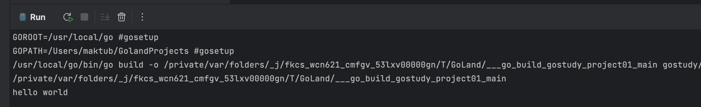

# 第2章 Go语言概述

## 2.1 什么是程序

程序：就是完成某个功能的指令的集合。画一个图理解：

|      |                                    |
| ---- | ---------------------------------- |
|      |  |


##  2.2 Go 语言的诞生小故事

### 2.2.1 Go 语言的核心开发团队


### **2.2.2** Google创造Golang的原因


### **2.2.3**  Golang的发展历程

Ø 2007 年，谷歌工程师 Rob Pike, Ken Thompson 和 Robert Griesemer 开始设计一门全新的语言，这是

Go 语言的最初原型。

Ø **2009** 年 11 月 10 日，Google 将 Go 语言以开放源代码的方式向全球发布。

Ø **2015** 年 8 月 19 日，Go 1.5 版发布，本次更新中移除了”最后残余的 C 代码” 

Ø 2017 年 2 月 17 日，Go 语言 Go 1.8 版发布。

Ø 2017 年 8 月 24 日，**Go** **语言** **Go** **1.9** **版发布**。 1.9.2 版本

Ø 2018 年 2 月 16 日，Go 语言 Go 1.10 版发布

## 2.3 Go语言的特点

- 简介：

  Go 语言保证了既能到达**静态编译语言的安全和性能**，又达到了**动态语言开发维护的高效率**，使用一个表达式来形容 Go 语言：<font color='red'>**Go** **=** **C + Python**</font> , 说明 Go 语言既有 C 静态语言程序的运行速度，又能达到 Python 动态语言的快速开发。

  1. 从 C 语言中继承了很多理念，包括表达式语法，控制结构，基础数据类型，调用参数传值，**指针**等等，也保留了和 C 语言一样的编译执行方式及弱化的指针

     举一个案例(体验)：

     ```
     func testPtr(num *int) {
     	*num = 20
     }
     ```

  2. 引入<font color='red'>**包的概念**</font>，用于组织程序结构，<font color='red'>**Go** **语言的一个文件都要归属于一个包**</font>，而不能单独存在。

     

  3. 垃圾回收机制，内存自动回收，不需开发人员管理

  4. 天然并发 (<font color='red'>**重要特点**</font>)

     1. 从语言层面支持并发，实现简单
     2. goroutine，轻量级线程，可实现大并发处理，高效利用多核。
     3. 基于 CPS 并发模型(Communicating Sequential Processes )实现

  5. 吸收了管道通信机制，形成 Go 语言特有的管道channel 通过管道 channel , 可以实现不同的goroute之间的相互通信

  6. 函数可以返回多个值。举例：

     ```go
     //写一个函数，实现同时返回 和，差
     //go 函数支持返回多个值
     func getSumAndSub(n1 int, n2 int) (int, int ) { 
       sum := n1 + n2 //go 语句后面不要带分号. 
       sub := n1 - n2
       return sum , sub
     }
     ```

  7. 新的创新：比如切片 slice、延时执行 defer

## 2.4 Go语言的开发工具介绍

### 2.4.1 工具介绍


### 2.4.2 工具选择

Ø 如何选择开发工具 

我们先选择用 **visual studio code** 或者 vim 文本编辑器本，到大家对 Go 语言有一定了解后，我们再使用 Eclipse 等 IDE 开发工具。 

Ø 这是为什么呢?

1) 更深刻的理解 Go 语言技术,**培养代码感**。->写代码的感觉。

2) 有利于公司面试。-> 给你纸，写程序

### 2.4.3 VSCode 的安装和使用

1. 先到下载地址去选择适合自己系统的 VSCode 安装软件

   [https://code.visualstudio.com/download]()

   

2. 演示如何在 windows 下安装 vscode 并使用

   1) 步骤 1: 把 vscode 安装文件准备好

      

   2) 步骤 2：双击安装文件，就可以一步一步安装，我个人的习惯是安装到 d:/programs 目录. 当看到如下界面时，就表示安装成功!

      

   3) 步骤 3: 简单的使用一下 vscode

      在 d 盘创建了一个文件夹 gocode.

      

3. **演示如何在Linux(ubuntu/centos)下安装 vscode 并使用**

   略、

4. 演示如何在 Mac 下安装 vscode 并使用

   如果你使用的就是 **mac** 系统，也可以在该系统下进行 go 开发. 

   1. 步骤 1：下载 mac 版本的 vscode 安装软件

      

   2. 把 vscode 安装软件，传输到 mac 系统

   3. 步骤 3：将安装软件解压后即可使用.

   4. 步骤 4：编写解简单测试

      在用户所在的目录，创建了 gocode,然后将 test.go  写到这个文件夹下 ..


> ##### **细节:在，默认情况下** **mac** **没有启动** **ssh** 服务，所以需要我们启动一下，才能远程传输文件。
>
> mac 本身安装了 ssh 服务，默认情况下不会开机自启
>
> 1. 启动 sshd 服务：
>
>    sudo launchctl load -w /System/Library/LaunchDaemons/ssh.plist
>
> 2. 停止 sshd 服务：
>
>    sudo launchctl unload -w /System/Library/LaunchDaemons/ssh.plist
>
> 3.  查看是否启动：
>
>    sudo launchctl list | grep ssh
>
> 如果看到下面的输出表示成功启动了：
>
> －－－－－－－－－－－－－－
>
> \- 0 com.openssh.sshd

### 2.4.4 小结

我们会讲解在 windows， linux , mac 如何安装 vscode 开发工具，并且还会讲解如何在三个系统下安装 go 的 sdk  和如何开发 go 程序。

但是为了学习方便，我们前期选择 Windows 下开发 go。到我们开始讲项目和将区块链时，就会使用 linux 系统。

在实际开发中，也可以在 windows 开发好程序，然后部署到 linux 下。

## 2.5 Windows 下搭建Go 开发环境-安装和配置 SDK

### 2.5.1 介绍SDK

1. SDK 的全称(**S**oftware **D**evelopment **K**it	软件开发工具包)
2. SDK 是提供给开发人员使用的，其中包含了对应开发语言的工具包

### 2.5.2 下载SDK 工具包

1. Go 语言的官网为：golang.org ,  因为各种原因，可能无法访问。
2. SDK 下载地址：Golang 中国： [https://www.golangtc.com/download]()
3. 如何选择对应的 sdk 版本


### 2.5.3  Windows下安装sdk

1. Windows 下 SDK 的各个版本说明：

   Windows 下：根据自己系统是 32 位还是 64 位进行下载：

   32 位系统：go1.9.2.windows-386.zip

   64 位系统：**go1.9.2.windows-amd64.zip**

2. 请注意：<font color='red'>安装路径不要有中文或者特殊符号如空格等</font>

3. 安装时，基本上是傻瓜式安装，解压就可以使用

4.  解压后，我们会看到 d:/go 目录，这个是 sdk

   

   如何测试我们的 go 的 sdk 安装成功。

   

### 2.5.4 windows 下配置 Golang 环境变量


Ø 配置环境变量介绍

根据 windows 系统在查找可执行程序的原理，可以将 Go 所在路径定义到环境变量中，让系统帮我们去找运行执行的程序，这样在任何目录下都可以执行 go 指令。

Ø 在 Go 开发中，需要配置哪些环境变量


Ø 如何配置

1. 步骤 1：先打开环境变量配置的界面

   

2. 步骤 2: 配置我们的环境变量

   

   

   对上图的一个说明：

   1) Path 这个环境变量不需要在创建，因为系统本身就有，你后面增加即可

   2) 增加 Go 的 bin :	**;%GOROOT%\bin**

   

   对上图的一个说明

   1) GOPATH ：就是你以后 go 项目存放的路径，即工作目录

   2) GOPATH：是一个新建的环境变量

   Ø 测试一下我们的环境变量是否配置 ok

   

   注意：配置环境变量后，需要重新打开一次 dos 的终端，这样环境变量才会生效。

3. 

## 2.6 Mac 下搭建Go 开发环境-安装和配置 SDK

### 2.6.1 mac 下安装Go 的 sdk

1. Mac 下 SDK 的各个版本说明：

   Mac OS  下：只有 64 位的软件安装包

   Mac OS  系统的安装包：go1.9.2.darwin-amd64.tar.gz

2. 请注意：安装路径不要有中文或者特殊符号如空格等

3. SDK 安装目录建议：<font color='blue'>Mac 一般放在用户目录下 go_dev/go 下</font> 

4. 安装时，解压即可

## 2.7 Go 语言快速开发入门

### 2.7.1 需求

要求开发一个 hello.go 程序，可以输出	"hello,world”

### 2.7.2 开发的步骤

1. 开发这个程序/项目时，go 的目录结构怎么处理.

   

2. 代码如下：

   

   对上图的说明:

   1. go 文件的后缀是 .go

   2.  package main

      表示该 hello.go  文件所在的包是 main,  在 go 中，每个文件都必须归属于一个包。

   3. import “fmt”

      表示：引入一个包，包名 fmt,  引入该包后，就可以使用 fmt 包的函数，比如：fmt.Println

   4. **func** main()

      func 是一个关键字，表示一个函数。

      main 是函数名，是一个主函数，即我们程序的入口。

   5. fmt.Println(“hello”)

      表示调用 fmt 包的函数 Println 输出 “hello,world”

3. 通过 go build 命令对该 go 文件进行编译

   

4.  运行 hello 文件即可

   

5. 注意：通过 go run 命令**可以**直接运行 hello.go 程序 [类似执行一个脚本文件的形式]

   

### 2.7.3 Golang 执行流程分析

Ø 如果是对源码编译后，再执行，Go 的执行流程如下图


Ø 如果我们是对源码直接 执行 go run  源码，Go 的执行流程如下图


Ø 两种执行流程的方式区别

1. 如果我们先编译生成了可执行文件，那么我们可以将该可执行文件拷贝到没有 go 开发环境的机器上，仍然可以运行
2. 如果我们是直接 go run	go 源代码，那么如果要在另外一个机器上这么运行，也需要 go 开发环境，否则无法执行
3. 在编译时，编译器会将程序运行依赖的库文件包含在可执行文件中，所以，可执行文件变大了很多。

### 2.7.4 编译和运行说明

1. 有了 go 源文件，通过编译器将其编译成机器可以识别的二进制码文件。

2.  在该源文件目录下，通过 go build 对 hello.go 文件进行编译。可以指定生成的可执行文件名，在

   windows 下 必须是 .exe 后缀

   

3. 如果程序没有错误，没有任何提示，会在当前目录下会出现一个可执行文件(**windows 下是.exe**

   **Linux下是一个可执行文件**)，该文件是二进制码文件，也是可以执行的程序。

4. 如果程序有错误，编译时，会在错误的那行报错。有助于程序员调试错误.

   

5.  运行有两种形式


### 2.7.5 Go 程序开发的注意事项

1) Go 源文件以 "go"  为扩展名。

2) Go 应用程序的执行入口是 main()函数。 这个是和其它编程语言（比如 java/c）

3) Go 语言严格区分大小写。

4) Go 方法由一条条语句构成，<font color='blue'>**每个语句后不需要分号**</font>(Go 语言会在每行后自动加分号)，这也体现出 Golang 的简洁性.

5) Go 编译器是一行行进行编译的，因此我们一行就写一条语句，不能把多条语句写在同一个，否则报错

   

6) go 语言**定义的变量**或者 **import** **的包**如果没有使用到，代码不能编译通过。

   

7) 大括号都是成对出现的，缺一不可。

## 2.8 Go 语言的转义字符(escape char)

说明:常用的转义字符有如下:

1. \t :  表示一个制表符，通常使用它可以排版。
2. \n	：换行符
3. \\：一个\ 
4. \"	：一个"
5. \r	：一个回车	fmt.Println("天龙八部雪山飞狐\r 张飞");
6. 案例截图：

## 2.9 Golang 开发常见问题和解决方法

### 2.9.1 文件名或者路径错误


### 2.9.2 小结和提示

学习编程最容易犯的错是语法错误 。Go 要求你必须按照语法规则编写代码。如果你的程序违反了语法规则，例如：忘记了大括号、引号，或者拼错了单词，Go 编译器都会报语法错误，<font color='red'>**要求：尝试着去看懂编译器会报告的错误信息**</font>。

## 2.10 注释(comment)

### 2.10.1 介绍注释

用于注解说明解释程序的文字就是注释，**注释提高了代码的阅读性**；

注释是一个程序员必须要具有的良好编程习惯。将自己的思想通过注释先整理出来，再用代码去体现。

### 2.10.2 在Golang 中注释有两种形式

1. 行注释

   - 基本语法：// 注释内容

   - 举例：

     

2. 块注释(多行注释)

   - 基本语法：

     ```
     /*
     注释内容
     */
     ```

   - 举例：

     

Ø 使用细节

1) 对于行注释和块注释，被注释的文字，不会被 Go 编译器执行。

2) 块注释里面不允许有块注释嵌套 [注意一下]