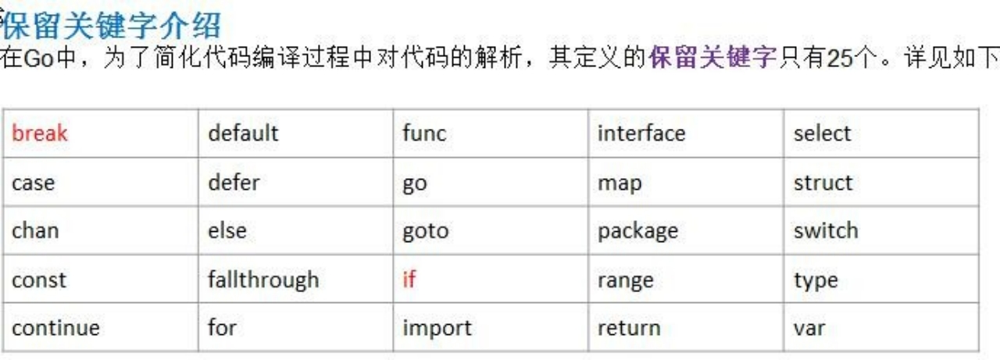

# 第三章 Golang变量

## 3.1 为什么需要变量

### 3.1.1 一个程序就是一个世界


### 3.1.2 变量是程序的基本组成单位

不论是使用哪种高级程序语言编写程序,变量都是其程序的基本组成单位，比如一个示意图：


## 3.2 变量的介绍

### 3.2.1 变量的概念

变量相当于内存中一个数据存储空间的表示，你可以把变量看做是一个房间的门牌号，通过门牌号我们可以找到房间，同样的道理，通过变量名可以访问到变量(值)。

### 3.2.2 变量的使用步骤

1) 声明变量(也叫:定义变量)

2) 非变量赋值

3) 使用变量

## 3.3 变量快速入门案例

看一个案例：


输出：

## 3.4 变量使用注意事项

1) 变量表示内存中的一个存储区域

2) 该区域有自己的名称（变量名）和类型（数据类型)

   示意图：

   

3) Golang 变量使用的三种方式

   1. 第一种：指定变量类型，**声明后若不赋值，使用默认值**

      

   2. 第二种：根据值自行判定变量类型(**类型推导**）

      

   3.  第三种：省略 var, 注意 :=左侧的变量不应该是已经声明过的，否则会导致编译错误

      

4) 多变量声明

   在编程中，有时我们需要一次性声明多个变量，Golang 也提供这样的语法，举例说明:

   

   如何一次性声明多个全局变量【在 go 中函数外部定义变量就是全局变量】：

    

5) 该区域的数据值可以在同一类型范围内不断变化(重点)

   

6)  变量在**同一个作用域**(在一个函数或者在代码块)内不能重名

   

7) 变量=**变量名**+**值**+**数据类型**，这一点请大家注意，变量的三要素

8) Golang 的变量如果没有赋初值，编译器会使用默认值,  比如 int 默认值 0,string 默认值为空串， 小数默认为 0	

## 3.5 变量的声明，初始化和赋值


## 3.6 程序中 +号的使用

1) 当左右两边都是数值型时，则做加法运算

2) 当左右两边都是字符串，则做字符串拼接


## 3.7 数据类型的基本介绍


## 3.8 整数类型

### 3.8.1 基本介绍

简单的说，就是**用于存放整数值**的，比如 0, -1, 2345 等等。

### 3.8.2 整数的各个类型


int 的无符号的类型：


int 的其它类型的说明：


### 3.8.3 整型的使用细节

1) Golang 各整数类型分：有符号和无符号，int uint  的大小和系统有关。

2) Golang 的整型默认声明为 int 型

   

3) 如何在程序查看某个变量的字节大小和数据类型 （使用较多）

   

4) Golang 程序中整型变量在使用时，遵守保小不保大的原则，即：在保证程序正确运行下，尽量使用占用空间小的数据类型。【如：年龄】

   

5) bit: 计算机中的最小存储单位。byte:计算机中基本存储单元。[二进制再详细说] 1byte = 8 bit

## 3.9 小数类型/浮点型

### 3.9.1 基本介绍

小数类型就是用于存放小数的，比如 1.2 0.23 -1.911

### 3.9.2 案例演示


### 3.9.3 小数类型分类


对上图的说明:

1. 关于浮点数在机器中存放形式的简单说明,浮点数=符号位+指数位+尾数位

   说明：浮点数都是有符号的.

   

2. 尾数部分可能丢失，造成精度损失。 -123.0000901

   

   

   说明：float64 的精度比 float32 的要准确.

   说明：如果我们要保存一个精度高的数，则应该选用 float64

3. 浮点型的存储分为三部分：符号位+指数位+尾数位 在存储过程中，精度会有丢失

### 3.9.4 浮点型使用细节

1) Golang 浮点类型有固定的范围和字段长度，不受具体 OS(操作系统)的影响。

2) Golang 的浮点型默认声明为 float64  类型

   

3)  浮点型常量有两种表示形式

   十进制数形式：如：5.12	.512	(必须有小数点）

   科学计数法形式:如：5.1234e<sup>2</sup>	= 5.12 * 10 的 2 次方	5.12E<sup>-2</sup>	= 5.12/10 的 2 次方

   

4) 通常情况下，应该使用 float64 ，因为它比 float32  更精确。[开发中，**推荐使用** **float64**]

## 3.10 字符类型

### 3.10.1 基本介绍

Golang 中没有专门的字符类型，如果要存储单个**字符**(字母)，一般使用 **byte** **来**保存。

**字符串就是一串固定长度的字符连接起来的字符序列**。Go 的字符串是由单个字节连接起来的。也就是说对于传统的字符串是由字符组成的，而 **Go** **的字符串不同**，它是由**字节**组成的。

### 3.10.2 案例演示


对上面代码说明

1. 如果我们保存的字符在 ASCII 表的,比如[0-1, a-z,A-Z..]直接可以保存到 byte
2. 如果我们保存的字符对应码值大于 255,这时我们可以考虑使用 int 类型保存
3. 如果我们需要安装字符的方式输出，这时我们需要格式化输出，即 fmt.Printf(“%c”, c1)..

### 3.10.3 字符类型使用细节

1) 字符常量是用单引号('')括起来的单个字符。例如：var c1	byte = 'a'	var c2 int = '中'  var c3 byte='9'

2)  Go中允许使用转义字符 '\’来将其后的字符转变为特殊字符型常量。例如：var c3 char	= ‘\n’ // '\n'表示换行符

3) Go语言的字符使用UTF-8编码, 如果想查询字符对应的utf8码值

   http://www.mytju.com/classcode/tools/encode_utf8.asp

   英文字母-1 个字节	汉字-3 个字节

4) 在 Go 中，字符的本质是一个整数，直接输出时，是该字符对应的 UTF-8 编码的码值。

5) 可以直接给某个变量赋一个数字，然后按格式化输出时%c，会输出该数字对应的 unicode 字符

   

6) **字符类型是可以进行运算的**，相当于一个整数，因为它都对应有 Unicode 码.

   

### 3.10.4 字符类型本质探讨

1. 字符型存储到计算机中，需要将字符对应的码值（整数）找出来

   存储：字符--->对应码值	>二进制-->存储

   读取：二进制----> 码值 ----> 字符 --> 读取

2. 字符和码值的对应关系是通过字符编码表决定的(是规定好)

3. Go 语言的编码都统一成了 utf-8。非常的方便，很统一，再也没有编码乱码的困扰了

## 3.11 布尔类型

### 3.11.1 基本介绍

1) 布尔类型也叫 bool 类型，bool 类型数据只允许取值 true 和 false

2) bool 类型占 1 个字节。

3) bool 类型适于**逻辑运算**，一般用于程序流程控制[注：这个后面会详细介绍]：

Ø if 条件控制语句；

Ø for 循环控制语句

### 3.11.2 案例演示


## 3.12 string类型

### 3.12.1 基本介绍

字符串就是一串固定长度的字符连接起来的字符序列。Go 的字符串是由单个字节连接起来的。Go 语言的字符串的字节使用 UTF-8 编码标识 Unicode 文本

### 3.12.2 案例演示


### 3.12.3 string 使用注意事项和细节

1) Go 语言的字符串的字节使用 UTF-8 编码标识 Unicode 文本，这样 Golang 统一使用UTF-8编码,中文乱码问题不会再困扰程序员。

2) 字符串一旦赋值了，字符串就不能修改了：在 Go中字符串是不可变的

   

3) 字符串的两种表示形式

   1. 双引号, 会识别转义字符

   2. 反引号，以字符串的原生形式输出，包括换行和特殊字符，可以实现防止攻击、输出源代码等效果

      【案例演示】

      

4) 字符串拼接方式

   

5) 当一行字符串太长时，需要使用到多行字符串，可以如下处理

   

## 3.13 基本数据类型的默认值

### 3.13.1 基本介绍

在 go 中，数据类型都有一个默认值，当程序员没有赋值时，就会保留默认值，在 go 中，默认值又叫零值。

### 3.13.2 基本数据类型的默认值如下


案例:


## 3.14 基本数据类型的相互转换

### 3.14.1 基本介绍

Golang 和 java / c 不同，Go 在不同类型的变量之间赋值时**需要显式转换**。也就是说 Golang 中数据类型**不能自动转换**。

### 3.14.2 基本语法

表达式 T(v) 将值 v  转换为类型 T

**T**: 就是数据类型，比如 int32，int64，float32 等等

**v**: 就是需要转换的变量

### 3.14.3 案例演示


### 3.14.4 基本数据类型相互转换的注意事项

1) Go 中，数据类型的转换可以是从 表示范围小-->表示范围大，也可以 范围大--->范围小

2) 被转换的是变量存储的数据(即值)，变量本身的数据类型并没有变化！

   

3) 在转换中，比如将 int64	转成 int8 【-128---127】 ，编译时不会报错，只是转换的结果是**按溢出处理**，和我们希望的结果不一样。 因此在转换时，需要考虑范围.

   

## 3.15 基本数据类型和string 的转换

### 3.15.1 基本介绍

在程序开发中，我们经常将基本数据类型转成 string,或者将 string 转成基本数据类型。

### 3.15.2 基本类型转string 类型

Ø 方式 1：fmt.Sprintf("%参数",	表达式)	【**个人习惯这个，灵活**】

函数的介绍：


参数需要和表达式的数据类型相匹配

fmt.Sprintf().. 会返回转换后的字符串

```go
package main

import "fmt"

func main() {
	var num1 = 99
	var num2 = 23.456
	var b = true
	var myChar = 'h'
	// 使用fmt.Sprintf方法
	str := fmt.Sprintf("%d", num1)
	fmt.Printf("str type %T str = %q\n", str, str)

	str = fmt.Sprintf("%f", num2)
	fmt.Printf("str type %T str = %q\n", str, str)

	str = fmt.Sprintf("%t", b)
	fmt.Printf("str type %T str = %q\n", str, str)

	str = fmt.Sprintf("%c", myChar)
	fmt.Printf("str type %T str = %q\n", str, str)
}
```

Ø 方式 2：使用 strconv  包的函数


```go
package main

import (
	"fmt"
	"strconv"
)

func main() {
	var num1 = 99
	var num2 = 23.456
	var b = true
	var myChar = 'h'

	// 使用 strconv包的函数
	str := strconv.FormatInt(int64(num1), 10)
	fmt.Printf("str type %T str = %q\n", str, str)

	str = strconv.FormatFloat(num2, 'f', 10, 64)
	fmt.Printf("str type %T str = %q\n", str, str)

	str = strconv.FormatBool(b)
	fmt.Printf("str type %T str = %q\n", str, str)

	str = string(myChar)
	fmt.Printf("str type %T str = %q\n", str, str)

	str = strconv.Itoa(num1)
	fmt.Printf("str type %T str = %q\n", str, str)
}
```

### 3.15.3 string 类型转基本数据类型

Ø 使用 strconv 包的函数


```
package main

import (
	"fmt"
	"strconv"
)

func main() {
	var str = "true"
	var str2 = "1234590"
	var str3 = "123.456"

	// b, _ := strconv.ParseBool(str)
	// 1.strconv.ParseBool(str) 函数会返回两个值 （value bool, err error)
	// 2.只想获取到 value bool,不想获取err 使用_忽略
	b, _ := strconv.ParseBool(str)
	fmt.Printf("b type %T b=%v\n", b, b)

	n1, _ := strconv.ParseInt(str2, 10, 64)
	n2 := int(n1)
	fmt.Printf("n1 type %T n1=%v\n", n1, n1)
	fmt.Printf("n1 type %T n1=%v\n", n2, n2)

	f1, _ := strconv.ParseFloat(str3, 64)
	fmt.Printf("n1 type %T n1=%v\n", f1, f1)
}
```

说明一下:


### 3.15.4 string 转基本数据类型的注意事项

在将 String 类型转成 基本数据类型时，**要确保** **String** **类型能够转成有效的数据**，比如 我们可以把 "123" , 转成一个整数，但是不能把 "hello" 转成一个整数，如果这样做，Golang 直接将其转成 0 ， 其它类型也是一样的道理. float => 0 bool => false

案例说明：

```go
package main

import (
	"fmt"
	"strconv"
)

func main() {
	var str = "hello"
	var n3 int64 = 11
	n3, _ = strconv.ParseInt(str, 10, 64)
	fmt.Printf("n3 type %T n3=%v\n", n3, n3)
}
```

## 3.16 指针

### 3.16.1 基本介绍

1) 基本数据类型，变量存的就是值，也叫值类型

2) 获取变量的地址，用&，比如： var num int, 获取 num 的地址：

   &num 分析一下基本数据类型在内存的布局.

   

3) 指针类型，指针变量存的是一个地址，这个地址指向的空间存的才是值

   

4) 获取指针类型所指向的值，使用：*，比如：var ptr *int,  使用*ptr 获取 ptr 指向的值

   ```go
   i := "hello"
   fmt.Println("i的地址=", &i)
   
   ptr := &i
   fmt.Printf("ptr type %T,ptr=%v\n", ptr, ptr)
   
   j := *ptr
   fmt.Printf("j type %T,j=%v\n", j, j)
   ```

   

### 3.16.2 案例演示

1) 写一个程序，获取一个 int 变量 num 的地址，并显示到终端

2) 将 num 的地址赋给指针 ptr , 并通过 ptr 去修改 num 的值.


### 3.16.3 指针的课堂练习


### 3.16.4 指针的使用细节

1) 值类型，都有**对应的指针类型**， 形式为	*******数据类型**，比如 int 的对应的指针就是 *int, float32对应的指针类型就是	*float32, 依次类推
2) 值类型包括：基本数据类型 **int** **系列**,**float** **系列**, **bool**, **string**  **、数组**和**结构体** struct

## 3.17 值类型和引用类型

### 3.17.1 值类型和引用类型的说明

1) 值类型：基本数据类型 int 系列, float  系列, bool, string  、数组和结构体 struct
2) 引用类型：指针、slice 切片、map、管道 chan、interface 等都是引用类型

### 3.17.2 值类型和引用类型的使用特点

1. 值类型：变量直接存储值，内存通常在栈中分配

   示意图：

   

2. 引用类型：变量存储的是一个地址，这个地址对应的空间才真正存储数据(值)，内存通常在堆上分配，当没有任何变量引用这个地址时，该地址对应的数据空间就成为一个垃圾，由 GC 来回收

   示意图：

   

3. 内存的栈区和堆区示意图

   


## 3.18 标识符的命名规范

### 3.18.1 标识符概念

1) Golang 对各种变量、方法、函数等命名时使用的字符序列称为标识符

2) 凡是自己可以起名字的地方都叫标识符

### 3.18.2 标识符的命名规则

1) 由 26 个英文字母大小写，0-9  ，_ 组成

2) 数字不可以开头。var num int //ok	var 3num int //error

3) Golang 中严格区分大小写。

   ```go
   var num int 
   var Num int
   说明：在 golang 中，num 和 Num  是两个不同的变量
   ```

4) 标识符不能包含空格

   

5) 下划线"_"本身在 Go 中是一个特殊的标识符，称为**空标识符**。可以代表任何其它的标识符，但是它对应的值会被忽略(比如：忽略某个返回值)。所以**仅能被作为占位符使用，不能作为标识符使用**

   

6) 不能以系统**保留关键字**作为标识符（一共有 25 个），比如 break，if 等等...

### 3.18.3 标识符的案例

```go
hello	// ok hello12 //ok
1hello // error ,不能以数字开头
h-b	// error ,不能使用 -
x h	// error, 不能含有空格

h_4	// ok
_ab	// ok
int	// ok , 我们要求大家不要这样使用
float32 // ok ,  我们要求大家不要这样使用
_	// error Abc		// ok
```

### 3.18.4 标识符命名注意事项

1) 包名：保持 package 的名字和目录保持一致，尽量采取有意义的包名，简短，有意义，不要和标准库不要冲突 fmt

   

2) 变量名、函数名、常量名：采用驼峰法

   ```go
   举例：
   var stuName string = “tom”	形式: xxxYyyyyZzzz ...
   
   var goodPrice float32 = 1234.5
   ```

3) 如果变量名、函数名、常量名首字母大写，则可以被其他的包访问；如果首字母小写，则只能在本包中使用 ( 注：可以简单的理解成，**首字母大写是公开的**，**首字母小写是私有的**) ,在 golang **没有**public , private 等关键字。

## 3.19 系统保留关键字



## 3.20 系统的预定义标识符

