# 第5章 程序流程控制

## 5.1 程序流程控制介绍

在程序中，程序运行的流程控制决定程序是如何执行的，是我们必须掌握的，主要有三大流程控制语句。

1) 顺序控制

2) 分支控制

3) 循环控制

## 5.2 顺序控制

程序从上到下逐行地执行，中间没有任何判断和跳转。

一个案例说明，必须下面的代码中，没有判断，也没有跳转.因此程序按照默认的流程执行，即顺序控制。

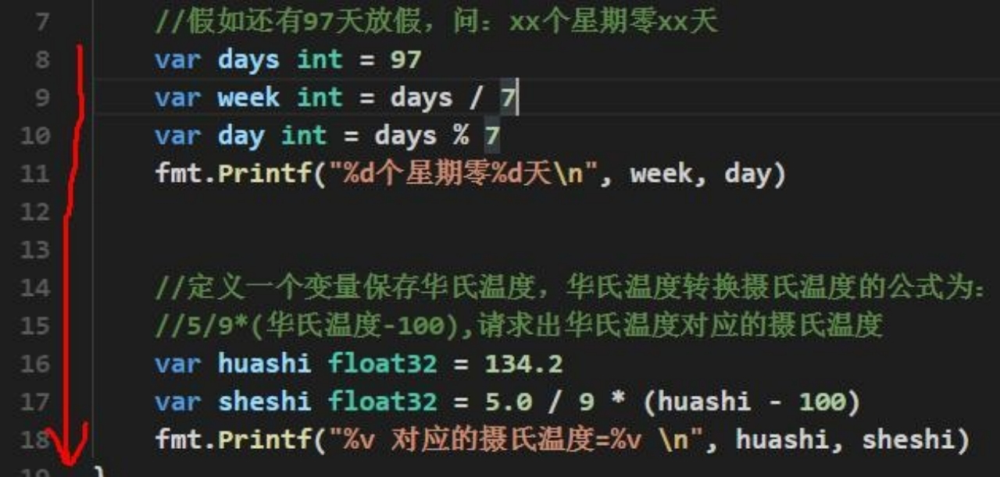

### 5.2.1 顺序控制的一个流程图

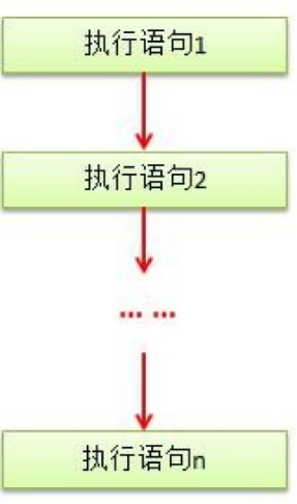

### 5.2.2 顺序控制举例和注意事项

Golang 中定义变量时采用合法的前向引用。如

```go
func main() {
  var num1 int = 10 //声明了 num1
  var num2 int = num1 + 20 //使用 num1 
  fmt.Println(num2)
}

错误形式：
func main() {
  var num2 int = num1 + 20 //使用 num1 
  var num1 int = 10 // 声 明 num1 (×) 
  fmt.Println(num2)
}
```

## 5.3 分支控制

### 5.3.1 分支控制的基本介绍

分支控制就是让程序有选择执行。有下面三种形式

1) 单分支

2) 双分支

3) 多分支

### 5.3.2 单分支控制

Ø 基本语法

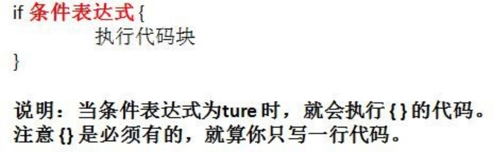

Ø 应用案例

编写一个程序,可以输入人的年龄,**如果**该同志的年龄大于 18 岁,则输出 "你年龄大于 18,要对自己的行为负责!"	需求---[分析]	>代码

```go
package main

import "fmt"

func main() {
	var age int
	fmt.Println("请输入年龄：")
	fmt.Scanln(&age)

	if age > 18 {
		fmt.Println("你年龄大于18，要对自己的行为负责")
	}

}
```

Ø 单分支的流程图

流程图可以用**图形方式**来更加清晰的描述程序执行的流程。

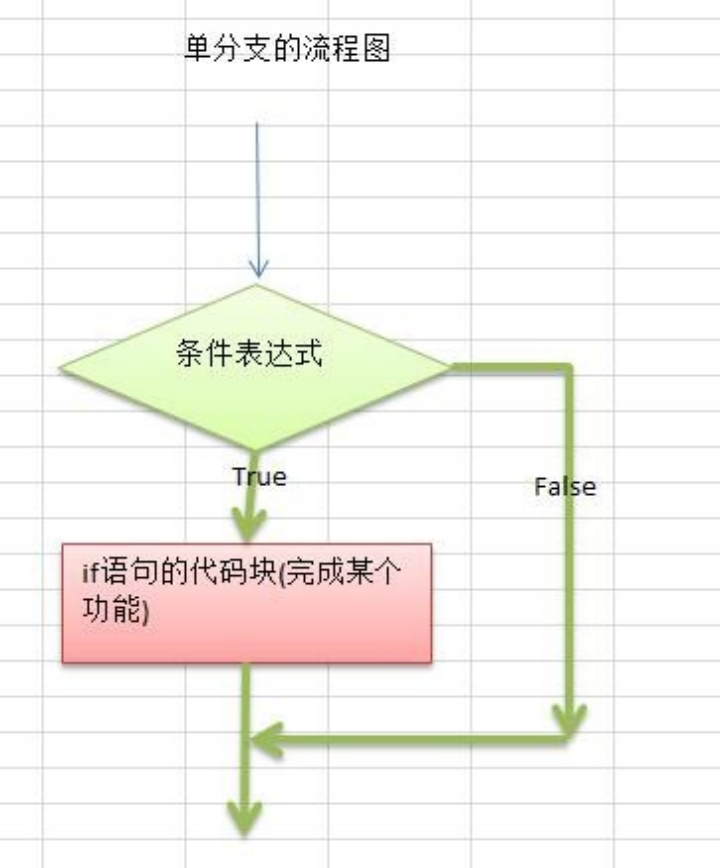

Ø 单分支的细节说明

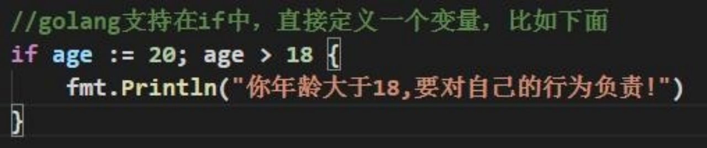

### 5.3.3 双分支控制

Ø 基本语法

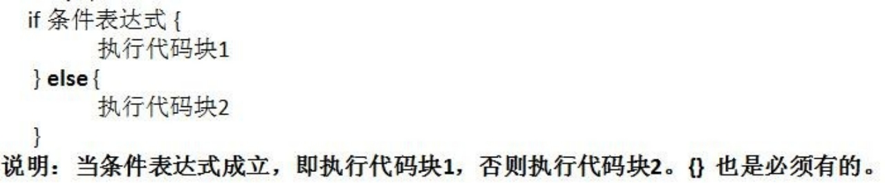

Ø 应用案例

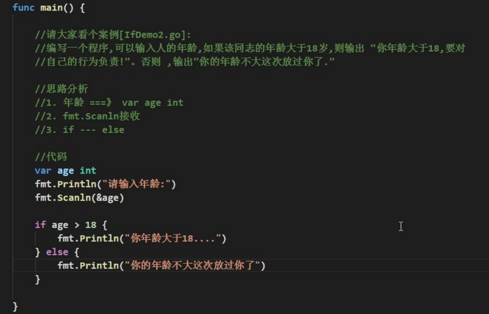

Ø 双分支的流程图的分析

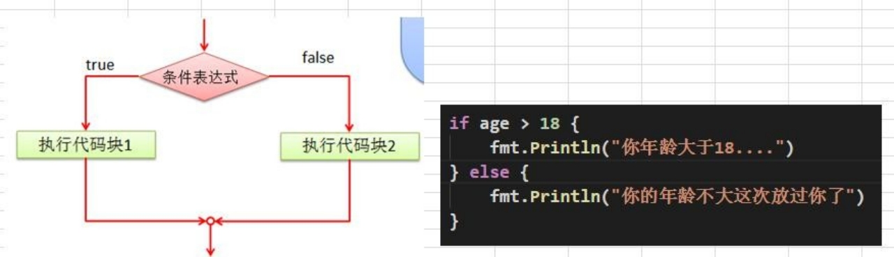

1. 从上图看 条件表达式就是	age >18

2. 执行代码块 1 ===> fmt.Println("你的年龄大于 18") ..

3. 执行代码块 2 ===> fmt.Println("你的年龄不大	") .
4. **强调一下** 双分支只会执行其中的一个分支

### 5.3.4 多分支控制

Ø 基本语法

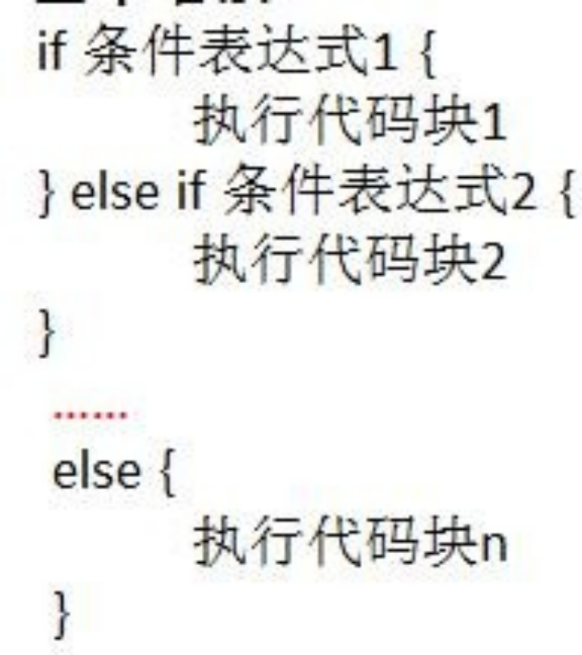

对上面基本语法的说明

1) 多分支的判断流程如下:
   1) 先判断条件表达式 1 是否成立，如果为真，就执行代码块 1
   2) 如果条件表达式 1 如果为假，就去判断条件表达式 2 是否成立， 如果条件表达式 2 为真， 就执行代码块 2
   3)  依次类推.
   4) 如果所有的条件表达式不成立，则执行 else 的语句块。

2) else 不是必须的。
3) **多分支只能有一个执行入口**。

Ø 看一个多分支的流程图(更加清晰)

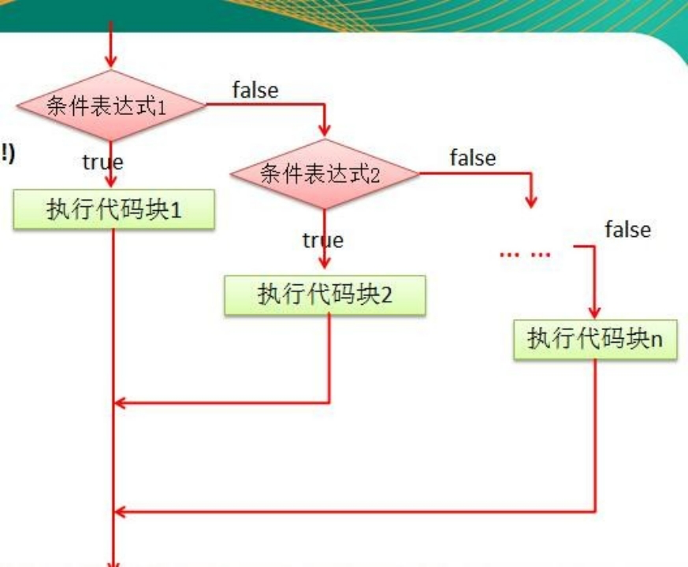

Ø 多分支的快速入门案例

如果：

成绩为 100 分时，奖励一辆 BMW；

成绩为(80，99]时，奖励一台 iphone7plus； 当成绩为[60,80]时，奖励一个 iPad；

其它时，什么奖励也没有。

请从键盘输入岳小鹏的期末成绩，并加以判断代码如下：

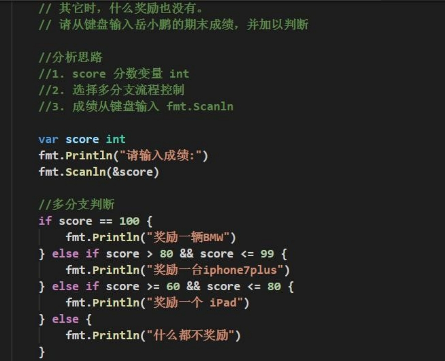

### 5.3.5 嵌套分支

Ø 基本介绍

在一个分支结构中又完整的嵌套了另一个完整的分支结构，里面的分支的结构称为内层分支外面的分支结构称为外层分支。

Ø 基本语法

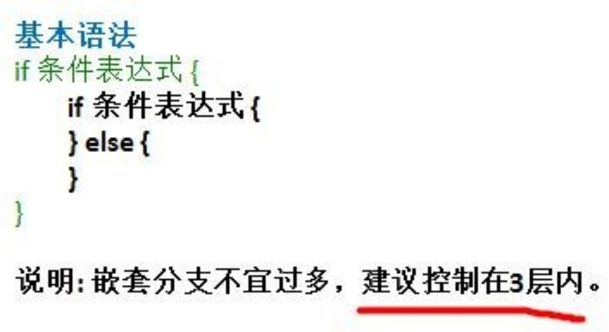

## 5.4 switch分支控制

### 5.4.1 基本的介绍

1. switch 语句用于基于不同条件执行不同动作，每一个 case 分支都是唯一的，从上到下逐一测试，直到匹配为止
2. 匹配项后面也<font color='red'>**不需要再加break**</font>

### 5.4.2 基本语法

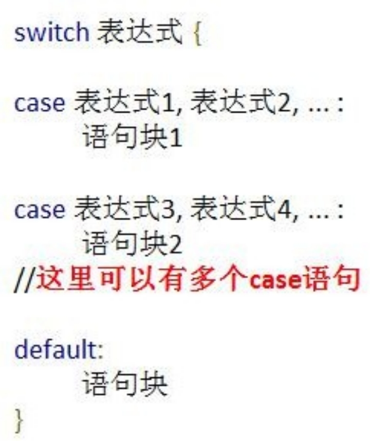

### 5.4.3 switch 的流程图

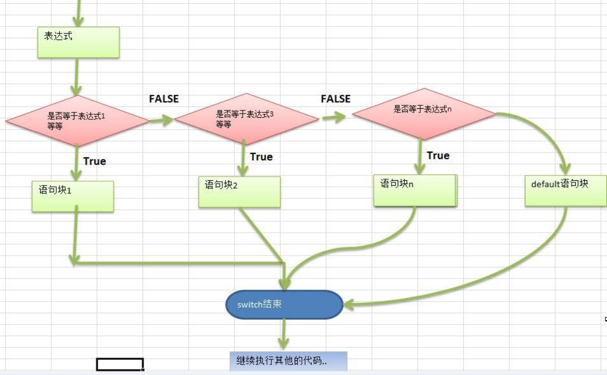

Ø 对上图的说明和总结

1. switch 的执行的流程是，先执行表达式，得到值，然后和 case 的表达式进行比较，如果相等， 就匹配到，然后执行对应的 case 的语句块，然后退出 switch 控制。
2.  如果 switch 的表达式的值没有和任何的 case 的表达式匹配成功，则执行 default 的语句块。执行后退出 switch 的控制.
3.  golang 的 case 后的表达式可以有多个，使用 逗号 间隔.
4. golang 中的 case 语句块不需要写 break , 因为默认会有,即在默认情况下，当程序执行完 case 语句块后，就直接退出该 switch 控制结构。

### 5.4.4 switch 快速入门案例

Ø 案例：

请编写一个程序，该程序可以接收一个字符，比如: a,b,c,d,e,f,g	a 表示星期一，b 表示星期二 …	根据用户的输入显示相依的信息.要求使用 switch  语句完成

Ø 代码

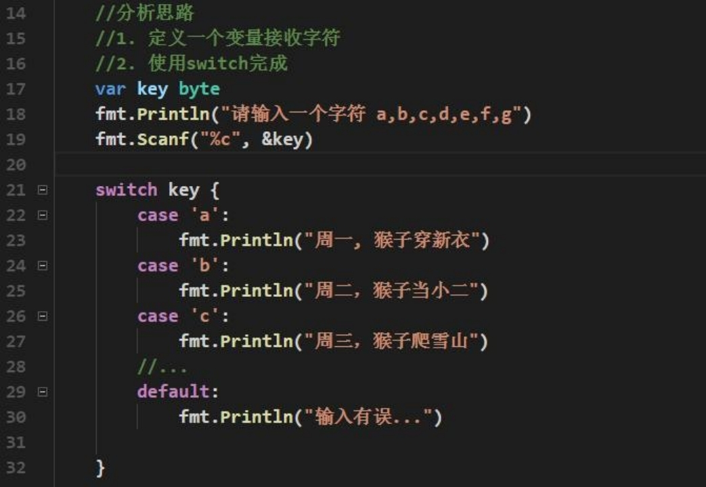

### 5.4.5 switch 的使用的注意事项和细节

1) case/switch 后是一个表达式( 即：**常量值**、<font color='gree'>变量</font>、一个有**返回值的函数**等都可以)

   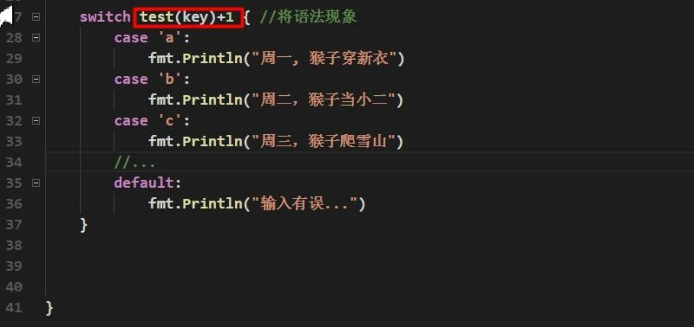

2) case 后的各个表达式的值的数据类型，必须和 switch 的表达式数据类型一致

   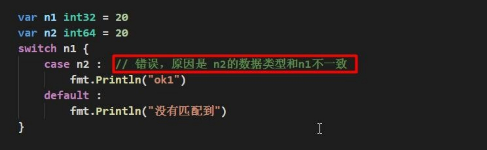

3)  case 后面可以带多个表达式，使用逗号间隔。比如 case 表达式 1,  表达式 2 ...

   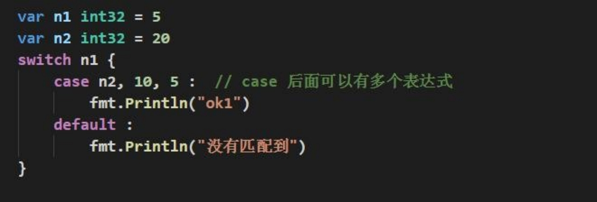

4) case 后面的表达式如果是常量值(字面量)，则要求不能重复

   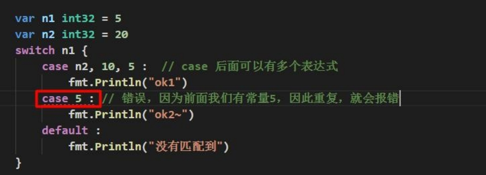

5) case 后面不需要带break , 程序匹配到一个 case 后就会执行对应的代码块，然后退出 switch，如果一个都匹配不到，则执行 default

6) default 语句不是必须的.

7) switch 后也可以不带表达式，类似 if --else 分支来使用

   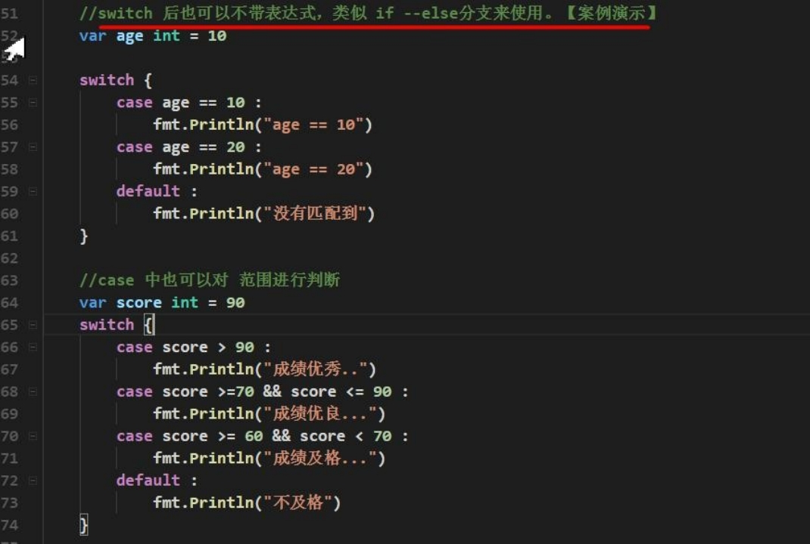

8) switch 后也可以直接声明/定义一个变量，分号结束，<font color='red'>**不推荐**</font>。

   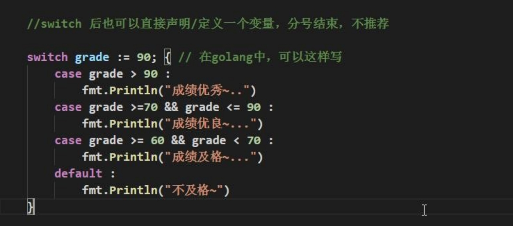

9) switch 穿透-fallthrough ，如果在 case 语句块后增加 fallthrough ,则会继续执行下一个 case，也叫 switch 穿透

   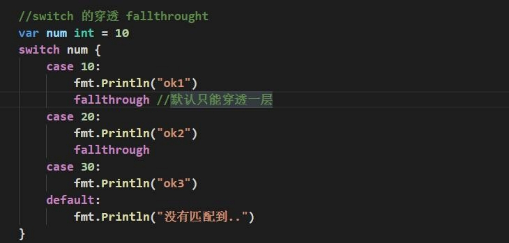

10) Type Switch：switch 语句还可以被用于 type-switch 来判断某个 interface 变量中实际指向的变量【还没有学 interface,  先体验一把】

    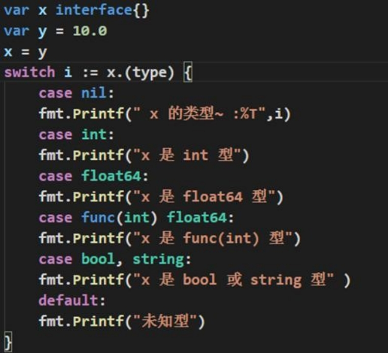

### 5.4.6 switch 和 if 的比较

总结了什么情况下使用 switch ,什么情况下使用 if

1) 如果判断的**具体数值不多**，而且符合整数、浮点数、字符、字符串这几种类型。建议使用 **swtich**语句，简洁高效。

2) 其他情况：对**区间判断**和结果为 **bool** 类型的判断，使用 if，**if** **的使用范围更广**。

## 5.5 for 循环控制

### 5.5.1 基本介绍

听其名而知其意。就是让我们的一段代码循环的执行。

### 5.5.2 一个实际的需求

Ø 请大家看个案例:

编写一个程序, 可以打印 10 句

"你好，尚硅谷!"。请大家想想怎么做?

Ø 使用传统的方式实现

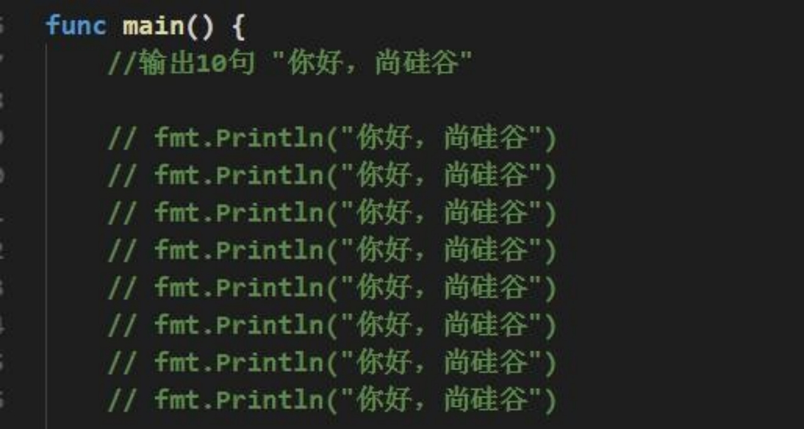

Ø for 循环的快速入门

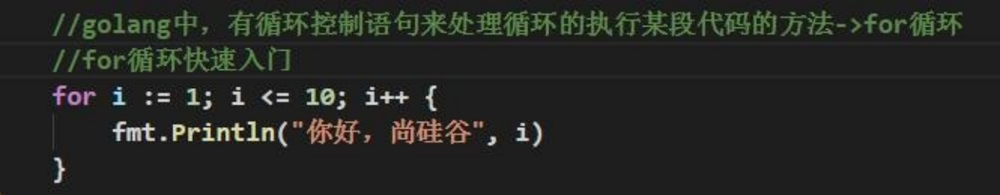

### 5.5.3 for 循环的基本语法

Ø 语法格式

for 循环变量初始化;  循环条件;  循环变量迭代 {

​	循环操作(语句)

}

Ø 对上面的语法格式说明

1) 对 for 循环来说，有四个要素：

2) 循环变量初始化

3) 循环条件

4) 循环操作(语句) ,有人也叫循环体。

5) 循环变量迭代

Ø for 循环执行的顺序说明

1) 执行循环变量初始化，比如 i := 1

2) 执行循环条件， 比如 i <= 10

3) 如果循环条件为真，就执行循环操作 :比如 fmt.Println(“	”)

4) 执行循环变量迭代 ,  比如 i++

5) 反复执行 2, 3, 4  步骤，直到 循环条件为 False ，就退出 for 循环。

### 5.5.3 for 循环执行流程分析

Ø for 循环的流程图

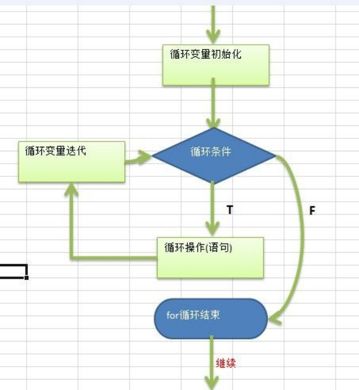

### 5.5.4 for 循环的使用注意事项和细节讨论

1) **循环条件**是返回一个<font color='red'>**布尔值**</font>的表达式

2)  for 循环的第二种使用方式

   ```go
   for	循环判断条件	{
   	//循环执行语句
   }
   将变量初始化和变量迭代写到其它位置
   ```

   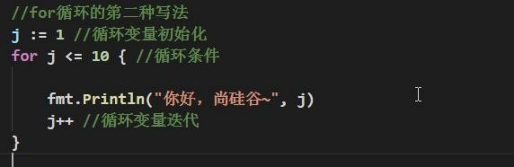

3) for 循环的第三种使用方式

   ```go
   for	{
   //循环执行语句
   }
   ```

   上面的写法**等价** **for** **;** **; {}**	是一个**无限循环**， 通常需要**配合** **break** **语句**使用

   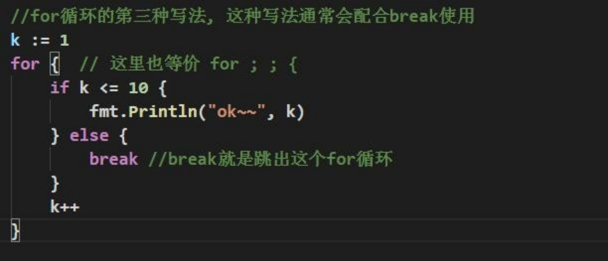

4) Golang 提供 for-range 的方式，可以方便遍历字符串和数组(注: 数组的遍历，我们放到讲数组的时候再讲解) ，**案例说明如何遍历字符串**。

   Ø 字符串遍历方式 1-传统方式

   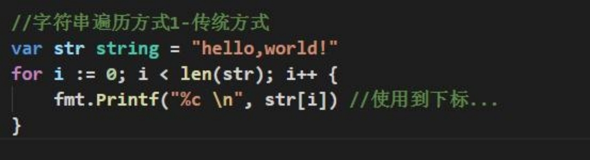

​		Ø 字符串遍历方式 2-for - range

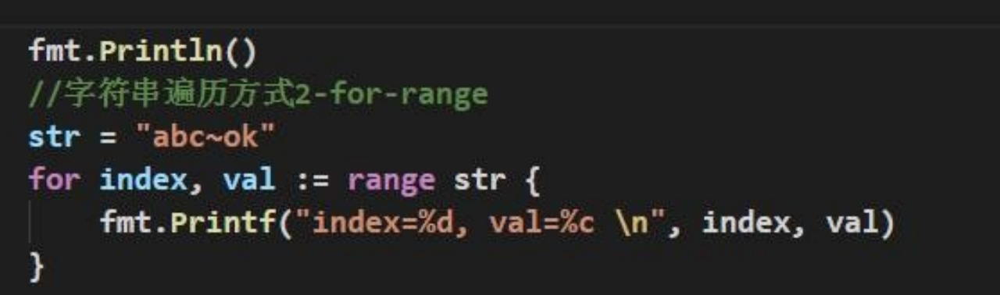

Ø 上面代码的细节讨论

如果我们的字符串含有中文，那么传统的遍历字符串方式，就是错误，会出现乱码。原因是传统的对字符串的遍历是按照**字节来遍历**，而一个汉字在 utf8 编码是对应 **3** **个字节**。

如何解决 需要要将	str 转成 []rune 切片.=> 体验一把

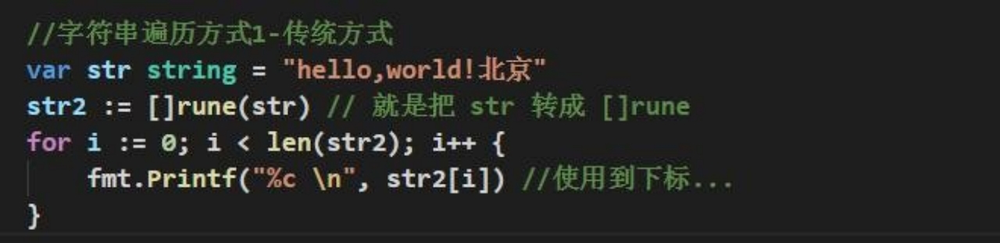

对应 for-range 遍历方式而言，是按照字符方式遍历。因此如果有字符串有中文，也是 ok

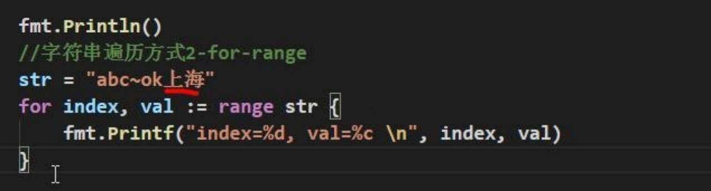

## 5.6 while 和 do..while 的实现

Go 语言没有 while 和 do...while 语法，这一点需要同学们注意一下，如果我们需要使用类似其它语言(比如 java / c 的 while 和 do...while )，**可以通过** **for** **循环来实现其使用效果**。

### 5.6.1 while 循环的实现

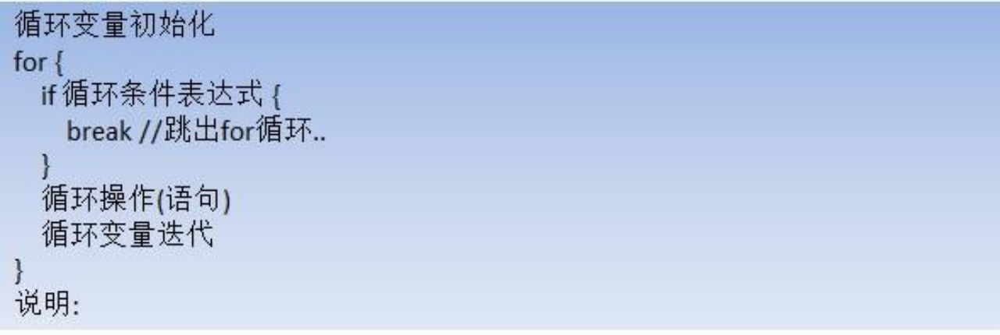

Ø 说明上图

1) for 循环是一个无限循环

2) break 语句就是跳出 for 循环

Ø 使用上面的 while 实现完成输出 10 句”hello,wrold”

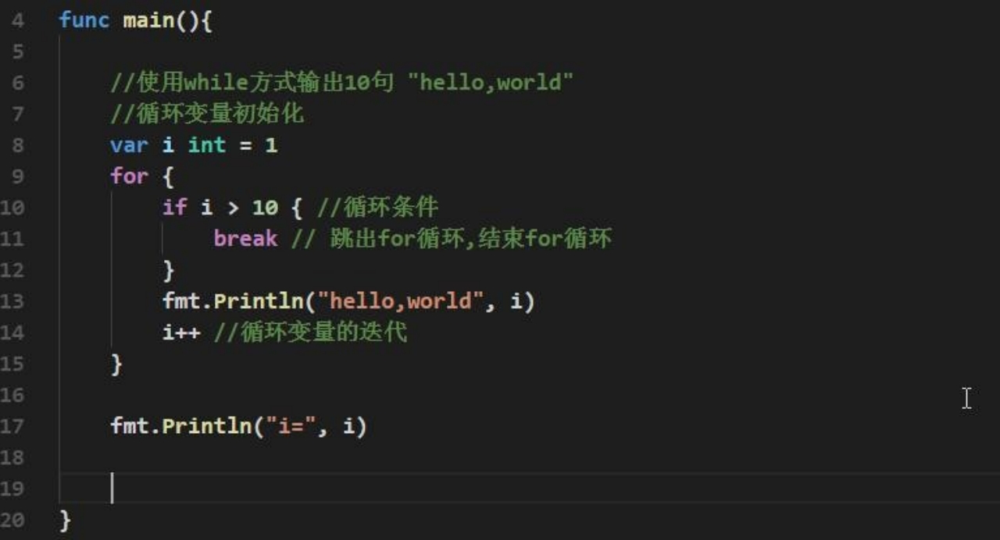

### 5.6.2 do..while 的实现

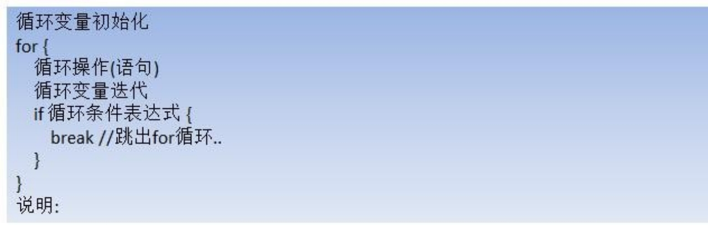

Ø 对上图的说明

1) 上面的循环是先执行，在判断，因此至少执行一次。

2) 当循环条件成立后，就会执行 break, break 就是跳出 for 循环，结束循环.

Ø 案例演示

使用上面的 do...while 实现完成输出 10 句”hello,ok

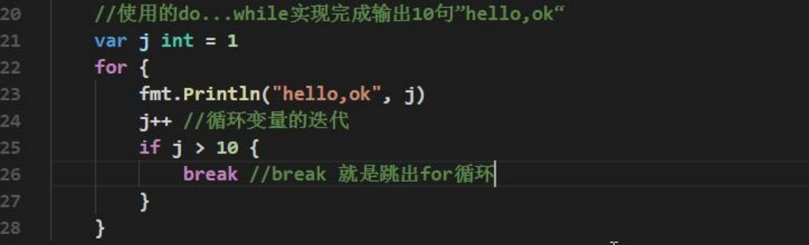

## 5.7 多重循环控制(重点，难点)

### 5.7.1 基本介绍

1) 将一个循环放在另一个循环体内，就形成了嵌套循环。在外边的 for 称为外层循环在里面的 for循环称为内层循环。【**建议一般使用两层，最多不要超过** **3** **层**】
2)  实质上，嵌套循环就是把内层循环当成外层循环的循环体。当只有内层循环的循环条件为 false时，才会完全跳出内层循环，才可结束外层的当次循环，开始下一次的循环。
3) 外层循环次数为 **m** 次，内层为 **n** 次，则内层循环体实际上需要执行 **m\*n** 次

## 5.8 跳转控制语句-break

### 5.8.1 看一个具体需求，引出break

随机生成 1-100 的一个数，直到生成了 99 这个数，看看你一共用了几次?

**分析**：编写一个无限循环的控制，然后**不停的随机生成数**，当生成了 99 时，就退出这个无限循环 ==》break 提示使用

如下随机生成 1-100 整数.

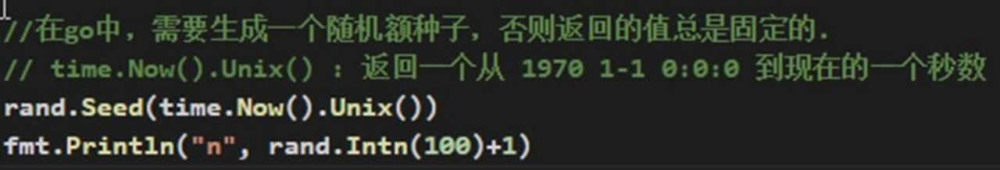

### 5.8.2 break 的快速入门案例

```go
package main

import (
	"fmt"
	"math/rand"
	"time"
)

func main() {
	count := 0

	for true {
		rand.Seed(time.Now().Unix())
		n := rand.Intn(100) + 1
		fmt.Println(count, n)
		count++
		if count == 100 {
			break
		}
	}
}
```

### 5.8.3 基本介绍

break 语句用于终止某个语句块的执行，用于中断当前 for 循环或跳出 switch 语句。

### 5.8.4 基本语法

```go
{	……
break
……
}
```

### 5.8.3 以for 循环使用break 为例,画出示意图

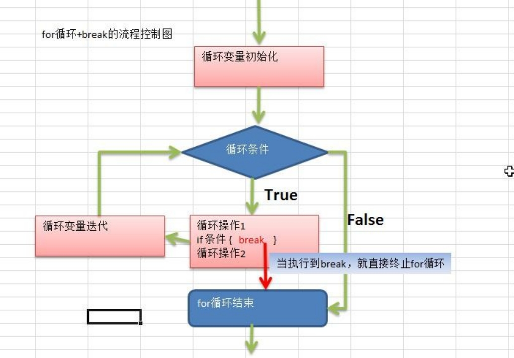

### 5.8.4 break 的注意事项和使用细节

1) break 语句出现在多层嵌套的语句块中时，可以**通过标签**指明要终止的是哪一层语句块

2) 看一个案例

   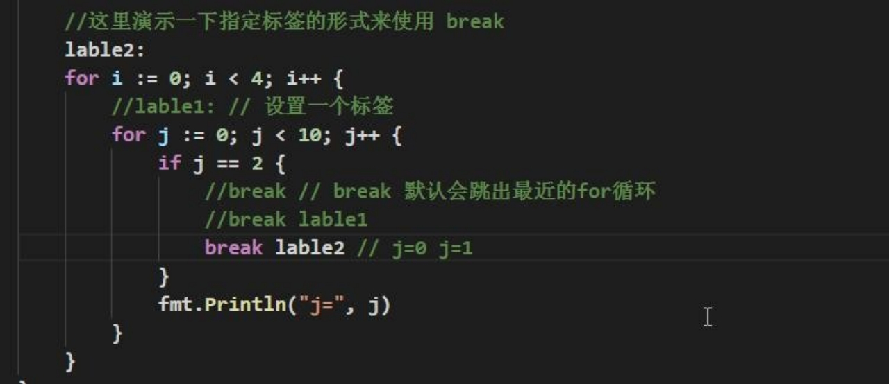

3) 对上面案例的说明

   1)  break 默认会跳出最近的 for 循环
   2)  break 后面可以指定标签，跳出标签对应的 for 循环

## 5.9 跳转控制语句-continue

### 5.9.1 基本介绍

continue 语句用于**结束本次循环**，继续**执行下一次循环**。

continue 语句出现在多层嵌套的循环语句体中时，**可以通过标签指明要跳过的是哪一层循环** , 这个和前面的 break 标签的使用的规则一样.

### 5.9.2 基本语法

```go
{	……
continue
……
}
```

### 5.9.3 continue 流程图

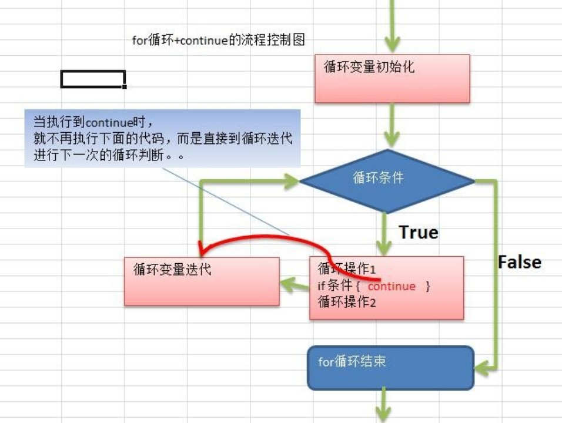

### 5.9.4 案例分析continue 的使用

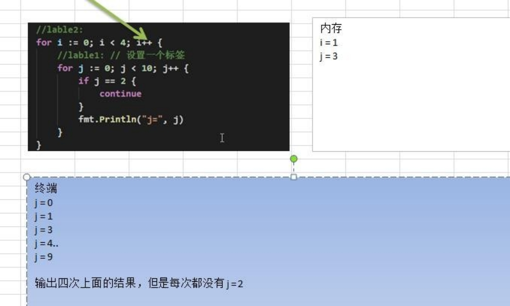

## 5.10 跳转控制语句-goto

### 5.10.1 goto 基本介绍

1) Go 语言的 goto 语句可以无条件地转移到程序中指定的行。

2) goto 语句通常与条件语句配合使用。可用来实现条件转移，跳出循环体等功能。

3) 在 Go 程序设计中<font color='red'>**一般不主张使用** **goto** **语句**</font>， 以免造成程序流程的混乱，使理解和调试程序都产生困难

### 5.10.2 goto 基本语法

```go
goto label
.. .
label: statement
```

### 5.10.3 goto 的流程图

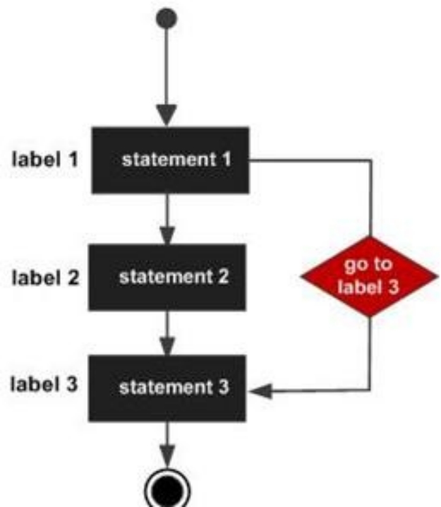

### 5.10.4 快速入门案例

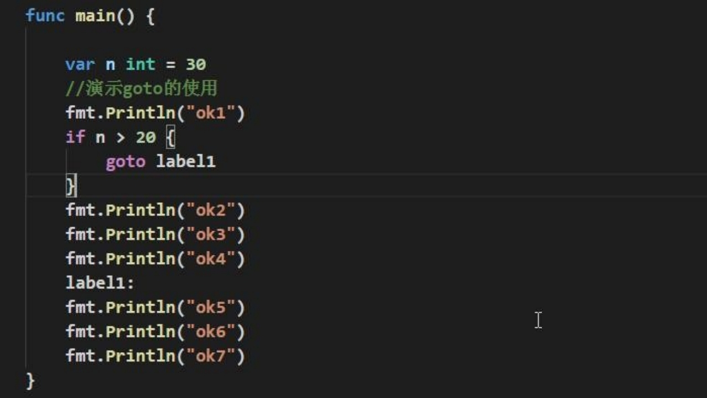

## 5.11 跳转控制语句-return

### 5.11.1 介绍

return 使用在方法或者函数中，表示跳出所在的方法或函数，在**讲解函数的时候，会详细的介绍**。

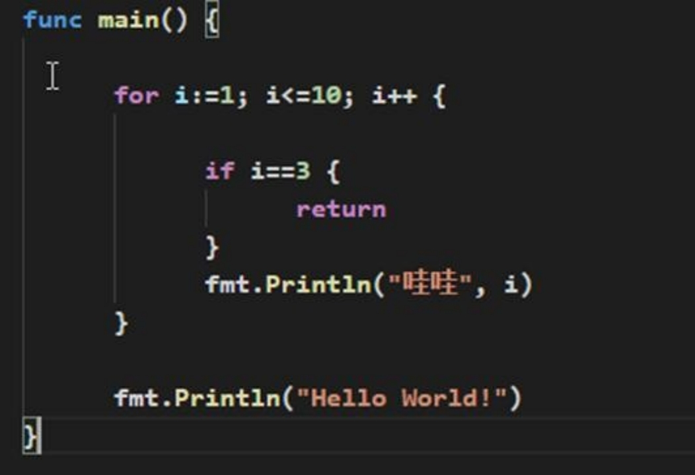

说明:

1) 如果 return 是在普通的函数，则表示跳出该函数，即不再执行函数中 return 后面代码，也可以理解成终止函数。

2) 如果 return  是在 main 函数，表示终止 main 函数，也就是说终止程序。