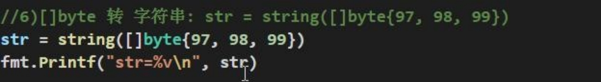

# 第6章 函数、包和错误处理

## 6.1 为什么需要函数

### 6.1.1 请大家完成这样一个需求

输入两个数,再输入一个运算符(+,-,*,/)，得到结果.

### 6.1.2 使用传统的方法解决

Ø 走代码


Ø 分析一下上面代码问题

1) 上面的写法是可以完成功能, 但是代码冗余

2) 同时不利于代码维护

3) 函数可以解决这个问题

## 6.2 函数的基本概念

为完成某一功能的程序指令(语句)的集合,称为函数。

在 Go 中,函数分为:  自定义函数、系统函数(查看 Go 编程手册)

## 6.3 函数的基本语法


## 6.4 快速入门案例


### 6.5 包的引出

1) 在实际的开发中，我们往往需要在不同的文件中，去调用其它文件的定义的函数，比如 main.go中，去使用 utils.go  文件中的函数，如何实现？

2) 现在有两个程序员共同开发一个 Go 项目,程序员小明希望定义函数 Cal ,程序员小强也想定义函数也叫 Cal。两个程序员为此还吵了起来,怎么办? 

### 6.6 包的原理图

包的本质实际上就是创建不同的文件夹，来存放程序文件。画图说明一下包的原理


### 6.7 包的基本概念

说明：go 的每一个文件都是属于一个包的，也就是说 go 是以包的形式来管理文件和项目目录结构的

### 6.8 包的三大作用

区分相同名字的函数、变量等标识符，当程序文件很多时,可以很好的管理项目控制函数、变量等访问范围，即作用域

### 6.9 包的相关说明

Ø 打包基本语法

package 包名 

Ø 引入包的基本语法

import "包的路径

### 6.10 包使用的快速入门

Go 相互调用函数，我们将 func Cal 定义到文件 utils.go , 将 utils.go 放到一个包中，当其它文件需要使用到 utils.go 的方法时，可以 import  该包，就可以使用了.


utils.go 文件

```go
package utils

import "fmt"

func Cal(n1 float64, n2 float64, operator byte) float64 {
	var res float64
	switch operator {
	case '+':
		res = n1 + n2
	case '-':
		res = n1 - n2
	case '*':
		res = n1 + n2
	case '/':
		res = n1 + n2
	default:
		fmt.Println("操作符号错误")
		return 0
	}
	return res
}
```

main.go 文件

```go
package main

import (
	"fmt"
	"gostudy/project01/utils"
)

func main() {
	res := utils.Cal(1.2, 2.3, '%')
	fmt.Println(res)
}
```

### 6.11 包使用的注意事项和细节讨论

1) 在给一个文件打包时，该包对应一个文件夹，比如这里的 utils 文件夹对应的包名就是 utils,文件的包名通常和文件所在的文件夹名一致，一般为小写字母。

2) 当一个文件要使用其它包函数或变量时，需要先引入对应的包

   Ø 引入方式 1：import	"包名"

   Ø 引入方式 2：

    import	(

   "包名"

   "包名"

   )

   Ø package 指令在 文件第一行，然后是 import  指令。

   Ø 在 import 包时，路径从 $GOPATH  的	src 下开始，不用带 src ,  编译器会自动从 src 下开始引入

3) 为了让其它包的文件，可以访问到本包的函数，则该<font color='red'>**函数名的首字母需要大写**</font>，类似其它语言的 public ,这样才能跨包访问。比如 utils.go 的

4)  在访问其它包函数，变量时，其语法是 包名.函数名， 比如这里的 main.go 文件中

   ```go
   res := utils.Cal(1.2, 2.3, '%')
   ```

5) 如果包名较长，Go 支持给包取别名， 注意细节：取别名后，原来的包名就不能使用了

   

6) 在同一包下，不能有相同的函数名（也不能有相同的全局变量名），否则报重复定义

7) 如果你要编译成一个可执行程序文件，就需要将这个包声明为 main , 即 package main .这个就是一个语法规范，如果你是写一个库 ，包名可以自定义

   

### 6.12 函数的调用机制

#### 6.12.1 通俗易懂的方式的理解


#### 6.12.2 函数-调用过程

介绍：为了让大家更好的理解函数调用过程, 看两个案例，并画出示意图，这个很重要

1. 传入一个数+1

   

   对上图说明

   1. 在调用一个函数时，会给该函数分配一个新的空间，编译器会通过自身的处理让这个新的空间和其它的栈的空间区分开来
   1. 在每个函数对应的栈中，数据空间是独立的，不会混淆
   1. 当一个函数调用完毕(执行完毕)后，程序会销毁这个函数对应的栈空间。

2. 计算两个数,并返回

   

#### 6.12.3 return 语句

Ø 基本语法和说明


## 6.13 函数的递归调用

### 6.13.1 基本介绍

一个函数在**函数体内**又**调用了本身**，我们称为递归调用

### 6.13.2 递归调用快速入门

Ø 代码 1


上面代码的分析图:


Ø 代码 2


对上面代码分析的示意图：


### 6.13.3 递归调用的总结

**函数递归需要遵守的重要原则**:

1) 执行一个函数时，就创建一个新的受保护的独立空间(新函数栈)

2) 函数的局部变量是独立的，不会相互影响

3) 递归必须向退出递归的条件逼近，否则就是无限递归，死龟了:)

4) 当一个函数执行完毕，或者遇到 return，就会返回，遵守谁调用，就将结果返回给谁，同时当函数执行完毕或者返回时，该函数本身也会被系统销毁

## 6.14 函数使用的注意事项和细节讨论

1) 函数的形参列表可以是多个，返回值列表也可以是多个。

2) 形参列表和返回值列表的数据类型可以是值类型和引用类型。

3) 函数的命名遵循标识符命名规范，首字母不能是数字，首字母大写该函数可以被本包文件和其它包文件使用，类似 public ,  首字母小写，只能被本包文件使用，其它包文件不能使用，类似 privat

4) 函数中的变量是局部的，函数外不生效【**案例说明**】

   

5) **基本数据类型**和**数组**默认都是**值传递的**，即进行值拷贝。在函数内修改，不会影响到原来的值。

   ```go
   package main
   
   import "fmt"
   
   func main() {
   	num := 20
   	test02(num)
   	fmt.Println("main() num=", num)
   }
   
   func test02(n1 int) {
   	n1 = n1 + 10
   	fmt.Println("test02() n1=", n1)
   }
   ```

6) 如果希望函数内的变量能修改函数外的变量(指的是默认以值传递的方式的数据类型)，可以传入变量的地址&，函数内以指针的方式操作变量。从效果上看类似引用 。

   

7) Go 函数不支持函数重载

   

8) 在 Go 中，<font color='red'>**函数也是一种数据类型**</font>，可以赋值给一个变量，则该变量就是一个函数类型的变量了。通过<font color='red'>该变量可以对函数</font>调用

   

9) 函数既然是一种数据类型，因此在 Go 中，函数可以作为形参，并且调用

   

10) 为了简化数据类型定义，Go 支持自定义数据类型

    基本语法：

    type 自定义数据类型名	数据类型	//	理解: 相当于一个别名

    案例：type myInt int	//  这时 myInt  就等价 int 来使用了.

11) 支持对函数返回值命名

    

12) 使用 _ 标识符，忽略返回值

    

13) Go 支持可变参数

    

 

## 6.15 函数的课堂练习

Ø 题 1


## 6.16 init函数

### 6.16.1 基本介绍

**每一个源文件都可以包含一个init函数**，该函数会在main函数执行前，被Go运行框架调用，也就是说init会在main函数前被调用

### 6.16.2 案例说明

```go
package main

import "fmt"

func main() {
	fmt.Println("main()...")
}

func init() {
	fmt.Println("init()...")
}
```

#### **输出的结果是**:

```
init()...
main()...
```

### 6.16.3 init函数的注意事项和细节

1) 如果一个文件同时包含**全局变量定义**，**init** **函数**和 **main** **函数**，则执行的流程**全局变量定义**->**init 函数**->**main 函数**

   ```go
   package main
   
   import "fmt"
   
   var age = test()
   
   func main() {
   	fmt.Println("main()...age=", age)
   }
   
   func init() {
   	fmt.Println("init()...")
   }
   
   func test() int {
   	fmt.Println("test()...")
   	return 90
   }
   
   ```

   输出结果：

   ```
   test()...
   init()...
   main()...age= 90
   ```

2) init 函数最主要的作用，就是完成一些**初始化的工作**，比如下面的案例

   ```go
   package utils
   
   import "fmt"
   
   var Age int
   var Name string
   
   func init() {
   	fmt.Println("utils包下的init（）。。")
   	Age = 100
   	Name = "Tom"
   }
   ```

   在其他包中引入使用

   ```go
   package main
   
   import (
   	"fmt"
   	"gostudy/project01/utils"
   )
   
   
   func main() {
   
   	fmt.Println("Age=", utils.Age, "Name=", utils.Name)
   }
   ```

3) 细节说明: 面试题：案例如果 main.go 和 utils.go 都含有 变量定义，init 函数时，执行的流程又是怎么样的呢？

   

## 6.17 匿名函数

### 6.17.1 介绍

Go 支持匿名函数，匿名函数就是没有名字的函数，如果我们某个函数只是希望使用一次，可以考虑使用匿名函数，匿名函数也可以实现多次调用。

### 6.17.2 匿名函数的使用方式1

在定义匿名函数时就直接调用，这种方式匿名函数只能调用一次。 


### 6.17.3 匿名函数的使用方式2

将**匿名函数赋给一个变量**(函数变量)，再通过该**变量来调用匿名函数** 【案例演示】


### 6.17.4 全局匿名函数

如果将匿名函数赋给一个全局变量，那么这个匿名函数，就成为一个全局匿名函数，可以在程序有效。


## 6.18 闭包

### 6.18.1 介绍

基本介绍：闭包就是<font color='red'>**一个函数**</font>和与<font color='red'>**其相关的引用环境**</font>组合的**一个整体**(实体)

### 6.18.2 案例演示

```go
package main

import "fmt"

func main() {
	f := AddUpper()
	fmt.Println(f(1))
	fmt.Println(f(2))
	fmt.Println(f(3))
}

// AddUpper 累加器
func AddUpper() func(int) int {
	var n = 10
	return func(x int) int {
		n = n + x
		return n
	}
}
```

Ø 对上面代码的说明和总结

1) AddUpper 是一个函数，返回的数据类型是 fun (int) int

2) 闭包的说明

   

   返回的是一个匿名函数, 但是这个匿名函数引用到函数外的n ,因此这个匿名函数就和n 形成一个整体，构成闭包。

3) 大家可以这样理解: 闭包是类, 函数是操作，n 是字段。函数和它使用到 n 构成闭包。

4) 当我们反复的调用 f 函数时，因为 n 是初始化一次，因此每调用一次就进行累计。

5) 我们要搞清楚闭包的关键，就是要分析出返回的函数它使用(引用)到哪些变量，因为函数和它引用到的变量共同构成闭包。

### 6.18.3 闭包的最佳实践

Ø 请编写一个程序，具体要求如下

1) 编写一个函数 makeSuffix(suffix string)	可以接收一个文件后缀名(比如.jpg)，并返回一个闭包

2) 调用闭包，可以传入一个文件名，如果该文件名没有指定的后缀(比如.jpg) ,则返回 文件名.jpg , 如果已经有.jpg 后缀，则返回原文件名。

3) 要求使用闭包的方式完成
4) strings.HasSuffix ,  该函数可以判断某个字符串是否有指定的后缀

```go
package main

import (
	"fmt"
	"strings"
)

func main() {
	f2 := makeSuffix(".jpg")
	fmt.Println("文件名处理后=", f2("winter"))
	fmt.Println("文件名处理后=", f2("bird.jpg"))
}

func makeSuffix(suffix string) func(str string) string {
	return func(name string) string {
		if !strings.HasSuffix(name, suffix) {
			return name + suffix
		}
		return name
	}
}
```

Ø 上面代码的总结和说明:

1) 返回的匿名函数和 makeSuffix (suffix string) 的 suffix 变量 组合成一个闭包,因为 返回的函数引用到 suffix 这个变量
2) 我们体会一下闭包的好处，如果使用传统的方法，也可以轻松实现这个功能，但是传统方法需要每次都传入 后缀名，比如 .jpg ,而闭包因为可以保留上次引用的某个值，所以我们传入一次就可以反复使用。

## 6.19 函数的defer

### 6.19.1 为什么需要defer

在函数中，程序员经常需要创建资源(比如：数据库连接、文件句柄、锁等) ，为了在**函数执行完毕后，及时的释放资源**，Go 的设计者提供 defer (延时机制)

### 6.19.2 快速入门案例

```go
package main

import (
	"fmt"
	"strings"
)

func main() {
	res := sum(10, 20)
	fmt.Println("res=", res)
}

func sum(n1 int, n2 int) int {
	defer fmt.Println("ok1 n1=", n1)
	defer fmt.Println("ok2 n2=", n2)
	res := n1 + n2
	fmt.Println("ok3 res=", res)
	return res
}
```

执行后输出结果：

```
/private/var/folders/_j/fkcs_wcn621_cmfgv_53lxv00000gn/T/GoLand/___go_build_gostudy_project06_main
ok3 res= 30
ok2 n2= 20
ok1 n1= 10
res= 30
```

### 6.19.3 defer 的注意事项和细节

1) 当 go 执行到一个 defer 时，不会立即执行 defer 后的语句，而是将 defer 后的语句压入到一个栈中[为了方便，暂时称该栈为 defer 栈], 然后继续执行函数下一个语句。

2) 当函数执行完毕后，在从 defer 栈中，依次从栈顶取出语句执行(注：遵守栈 先入后出的机制)，所以同学们看到前面案例输出的顺序。

3) 在 defer 将语句放入到栈时，也会将相关的值拷贝同时入栈。**请看一段代码**：

   ```go
   package main
   
   import (
   	"fmt"
   	"strings"
   )
   
   func main() {
   	res := sum(10, 20)
   	fmt.Println("res=", res)
   }
   
   func sum(n1 int, n2 int) int {
   	defer fmt.Println("ok1 n1=", n1)
   	defer fmt.Println("ok2 n2=", n2)
   	// 增加一句话
   	n1++
   	n2++
   	res := n1 + n2
   	fmt.Println("ok3 res=", res)
   	return res
   }
   ```

   上面代码输出的结果如下:

   ```
   ok3 res= 32
   ok2 n2= 20
   ok1 n1= 10
   res= 32
   ```

### 6.19.4 defer 的最佳实践

defer 最主要的价值是在，当函数执行完毕后，可以及时的释放函数创建的资源。看下**模拟代码**


说明:

1) 在 golang 编程中的通常做法是，创建资源后，比如(打开了文件，获取了数据库的链接，或者是锁资源)， 可以执行 defer file.Close() defer connect.Close()

2) 在 defer 后，可以继续使用创建资源.

3) 当函数完毕后，系统会依次从 defer 栈中，取出语句，关闭资源.

4) 这种机制，非常简洁，程序员不用再为在什么时机关闭资源而烦心。

## 6.20 函数参数传递方式

### 6.20.1 基本介绍

我们在讲解函数注意事项和使用细节时，已经讲过值类型和引用类型了，这里我们再系统总结一下，因为这是重难点，值类型参数默认就是值传递，而引用类型参数默认就是引用传递。

### 6.20.2 两种传递方式

1) 值传递

2) 引用传递

其实，不管是值传递还是引用传递，传递给函数的都是变量的副本，不同的是，值传递的是值的拷贝，引用传递的是地址的拷贝，一般来说，地址拷贝效率高，因为数据量小，而值拷贝决定拷贝的数据大小，数据越大，效率越低。

### 6.20.3 值类型和引用类型

1) **值类型**：基本数据类型 int 系列, float  系列, bool, string 、数组和结构体 struct

2) **引用类型**：指针、slice 切片、map、管道 chan、interface 等都是引用类型

### 6.20.4 值传递和引用传递使用特点


 如果希望函数内的变量能修改函数外的变量，可以传入变量的地址&，函数内以指针的方式操作变量。从效果上看类似引用 。这个案例在前面详解函数使用注意事项的

## 6.21 变量作用域

1) 函数内部声明/定义的变量叫局部变量，**作用域仅限于函数内**部

   

2) 函数外部声明/定义的变量叫全局变量，作用域在整个包都有效，如果其首字母为大写，则作用域在整个程序有效

3) 如果变量是在一个代码块，比如 for / if 中，那么这个变量的的作用域就在该代码块

## 6.22 函数课堂练习(综合)

1) 函数可以没有返回值案例，编写一个函数,从终端输入一个整数打印出对应的金子塔

   **分析思路**：就是将原来写的打印金字塔的案例，使用函数的方式封装，在需要打印时，直接调用即可。

   ```go
   package main
   
   import (
   	"fmt"
   	"strings"
   )
   
   func main() {
   	printPyramid(5)
   }
   
   func printPyramid(totalLevel int) {
   	// i表示层数
   	for i := 1; i <= totalLevel; i++ {
   		// 在打印*号前先打印空格
   		for k := 1; k <= totalLevel-i; k++ {
   			fmt.Print(" ")
   		}
   		// j表示每层打印多少*
   		for j := 1; j <= 2*i-1; j++ {
   			fmt.Print("*")
   		}
   		fmt.Println()
   	}
   }
   ```

2) 编写一个函数,从终端输入一个整数(1—9),打印出对应的乘法表

   **分析思路**：就是将原来写的调用九九乘法表的案例，使用函数的方式封装，在需要打印时，直接调用即可

   ```go
   package main
   
   import (
   	"fmt"
   	"strings"
   )
   
   func main() {
   	printMulti(9)
   }
   
   func printMulti(num int) {
   	for i := 1; i <= num; i++ {
   		for j := 1; j <= i; j++ {
   			fmt.Printf("%v * %v = %v \t", j, i, j*i)
   		}
   		fmt.Println()
   	}
   }
   ```

## 6.23 字符串常用的系统函数

说明：字符串在我们程序开发中，使用的是非常多的，常用的函数需要同学们掌握[带看手册或者官方编程指南]:

1) 统计字符串的长度，按字节 len(str)

   

2) 字符串遍历，同时处理有中文的问题 r := []rune(str)

   

3) 字符串转整数:	n, err := strconv.Atoi("12")

   

4) 整数转字符串	str = strconv.Itoa(12345)

   

5) 字符串 转 []byte:	var bytes = []byte("hello go")

   

6) []byte 转 字符串: str = string([]byte{97, 98, 99})

   

7) 10 进制转 2, 8, 16 进制:	str = strconv.FormatInt(123, 2) // 2-> 8 , 16

   

8) 查找子串是否在指定的字符串中: strings.Contains("seafood", "foo") //true

   

9) 统计一个字符串有几个指定的子串 ： strings.Count("ceheese", "e") //4

   

10) 不区分大小写的字符串比较(== 是区分字母大小写的): fmt.Println(strings.EqualFold("abc", "Abc")) //true

    

11) 返回子串在字符串第一次出现的 index 值，如果没有返回-1 : strings.Index("NLT_abc", "abc") // 4

    

12) 返回子串在字符串最后一次出现的 index，如没有返回-1 : strings.LastIndex("go golang", "go")

    

13) 将指定的子串替换成 另外一个子串: strings.Replace("go go hello", "go", "go 语言", n) n 可以指定你希望替换几个，如果 n=-1 表示全部替换

    

14) 按 照 指 定 的 某 个 字 符 ， 为 分 割 标 识 ， 将 一 个 字 符 串 拆 分 成 **字 符 串 数 组strings.Split("hello,wrold,ok", ",")**

    

15) 将字符串的字母进行大小写的转换: strings.ToLower("Go") // go strings.ToUpper("Go") // G

    

16) 将字符串左右两边的空格去掉： strings.TrimSpace(" tn a lone gopher ntrn	")

    

17) 将字符串左右两边指定的字符去掉 ： strings.Trim("! hello! ", " !")	// ["hello"] //将左右两边 !和 " "去掉

18) 将字符串左边指定的字符去掉 ： strings.TrimLeft("! hello! ", " !")	// ["hello"] //将左边 ! 和 " "去掉

19) 将字符串右边指定的字符去掉 ： strings.TrimRight("! hello! ", " !")	// ["hello"] //将右边 ! 和 " "去掉

20) 判断字符串是否以指定的字符串开头: strings.HasPrefix("ftp://192.168.10.1", "ftp") // true

21) 判断字符串是否以指定的字符串结束: strings.HasSuffix("NLT_abc.jpg", "abc") //false

## 6.24 时间和日期相关函数

### 6.24.1 基本的介绍

说明：在编程中，程序员会经常使用到日期相关的函数，比如：统计某段代码执行花费的时间等等。

1) 时间和日期相关函数，需要导入 time 包

   

2) time.Time 类型，用于表示时间

   ```go
   func main() {
   	now := time.Now()
   	fmt.Printf("now=%v now type=%T", now, now)
   }
   ```

   ```
   /private/var/folders/_j/fkcs_wcn621_cmfgv_53lxv00000gn/T/GoLand/___go_build_gostudy_project06_main
   now=2023-01-24 17:25:21.573582 +0800 CST m=+0.000070251 now type=time.Time
   ```

3) 如何获取到其它的日期信息

   ```go
   func main() {
   	// 1、获取当前时间
   	now := time.Now()
   	fmt.Printf("now=%v now type=%T\n", now, now)
   
   	// 2、通过now可以获取到年月日，时分秒
   	fmt.Printf("年=%v\n", now.Year())
   	fmt.Printf("月=%v\n", now.Month())
   	fmt.Printf("日=%v\n", now.Day())
   	fmt.Printf("时=%v\n", now.Hour())
   	fmt.Printf("分=%v\n", now.Minute())
   	fmt.Printf("秒=%v\n", now.Second())
   }
   ```

4) 格式化日期时间

   方式 1: 就是使用 Printf 或者 SPrintf

   ```go
   package main
   
   import (
   	"fmt"
   	"strings"
   	"time"
   )
   
   func main() {
   	// 1、获取当前时间
   	now := time.Now()
   	fmt.Printf("now=%v now type=%T\n", now, now)
   
   	// 	格式化日期时间
   	fmt.Printf("当前年月日 %d-%d-%d %d:%d:%d \n", now.Year(), now.Month(),
   		now.Day(), now.Hour(), now.Minute(), now.Second())
   	dateStr := fmt.Sprintf("当前年月日 %d-%d-%d %d:%d:%d \n", now.Year(), now.Month(),
   		now.Day(), now.Hour(), now.Minute(), now.Second())
   	fmt.Printf("dateStr=%v\n", dateStr)
   }
   ```

   方式二: 使用 time.Format() 方法完成:

   ```go
   package main
   
   import (
      "fmt"
      "strings"
      "time"
   )
   
   func main() {
      // 1、获取当前时间
      now := time.Now()
      fmt.Printf("now=%v now type=%T\n", now, now)
   
      //     格式化日期时间的第二种方式
      fmt.Printf(now.Format("2006-01-02 15:04:05"))
      fmt.Println()
      fmt.Printf(now.Format("2006-01-02"))
      fmt.Println()
      fmt.Printf(now.Format("15:04:05"))
   }
   ```

5) 时间的常量

   ```go
   const (
     Nanosecond	Duration = 1 //纳秒
     Microsecond	= 1000 * Nanosecond	//微秒
     Millisecond	= 1000 * Microsecond //毫秒Second		= 1000 * Millisecond //秒
     Minute	= 60 * Second //分钟
     Hour	= 60 * Minute //小时
   )
   ```

   常量的作用：**在程序中可用于获取指定时间单位的时间，比如想得到100毫秒**100 * time.Millisecond

6) 结合 Sleep 来使用一下时间常量

   ```go
   package main
   
   import (
   	"fmt"
   	"strings"
   	"time"
   )
   
   func main() {
   	// 每隔0.1秒打印一个数字，打印到100退出
   	i := 0
   	for {
   		i++
   		fmt.Println(i)
   		// 休眠 time.Sleep(time.Second)
   		time.Sleep(time.Millisecond * 100)
   		if i == 100 {
   			break
   		}
   	}
   }
   ```

7) time 的 Unix 和 UnixNano 的方法

   

​	

### 6.24.2 时间和日期的课堂练习

编写一段代码来统计 函数 test03  执行的时间

```go
func main() {
	start := time.Now().Unix()
	test03()
	end := time.Now().Unix()
	fmt.Printf("执行test03()的耗费时间为%v秒\n", end-start)
}

func test03() {
	str := ""
	for i := 0; i < 100000; i++ {
		str += "hello" + strconv.Itoa(i)
	}
}
```

## 6.25 内置函数

### 6.25.1 说明

Golang 设计者为了编程方便，提供了一些函数，这些函数可以直接使用，我们称为 Go 的内置函数。文档：https://studygolang.com/pkgdoc -> builtin 

1) len：用来求长度，比如 string、array、slice、map、channel

2) new：用来分配内存，主要用来分配值类型，比如 int、float32,struct...返回的是指针

   **举例说明** **new** **的使用**：

   ```go
   func main() {
   	num1 := 100
   	fmt.Printf("num1的类型%T, num1的值=%v, num1的地址%v\n", num1, num1, &num1)
   
   	num2 := new(int) // *int
   	// num2的类型%T => *int
   	// num2的值 = 地址 0x1400011c020 (这个地址是系统分配)
   	// num2的地址%v = 地址 0x1400011c02 (这个地址是系统分配)
   	*num2 = 100
   	fmt.Printf("num2的类型%T, num2的值%v, num2的地址%v\n nmu2的指针，指向的值=%v", num2, num2, &num2, *num2)
   }
   ```

   上面代码对应的内存分析图：

   

3) make：用来**分配内存**，主要用来**分配引用类型**，比如 channel、map、slice。这个我们后面讲解。

## 6.26 错误处理

### 6.26.1 看一段代码，引出错误处理

```go
func main() {
	//	测试
	test()
	fmt.Println("main()下面的代码")
}

func test() {
	num1 := 10
	num2 := 0
	res := num1 / num2
	fmt.Println("res=", res)
}
```

对上面代码的总结:

1) 在默认情况下，当发生错误后(panic) ,程序就会退出（崩溃.）
2) 如果我们希望：当发生错误后，可以捕获到错误，并进行处理，保证程序可以继续执行。还可以在捕获到错误后，给管理员一个提示(邮件,短信。。。）
3) 这里引出我们要将的错误处理机制

### 6.26.2 基本说明

1) Go 语言追求简洁优雅，所以，Go 语言不支持传统的 try…catch…finally  这种处理。
2) Go 中引入的处理方式为：<font color='red'>**defer**, **panic**, **recover**</font>
3) 这几个异常的使用场景可以这么简单描述：Go 中可以抛出一个 panic 的异常，然后在 defer 中通过 recover 捕获这个异常，然后正常处理

### 6.26.3 使用defer+recover 来处理错误

```go
func main() {
	//	测试
	test()
	fmt.Println("main()下面的代码")
}

func test() {
	// 	使用defer + recover 来捕获和处理异常
	defer func() {
		err := recover()
		if err != nil {
			fmt.Println("err=", err)
		}
	}()
	num1 := 10
	num2 := 0
	res := num1 / num2
	fmt.Println("res=", res)
}
```

### 6.26.4 错误处理的好处

进行错误处理后，程序不会轻易挂掉，如果加入预警代码，就可以让程序更加的健壮。看一个案例演示：


### 6.26.5 自定义错误的介绍

Go 程序中，也支持自定义错误， 使用 errors.New 和 panic 内置函数。

1) errors.New("错误说明") ,  会返回一个 error 类型的值，表示一个错误
2) panic 内置函数 ,接收一个 interface{}类型的值（也就是任何值了）作为参数。可以接收 error 类型的变量，**输出错误信息**，**并退出程序**.

### 6.26.6 案例说明


