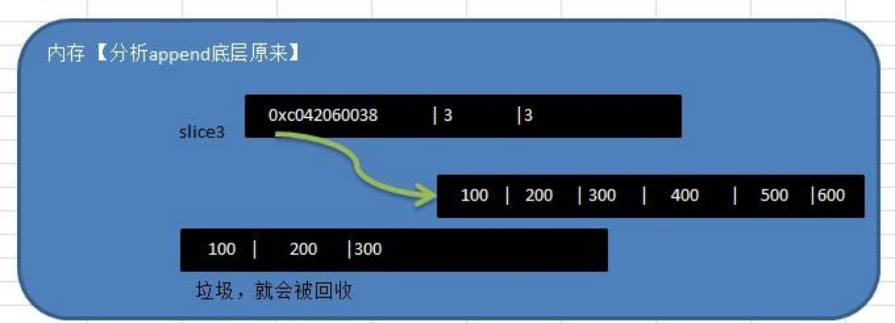
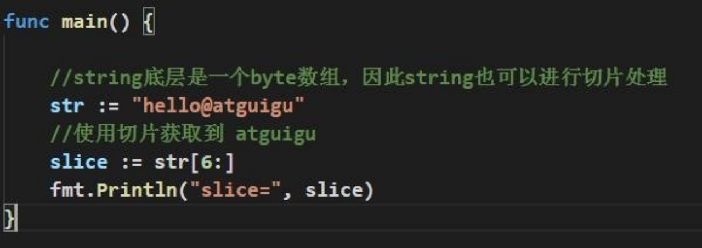

# 第07章 数组与切片

## 7.1 为什么需要数组

Ø 看一个问题

一个养鸡场有 6 只鸡，它们的体重分别是 3kg,5kg,1kg,3.4kg,2kg,50kg 。请问这六只鸡的总体重是多少?平均体重是多少? 请你编写一个程序

Ø 使用传统的方法来解决


对上面代码的说明

1) 使用传统的方法不利于数据的管理和维护.
2) 传统的方法不够灵活，因此我们引出需要学习的新的数据类型=>数组

## 7.2 数组介绍

数组可以存放多个同一类型数据。数组也是一种数据类型，在 Go 中，数组是值类型。

## 7.3 数组的快速入门

我们使用数组的方法来解决养鸡场的问题.


对上面代码的总结

1) 使用数组来解决问题，程序的可维护性增加.

2) 而且方法代码更加清晰，也容易扩展。

## 7.4 数组定义和内存布局

Ø 数组的定义

var	数组名 [数组大小]数据类型

var a [5]int

赋初值 a[0] = 1 a[1] = 30 ....

Ø 数组在内存布局(**重要**)


对上图的总结:

1) 数组的地址可以通过数组名来获取 &intArr

2) 数组的第一个元素的地址，就是数组的首地址

3) 数组的各个元素的地址间隔是依据数组的类型决定，比如 int64 -> 8	int32->4...

```go
func main() {

	var intArr [3]int // int占8个字节
	//	当我们定义完数组后，其实数组的各个元素有默认值 0
	fmt.Println(intArr)
	intArr[0] = 10
	intArr[1] = 20
	intArr[2] = 30
	fmt.Println(intArr)
	fmt.Printf("intArr的地址=%p \nintArr[0]的地址%p \nintArr[1]的地址%p \nintArr[2]的地址%p",
		&intArr, &intArr[0], &intArr[1], &intArr[2])
}

[0 0 0]
[10 20 30]
intArr的地址=0x1400001c090 
intArr[0]的地址0x1400001c090 
intArr[1]的地址0x1400001c098 
intArr[2]的地址0x1400001c0a0
```

## 7.5 数组的使用

Ø 访问数组元素

**数组名[下标]** 比如：你要使用 a 数组的第三个元素	a[2]

Ø 快速入门案例

从终端循环输入 5 个成绩，保存到 float64 数组,并输出.

```go
func main() {
	//	从终端循环输入5个成绩，保存到float64数组，并输出
	var scores [5]float64
	for i := 0; i < len(scores); i++ {
		fmt.Printf("请输入第%d个元素的值\n", i+1)
		fmt.Scanln(&scores[i])
	}
	// 变量数组打印
	for i, score := range scores {
		fmt.Printf("score[%d]=%v\n", i, score)
	}
}
```

Ø 四种初始化数组的方式

```go
func main() {
	// 四种初始化数组的方式
	var numArr01 [3]int = [3]int{1, 2, 3}
	fmt.Println("numArr01=", numArr01)

	var numArr02 = [3]int{1, 2, 3}
	fmt.Println("numArr02=", numArr02)

	// 这里的[...]是规定写法
	var numArr03 = [...]int{8, 9, 10}
	fmt.Println("numArr03=", numArr03)

	var numArr04 = [...]int{1: 800, 0: 900, 2: 999}
	fmt.Println("numArr04=", numArr04)

	// 类型推导
	strArr := [...]string{"tom", "jack", "mary"}
	fmt.Println("strArr=", strArr)
}
```

## 7.6 数组的遍历

### 7.6.1 方式 1-常规遍历

前面已经讲过了，不再赘述

### 7.6.2 方式 2-for-range 结构遍历

这是 Go 语言一种独有的结构，可以用来遍历访问数组的元素。

Ø for--range 的基本语法


## 7.7 数组使用的注意事项和细节

1) 数组是多个相同类型数据的组合,一个数组一旦声明/定义了,其长度是固定的, 不能动态变化

   

2) var arr []int	这时 arr 就是一个 slice 切片，切片后面专门讲解

3) 数组中的元素可以是任何数据类型，包括值类型和引用类型，但是不能混用。

4) 数组创建后，如果没有赋值，有默认值(零值)

5) 使用数组的步骤 1.  声明数组并开辟空间 2  给数组各个元素赋值(默认零值) 3  使用数组

6) 数组的下标是从 0 开始的

7) 数组下标必须在指定范围内使用，否则报 panic：数组越界，比如

   var arr [5]int	则有效下标为 0-4

8) Go 的数组属值类型， 在默认情况下是值传递， 因此会进行值拷贝。数组间不会相互影响

   

9) 如想在其它函数中，去修改原来的数组，可以使用引用传递(指针方式)

   

10) 长度是数组类型的一部分，在传递函数参数时 需要考虑数组的长度，看下面案例

    

## 7.8 数组的应用案例

1) 创建一个 byte 类型的 26 个元素的数组，分别 放置'A'-'Z‘。使用 for 循环访问所有元素并打印出来。提示：字符数据运算 'A'+1 -> 'B'

   ```go
   func main() {
   	var myChars [26]byte
   	for i := 0; i < 26; i++ {
   		myChars[i] = 'A' + byte(i)
   	}
   	for i := 0; i < 26; i++ {
   		fmt.Printf("%c", myChars[i])
   	}
   }
   ```

2) 请求出一个数组的最大值，并得到对应的下标。

   ```go
   func main() {
   	var intArr = [...]int{1, -1, 9, 90, 11, 88}
   	maxIndex := 0
   	maxVal := 0
   
   	for index, value := range intArr {
   		if value > maxVal {
   			maxVal = value
   			maxIndex = index
   		}
   	}
   
   	fmt.Printf("maxVal=%v maxIndex=%v", maxVal, maxIndex)
   }
   ```

3) 要求：随机生成五个数，并将其反转打印 , 复杂应用.

   ```go
   package main
   
   import (
   	"fmt"
   	"math/rand"
   	"time"
   )
   
   func main() {
   	var intArr [5]int
   	// 为了每次生成的随机数不一样，我们需要给一个seed值
   	rand.Seed(time.Now().UnixNano())
   	for index := range intArr {
   		intArr[index] = rand.Intn(100)
   	}
   	fmt.Println("交换前=", intArr)
   	temp := 0
   	for i := 0; i < len(intArr)/2; i++ {
   		temp = intArr[len(intArr)-1-i]
   		intArr[len(intArr)-1-i] = intArr[i]
   		intArr[i] = temp
   	}
   	fmt.Println("交换后=", intArr)
   }
   ```

## 7.9 为什么需要切片

先看一个需求：我们需要一个数组用于保存学生的成绩，但是**学生的个数**是不确定的，请问怎么办？解决方案：-》使用**切片**。

## 7.10 切片的基本介绍

1) 切片的英文是 slice

2) 切片是数组的一个引用，因此<font color='blue'>**切片是引用类型**</font>，在进行传递时，遵守引用传递的机制。

3) 切片的<font color='red'>**使用和数组类似**</font>，遍历切片、访问切片的元素和求切片长度 len(slice)都一样。

4) 切片的长度是可以变化的，因此切片是一个<font color='purple'>**可以动态变化数组**</font>

5) 切片定义的基本语法:

   var 切片名 []类型

   比如：var a [] int

## 7.11 快速入门

演示一个切片的基本使用：

```go
func main() {
   // 演示切片的基本使用
   var intArr = [...]int{1, 22, 33, 66, 99}
   // 声明/定义一个切片
   // slice := intArr[1:3]
   // 1. slice就是切片名
   // 2. intArr[1:3] 表示 slice 引用到intArr这个数组
   // 3. 引用intArr数组的起始下标为1，最后的下标为3（但是不包含3
   slice := intArr[1:3]
   fmt.Println("intArr=", intArr)
   fmt.Println("slice 的元素是=", slice)
   fmt.Println("slice 的元素个数=", len(slice))
   fmt.Println("slice 的容量=", cap(slice))
}
```

运行结果是：

```
/private/var/folders/_j/fkcs_wcn621_cmfgv_53lxv00000gn/T/GoLand/___go_build_gostudy_project07_main
intArr= [1 22 33 66 99]
slice 的元素是= [22 33]
slice 的元素个数= 2
slice 的容量= 4
```

## 7.12 切片在内存中形式(重要)

Ø 基本的介绍：

为了让大家更加深入的理解切片，我们画图分析一下切片在内存中是如何布局的，这个是一个非常重要的知识点：(以前面的案例来分析)

Ø 画出前面的切片内存布局


Ø 对上面的分析图总结

1. slice 的确是一个引用类型
2. slice 从底层来说，其实就是一个数据结构(struct 结构体) 

```go
type slice struct {
  ptr	*[2]int
  len	int
  cap	int
}
```

## 7.13 切片的使用

Ø 方式 1

第一种方式：定义一个切片，然后让切片去引用一个已经创建好的数组，比如前面的案例就是这样的。

Ø 方式 2

第二种方式：通过 **make** 来创建切片.

基本语法：**var 切片名 []type = make([]type, len, [cap])**

参数说明: type:  就是数据类型	len : 大小	cap ：指定切片容量，**可选， 如果你分配了cap,则要求 cap>=len.** 

**对上面代码的小结**:

1) 通过 make 方式创建切片可以指定切片的大小和容量

2) 如果没有给切片的各个元素赋值，那么就会使用默认值[int , float=> 0	string =>””	bool => false]
3) 通过 make 方式创建的切片对应的数组是由 make 底层维护，对外不可见，即只能通过 slice 去访问各个元素.

Ø 方式 3

第 3 种方式：定义一个切片，直接就指定具体数组，使用原理类似 make 的方式 案例演示：


Ø 方式 1 和方式 2 的区别(面试)


## 7.14 切片的遍历

切片的遍历和数组一样，也有两种方式

Ø for 循环常规方式遍历

Ø for-range 结构遍历切片 

```go
package main

import "fmt"

func main() {
	// 使用常规的for循环遍历切片
	var arr = [...]int{10, 20, 30, 40, 50}
	slice := arr[1:4] // 20, 30, 40
	for i := 0; i < len(slice); i++ {
		fmt.Printf("slice[%v]=%v\n", i, slice[i])
	}
	fmt.Println("==============")
	for index, val := range slice {
		fmt.Printf("i=%v v=%v \n", index)
	}
}
```

## 7.15 切片的使用的注意事项和细节讨论

1) 切片初始化时 var slice = arr[startIndex:endIndex]

   说明：从 arr 数组下标为 startIndex，取到 下标为 endIndex 的元素(不含 arr[endIndex])。

2) 切片初始化时，仍然不能越界。范围在 [0-len(arr)] 之间，但是可以动态增长.

   var slice = arr[0:end] 可以简写 var slice = arr[:end]

   var slice = arr[start:len(arr)] 可以简写： var slice = arr[start:] 

   var slice = arr[0:len(arr)] 可以简写: var slice = arr[:]

3) cap 是一个内置函数，用于统计切片的容量，即最大可以存放多少个元素。

4) 切片定义完后，还不能使用，因为本身是一个空的，需要让其引用到一个数组，或者 make 一个空间供切片来使用

5) 切片可以继续切片[案例演示]

   ```go
   package main
   
   import "fmt"
   
   func main() {
   	// 使用常规的for循环遍历切片
   	var arr = [...]int{10, 20, 30, 40, 50}
   	slice := arr[1:4] // 20, 30, 40
   	for i := 0; i < len(slice); i++ {
   		fmt.Printf("slice[%v]=%v\n", i, slice[i])
   	}
   	fmt.Println("==============")
   	for index, val := range slice {
   		fmt.Printf("i=%v v=%v \n", index, val)
   	}
   
   	slice2 := slice[1:2]
   	slice2[0] = 100 // 因为arr, slice和slice2指向的数据空间是同一个，因此slice[0] = 100
   	fmt.Println("slice2=", slice2)
   	fmt.Println("slice=", slice)
   	fmt.Println("arr=", arr)
   }
   ```

6) 用 append 内置函数，可以对切片进行动态追加

   ```go
   package main
   
   import "fmt"
   
   func main() {
   	// 用append内置函数，可以对切片进行动态追加
   	var slice3 = []int{100, 200, 300}
   	// 通过append直接给slice3追加具体的元素
   	slice3 = append(slice3, 400, 500, 600)
   	fmt.Println("slice3=", slice3)
   	// 通过append将切片slice3追加给slice3
   	slice3 = append(slice3, slice3...)
   	fmt.Println("slice3=", slice3)
   
   }
   ```

   对上面代码的小结

   

   **切片append操作的底层原理分析**:

   切片 append 操作的本质就是对数组扩容

   go 底层会创建一下新的数组 newArr(安装扩容后大小)

   将 slice 原来包含的元素拷贝到新的数组 newArr

   slice 重新引用到 newArr

   注意 newArr 是在底层来维护的，程序员不可见.

7) 切片的拷贝操作

   切片使用 copy 内置函数完成拷贝，举例说明

   ```go
   package main
   
   import "fmt"
   
   func main() {
   	// 切片的拷贝操作
   	// 切片使用copy内置函数完成拷贝，举例说明
   	var slice4 = []int{1, 2, 3, 4, 5}
   	var slice5 = make([]int, 10)
   	copy(slice5, slice4)
   	slice4[4] = 999
   	fmt.Println("slice4=", slice4) // slice4= [1 2 3 4 999]
   	fmt.Println("slice5=", slice5) // slice5= [1 2 3 4 5 0 0 0 0 0]
   }
   ```

   **对上面代码的说明:**

   (1) copy(para1, para2) 参数的数据类型是切片

   (2) 按照上面的代码来看, slice4 和 slice5 的数据空间是独立，相互不影响，也就是slice4[0]=999,slice5[0] 仍然是 1

8) 关于拷贝的注意事项

   

   **说明**: 上面的代码没有问题，可以运行,  最后输出的是 [1]

9) 切片是引用类型，所以在传递时，遵守引用传递机制。看两段代码，并分析底层原理

    

## 7.16 string 和 slice

1) string 底层是一个 byte 数组，因此 string 也可以进行切片处理 案例演示：

   

2) string 和切片在内存的形式，以 "abcd" 画出内存示意图

   

3) string 是不可变的，也就说不能通过 str[0] = 'z' 方式来修改字符串

   

4) 如果需要修改字符串，可以先将 string -> []byte / 或者 []rune -> 修改 -> 重写转成 string

   

## 7.17 切片的课堂练习题

**说明**：编写一个函数 fbn(n int) ，要求完成

1) 可以接收一个 n int

2) 能够将斐波那契的数列放到切片中

3) 提示, 斐波那契的数列形式:

arr[0] = 1; arr[1] = 1; arr[2]=2; arr[3] = 3; arr[4]=5; arr[5]=8

**代码思路：**

```go
package main

import "fmt"

func main() {
	fnbSlice := fbn(20)
	fmt.Println("fnbSlice=", fnbSlice)
}

func fbn(n int) []uint64 {
	// 声明一个切片，切片大小 n
	fbnSlice := make([]uint64, n)
	// 第一个数和第二个数的斐波那契 1
	fbnSlice[0] = 1
	fbnSlice[1] = 1
	// 进行for循环来存放斐波那契的数列
	for i := 2; i < n; i++ {
		fbnSlice[i] = fbnSlice[i-1] + fbnSlice[i-2]
	}
	return fbnSlice
}
```

