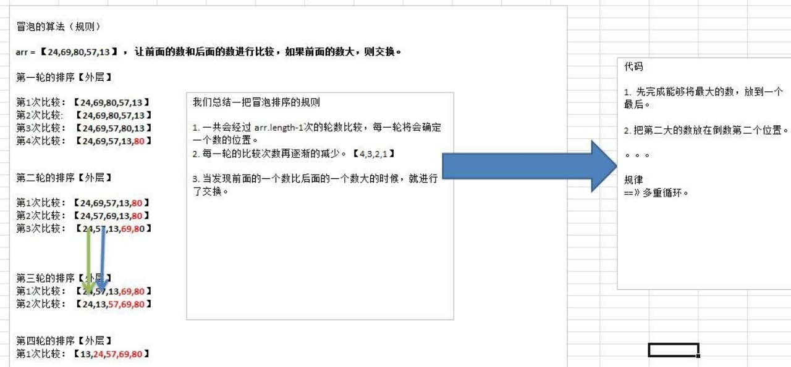
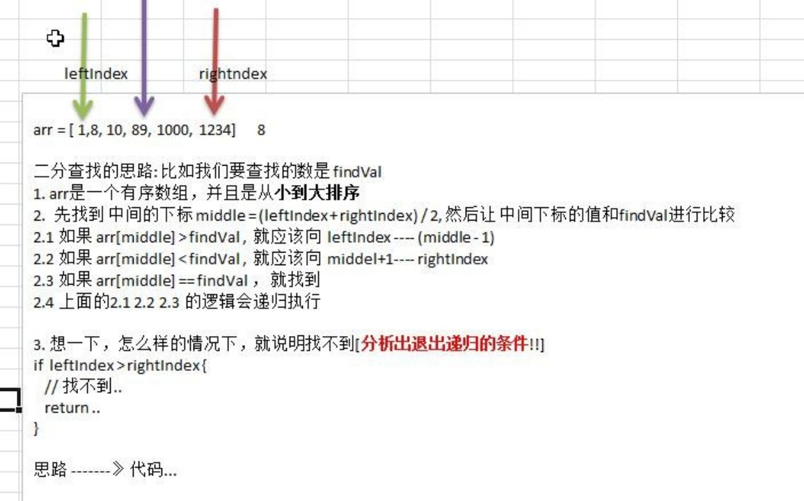
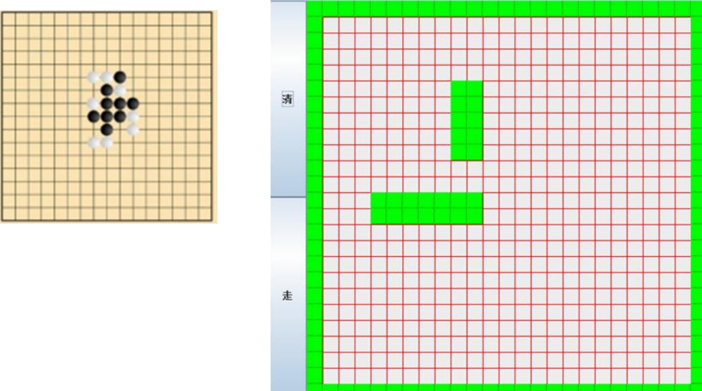
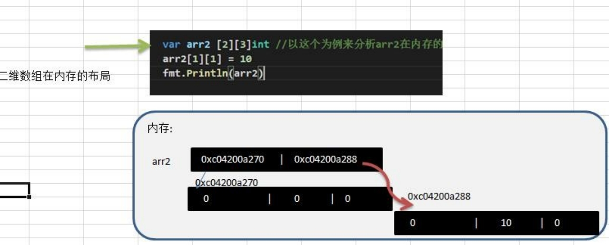
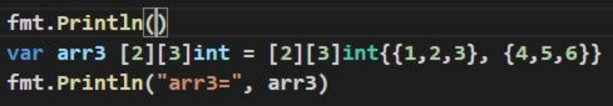
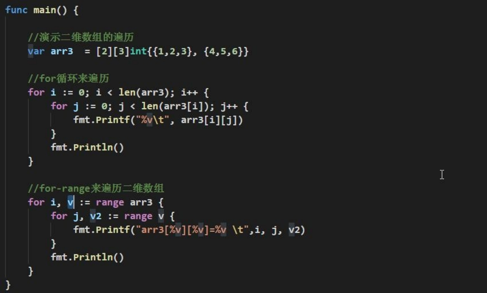

# 第8章 排序和查找

## 8.1 排序的基本介绍

排序是将一组数据，依指定的顺序进行排列的过程。

排序的分类：

1. 内部排序：

   指将需要处理的所有数据都加载到内部存储器中进行排序。包括（<font color='red'>交换式排序法、选择式排序法和插入式排序法</font>）。

2. 外部排序法：

   数据量过大，无法全部加载到内存中，需要借助外部存储进行排序。包括（<font color='red'>合并排序法和直接合并排序法）。</font>

## 8.2 冒泡排序的思路分析

冒泡排序（Bubble Sorting）的基本思想是：通过对待排序序列从后向前（从下标较大的元素开始），依次比较相邻元素的排序码，若发现逆序则交换，使排序码较小的元素逐渐从后部移向前部（从下标较大的单元移向下标较小的单元），就像水底下的气泡一样逐渐向上冒。

因为在排序的过程中，各元素不断接近自己的位置，如果一趟下来没有进行过交换，就说明序列有序，因此要在排序过程中设置一个标志flag判断元素是否进行过交换。从而减少不必要的比较（优化）。



## 8.3 冒泡排序实现

```go
package main

import "fmt"

func main() {
	arr := [5]int{24, 69, 80, 57, 13}
	BubbleSort(&arr)
}

func BubbleSort(arr *[5]int) {
	fmt.Println("排序前arr=", *arr)
	for i := 0; i < len(*arr)-1; i++ {
		for j := len(*arr) - 1; j > i; j-- {
			if (*arr)[j] < (*arr)[j-1] {
				temp := (*arr)[j]
				(*arr)[j] = (*arr)[j-1]
				(*arr)[j-1] = temp
			}
		}
	}
	fmt.Println("排序后arr=", *arr)
}
```

## 8.4 查找

Ø 介绍：

在 Golang 中，我们常用的查找有两种:

1. **顺序查找**

2) **二分查找**(该数组是有序)

 Ø 案例演示：

1) 有一个数列：白眉鹰王、金毛狮王、紫衫龙王、青翼蝠王

   猜数游戏：从键盘中任意输入一个名称，判断数列中是否包含此名称【顺序查找】

   ```go
   package main
   
   import "fmt"
   
   func main() {
   	names := [4]string{"白眉鹰王", "金毛狮王", "紫衫龙王", "青翼蝠王"}
   	var heroName = ""
   	fmt.Println("请输入要查找的人名...")
   	fmt.Scanln(&heroName)
   	// 顺序查找：第一种方式
   	for i := 0; i < len(names); i++ {
   		if heroName == names[i] {
   			fmt.Printf("找到%v, 下标%v \n", heroName, i)
   		} else {
   			if i == len(names)-1 {
   				fmt.Printf("没有找到%v \n", heroName)
   			}
   		}
   	}
   	// 顺序查找：第二种方式
   	index := -1
   	for i := 0; i < len(names); i++ {
   		if heroName == names[i] {
   			index = i
   			break
   		}
   	}
   	if index != -1 {
   		fmt.Printf("找到%v, 下标%v \n", heroName, index)
   	} else {
   		fmt.Printf("没有找到%v \n", heroName)1
   	}
   }
   ```

2) 请对一个**有序数组**进行二分查找 {1,8, 10, 89, 1000, 1234} ，输入一个数看看该数组是否存在此数，并且求出下标，如果没有就提示"没有这个数"。【会使用到递归】

   二分查找的思路分析:



```go
/*
二分查找的思路: 比如我们要查找的数是 findVal
1.	arr 是一个有序数组，并且是从小到大排序
2.	先找到 中间的下标 middle = (leftIndex + rightIndex) / 2, 然后让 中间下标的值和 findVal 进行比较
2.1	如果 arr[middle] > findVal ,	就应该向	leftIndex	(middle - 1)
2.2	如果 arr[middle] < findVal ,	就应该向	middel+1	rightIndex
2.3	如果 arr[middle] == findVal ， 就找到
2.4	上面的 2.1 2.2 2.3 的逻辑会递归执行
3.	想一下，怎么样的情况下，就说明找不到[分析出退出递归的条件!!] if	leftIndex > rightIndex {
// 	找不到.. return ..
}
*/
func BinaryFind(arr *[6]int, leftIndex int, rightIndex int, findVal int) {
	if leftIndex > rightIndex {
		fmt.Println("未找到...")
		return
	}
	middle := (leftIndex + rightIndex) / 2
	if (*arr)[middle] > findVal {
		//说明我们要查找的数，应该在	leftIndex --- middle-1
		BinaryFind(arr, leftIndex, middle-1, findVal)
	} else if (*arr)[middle] < findVal {
		//说明我们要查找的数，应该在	middel+1 --- rightIndex
		BinaryFind(arr, middle+1, rightIndex, findVal)
	} else {
		// 找到了
		fmt.Printf("找到了，下标为%v \n", middle)
	}
}

func main() {
	arr := [6]int{1, 8, 10, 89, 1000, 1234}
	//测试一把
	BinaryFind(&arr, 0, len(arr)-1, 10)
}
```

## 8.5 二维数组的介绍

多维数组我们只介绍二维数组

## 8.6 二维数组的应用场景

比如我们开发一个五子棋游戏，棋盘就是需要二维数组来表示。如图




## 8.7 二维数组的应用场景

快速入门案例：

Ø 请用二维数组输出如下图形

0 0 0 0 0 0

0 0 1 0 0 0

0 2 0 3 0 0

0 0 0 0 0 0

Ø 代码演示

```go
func main() {
	// 定义/声明二维数组
	var arr [4][6]int
	// 赋初值
	arr[1][2] = 1
	arr[2][1] = 2
	arr[2][3] = 3

	for i := 0; i < 4; i++ {
		for j := 0; j < 6; j++ {
			fmt.Print(arr[i][j], " ")
		}
		fmt.Println()
	}
}
```

## 8.8 使用方式 1: 先声明/定义,再赋值

Ø 语法: var 数组名 [大小][大小]类型

Ø 比如: var arr [2][3]int  ， 再赋值。

Ø 使用演示

Ø 二维数组在内存的存在形式(重点)



## 8.9 使用方式 2: 直接初始化

Ø 声明：var 数组名 [大小][大小]类型 = [大小][大小]类型{{初值..},{初值..}}

Ø 赋值(有默认值，比如 int	类型的就是 0)

Ø 使用演示



Ø 说明：二维数组在声明/定义时也对应有四种写法[和一维数组类似]

var 数组名 [大小][大小]类型 = [大小][大小]类型{{初值..},{初值..}}

var 数组名 [大小][大小]类型 = [...][大小]类型{{初值..},{初值..}}

var 数组名	= [大小][大小]类型{{初值..},{初值..}}

var 数组名	= [...][大小]类型{{初值..},{初值..}}

## 8.10 二维数组的遍历

Ø 双层 for 循环完成遍历

Ø for-range 方式完成遍历

