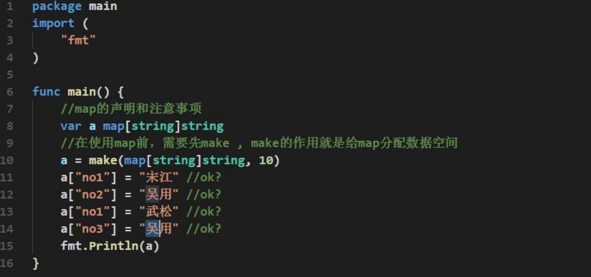
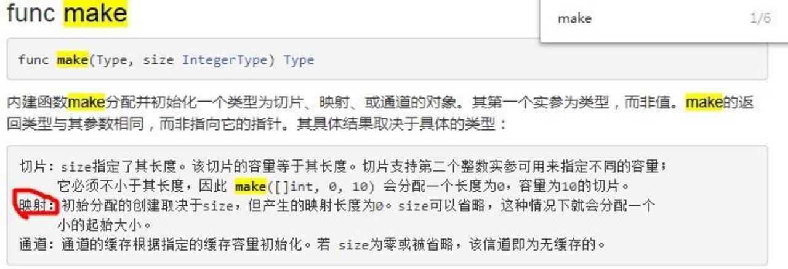
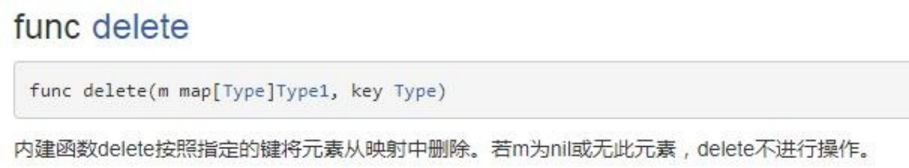
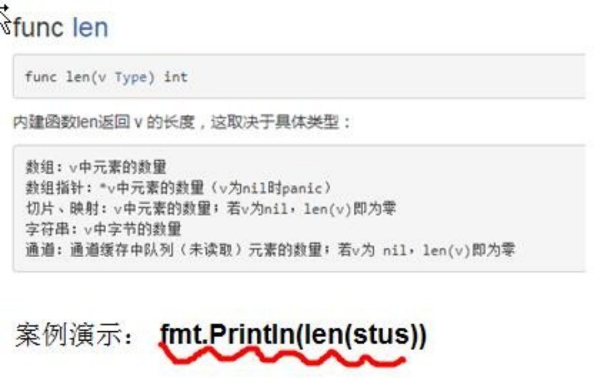

# 第9章 map

## 9.1 map 的基本介绍

map 是 key-value 数据结构，又称为字段或者关联数组。类似其它编程语言的集合， 在编程中是经常使用到

## 9.2 map 的声明

###  9.2.1 基本语法

var map 变量名 map[keytype]valuetype

Ø key 可以是什么类型

golang 中的 map，的 key 可以是很多种类型，比如 bool, 数字，string, 指针, channel ,  还可以是只包含前面几个类型的 接口, 结构体, 数组

**通常key为int、string**

注意: slice， map  还有 function  不可以，因为这几个没法用 == 来判断

Ø valuetype 可以是什么类型

valuetype 的类型和 key 基本一样

通常为: 数字(整数,浮点数),string,map,struct

### 9.2.2 map 声明的举例

map 声明的举例：

```go
var a map[string]string 
var a map[string]int 
var a map[int]string
var a map[string]map[string]string
```

注意：声明是不会分配内存的，初始化需要 make ，分配内存后才能赋值和使用。

**案例演示**：



Ø 对上面代码的说明

1) map 在使用前一定要 make

2) map 的 key 是不能重复，如果重复了，则以最后这个 key-value 为准

3) map 的 value 是可以相同的.

4) map 的 key-value 是无序

5) make 内置函数数目



## 9.3 map 的使用

Ø 方式 1

```go
	// 第一种使用方式
	var amap map[string]string
	// 在使用map前，需要先make，make的作用就是给map分配数据空间
	amap = make(map[string]string, 10)
	amap["no1"] = "宋江"
	amap["no2"] = "吴用"
	amap["no1"] = "武松"
	amap["no3"] = "吴用"
	fmt.Println(amap)
```

Ø 方式 2

```go
	// 第二种方式
	cities := make(map[string]string)
	cities["no1"] = "北京"
	cities["no2"] = "天津"
	cities["no3"] = "上海"
	fmt.Println(cities)
```

Ø 方式 3

```go
// 第三种方式
	heroes := map[string]string{
		"hero1": "宋江",
		"hero2": "卢俊义",
		"hero3": "吴用",
	}
	heroes["hero4"] = "林冲"
	fmt.Println(heroes)
```

## 9.4 map 的增删改查操作

Ø map 增加和更新：

map["key"] = value //<font color='red'>**如果key还没有，就是增加，如果key存在就是修改**。</font>

Ø map 删除

**说明**：

delete(map，"key") ，delete 是一个内置函数，如果 key 存在，就删除该 key-value,如果 key 不存在， 不操作，但是也不会报错



Ø 细节说明

如果我们要删除 map 的所有 key ,没有一个专门的方法一次删除，可以遍历一下 key, 逐个删除或者 map = make(...)，make 一个新的，让原来的成为垃圾，被 gc 回收

Ø map 查找：

```go
val, ok := heroes["hero1"]
	if ok {
		fmt.Println("有值:", val)
	} else {
		fmt.Println("没有值:")
	}
```

对上面代码的说明:

说明：如果 heroes 这个 map 中存在 "hero1"  ， 那么 findRes 就会返回 true,否则返回 false

## 9.5 map 遍历

案例演示相对复杂的 map 遍历：该 map 的 value 又是一个 map

说明：map 的遍历使用 **for-range** 的结构遍历

Ø map 的长度：



## 9.6 map 切片

### 9.6.1 基本介绍

**切片的数据类型如果是 map**，则我们称为 slice of map，**map切片**，这样使用则 **map 个数就可以动态变化了**。

### 9.6.2 案例演示

要求：使用一个 map 来记录 monster 的信息 name 和 age, 也就是说一个 monster 对应一个 map,并且妖怪的个数可以动态的增加=>**map 切片**

```go
// 演示map切片的使用

	// 1、声明一个切片
	var monsters []map[string]string
	monsters = make([]map[string]string, 2) // 准备放入两个妖怪
	// 2、增加第一个妖怪的信息
	if monsters[0] == nil {
		monsters[0] = make(map[string]string, 2)
		monsters[0]["name"] = "牛魔王"
		monsters[0]["age"] = "500"
	}
	if monsters[1] == nil {
		monsters[1] = make(map[string]string, 2)
		monsters[1]["name"] = "玉兔精"
		monsters[1]["age"] = "400"
	}
	// 下面这个写法越界
	//if monsters[2] == nil {
	//	monsters[2] = make(map[string]string, 2)
	//	monsters[2]["name"] = "狐狸精"
	//	monsters[2]["age"] = "300"
	//}
	// 需要使用切片的append函数，可以动态的增加monster
	newMonster := map[string]string{
		"name": "新的妖怪～火云邪神",
		"age":  "200",
	}
	monsters = append(monsters, newMonster)

	fmt.Println(monsters)
```

## 9.7 map排序

### 9.7.1 基本介绍

1) golang 中没有一个专门的方法针对 map 的 key 进行排序

2) golang 中的 map 默认是无序的，注意也不是按照添加的顺序存放的，你每次遍历，得到的输出可能不一样. 

3) golang 中 map 的排序，是先将 key 进行排序，然后根据 key 值遍历输出即可

## 9.8 map 使用细节

1. map 是引用类型，遵守引用类型传递的机制，在一个函数接收 map，修改后，会直接修改原来的 map
2. map 的容量达到后，再想 map 增加元素，会自动扩容，并不会发生 panic，也就是说 map 能动态的增长 键值对(key-value)
3. map 的 **value** **也经常使用** **struct** **类型**，更适合管理复杂的数据(比前面 value 是一个 map 更好)，