# 第10章 面向对象编程(上)

## 10.1 结构体

### 10.1.1 看一个问题


1. 使用现有技术解决

2. 单独的定义变量解决

   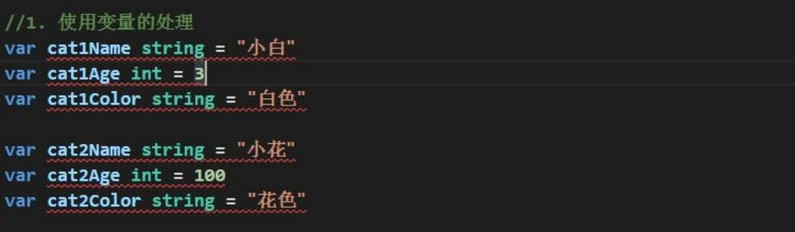

3. 使用数组解决

   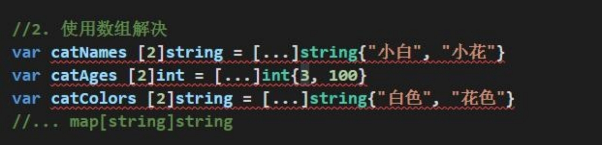

### 10.1.2 现有技术解决的缺点分析

1) 使用变量或者数组来解决养猫的问题，不利于数据的管理和维护。因为名字，年龄，颜色都是属于一只猫，但是这里是分开保存。

2) 如果我们希望对一只猫的属性（名字、年龄，颜色）进行操作(绑定方法)， 也不好处理。

3) 引出我们要讲解的技术-》**结构体**。

### 10.1.3 一个程序就是一个世界，有很多对象(变量)


### 10.1.4 Golang 语言面向对象编程说明

1) Golang 也支持面向对象编程(OOP)，但是和传统的面向对象编程有区别，并不是纯粹的面向对象语言。所以我们说 Golang 支持面向对象编程特性是比较准确的。

2) Golang 没有类(class)，Go 语言的结构体(struct)和其它编程语言的类(class)有同等的地位，你可以理解 Golang 是基于 struct 来实现 OOP 特性的。

3) Golang 面向对象编程非常简洁，去掉了传统 OOP 语言的继承、方法重载、构造函数和析构函数、隐藏的 this 指针等等

4) Golang 仍然有面向对象编程的**继承，封装和多态**的特性，只是实现的方式和其它 OOP 语言不一样，比如继承 ：Golang 没有 extends 关键字，继承是通过匿名字段来实现。

5) Golang 面向对象(OOP)很优雅，OOP 本身就是语言类型系统(type system)的一部分，通过接口(interface)关联，耦合性低，也非常灵活。后面同学们会充分体会到这个特点。也就是说在Golang 中面向接口编程是非常重要的特性。

### 10.1.5 结构体与结构体变量(实例/对象)的关系示意图

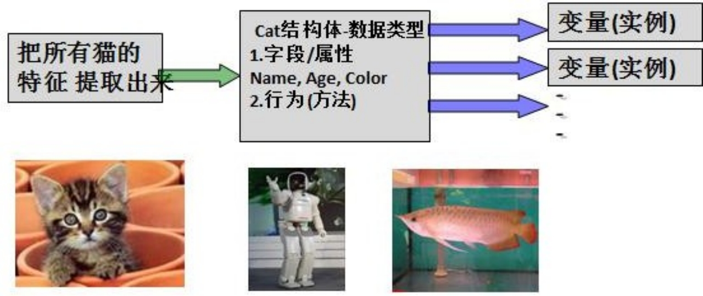

Ø 对上图的说明

1) 将一类事物的特性提取出来(比如猫类)， 形成一个新的数据类型， 就是一个结构体。

2) 通过这个结构体，我们可以创建多个变量(实例/对象)

3) 事物可以猫类，也可以是 Person  ， Fish  或是某个工具类。。。

### 10.1.6 快速入门-面向对象的方式(struct)

Ø 代码演示

```go
func main() {
	var cat1 Cat
	cat1.Name = "小白"
	cat1.Age = 3
	cat1.Color = "白色"
	cat1.Hobby = "吃🐟"
	fmt.Println(cat1)
}

// Cat 定义一个Cat结构体
type Cat struct {
	Name  string
	Age   int
	Color string
	Hobby string
}
```

### 10.1.7 结构体和结构体变量(实例)的区别和联系

通过上面的案例和讲解我们可以看出:

1) 结构体是自定义的数据类型，代表一类事物.

2) 结构体变量(实例)是具体的，实际的，代表一个具体变量

### 10.1.8 结构体变量(实例)在内存的布局(重要!)

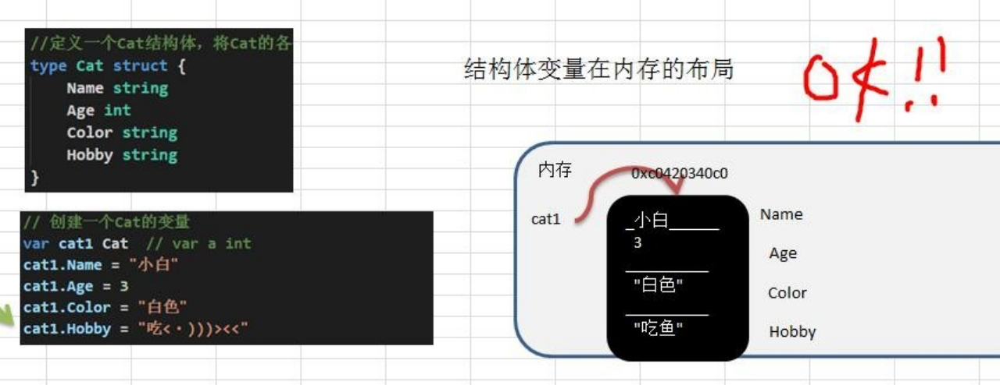

### 10.1.9 如何声明结构体

Ø 基本语法

```go
type 结构体名称 struct { 
	field1 type
	field2 type
}
```

Ø 举例

```go
type Student struct { 
  Name string //字段
  Age int //字段
  Score float32
}
```

### 10.1.10 字段/属性

Ø 基本介绍

1. 从概念或叫法上看： 结构体字段 = 属性 = field
2. 字段是结构体的一个组成部分，一般是**基本数据类型**、**数组**,也可是**引用类型**。比如我们前面定义猫结构体 的 Name string	就是属性

Ø 注意事项和细节说明

1) 字段声明语法同变量，示例：字段名 字段类型

2) 字段的类型可以为：基本类型、数组或引用类型

3) 在创建一个结构体变量后，如果没有给字段赋值，都对应一个零值(默认值)，规则同前面讲的一样:

   布尔类型是 false ，数值是 0  ，字符串是 ""。

   数组类型的默认值和它的元素类型相关，比如 score [3]int 则为[0, 0, 0]

   <font color='red'>指针，slice，和 map 的零值都是 nil ，即还没有分配空间。</font>

   案例演示：

   ```go
   type Person struct {
   	Name string
   	Age int
   	Scores [5]float64
   	ptr *int // 指针
   	slice []int // 切片
   	map1 map[string]string // map
   }
   
   func main() {
   	// 定义结构体变量
   	var p1 Person
   	fmt.Println(p1)
   	// 使用slice，需要先make
   	p1.slice = make([]int, 10)
   	p1.slice[0] = 100
   	// 使用map 先make
   	p1.map1 = make(map[string]string)
   	p1.map1["key1"] = "tom"
   	fmt.Println(p1)
   }
   ```

4) 不同结构体变量的字段是独立，互不影响，一个结构体变量字段的更改，不影响另外一个, **结构体是值类型**

   ```go
   type Monster struct {
   	Name string
   	Age int
   }
   ```

   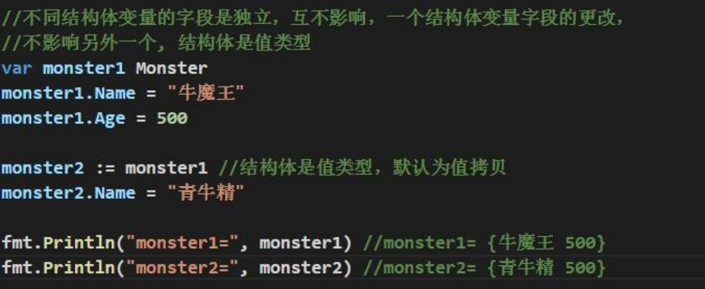

**画出上面代码的内存示意图**：

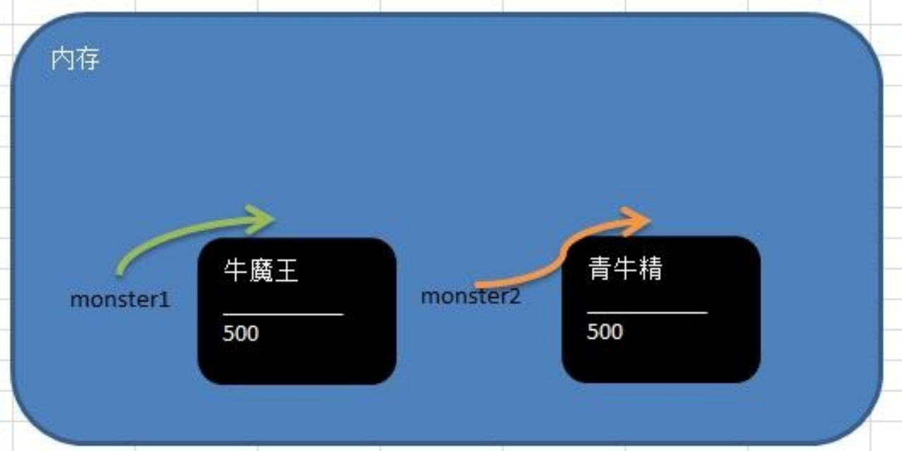

### 10.1.11 创建结构体变量和访问结构体字段

Ø 方式 1-直接声明

```go
var person Person
```

Ø 方式 2-{}

```go
person := Person{}
fmt.Println(person)
```

Ø 方式 3-&

```go
var person *Person = new(Person)
	// person这里是一个指针，因此标准的给字段赋值方式
	// (*person).Name = "smith" 也可以这样写 person.Name = "john"
	//  原因：go的设计者 为了程序员使用方便，底层会对 person.Name = "john" 进行处理 (*person).Name = "john"
	(*person).Name = "smith"
	person.Name = "john"
	fmt.Println(*person)
```

Ø 方式 4-{}

```go
	var person *Person = &Person{}
	fmt.Println(person)
```

Ø 说明:

1) 第 3 种和第 4 种方式返回的是 **结构体指针**。
2) 结构体指针访问字段的标准方式应该是：(*结构体指针).字段名 ，比如 (*person).Name = "tom"
3) 但 go 做了一个简化，**也支持** **结构体指针.字段名**,	比如 person.Name = "tom"。更加符合程序员使用的习惯，**go 编译器底层 对 person.Name 做了转化(*person).Name。**

### 10.1.12 struct 类型的内存分配机制

```go
	var p1 Person
	p1.Age = 10
	p1.Name = "小明"
	var p2 = p1
	p2.Name = "tom"
	fmt.Printf("p2.Name=%v p1.Name=%v", p2.Name, p1.Name)
```

**输出的结果是**: p2.Name = tom p1.Name = 小明

Ø 结构体在内存中示意图

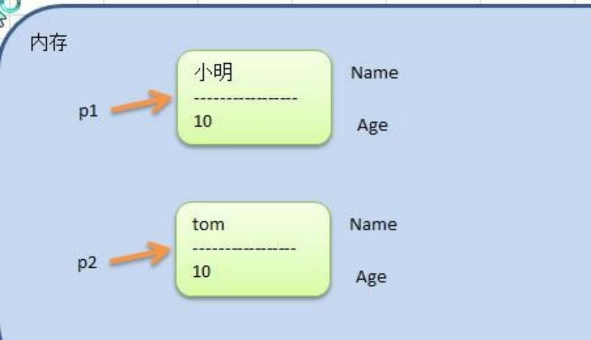

Ø 看下面代码，并分析原因

```go
	var p1 Person
	p1.Age = 10
	p1.Name = "小明"
	var p2 *Person = &p1 // 使用指针

	fmt.Println((*p2).Age)
	fmt.Println(p2.Age)
	p2.Name = "tom"
	fmt.Printf("p2.Name=%v p1.Name=%v", p2.Name, p1.Name)

	fmt.Printf("p1的地址是%p\n", &p1)
	fmt.Printf("p2的地址是%p p2的值是%p\n", &p2, p2)

10
10
p2.Name=tom p1.Name=tomp1的地址是0x1400012e000
p2的地址是0x14000114018 p2的值是0x1400012e000
```

上面代码对应的内存图的分析：

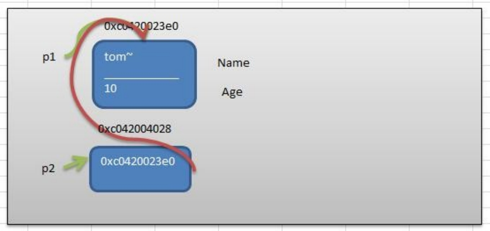

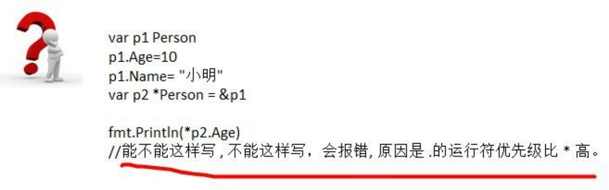

### 10.1.13 结构体使用注意事项和细节

1) 结构体的所有字段在<font color='blue'>**内存中是连续**</font>的

   ```go
   type Point struct {
   	x int
   	y int
   }
   
   type Rect struct {
   	leftUp, rightDown Point
   }
   
   type Rect2 struct {
   	leftUp, rightDown *Point
   }
   
   func main() {
   	r1 := Rect{Point{1, 2}, Point{3, 4}}
   
   	// r1有四个int， 在内存中是连续分布的
   	fmt.Printf("r1.leftUp.x 地址=%p  r1.leftUp.y 地址=%p r1.rightDown.x 地址=%p r1.rightDown.y 地址=%p\n",
   		&r1.leftUp.x, &r1.leftUp.y, &r1.rightDown.x, &r1.rightDown.y)
   
   	// r2有两个 *Point类型 这两个*Point类型的本身地址也是连续的，但是他们指向的地址不一定是连续
   	r2 := Rect2{&Point{10, 20}, &Point{30, 40}}
   	// 打印地址
   	fmt.Printf("r2.leftUp 本身地址=%p r2.rightDown 本身地址=%p \n",
   		&r2.leftUp, &r2.rightDown)
   	fmt.Printf("r2.leftUp 指向地址=%p r2.rightDown 指向地址=%p \n",
   		r2.leftUp, r2.rightDown)
   }
   
   
   r1.leftUp.x 地址=0x1400001e020  r1.leftUp.y 地址=0x1400001e028 r1.rightDown.x 地址=0x1400001e030 r1.rightDown.y 地址=0x1400001e038
   r2.leftUp 本身地址=0x14000010230 r2.rightDown 本身地址=0x14000010238 
   r2.leftUp 指向地址=0x14000020080 r2.rightDown 指向地址=0x14000020090 
   ```

2) 结构体是用户单独定义的类型，和其它类型进行转换时需要有完全相同的字段(名字、个数和类型)

   ```go
   type A struct {
   	Num int
   }
   
   type B struct {
   	Num int
   }
   
   func main() {
   	var a A
   	var b B
   	a = A(b)
   	fmt.Println(a, b)
   }
   ```

3) 结构体进行 type 重新定义(相当于取别名)，Golang 认为是新的数据类型，但是相互间可以强转

   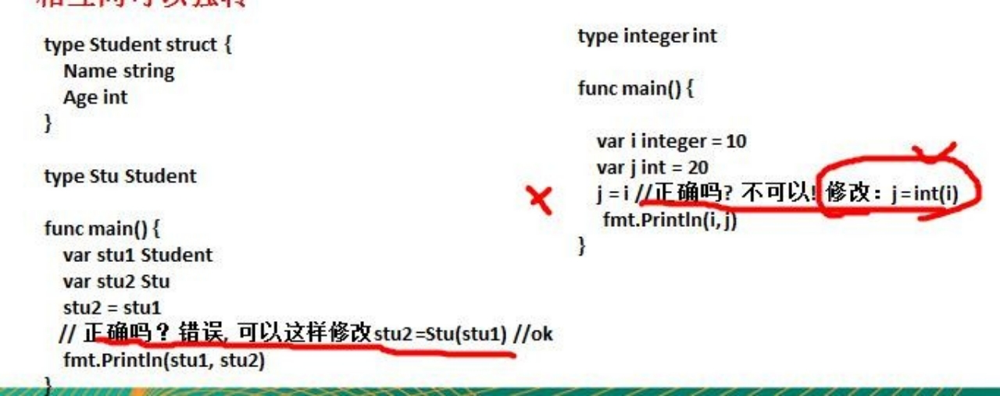

4) struct 的每个字段上，可以写上一个 **tag**,  该 tag 可以通过反射机制获取，常见的使用场景就是**序列化**和反序列化

   Ø 序列化的使用场景:

   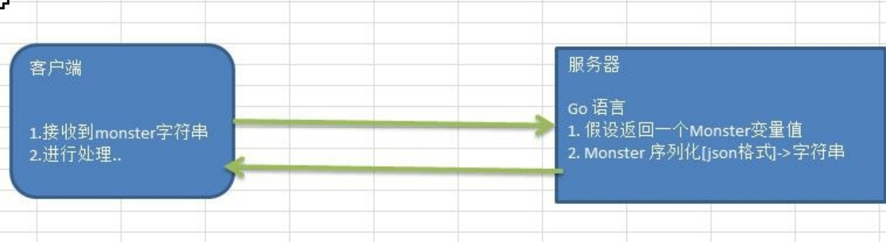

   Ø 举例:

   ```go
   type Monster struct {
   	Name string `json:"name"`
   	Age  int `json:"age"`
   }
   
   func main() {
   	// 1、创建一个Monster变量
   	monster := Monster{"牛魔王", 500}
   	// 2、将monster变量序列化为json格式字符串
   	jsonstr, err := json.Marshal(monster)
   	if err != nil {
   		fmt.Println("json 处理错误", err)
   	}
   	fmt.Println("jsonStr", string(jsonstr))
   }
   ```

## 10.2 方法

### 10.2.1 基本介绍

在某些情况下，我们要需要声明(定义)方法。比如 Person 结构体:除了有一些字段外( 年龄，姓名..),Person 结构体还有一些行为比如:可以说话、跑步..,通过学习，还可以做算术题。这时就要用方法才能完成。

Golang 中的方法是**作用在指定的数据类型上的**(即：和指定的数据类型绑定)，因此**自定义类型， 都可以有方法**，而不仅仅是 **struct**。

### 10.2.2 方法的声明和调用

```go
type A struct { 
	Num int
}

func (a A) test() { 
	fmt.Println(a.Num)
}
```

Ø 对上面的语法的说明

1) func (**a** **A**) test()	{}	表示 A 结构体有一方法，方法名为 test

2) (a A) 体现 test 方法是和 A 类型绑定的

Ø 举例说明

```go
type Person struct {
	Name   string
	Age    int
	Scores [5]float64
	ptr    *int              // 指针
	slice  []int             // 切片
	map1   map[string]string // map
}

// 给Person类型绑定一个方法
func (p Person) test() {
	fmt.Println("test() name=", p.Name)
}

func main() {
	p := Person{}
	p.Name = "tom"
	p.test()
}
```

Ø 对上面的总结

1) test 方法和 Person 类型绑定

2) test 方法只能通过 Person 类型的变量来调用，而不能直接调用，也不能使用其它类型变量来调用
3)  func (p Person) test() {}... p 表示哪个 Person 变量调用，这个 p 就是它的副本, 这点和函数传参非常相似。
4) p 这个名字，有程序员指定，不是固定,  比如修改成 person 也是可以

### 10.2.3 方法的调用和传参机制原理

Ø 说明：

方法的调用和传参机制和函数基本一样，不一样的地方是方法调用时，会将调用方法的变量，当做实参也传递给方法。

1) 在通过一个变量去调用方法时，其调用机制和函数一样
2) 不一样的地方时，变量调用方法时，该变量本身也会作为一个参数传递到方法(如果变量是值类型，则进行值拷贝，如果变量是引用类型，则进行地址拷贝)

### 10.2.4 方法的声明(定义)

```go
func (recevier type) methodName（参数列表） (返回值列表){
	方法体
	return 返回值
}
```

1) 参数列表：表示方法输入

2) recevier type : 表示这个方法和 type 这个类型进行绑定，或者说该方法作用于 type 类型

3) receiver type : type 可以是结构体，也可以其它的自定义类型

4) receiver :  就是 type 类型的一个变量(实例)，比如 ：Person 结构体 的一个变量(实例)

5) 返回值列表：表示返回的值，可以多个

6) 方法主体：表示为了**实现某一功能代码**块

7) return 语句不是必须的。

### 10.2.5 方法的注意事项和细节

1) 结构体类型是值类型，在方法调用中，遵守值类型的传递机制，是值拷贝传递方式
2) 如程序员希望在方法中，修改结构体变量的值，可以通过结构体指针的方式来处理
3) Golang 中的方法作用在指定的数据类型上的(即：和指定的数据类型绑定)，因此自定义类型， 都可以有方法，而不仅仅是 struct， 比如 int , float32 等都可以有方法
4) 方法的访问范围控制的规则，和函数一样。方法名首字母小写，只能在本包访问，方法首字母大写，可以在本包和其它包访问。
5) 如果一个类型实现了 String()这个方法，那么 fmt.Println 默认会调用这个变量的 String()进行输出

### 10.2.6 方法和函数区别

1. 调用方式不一样

   函数的调用方式:	函数名(实参列表)

   方法的调用方式:	变量.方法名(实参列表)

2. 对于普通函数，接收者为值类型时，不能将指针类型的数据直接传递，反之亦然

3. 对于方法（如 struct 的方法），接收者为值类型时，可以直接用指针类型的变量调用方法，反过来同样也可以


总结:

1) 不管调用形式如何，真正决定是值拷贝还是地址拷贝，看这个方法是和哪个类型绑定.

2) 如果是和值类型，比如	(**p** **Person**) , 则是值拷贝， 如果和指针类型，比如是 (**p** ***Person**) 则是地址拷贝。

## 10.3 面向对象编程应用实例

### 10.3.1 步骤

1) 声明(定义)结构体，确定结构体名

2) 编写结构体的字段

3) 编写结构体的方法

### 10.3.2 学生案例

1) 编写一个 Student 结构体，包含 name、gender、age、id、score 字段，分别为 string、string、int、int、float64 类型。

2) 结构体中声明一个 say 方法，返回 string 类型，方法返回信息中包含所有字段值。
3) 在 main 方法中，创建 Student 结构体实例(变量)，并访问 say 方法，并将调用结果打印输出

```go
func main() {
	var stu = Student{name: "tom", gender: "male", age: 18,
		id:    1000,
		score: 99.98,
	}
	fmt.Println(stu.say())
}

type Student struct {
	name   string
	gender string
	age    int
	id     int
	score  float64
}

func (student Student) say() string {
	infoStr := fmt.Sprintf("student 的信息 name=[%v] gender=[%v], age=[%v] id=[%v] score=[%v]",
		student.name, student.gender, student.age, student.id, student.score)
	return infoStr
}
```

### 10.3.3 盒子案例

1) 编程创建一个 Box 结构体，在其中声明三个字段表示一个立方体的长、宽和高，长宽高要从终端获取

2) 声明一个方法获取立方体的体积。

3) 创建一个 Box 结构体变量，打印给定尺寸的立方体的体积

```go
type Box struct {
	len    float64
	width  float64
	height float64
}

// 声明一个方法获取立方体体积
func (box Box) getVolume() float64 {
	return box.len * box.width * box.height
}

func main() {
	box := Box{1.1, 2.0, 3.0}
	volume := box.getVolume()
	fmt.Printf("体积为=%.2f", volume)
}
```

## 10.4 创建结构体变量时指定字段值

Ø 说明

Golang 在创建结构体实例(变量)时，可以直接指定字段的值

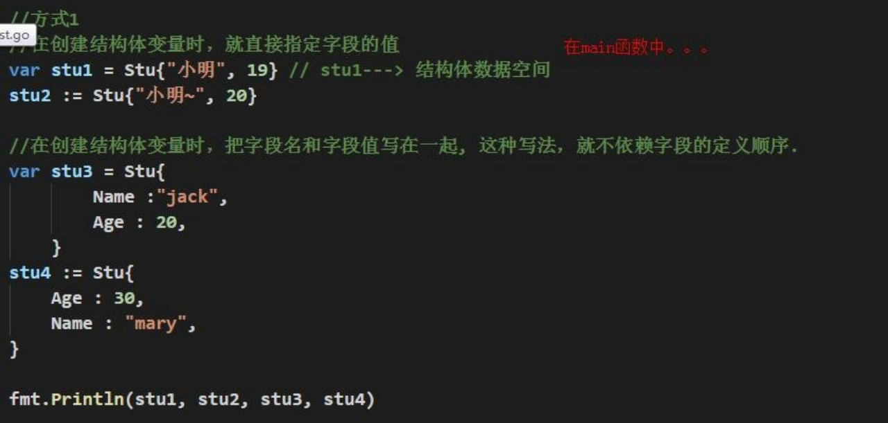

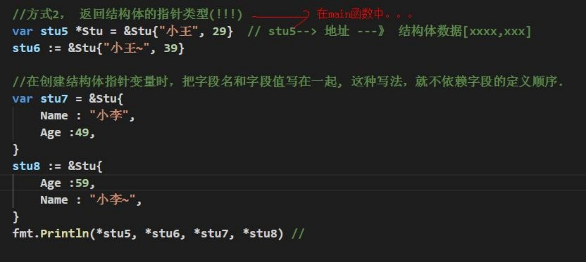

## 10.5 工厂模式

### 10.5.1 说明

Golang 的结构体没有构造函数，通常可以使用工厂模式来解决这个问题。

### 10.5.2 需求

一个结构体的声明是这样的: 

```go
package model

type Student struct { 
	Name string...
}
```

因为这里的Student 的首字母S 是大写的，如果我们想在其它包创建 Student 的实例(比如main 包)， 引入 model 包后，就可以直接创建 Student 结构体的变量(实例)。

**但是问题来了，如果首字母是小写的，比如 是 type student struct {....}就不不行了，怎么办-->工厂模式来解决**.

### 10.5.3 工厂模式来解决问题

Ø 使用工厂模式实现跨包创建结构体实例(变量)的案例:

如果 model 包的 **结构体变量首字母大写，引入后，直接使用,  没有问题**

如果 model 包的 结构体变量首字母小写，引入后，不能直接使用, 可以**工厂模式解决**

```go
// 定义一个结构体
type student struct {
	name string
	age  float64
}

func NewStudent(name string, age float64) student {
	return student{name: name, age: age}
}

import (
	"fmt"
	"gostudy/10_OOP_up/model"
)

func main() {
	student := model.NewStudent("tom", 18)
	fmt.Println(student)
}
```

