# 第11章 面向对象编程（下）

## 11.1 面向对象编程思想-抽象

### 11.1.1 抽象的介绍

我们在前面去定义一个结构体时候，实际上就是把一类事物的共有的**属性(字段)和行为(方法)提取出来，形成一个物理模型**(结构体)。这种研究问题的方法称为抽象。

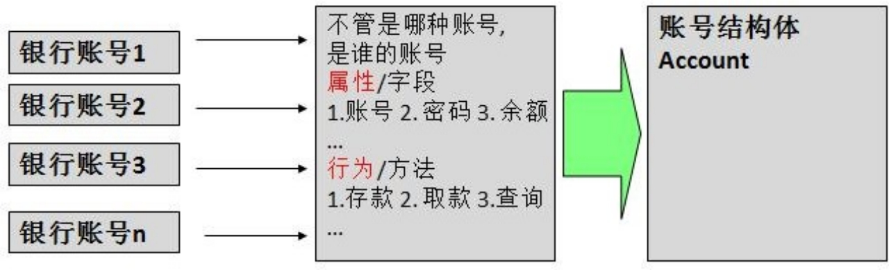

### 11.1.2 代码实现

```go
package main

import (
	"fmt"
	"strconv"
)

// Account 定义一个结构体Account
type Account struct {
	AccountNo string
	Pwd       string
	Balance   float64
}

// Deposit  1、存款
func (account *Account) Deposit(money float64, pwd string) {
	//看下输入的密码是否正确
	if pwd != account.Pwd {
		fmt.Println("你输入的密码不正确")
		return
	}
	//看看存款金额是否正确
	if money <= 0 {
		fmt.Println("你输入的金额不正确")
		return
	}

	account.Balance += money
	fmt.Println("存款成功~~")
}

func (account *Account) WithDraw(money float64, pwd string) {
	//看下输入的密码是否正确
	if pwd != account.Pwd {
		fmt.Println("你输入的密码不正确")
		return
	}
	//看看取款金额是否正确
	if money <= 0 {
		fmt.Println("你输入的金额不正确")
		return
	}
	account.Balance -= money
	fmt.Println("取款成功~~")
}

func (account *Account) Query(pwd string) string {
	//看下输入的密码是否正确
	if pwd != account.Pwd {
		return "你输入的密码不正确"
	}
	return strconv.FormatFloat(account.Balance, 'f', 2, 64)
}

func main() {
	account := Account{"001", "123456", 100.0}
	account.Deposit(200.0, "123456")
	balance := account.Query("123456")
	fmt.Println(balance)
}
```

## 11.2 面向对象编程三大特性-封装

### 11.2.1 基本介绍

Golang 仍然有面向对象编程的继承，封装和多态的特性，只是实现的方式和其它 OOP 语言不一样，下面我们一一为同学们进行详细的讲解 Golang 的三大特性是如何实现的。

### 11.2.2 封装介绍

封装(encapsulation)就是把抽象出的字段和对字段的操作封装在一起,数据被保护在内部,程序的其它包只有通过被授权的操作(方法),才能对字段进行操作


### 11.2.3 封装的理解和好处

1) 隐藏实现细节

2) 提可以对**数据进行验证**，保证安全合理(Age)

### 11.2.4 如何体现封装

1) 对结构体中的属性进行封装

2) 通过**方法**，**包** 实现封装

### 11.2.5 封装的实现步骤

1) 将结构体、字段(属性)的首字母小写(不能导出了，其它包不能使用，类似 private)

2) 给结构体所在包提供一个工厂模式的函数，首字母大写。类似一个构造函数

3) 提供一个首字母大写的 Set 方法(类似其它语言的 public)，用于对属性判断并赋值

   ```go
   func (var	结构体类型名) SetXxx(参数列表) (返回值列表) {
   	//加入数据验证的业务逻辑var.字段 = 参数
   }
   ```

4) 提供一个首字母大写的 Get 方法(类似其它语言的 public)，用于获取属性的值

   ```go
   func (var 结构体类型名) GetXxx() {
   	return var.age;
   }
   ```

**特别说明**：在 Golang 开发中并没有特别强调封装，这点并不像 Java. 所以提醒学过java 的朋友， 不用总是用 java 的语法特性来看待 Golang, Golang 本身对面向对象的特性做了简化的.

## 11.3 面向对象编程三大特性-继承

### 11.3.1 看一个问题，引出继承的必要性

一个小问题,看个学生考试系统的程序 extends01.go，提出代码复用的问题

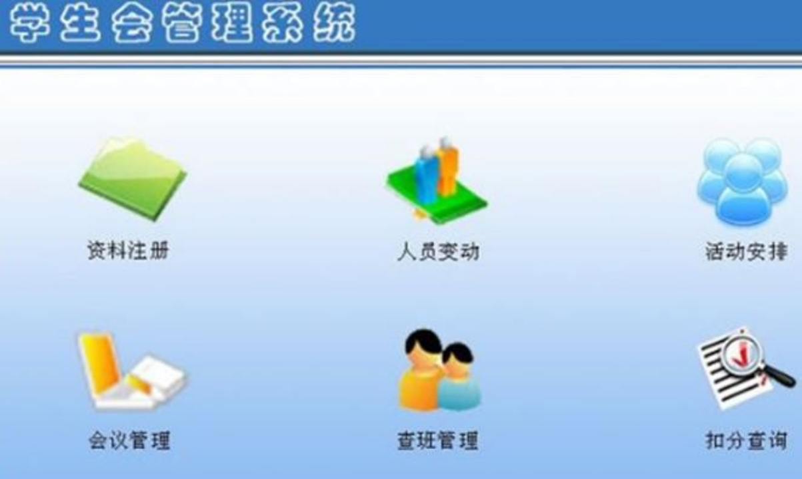

```go
func main() {
	pupil := Pupil{Name: "tom", Age: 10}
	pupil.testing()
	pupil.SetScore(90)
	pupil.ShowInfo()

	graduate := Graduate{Name: "tom", Age: 10}
	graduate.testing()
	graduate.SetScore(90)
	graduate.ShowInfo()
}

// Pupil 小学生
type Pupil struct {
	Name  string
	Age   int
	Score int
}

func (p *Pupil) ShowInfo() {
	fmt.Printf("学生名=%v 年龄=%v 成绩=%v\n", p.Name, p.Age, p.Score)
}

func (p *Pupil) SetScore(score int) {
	//业务判断
	p.Score = score
}

func (p *Pupil) testing() {
	fmt.Println("小学生正在考试中	")
}

// Graduate 大学生
type Graduate struct {
	Name  string
	Age   int
	Score int
}

func (p *Graduate) ShowInfo() {
	fmt.Printf("学生名=%v 年龄=%v 成绩=%v\n", p.Name, p.Age, p.Score)

}

func (p *Graduate) SetScore(score int) {
	//业务判断
	p.Score = score
}

func (p *Graduate) testing() {
	fmt.Println("大学生正在考试中	")
}
```

Ø 对上面代码的小结

1) Pupil 和 Graduate 两个结构体的字段和方法几乎，但是我们却写了相同的代码， 代码复用性不强

2) 出现代码冗余，而且代码**不利于维护**，同时**也不利于功能的扩展**。

3) 解决方法-通过**继承**方式来解决 

### 11.3.2 继承基本介绍和示意图

继承可以解决代码复用,让我们的编程更加靠近人类思维。

当多个结构体存在相同的属性(字段)和方法时,可以从这些结构体中抽象出结构体(比如刚才的

Student),在该结构体中定义这些相同的属性和方法。

其它的结构体不需要重新定义这些属性(字段)和方法，只需嵌套一个 Student 匿名结构体即可。 [**画出示意图 ]** 

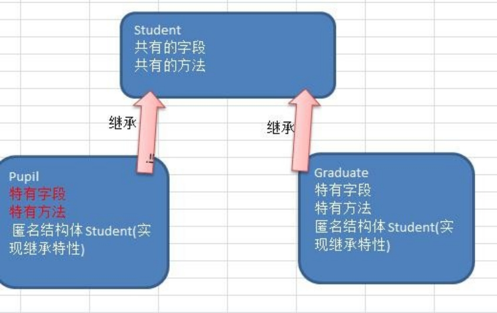

也就是说：在 Golang 中，如果一个 struct 嵌套了另一个匿名结构体，那么这个结构体可以直接访问匿名结构体的字段和方法，从而实现了继承特性。

### 11.3.3 嵌套匿名结构体的基本语法

```go
type Goods struct { 
	Name string 
	Price int
}
type Book struct {
	Goods	//这里就是嵌套匿名结构体 Goods Writer string
}
```

### 11.3.4 快速入门案例

Ø 案例

 extends01.go 改进，使用嵌套匿名结构体的方式来实现继承特性,请大家注意体会这样编程

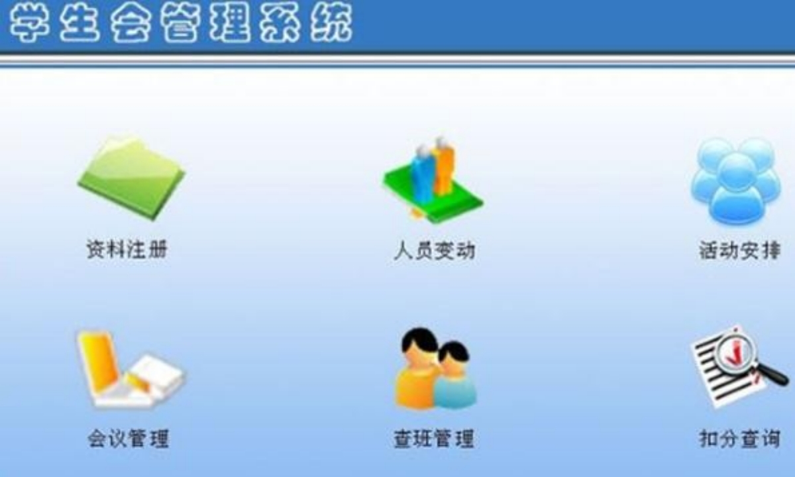

```go
func main() {
	pupil := Pupil{}
	pupil.Student.Name = "tom"
	pupil.Student.Age = 10
	pupil.testing()
	pupil.SetScore(90)
	pupil.ShowInfo()

	graduate := Graduate{}
	graduate.Student.Name = "mary~"
	graduate.Student.Age = 28
	graduate.testing()
	graduate.SetScore(90)
	graduate.ShowInfo()
}

type Student struct {
	Name  string
	Age   int
	Score int
}

func (student *Student) ShowInfo() {
	fmt.Printf("学生名=%v 年龄=%v 成绩=%v\n", student.Name, student.Age, student.Score)
}

func (student *Student) SetScore(score int) {
	//业务判断
	student.Score = score
}

func (student *Student) testing() {
	fmt.Println("正在考试中")
}

// Pupil 小学生
type Pupil struct {
	Student //嵌入了 Student 匿名结构体
}

// Graduate 大学生
type Graduate struct {
	Student //嵌入了 Student 匿名结构体
}
```

### 11.3.5 继承给编程带来的便利 

1) 代码的复用性提高了

2) 代码的扩展性和维护性提高了

### 11.3.6 继承的深入讨论

1) 结构体可以**使用嵌套匿名结构体所有的字段和方法**，即：首字母大写或者小写的字段、方法， 都可以使用。【举例说明】

   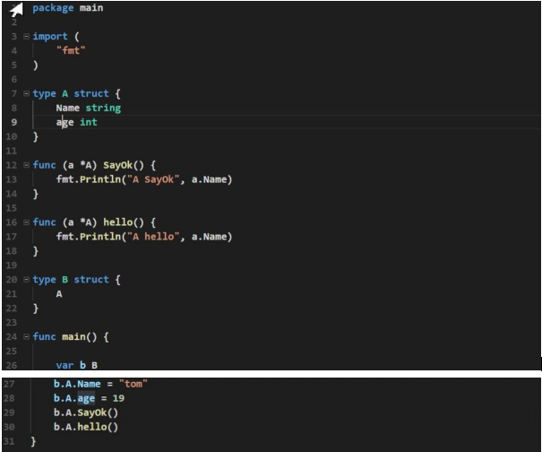

2) 匿名结构体字段访问可以简化，如图

   1) 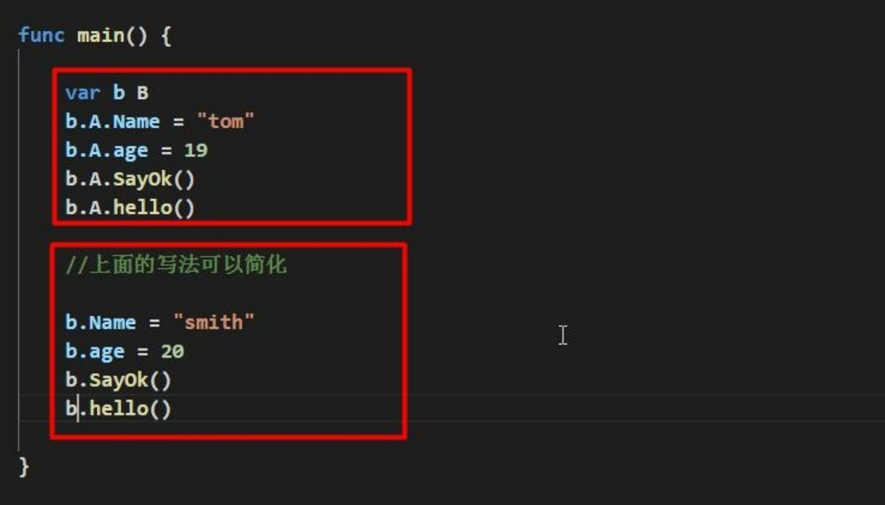

   对上面的代码小结

   (1) **当我们直接通过** **b** **访问字段或方法时，其执行流程如下**比如 b.Name

   (2) 编译器会先看 b 对应的类型有没有 Name, 如果有，则直接调用 B 类型的 Name 字段

   (3) 如果没有就去看 B 中嵌入的匿名结构体 A 有没有声明 Name 字段，如果有就调用,如果没有继续查找..如果都找不到就报错.

3) 当**结构体**和**匿名结构体**有相同的字段或者方法时，**编译器采用就近访问原则访问**，如希望访问匿名结构体的字段和方法，可以通过匿名结构体名来区分【举例说明】

   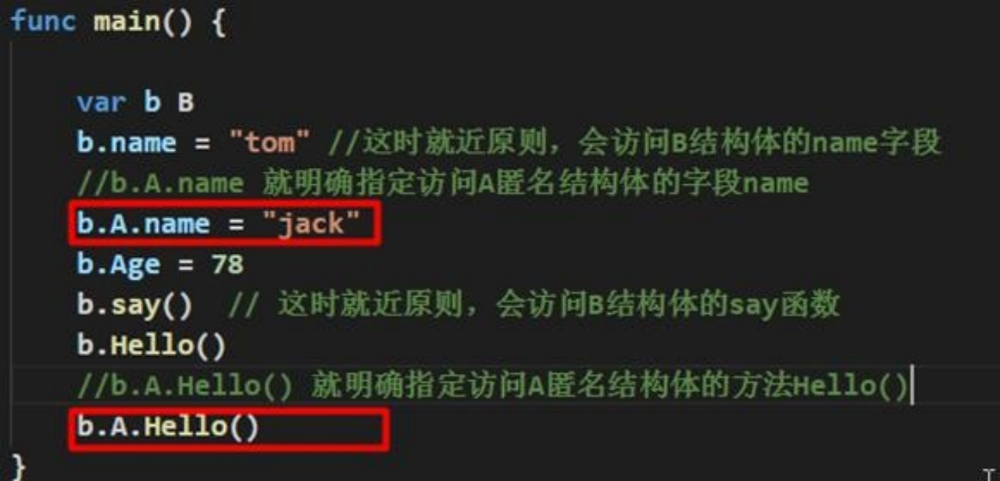

4) 结构体嵌入两个(或多个)匿名结构体，如**两个匿名结构体有相同的字段和方法**(**同时结构体本身没有同名的字段和方法**)，在访问时，就必须明确指定匿名结构体名字，否则编译报错。【举例说明】

   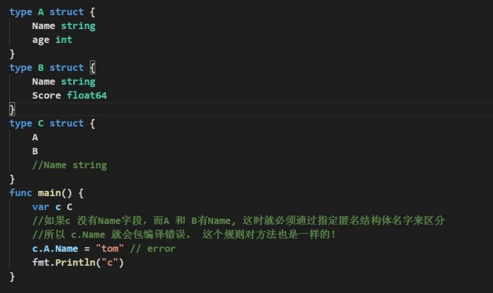

5) 如果一个 struct 嵌套了一个有名结构体，这种模式就是**组合**，如果是组合关系，那么在访问组合的结构体的字段或方法时，必须带上结构体的名字

   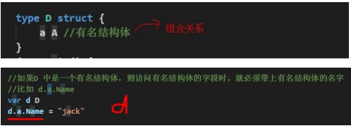

6) 嵌套匿名结构体后，也可以在创建结构体变量(实例)时，直接指定各个**匿名结构体字段的**值

   ```go
   func main() {
   	// 嵌套匿名结构体后 在创建结构体变量(实例)时，直接指定各个匿名结构体字段的值
   	tv := TV{Goods{"电视机001", 5000.99}, Brand{"海尔", "山东"}}
   	tv2 := TV{Goods{"电视机002", 5000.99}, Brand{"夏普", "北京"}}
   	fmt.Println("tv", tv)
   	fmt.Println("tv2", tv2)
   	tv3 := TV2{&Goods{"电视机003", 7000.99}, &Brand{"创维", "河南"}}
   	tv4 := TV2{&Goods{"电视机004", 7000.99}, &Brand{"长虹", "四川"}}
   	fmt.Println("tv3", *tv3.Goods, *tv3.Brand)
   	fmt.Println("tv4", *tv4.Goods, *tv4.Brand)
   }
   
   type Goods struct {
   	Name  string
   	Price float64
   }
   
   type Brand struct {
   	Name    string
   	Address string
   }
   
   type TV struct {
   	Goods
   	Brand
   }
   
   type TV2 struct {
   	*Goods
   	*Brand
   }
   ```

### 11.3.7 课堂练习

11.3.7 课堂练习结构体的匿名字段是基本数据类型，如何访问, 下面代码输出什么

```go
func main() {
	e := E{}
	e.Name = "狐狸精"
	e.Age = 300
	e.int = 30
	fmt.Println("e=", e)
}

type Monster struct {
	Name string
	Age  int
}

type E struct {
	Monster
	int // 匿名字段是基本数据类型
}
```

说明

1) 如果一个结构体有 int 类型的匿名字段，就不能第二个。

2) 如果需要有多个 int 的字段，则必须给 int 字段指定名字

### 11.3.8 面向对象编程-多重继承

Ø 多重继承说明

如**一个 struct 嵌套了多个匿名结构体**，那么该结构体可以直接访问嵌套的匿名结构体的字段和方法，**从而实现了多重继承**。

Ø 案例演示

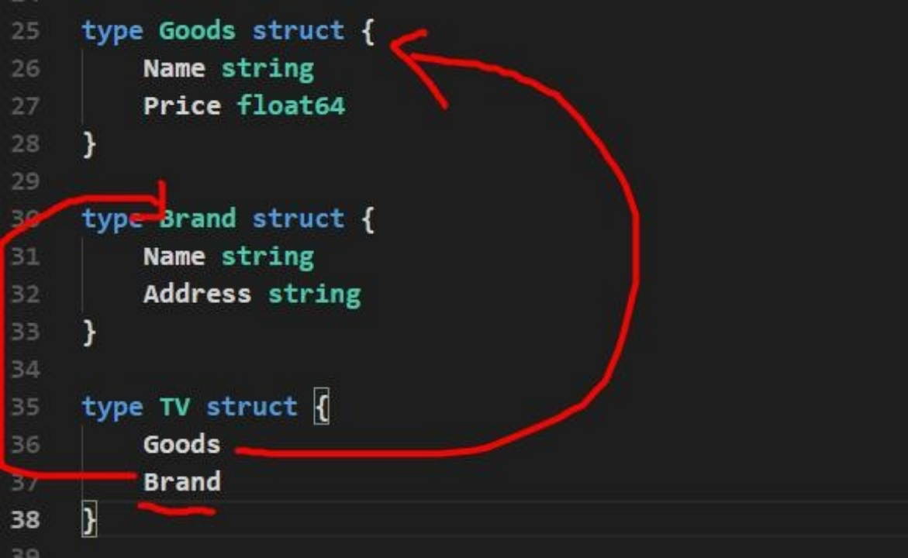

Ø 多重继承细节说明

1) 如嵌入的匿名结构体有相同的字段名或者方法名，则在访问时，需要通过匿名结构体类型名来区分。【案例演示】

   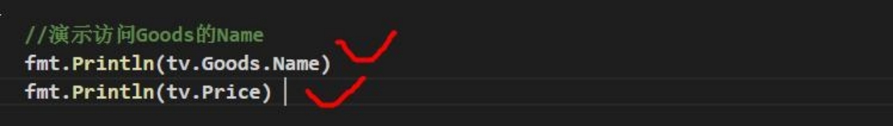

2) 为了保证代码的简洁性，建议大家尽量不使用多重继承

## 11.4 接口(interface)

### 11.4.1 基本介绍

按顺序,我们应该讲解多态,但是在讲解多态前,我们需要讲解接口(interface)，因为在 Golang 中 多态特性主要是通过接口来体现的。

### 11.4.2 为什么有接口


### 11.4.3 接口快速入门

这样的设计需求在 Golang 编程中也是会大量存在的,我曾经说过,一个程序就是一个世界,在现实世界存在的情况，在程序中也会出现。**我们用程序来模拟一下前面的应用场景**。

```go
func main() {
	// 先创建结构体变量
	computer := Computer{}
	phone := Phone{}
	camera := Camera{}
	//关键点
	computer.Working(phone)
	computer.Working(camera)
}

type Usb interface {
	// Startup Stop 声明了两个没有实现的方法
	Startup()
	Stop()
}

type Phone struct {
}

// Startup 让 Phone 实现 Usb 接口的方法
func (p Phone) Startup() {
	fmt.Println("手机开始工作。。。")
}

func (p Phone) Stop() {
	fmt.Println("手机停止工作。。。")
}

type Camera struct {
}

// Startup 让 Camera 实现	Usb 接口的方法
func (c Camera) Startup() {
	fmt.Println("相机开始工作。。。")
}
func (c Camera) Stop() {
	fmt.Println("相机停止工作。。。")
}

type Computer struct {
}

func (c Computer) Working(usb Usb) {
	//usb 变量会根据传入的实参，来判断到底是 Phone,还是 Camera
	//通过 usb 接口变量来调用 Start 和 Stop 方法
	usb.Startup()
	usb.Stop()
}
```

### 11.4.4 接口概念的再说明

interface 类型可以定义一组方法，但是这些不需要实现。并且 interface 不能包含任何变量。到某个自定义类型(比如结构体 Phone)要使用的时候,在根据具体情况把这些方法写出来(实现)。

### 11.4.5 基本语法

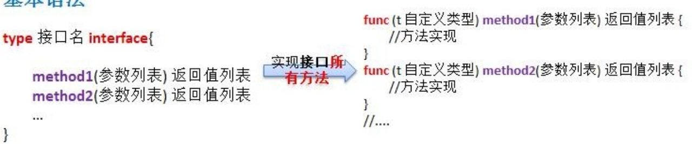

Ø 小结说明:

1) 接口里的**所有方法都没有方法体**，即接口的方法都是没有实现的方法。接口体现了程序设计的**多态**和**高内聚低偶合**的思想。
2) Golang 中的接口，**不需要显式的实现**。只要一个变量，含有接口类型中的所有方法，那么这个变量就实现这个接口。因此，Golang 中**没有 implement **这样的关键字

### 11.4.6 接口使用的应用场景

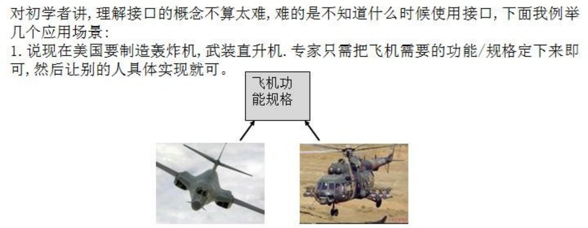

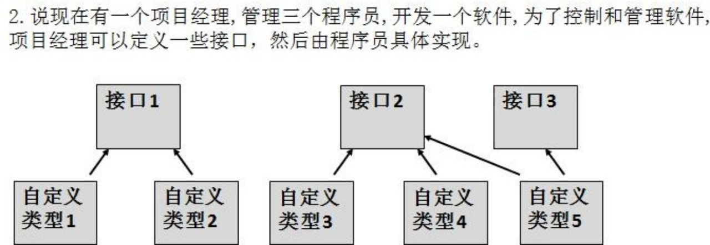

### 11.4.7 注意事项和细节

1) 接口本身**不能创建实例**,但是**可以指向一个实现了该接口的自定义类型的变量**(实例)

   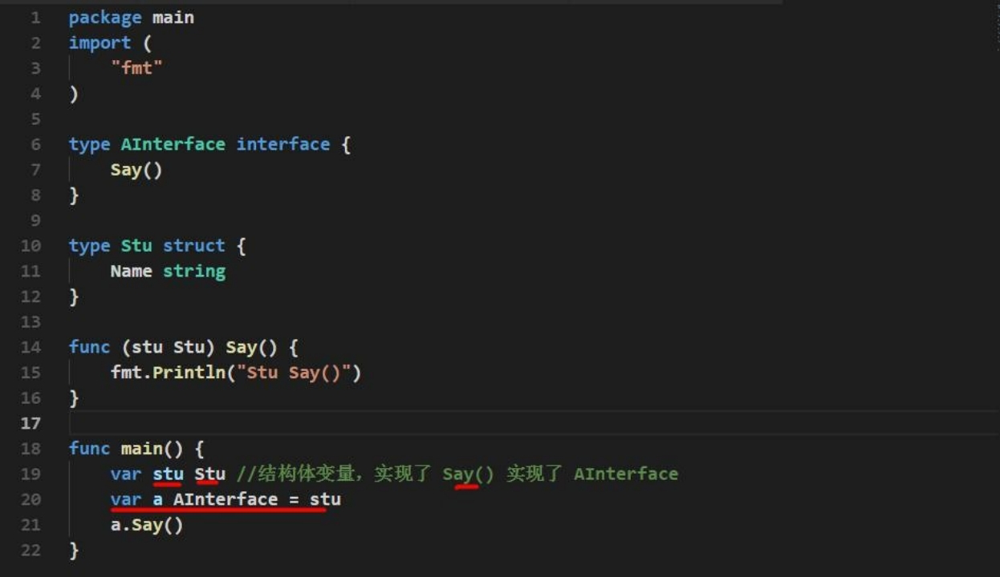

2) 接口中所有的方法都没有方法体,即都是没有实现的方法。

3) 在 Golang 中，一个自定义类型需要将某个接口的所有方法都实现，我们说这个自定义类型实现了该接口。

4) 一个自定义类型只有实现了某个接口，才能将该自定义类型的实例(变量)赋给接口类型

5) 只要是自定义数据类型，就可以实现接口，不仅仅是结构体类型。

6) 一个自定义类型可以实现多个接口

7) Golang 接口中不能有任何变量

8) 一个接口(比如 A 接口)可以继承多个别的接口(比如 B,C 接口)，这时如果要实现 A 接口，也必须将 B,C 接口的方法也全部实现。

9) interface 类型默认是一个指针(引用类型)，如果没有对 interface 初始化就使用，那么会输出 nil

10) 空接口  interface{}   没有任何方法，**所以所有类型都实现了空接口**,   即我们可以**把任何一个变量** **赋给空接口**。

### 11.4.8 实现接口 vs 继承

Ø 听到现在,可能会对实现接口和继承比较迷茫了, 这个问题,那么他们究竟有什么区别呢

```go
func main() {
	monkey := LittleMonkey{
		Monkey{
			"悟空",
		},
	}
	monkey.climbing()
	monkey.Flying()
	monkey.Flying()
}

type Monkey struct {
	Name string
}

type BirdAble interface {
	Flying()
}

type FishAble interface {
	Swimming()
}

func (monkey *Monkey) climbing() {
	fmt.Println(monkey.Name, "生来会爬树..")
}

type LittleMonkey struct {
	Monkey
}

func (monkey LittleMonkey) Flying() {
	fmt.Println("通过学习，会飞翔..")
}

func (monkey LittleMonkey) Swimming() {
	fmt.Println("通过学习，会游泳..")
}
```

Ø 对上面代码的小结

1) 当 A 结构体继承了 B 结构体，那么 A 结构就自动的继承了 B 结构体的字段和方法，并且可以直接使用

2) 当 A 结构体需要扩展功能，同时不希望去破坏继承关系，则可以去实现某个接口即可，因此我们可以认为：实现接口是对继承机制的补充.

Ø 实现接口可以看作是对 继承的一种补充

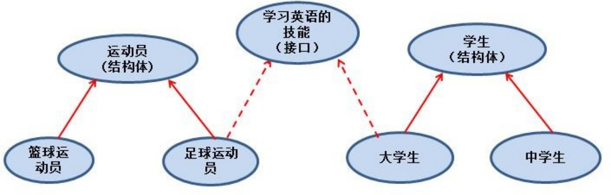

Ø **接口和继承解决的解决的问题**不同

继承的价值主要在于：解决代码的**复用性**和**可维护性**。

接口的价值主要在于：**设计**，设计好各种规范(方法)，让其它自定义类型去实现这些方法。

Ø 接口比继承更加灵活

接口比继承更加灵活，继承是满足 is - a 的关系，而接口只需满足 like - a 的关系。

Ø 接口在一定程度上实现**代码**解耦

## 11.6 面向对象编程-多态

### 11.6.1 基本介绍

变量(实例)具有多种形态。面向对象的第三大特征，在 Go 语言，多态特征是通过接口实现的。可以按照统一的接口来调用不同的实现。这时接口变量就呈现不同的形态

### 11.6.2 快速入门

在前面的 Usb 接口案例，Usb usb ，既可以接收手机变量，又可以接收相机变量，就体现了 Usb 接口 多态特性。[点明]

### 11.6.3 接口体现多态的两种形式

Ø 多态参数

在前面的 Usb 接口案例，Usb usb ，即可以接收手机变量，又可以接收相机变量，就体现了 Usb 接口 多态。

Ø **多态**数组

演示一个案例：给 Usb 数组中，存放 Phone 结构体 和	Camera 结构体变量

```go

func main() {
	//定义一个 Usb 接口数组，可以存放 Phone 和 Camera 的结构体变量
	//这里就体现出多态数组
	var usbArr [3]Usb
	usbArr[0] = Phone{"vivo"}
	usbArr[1] = Phone{"小米"}
	usbArr[2] = Camera{"尼康"}

	fmt.Println(usbArr)
}
```

## 11.7 类型断言

### 11.7.1 由一个具体的需要，引出了类型断言.

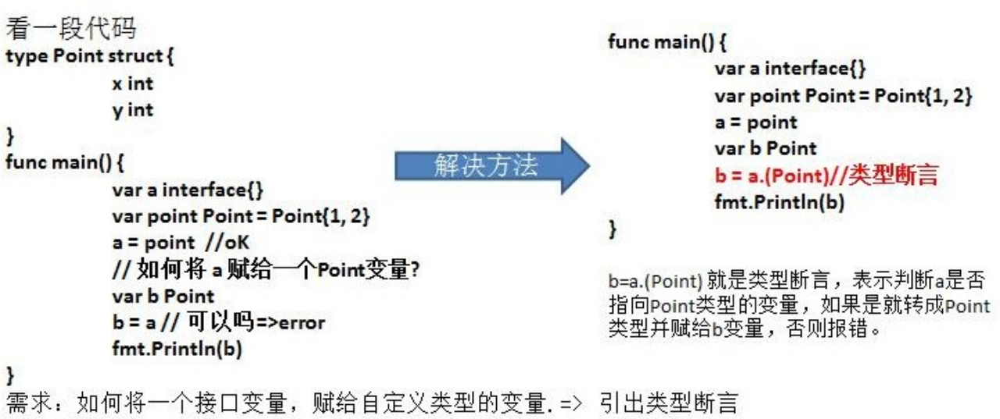

### 11.7.2 基本介绍

类型断言，由于接口是一般类型，不知道具体类型，如果要转成具体类型，就需要使用类型断言， 具体的如下:

```go
func main() {
	var x interface{}
	var b2 float32 = 1.1
	x = b2
	y := x.(float32)
	fmt.Printf("y的类型是 %T 值是=%v", y, y)
}
```

Ø 对上面代码的说明:

在进行类型断言时，如果类型不匹配，就会报 panic, 因此进行类型断言时，要确保原来的空接口指向的就是断言的类型.

Ø 如何在进行断言时，带上检测机制，如果成功就 ok,否则也不要报 panic

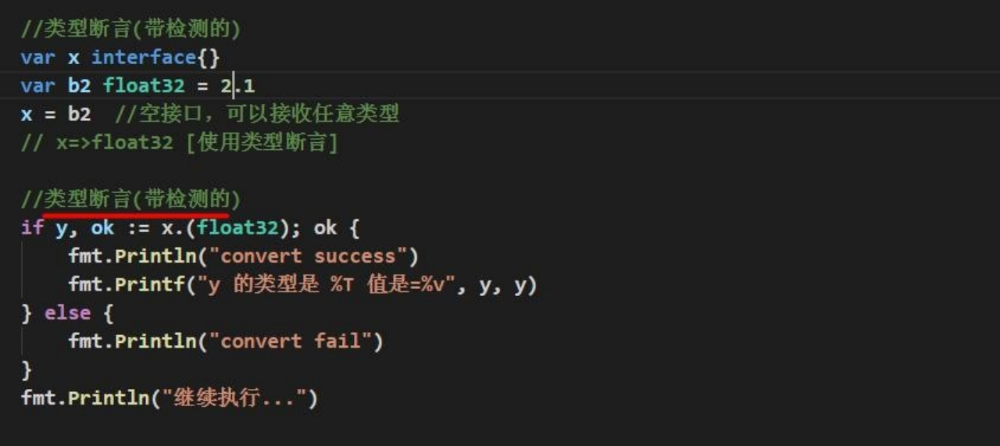