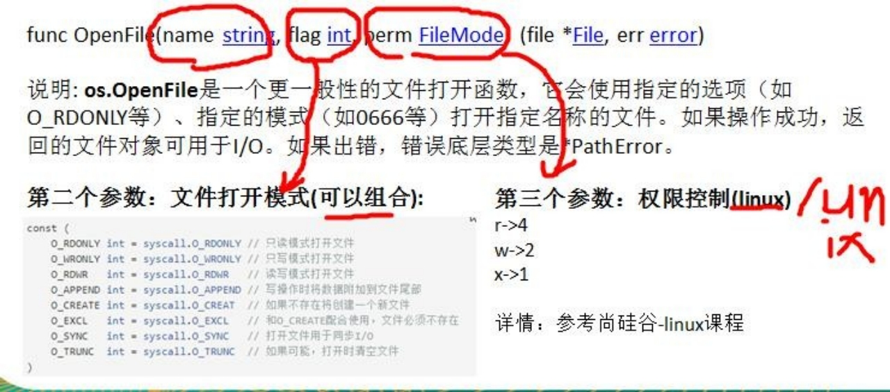
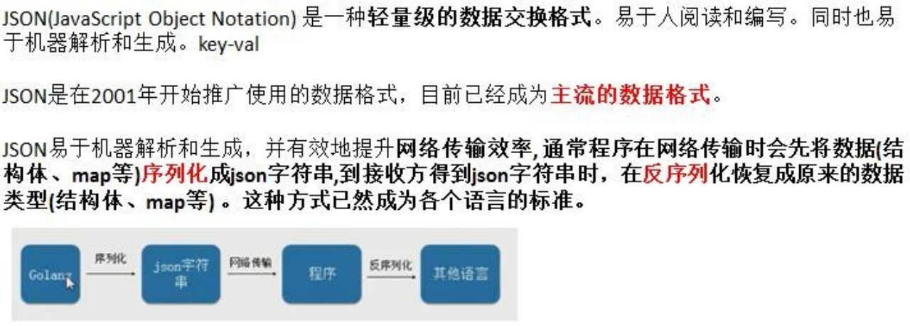

# 第12章 文件操作

## 12.1 文件的基本介绍

Ø 文件的概念

文件,对我们并不陌生,文件是数据源(保存数据的地方)的一种,比如大家经常使用的word 文档,txt 文件,excel 文件...都是文件。文件最主要的作用就是保存数据,它既可以保存一张图片,也可以保持视频,声音...

Ø 输入流和输出流


Ø **os**.File 封装所有文件相关操作，File 是一个结构体


## 12.2 打开文件和关闭文件


Ø 案例演示

```go
package main

import (
	"fmt"
	"os"
)

func main() {
	file, err := os.Open("/Users/maktub/Desktop/1.txt")
	if err != nil {
		fmt.Println("open file err=", err)
	}
	// 输出一下文件 看看是什么
	fmt.Printf("file=%v", file)
	// 关闭文件
	err = file.Close()
	if err != nil {
		fmt.Println("close file err=", err)
	}
}
```

## 12.3 读文件操作应用实例

**读取文件的内容**并**显示在终端**(带**缓冲区**的方式)，使用 os.Open, file.Close, bufio.NewReader(),reader.ReadString 函数和方法. 

```go
package main

import (
	"bufio"
	"fmt"
	"io"
	"os"
)

func main() {
	file, err := os.Open("/Users/maktub/Desktop/1.txt")
	if err != nil {
		fmt.Println("open file err=", err)
	}
	// 当函数退出时 及时关闭file句柄，避免内存泄露
	defer file.Close()
	// 创建一个 *Reader，带缓冲的
	const (
		defaultBufSize = 4096
	)
	reader := bufio.NewReader(file)
	for true {
		str, err := reader.ReadString('\n') // 读到一个换行就结束
		// 输出内容
		fmt.Println(str)
		if err == io.EOF {
			break
		}
	}
	fmt.Println("文件读取结束...")
}
```

读取文件的内容并显示在终端(使用 ioutil 一次将整个文件读入到内存中)，这种**方式适用于文件不大的情况**。相关方法和函数(ioutil.ReadFile)


## 12.4 写文件操作应用实例

### 12.4.1 基本介绍-os.OpenFile 函数



### 12.4.2 基本应用实例-方式一

1) 创建一个新文件，写入内容 5 句 "hello, Gardon"

   ```go
   package main
   
   import (
   	"bufio"
   	"fmt"
   	"os"
   )
   
   func main() {
   	// 1、打开文件 abc.txt
   	filepath := "/Users/maktub/Desktop/abc.txt"
   	file, err := os.OpenFile(filepath, os.O_WRONLY|os.O_CREATE, 0666)
   	if err != nil {
   		fmt.Printf("open file err=%v\n", err)
   		return
   	}
   	// 及时关闭file句柄
   	defer file.Close()
   	str := "hello,Gardon\n"
   	// 写入时，使用带缓存的 *Writer
   	writer := bufio.NewWriter(file)
   	for i := 0; i < 5; i++ {
   		writer.WriteString(str)
   	}
   	// 因为Writer时带缓存，因此在调用WriteString方法时,其实是先将内容写入缓存，需要调用flush 真正写入文件
   	writer.Flush()
   }
   ```

2) 打开一个存在的文件中，将原来的内容覆盖成新的内容 10 句 "你好，尚硅谷!"

   ```go
   package main
   
   import (
   	"bufio"
   	"fmt"
   	"os"
   )
   
   func main() {
   	filePath := "/Users/maktub/Desktop/abc.txt"
   	//1 .打开文件已经存在文件, d:/abc.txt filePath := "d:/abc.txt"
   	file, err := os.OpenFile(filePath, os.O_WRONLY|os.O_TRUNC, 0666)
   	if err != nil {
   		fmt.Printf("open file err=%v\n", err)
   		return
   	}
   	//及时关闭 file 句柄
   	defer file.Close()
   	str := "你好,尚硅谷!\r\n" // \r\n 表示换行
   	writer := bufio.NewWriter(file)
   	//写入时，使用带缓存的 *Writer writer := bufio.NewWriter(file)
   	for i := 0; i < 10; i++ {
   		writer.WriteString(str)
   	}
   	writer.Flush()
   }
   ```

3) 打开一个存在的文件，在原来的内容**追加内容** 

   ```go
   package main
   
   import (
   	"bufio"
   	"fmt"
   	"os"
   )
   
   func main() {
   	filePath := "/Users/maktub/Desktop/abc.txt"
   	//1 .打开文件已经存在文件, d:/abc.txt filePath := "d:/abc.txt"
   	file, err := os.OpenFile(filePath, os.O_WRONLY|os.O_APPEND, 0666)
   	if err != nil {
   		fmt.Printf("open file err=%v\n", err)
   		return
   	}
   	//及时关闭 file 句柄
   	defer file.Close()
   	str := "你好,aaa!\r\n" // \r\n 表示换行
   	writer := bufio.NewWriter(file)
   	//写入时，使用带缓存的 *Writer writer := bufio.NewWriter(file)
   	for i := 0; i < 10; i++ {
   		writer.WriteString(str)
   	}
   	writer.Flush()
   }
   ```

### 12.4.3 基本应用实例-方式二

编程一个程序，将一个文件的内容，写入到另外一个文件。注：这两个文件已经存在了. 说明：使用 ioutil.ReadFile / ioutil.WriteFile 完成写文件的任务.

代码实现：


### 12.4.4 判断文件是否存在


## 12.5 文件编程应用实例

### 12.5.1 拷贝文件

说明：将一张图片/电影/mp3 拷贝到另外一个文件	e:/abc.jpg	io 包

func Copy(dst Writer, src Reader) (written int64, err error)

注意; Copy 函数是 io 包提供的. 

```go
package main

import (
	"bufio"
	"fmt"
	"io"
	"os"
)

func main() {
	srcFile := "/Users/maktub/Desktop/abc.txt"
	dstFile := "/Users/maktub/Desktop/aaa.txt"
	_, err := CopyFile(dstFile, srcFile)
	if err == nil {
		fmt.Printf("拷贝完成\n")
	} else {
		fmt.Printf("拷贝错误 err=%v\n", err)
	}

}

func CopyFile(dstFileName string, srcFileName string) (written int64, err error) {
	srcFile, err := os.Open(srcFileName)
	if err != nil {
		return 0, err
	}
	defer srcFile.Close()
	// 通过srcFile，获取到Reader
	reader := bufio.NewReader(srcFile)
	//打开 dstFileName
	dstFile, err := os.OpenFile(dstFileName, os.O_WRONLY|os.O_CREATE, 0666)
	if err != nil {
		return 0, err
	}
	//通过 dstFile, 获取到 Writer
	writer := bufio.NewWriter(dstFile)
	defer dstFile.Close()
	return io.Copy(writer, reader)
}
```

## 12.6 命令行参数

### 12.6.1 看一个需求

我们希望能够获取到命令行输入的各种参数，该如何处理? 如图：=> 命令行参数


### 12.6.2 基本介绍

**os.Args** 是一个 string 的切片，用来存储所有的命令行参数

### 12.6.3 举例说明

请编写一段代码，可以获取命令行各个参数


**代码实现**:


### 12.6.4 flag 包用来解析命令行参数

说明: 前面的方式是比较原生的方式，对解析参数不是特别的方便，特别是带有指定参数形式的命令行。比如：cmd>main.exe	-f c:/aaa.txt -p 200 -u root 这样的形式命令行，go 设计者给我们提供了 flag包，可以方便的解析命令行参数，而且参数顺序可以随意

```go
package main

import (
	"bufio"
	"flag"
	"fmt"
	"io"
	"os"
)

func main() {
	// 定义几个变量，用于接收命令行的参数值
	var user string
	var pwd string
	var host string
	var port int

	flag.StringVar(&user, "u", "", "用户名，默认为空")
	flag.StringVar(&pwd, "pwd", "", "密码，默认为空")
	flag.StringVar(&host, "h", "localhost", "用户名，默认为localhost")
	flag.IntVar(&port, "port", 3306, "端口好，默认为3306")
	// 转换 必须调用该方法
	flag.Parse()
	// 输出结果
	fmt.Printf("user=%v pwd=%v host=%v port=%v",
		user, pwd, host, port)
}
```

## 12.7 json 基本介绍

Ø 概述



Ø 应用场景(示意图)


## 12.8 json 数据格式说明


## 12.9 json 数据在线解析

https:/[/www.json.cn/](http://www.json.cn/) 网站可以验证一个 json 格式的数据是否正确。尤其是在我们编写比较复杂的json 格式数据时，很有用。

## 12.10 json 的序列化

Ø 介绍

json 序列化是指，将有 **key-valu**e 结构的数据类型(比如**结构体、map、切片**)序列化成 json 字符串的操作。

Ø 应用案例

这里我们介绍一下**结构体、map和切片**的序列化，其它数据类型的序列化类似

```go
func main() {
	testStruct()
}

// Monster 定义一个结构体
type Monster struct {
	Name     string
	Age      int
	Birthday string
	Sal      float64
	Skill    string
}

func testStruct() {
	monster := Monster{"牛魔王", 500, "2011-11-11", 8000.0, "牛魔拳"}
	//将 monster 序列化
	data, err := json.Marshal(&monster)
	if err != nil {
		fmt.Printf("序列号错误 err=%v\n", err)
	}
	// 输 出 序 列 化 后 的 结 果
	fmt.Printf("monster 序列化后=%v\n", string(data))
}
```

Ø 注意事项

对于结构体的序列化，如果我们希望序列化后的key 的名字，又我们自己重新制定，那么可以给struct指定一个 tag 标签.

```go
// Monster 定义一个结构体
type Monster struct {
	Name     string `json:"monsterName"`
	Age      int
	Birthday string
	Sal      float64
	Skill    string
}

monster 序列化后={"monsterName":"牛魔王","Age":500,"Birthday":"2011-11-11","Sal":8000,"Skill":"牛魔拳"}
```

## 12.11 json 的反序列化

Ø 基本介绍

json 反序列化是指，将 json 字符串反序列化成对应的数据类型(比如结构体、map、切片)的操作

Ø 应用案例

这里我们介绍一下将 json 字符串反序列化成结构体、map 和切片

```go
func unmarshalStruct() {
	str := "{\"Name\":\"牛魔王\",\"Age\":500,\"Birthday\":\"2011-11-11\",\"Sal\":8000,\"Skill\":\"牛魔拳\"}"
	//定义一个 Monster 实例
	var monster Monster
	err := json.Unmarshal([]byte(str), &monster)
	if err != nil {
		fmt.Printf("unmarshal err=%v\n", err)

	}
	fmt.Printf("反序列化后 monster=%v monster.Name=%v \n", monster, monster.Name)
}
```

