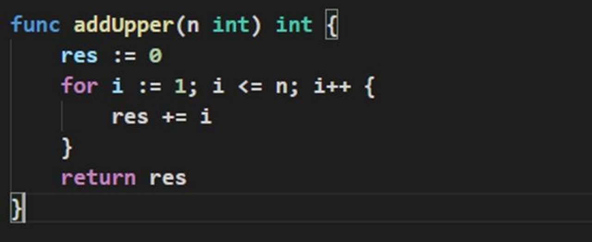
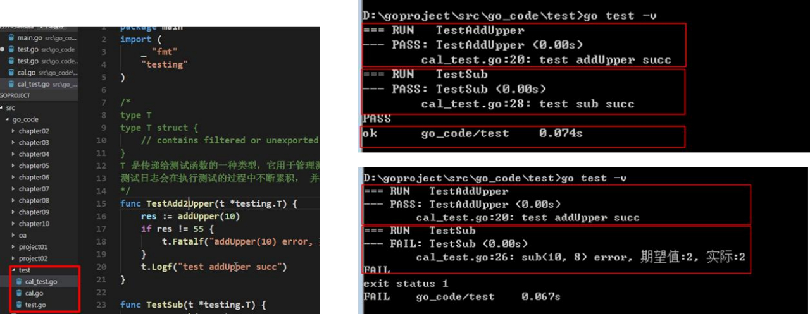
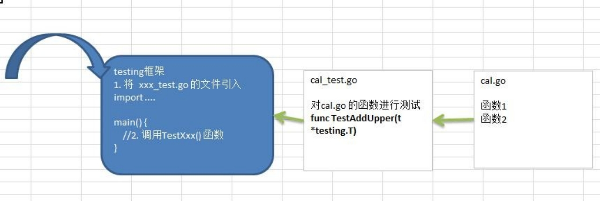
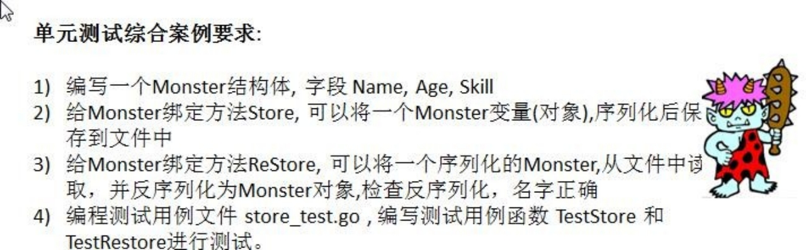

# 第13章 单元测试

## 13.1 先看一个需求

在我们工作中，我们会遇到这样的情况，就是去确认一个函数，或者一个模块的结果是否正确， 如：



## 13.2 传统的方法

### 13.2.1 传统的方式来进行测试

在 main 函数中，调用 addUpper 函数，看看实际输出的结果是否和预期的结果一致，如果一致， 则说明函数正确，否则函数有错误，然后修改错误

### 13.2.2 传统方法的缺点分析

1) 不方便, 我们需要在 main 函数中去调用，这样就需要去修改 main 函数，如果现在项目正在运行，就可能去停止项目。

2) 不利于管理，因为当我们测试多个函数或者多个模块时，都需要写在 main 函数，不利于我们管理和清晰我们思路

3) 引出单元测试。-> testing  测试框架 可以很好解决问题。

## 13.3 单元测试-基本介绍

Go 语言中自带有一个轻量级的测试框架 testing 和自带的 go test 命令来实现单元测试和性能测试，

testing 框架和其他语言中的测试框架类似，可以基于这个框架写针对相应函数的测试用例，也可以基于该框架写相应的压力测试用例。通过单元测试，可以解决如下问题

1) 确保**每个函数是可运行，并且运行结果是正确**的

2) 确保写出来的代码**性能是好**的，

3) 单元测试能及时的发现程序设计或实现的**逻辑错误**，使问题及早暴露，便于问题的定位解决， 而**性能测试**的重点在于发现程序设计上的一些问题，让程序能够在高并发的情况下还能保持稳定

## 13.4 单元测试-快速入门

使用 Go 的单元测试，对 addUpper 和 sub 函数进行测试。



单元测试的运行原理示意图



1) 测试用例文件名必须以 _test.go  结尾。 比如 cal_test.go , cal 不是固定的。

2) 测试用例函数必须以 Test 开头，一般来说就是 Test+被测试的函数名，比如 TestAddUpper

3) TestAddUpper(t *tesing.T)	的形参类型必须是 *testing.T 【看一下手册】

4) 一个测试用例文件中，可以有多个测试用例函数，比如 TestAddUpper、TestSub

5) 运行测试用例指令
   1) cmd>go test	[如果运行正确，无日志，错误时，会输出日志]
   2) cmd>go test -v	[运行正确或是错误，都输出日志]
6) 当出现错误时，可以使用 t.Fatalf 来格式化输出错误信息，并退出程序

7) t.Logf 方法可以输出相应的日志

8) 测试用例函数，并没有放在 main 函数中，也执行了，这就是测试用例的方便之处[原理图].

9) PASS 表示测试用例运行成功，FAIL 表示测试用例运行失败

10) 测试单个文件，一定要带上被测试的原文件

​	go test -v cal_test.go cal.go

11) 测试单个方法

​	go test -v -test.run	TestAddUpper

## 13.5 单元测试-综合案例



monster.go

```go
package monster

import (
	"bufio"
	"encoding/json"
	"fmt"
	"io/ioutil"
	"os"
)

type Monster struct {
	Name  string
	Age   int
	Skill string
}

// Store 给 Monster 绑定方法 Store, 可以将一个 Monster 变量(对象),序列化后保存到文件中
func (monster *Monster) Store() bool {
	// 先序列化
	data, err := json.Marshal(monster)
	if err != nil {
		fmt.Println("marshal err =", err)
		return false
	}
	// 保存到文件
	filePath := "/Users/maktub/Desktop/monster.json"
	file, err := os.OpenFile(filePath, os.O_WRONLY|os.O_CREATE, 0666)
	if err != nil {
		fmt.Println("openFile err =", err)
		return false
	}
	defer file.Close()
	writer := bufio.NewWriter(file)
	writer.WriteString(string(data))
	writer.Flush()
	return true
}

// Restore 给 Monster 绑定方法 ReStore, 可以将一个序列化的 Monster,从文件中读取， 并反序列化为 Monster 对象,检查反序列化，名字正确
func (monster *Monster) Restore() bool {
	// 1. 先从文件中，读取序列化的字符串
	filePath := "/Users/maktub/Desktop/monster.json"
	data, err := ioutil.ReadFile(filePath)
	if err != nil {
		fmt.Println("ReadFile err =", err)
		return false
	}
	json.Unmarshal(data, monster)
	return true
}
```

monster_test.go

```go
package monster

import "testing"

// 测试用例，测试Store方法
func TestStore(t *testing.T) {
	// 先创建一个 Monster 实例
	monster := Monster{"红孩儿", 10, "喷火"}
	res := monster.Store()
	if !res {
		t.Fatalf("monster.Store() 错误，希望为=%v 实际为=%v", true, res)
	}
	t.Logf("monster.Store() 测试成功!")
}

func TestReStore(t *testing.T) {
	// 先创建一个 Monster 实例 ， 不需要指定字段的值
	var monster = Monster{}
	res := monster.Restore()
	if !res {
		t.Fatalf("monster.ReStore() 错误，希望为=%v 实际为=%v", true, res)
	}
	t.Logf("monster.ReStore() 测试成功!")
}
```

