# 第14章 goroutine和channel

## 16.1 goroutine-看一个需求

Ø 需求：要求统计 1-9000000000  的数字中，哪些是素数？

Ø 分析思路：

1) 传统的方法，就是使用一个循环，循环的判断各个数是不是素数。[很慢]

2) 使用并发或者并行的方式，将统计素数的任务分配给多个 goroutine 去完成，这时就会使用到goroutine.

## 16.2 goroutine-基本介绍

### 16.2.1 进程和线程介绍


### 16.2.2 程序、进程和线程的关系示意图

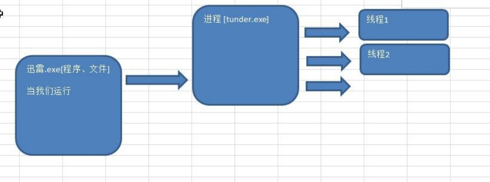

### 16.2.3 并发和并行

Ø 并发和并行

1) 多线程程序在单核上运行，就是并发

2) 多线程程序在多核上运行，就是并行

3) 示意图:

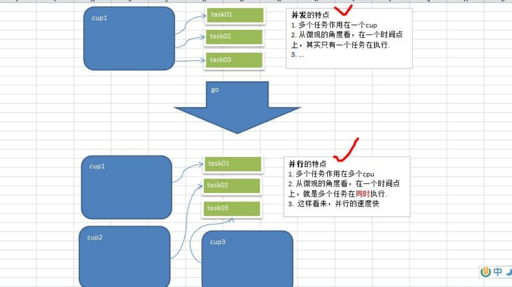

Ø 小结


### 16.2.4 Go 协程和Go 主线程

Ø Go 主线程(有程序员直接称为线程/也可以理解成进程): 一个 Go 线程上，可以起多个协程，你可以这样理解，协程是轻量级的线程[编译器做优化]。

Ø Go 协程的特点

1) 有独立的栈空间

2) 共享程序堆空间

3) 调度由用户控制

4) 协程是轻量级的线程

Ø 一个示意图


## 16.3 goroutine-快速入门

### 16.3.1 案例说明

Ø 请编写一个程序，完成如下功能:

1) 在主线程(可以理解成进程)中，开启一个 goroutine,  该协程每隔 1 秒输出 "hello,world"

2) 在主线程中也每隔一秒输出"hello,golang", 输出 10 次后，退出程序

3) 要求主线程和 goroutine 同时执行.

4) 画出**主线程和协程执行流程图**

```go
package main

import (
	"fmt"
	"strconv"
	"time"
)

func test() {
	for i := 1; i <= 10; i++ {
		fmt.Println("test() hello,world" + strconv.Itoa(i))
		time.Sleep(time.Second)
	}
}
func main() {
	go test() // 开启了一个协程
	for i := 1; i <= 10; i++ {
		fmt.Println("main() hello,golang" + strconv.Itoa(i))
		time.Sleep(time.Second)
	}
}
```

Ø 主线程和协程执行流程图

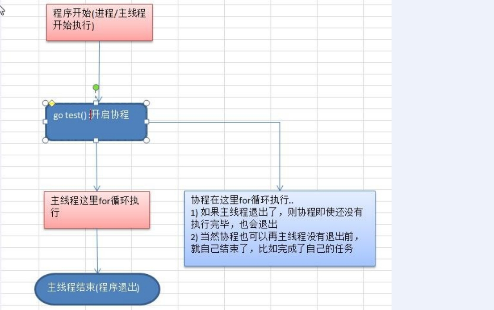

### 16.3.2 快速入门小结

1) 主线程是一个物理线程，直接作用在 cpu 上的。是重量级的，非常耗费 cpu 资源。

2) 协程从主线程开启的，是轻量级的线程，是逻辑态。对资源消耗相对小。

3) Golang 的协程机制是重要的特点，可以轻松的**开启上万个协程**。其它编程语言的并发机制是一般基于线程的，开启过多的线程，资源耗费大，这里就突显 Golang 在并发上的优势了

## 16.4 goroutine 的调度模型

### 16.4.1 MPG 模式基本介绍

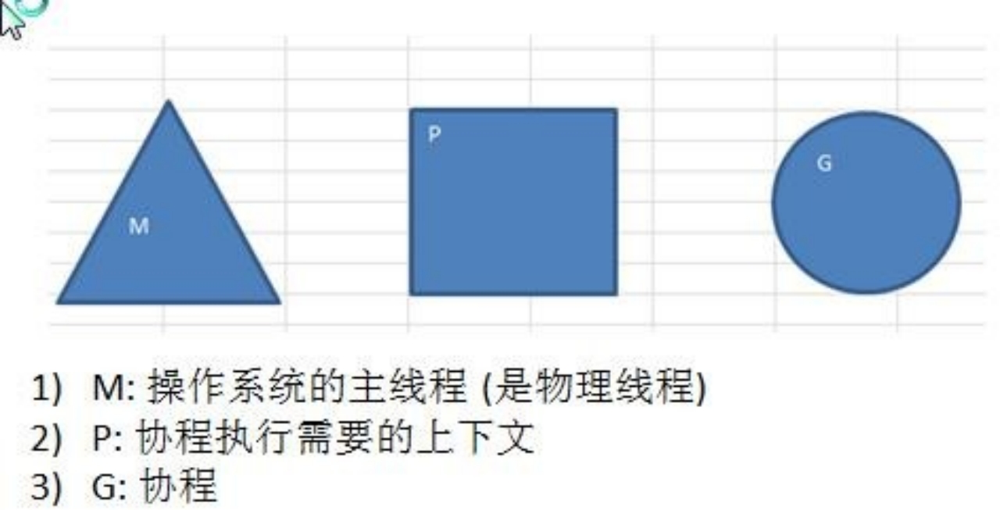

### 16.4.2 MPG 模式运行的状态 1

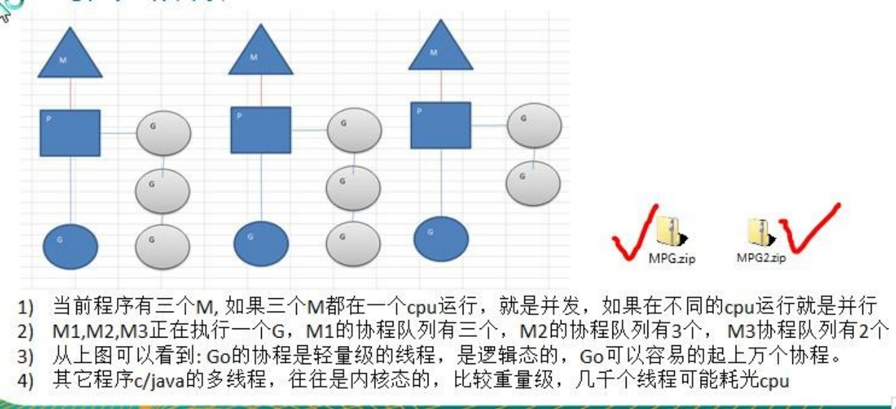

### 16.4.3 MPG 模式运行的状态 2


## 16.5 设置 Golang 运行的cpu 数

Ø 介绍：为了充分了利用多 cpu 的优势，在 Golang 程序中，设置运行的 cpu 数目

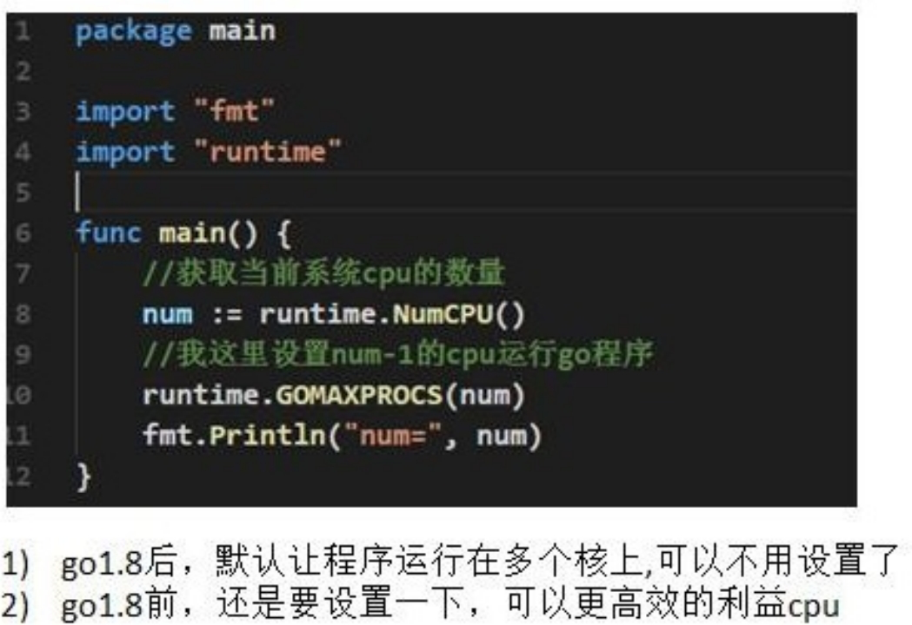

## 16.6 channel(管道)-看个需求

**需求**：现在要计算 1-200 的各个数的阶乘，并且把各个数的阶乘放入到 map 中。最后显示出来。要求使用 goroutine 完成

Ø 分析思路：

1) 使用 goroutine 来完成，效率高，但是会出现并发/并行安全问题.

2) 这里就提出了不同 goroutine 如何通信的问题

Ø 代码实现

1) 使用 goroutine 来完成(看看使用 gorotine 并发完成会出现什么问题? 然后我们会去解决)

2) 在运行某个程序时，如何知道是否存在资源竞争问题。 方法很简单，在编译该程序时，增加一个参数-race 即可

   ```go
   package main
   
   import (
   	"fmt"
   	"time"
   )
   
   var (
   	myMap = make(map[int]int, 10)
   )
   
   // test 函数就是计算 n!, 让将这个结果放入到 myMap
   func test(n int) {
   
   	res := 1
   	for i := 1; i <= n; i++ {
   		res *= i
   	}
   
   	//这里我们将 res 放入到 myMap
   	myMap[n] = res //concurrent map writes?
   }
   
   func main() {
   	// 我们这里开启多个协程完成这个任务[200 个]
   	for i := 1; i <= 200; i++ {
   		go test(i)
   	}
   
   	// 休眠 10 秒钟【第二个问题 】
   	time.Sleep(time.Second * 10)
   
   	//这里我们输出结果,变量这个结果
   	for i, v := range myMap {
   		fmt.Printf("map[%d]=%d\n", i, v)
   	}
   }
   ```

3) 示意图

   

### 16.6.1 不同goroutine 之间如何通讯

1) 全局变量的互斥锁

2) 使用管道 channel 来解决

### 16.6.2 使用全局变量加锁同步改进程序

Ø 因为没有对全局变量 m 加锁，因此会出现资源争夺问题，代码会出现错误，提示 concurrent map writes

Ø 解决方案：加入互斥锁

Ø 我们的数的阶乘很大，结果会越界,可以将求阶乘改成 sum += uint64(i)

```go
package main

import (
	"fmt"
	"sync"
	"time"
)

var (
	myMap = make(map[int]int, 10)
	//	声明一个全局的互斥锁
	// lock 是一个全局的互斥锁
	// sync包：synchornized 同步 Mutex：互斥
	lock sync.Mutex
)

// test 函数就是计算 n!, 让将这个结果放入到 myMap
func test(n int) {

	res := 1
	for i := 1; i <= n; i++ {
		res *= i
	}

	// 这里我们将 res 放入到 myMap
	// 加锁
	lock.Lock()
	myMap[n] = res //concurrent map writes?
	// 解锁
	lock.Unlock()
}

func main() {
	// 我们这里开启多个协程完成这个任务[200 个]
	for i := 1; i <= 10; i++ {
		go test(i)
	}

	// 休眠 10 秒钟【第二个问题 】
	time.Sleep(time.Second * 10)

	//这里我们输出结果,变量这个结果
	for i, v := range myMap {
		fmt.Printf("map[%d]=%d\n", i, v)
	}
}
```

### 16.6.3 为什么需要channel

1) 前面使用全局变量加锁同步来解决 goroutine 的通讯，但不完美

2) 主线程在等待所有 goroutine 全部完成的时间很难确定，我们这里设置 10 秒，仅仅是估算。

3) 如果主线程休眠时间长了，会加长等待时间，如果等待时间短了，可能还有 goroutine 处于工作状态，这时也会随主线程的退出而销毁

4) 通过全局变量加锁同步来实现通讯，也并不利用多个协程对全局变量的读写操作。

5) 上面种种分析都在呼唤一个新的通讯机制-channel

### 16.6.4 channel 的基本介绍

1) channle 本质就是一个数据结构-队列

2) 数据是先进先出【FIFO : first in first out】

3) 线程安全，多 goroutine 访问时，不需要加锁，就是说 channel 本身就是线程安全的

4) channel 有类型的，一个 string 的 channel 只能存放 string 类型数据。

5) 示意图：

   

### 16.6.5 定义/声明 channel

Ø var 变量名 chan 数据类型

Ø 举例：

```go
var	intChan	chan	int (intChan 用于存放 int 数据)
var	mapChan chan map[int]string (mapChan 用于存放 map[int]string 类型) 
var	perChan	chan	Person
var	perChan2	chan	*Person
```

Ø 说明

channel 是引用类型

channel 必须初始化才能写入数据, 即 make 后才能使用

管道是有类型的，intChan 只能写入 整数 int

### 16.6.6 管道的初始化，写入数据到管道，从管道读取数据及基本的注意事项

```go
package main

import "fmt"

func main() {
	// 1、创建一个可以存放3个int类型的channel
	intChan := make(chan int, 3)
	// 2、看看 intChan 是什么
	fmt.Printf("intChan 的值=%v intChan 本身的地址=%p\n", intChan, &intChan)

	// 3、向管道写入数据
	intChan <- 10
	num := 211
	intChan <- num
	intChan <- 50
	//intChan <- 98 // 当我们给管写入数据时，不能超过其容量

	// 4、看看管道的长度和 cap(容量)
	fmt.Printf("channel len= %v cap=%v \n", len(intChan), cap(intChan)) // 3, 3

	// 5、从管道中读取数据
	num2 := <-intChan
	fmt.Println("num2=", num2)
	fmt.Printf("channel len= %v cap=%v \n", len(intChan), cap(intChan)) // 2, 3

	// 6. 在没有使用协程的情况下，如果我们的管道数据已经全部取出，再取就会报告 deadlock

	num3 := <-intChan
	num4 := <-intChan
	//num5 := <-intChan
	fmt.Println("num3=", num3, "num4=", num4)
}
```

### 16.6.7 channel 使用的注意事项

1) channel 中只能存放指定的数据类型

2) channle 的数据放满后，就不能再放入了

3) 如果从 channel 取出数据后，可以继续放入

4) 在没有使用协程的情况下，如果 channel 数据取完了，再取，就会报 dead lock

### 16.6.8 读写channel 案例演示

## 16.7 channel 的遍历和关闭

### 16.7.1 channel 的关闭

使用内置函数close 可以关闭 channel, 当 channel 关闭后，就不能再向 channel 写数据了，但是仍然可以从该 channel 读取数据

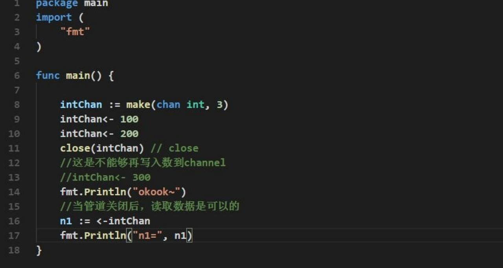

### 16.7.2 channel 的遍历

channel 支持 for--range 的方式进行遍历，请注意两个细节

1) 在遍历时，如果 channel 没有关闭，则回出现 deadlock 的错误
2) 在遍历时，如果 channel 已经关闭，则会正常遍历数据，遍历完后，就会退出遍历

### 16.7.3 应用实例 1


Ø 思路分析：

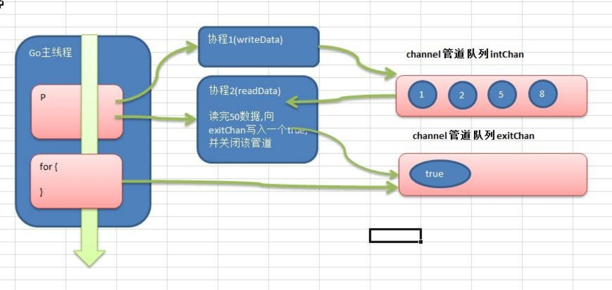

```go
package main

import (
	"fmt"
)

func writeData(intChan chan int) {
	for i := 1; i <= 50; i++ {
		// 放入数据
		intChan <- i
		fmt.Println("writeData ", i)
	}
	close(intChan) //关闭
}

func readData(intChan chan int, exitChan chan bool) {
	for {
		v, ok := <-intChan
		if !ok {
			break
		}
		fmt.Printf("readData 读到数据=%v\n", v)
	}
	// readData 读取完数据后，即任务完成
	exitChan <- true
	close(exitChan)
}

func main() {
	//创建两个管道
	intChan := make(chan int, 50)
	exitChan := make(chan bool, 1)
	go writeData(intChan)
	go readData(intChan, exitChan)
	for {
		_, ok := <-exitChan
		if !ok {
			break
		}
	}
}
```

### 16.7.4 应用实例 2-阻塞


### 16.7.5 应用实例 3

Ø 需求：

要求统计 1-8000 的数字中，哪些是素数？这个问题在本章开篇就提出了，现在我们有 goroutine和 channel 的知识后，就可以完成了 

Ø 分析思路：

传统的方法，就是使用一个循环，循环的判断各个数是不是素数【ok】。

使用并发/并行的方式，将统计素数的任务分配给多个(4 个)goroutine 去完成，完成任务时间短。

Ø **画出分析思路**

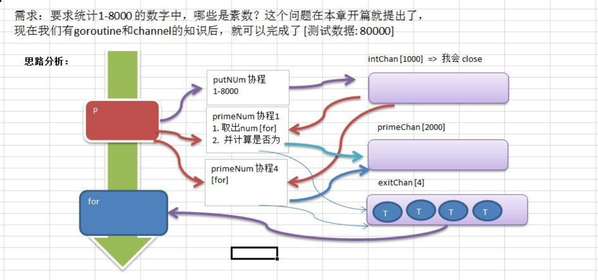

```go
package main

import (
	"fmt"
)

func putNum(intChan chan int) {
	for i := 1; i <= 8000; i++ {
		intChan <- i
	}
	// 关闭channel
	close(intChan)
}

// 从 intChan 取出数据，并判断是否为素数,如果是，就放入到 primeChan
func primeNum(intChan chan int, primeChan chan int, exitChan chan bool) {

	for {
		num, ok := <-intChan
		if !ok {
			break
		}
		flag := true
		//判断 num 是不是素数
		for i := 2; i < num; i++ {
			if num%i == 0 { //说明该 num 不是素数
				flag = false
				break
			}
		}
		if flag {
			//将这个数就放入到 primeChan
			primeChan <- num
		}
	}
	fmt.Println("有一个 primeNum  协程因为取不到数据，退出")
	//向 exitChan 写入 true
	exitChan <- true
}

func main() {
	intChan := make(chan int, 1000)
	primeChan := make(chan int, 2000) //放入结果
	//标识退出的管道
	exitChan := make(chan bool, 4) // 4 个

	//开启一个协程，向 intChan 放入 1-8000 个数
	go putNum(intChan)
	//开启 4 个协程，从 intChan 取出数据，并判断是否为素数,如果是，就
	//放入到 primeChan
	for i := 0; i < 4; i++ {
		go primeNum(intChan, primeChan, exitChan)
	}
	go func() {
		for i := 0; i < 4; i++ {
			<-exitChan

		}
		//当我们从 exitChan 取出了 4 个结果，就可以放心的关闭 primeChan
		close(primeChan)
	}()
	// 遍历我们的 primeChan ,把结果取出
	for {
		res, ok := <-primeChan
		if !ok {
			break
		}
		//将结果输出
		fmt.Printf("素数=%d\n", res)
	}
	fmt.Println("main 线程退出")
}
```

## 16.8 channel 使用细节和注意事项

1. channel 可以声明为只读，或者只写性质

   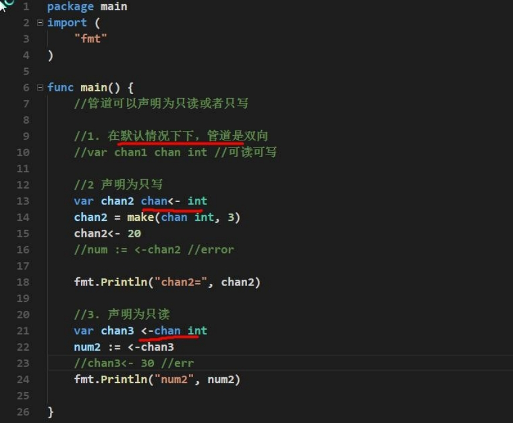

2. channel 只读和只写的最佳实践案例

   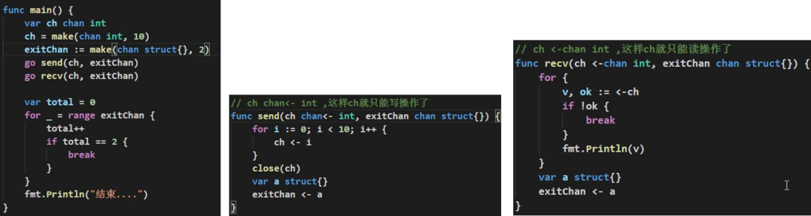

3. 使用 select 可以解决从管道取数据的阻塞问题

   ```go
   func main() {
   	// 1.定义一个管道 10 个数据 int
   	intChan := make(chan int, 10)
   	for i := 0; i < 10; i++ {
   		intChan <- i
   	}
   	// 2.定义一个管道 5 个数据 string
   	stringChan := make(chan string, 5)
   	for i := 0; i < 5; i++ {
   		stringChan <- "hello" + fmt.Sprintf("%d", i)
   	}
   	// 传统的方法在遍历管道时，如果不关闭会阻塞而导致 deadlock
   	//问题，在实际开发中，可能我们不好确定什么关闭该管道.
   	//可以使用 select 方式可以解决
   	for {
   		select {
   		// 注意: 这里，如果 intChan 一直没有关闭，不会一直阻塞而 deadlock 会自动到下一个 case 匹配
   		case v := <-intChan:
   			fmt.Printf("从 intChan 读取的数据%d\n", v)
   			time.Sleep(time.Second)
   		case v := <-stringChan:
   			fmt.Printf("从 stringChan 读取的数据%s\n", v)
   			time.Sleep(time.Second)
   		default:
   			fmt.Printf("都取不到了，不玩了, 程序员可以加入逻辑\n")
   			time.Sleep(time.Second)
   			return
   		}
   	}
   }
   ```

4. goroutine 中使用 recover，解决协程中出现 panic，导致程序崩溃问题

   

```go
func sayHello() {
	for i := 0; i < 10; i++ {
		time.Sleep(time.Second)
		fmt.Println("hello,world")
	}
}

func test() {
	defer func() {
		if err := recover(); err != nil {
			fmt.Println("test() 发生错误", err)
		}
	}()
	//定义了一个 map
	var myMap map[int]string
	myMap[0] = "golang" //error
}

func main() {
	go sayHello()
	go test()

	for i := 0; i < 10; i++ {
		fmt.Println("main() ok=", i)
		time.Sleep(time.Second)
	}
}
```

