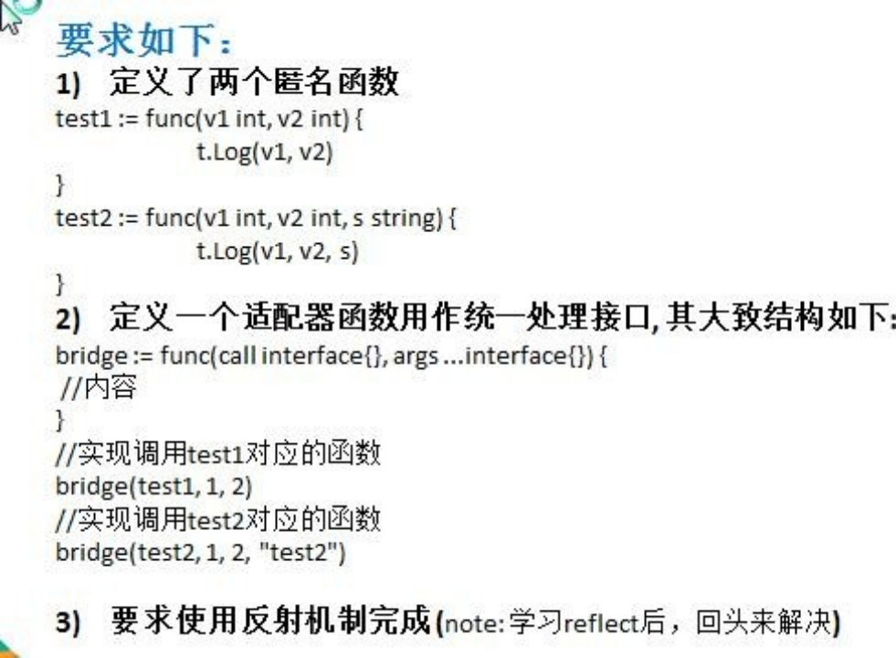
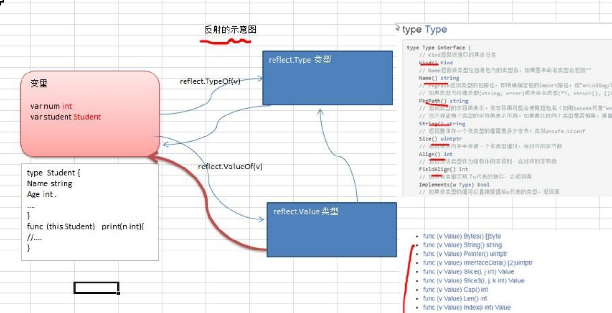
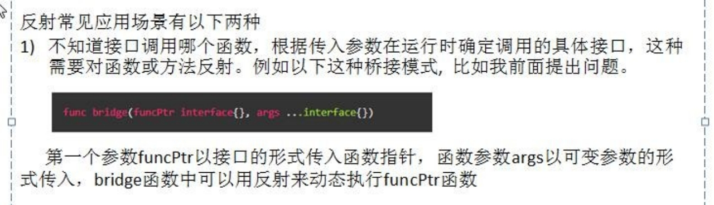
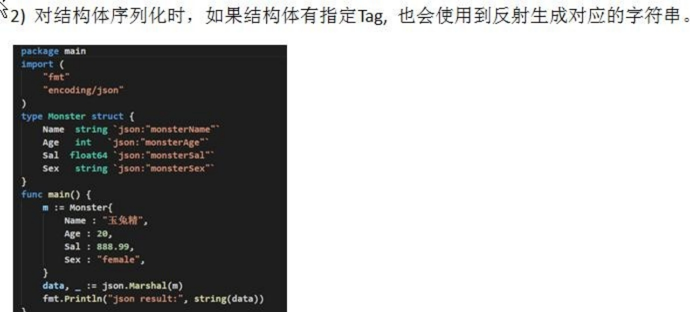
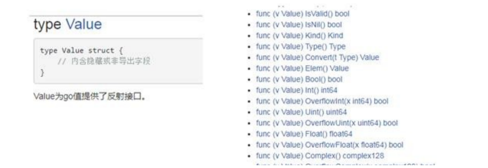
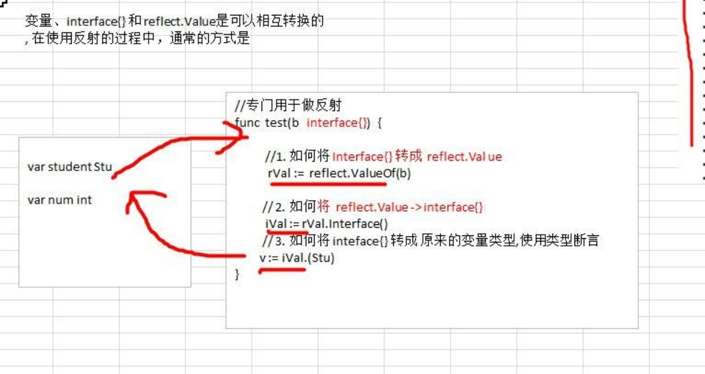
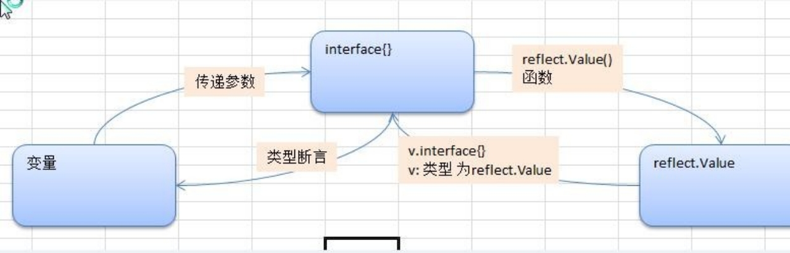
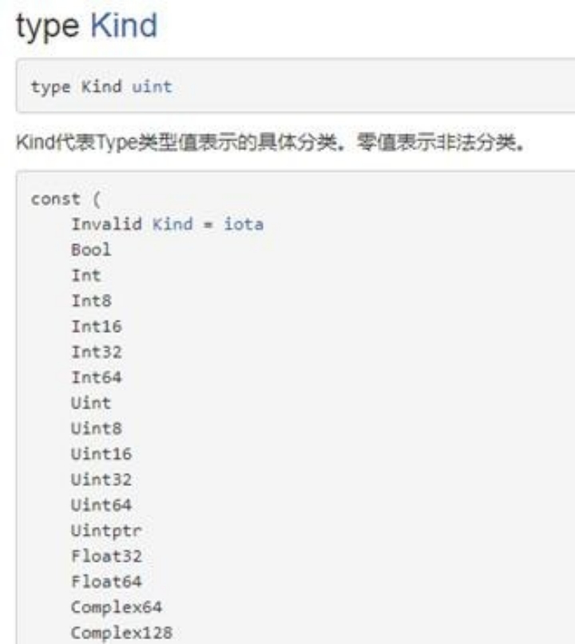

# 第15章 反射

## 15.1 先看一个问题，反射的使用场景


## 15.2 使用反射机制，编写函数的适配器, 桥连接



## 15.3 反射的基本介绍

### 15.3.1 基本介绍

1) 反射可以在运行时**动态获取变量的各种信息**, 比如变量的类型(type)，类别(kind)

2) 如果是结构体变量，还可以获取到结构体本身的信息(包括结构体的**字段**、**方法**)

3) 通过反射，可以修改变量的值，可以调用关联的方法。

4) 使用反射，需要 import (“**reflect**”)
5) 示意图



### 15.3.2 反射的应用场景





### 15.3.3 反射重要的函数和概念

1. reflect.TypeOf(变量名)，获取变量的类型，返回reflect.Type类型

2. reflect.ValueOf(变量名)，获取变量的值，返回reflect.Value类型，reflect.Value是一个结构体类型。通过relect.Value，可以获取到关于该变量的很多信息

   

3. 变量、interface{} 和 reflect.Value 是可以相互转换的，这点在实际开发中，会经常使用到。画出示意图

   



## 15.4 反射的快速入门

### 15.4.1 快速入门说明

Ø 请编写一个案例，演示对(基本数据类型、interface{}、reflect.Value)进行反射的基本操作代码演示，见下面的表格：

Ø请编写一个案例，演示对(结构体类型、interface{}、reflect.Value)进行反射的基本操作

```go
package main

import (
	"fmt"
	"reflect"
)

func reflectTest01(b interface{}) {
	//通过反射获取的传入的变量的 type , kind值

	// 1. 先获取到 reflect.Type
	rType := reflect.TypeOf(b)
	fmt.Println("rType=", rType)

	// 2. 获取到 reflect.Value
	val := reflect.ValueOf(b)

	n2 := 2 + val.Int()
	fmt.Println("n2=", n2)
	fmt.Printf("rVal=%v rVal type=%T\n", rType, val)

	// 将 val 转成 interface{}
	iV := val.Interface()
	// 将 interface{} 通过断言转成需要的类型
	num2 := iV.(int)
	fmt.Println("num2=", num2)
}

func reflectTest02(b interface{}) {
	// 1. 先获取到 reflect.Type
	rType := reflect.TypeOf(b)
	fmt.Println("rType=", rType)

	// 2. 获取到 reflect.Value
	val := reflect.ValueOf(b)
	// 将 val 转成 interface{}
	iV := val.Interface()
	fmt.Printf("iv=%v iv type=%T \n", iV, iV)
}

type Student struct {
	Name string
	Age  int
}

func main() {
	num := 100
	reflectTest01(num)

	stu := Student{"tom", 20}
	reflectTest02(stu)
}
```

## 15.5 反射的注意事项和细节

1) reflect.Value.Kind，获取变量的类别，返回的是一个常量

   

2) Type 和 Kind  的区别

   Type 是类型, Kind 是类别， Type 和 Kind **可能是相同的，也可能是不同的.** 比如:	var num int = 10	num 的 Type 是 int , Kind 也是 int

   比如:	var stu Student	stu 的 Type 是 pkg1.Student , Kind 是 struct

3) 通过反射可以让<font color='red'>变量</font>在<font color='blue'>interface{}</font>和<font color='purple'>Reflect.Value</font>

4) 使用反射的方式来获取变量的值（<font color='red'>并返回对应的类型</font>），要求数据类型匹配，比如x是int，那么就应该使用reflect.Value(x).Int()，而不能使用其它的，否则报panic

5) 通过反射的来修改变量, 注意当使用 SetXxx 方法来设置需要通过对应的指针类型来完成, 这样才能改变传入的变量的值, 同时需要使用到 reflect.Value.Elem()方法

   ```go
   func main() {
   	str := "tom"
   	value := reflect.ValueOf(&str)
   	value.Elem().SetString("jack")
   	fmt.Println(str)
   }
   ```

## 15.6 反射最佳实践

1) 使用**反射来遍历结构体的字段**，**调用结构体的方法**，并**获取结构体标签**的值

```go
func main() {
	monster := Monster{"牛魔王", 500, 100, "男"}
	testStruct(monster)
}

type Monster struct {
	Name  string  `json:"name"`
	Age   int     `json:"monster_age"`
	Score float32 `json:"成绩"`
	Sex   string
}

func (s Monster) GetSum(n1, n2 int) int {
	return n1 + n2
}

func testStruct(a interface{}) {
	//获取 reflect.Type 类型
	typ := reflect.TypeOf(a)
	//获取 reflect.Value 类型
	val := reflect.ValueOf(a)
	//获取到 a 对应的类别
	kd := val.Kind()
	//如果传入的不是 struct，就退出
	if kd != reflect.Struct {
		fmt.Println("expect struct")
		return
	}
	// 获取到该结构体有几个字段
	fieldNum := typ.NumField()
	fmt.Printf("struct has %d fields\n", fieldNum)

	for i := 0; i < fieldNum; i++ {
		fmt.Printf("Field %d:  值为=%v\n", i, val.Field(i))
		//获取到 struct 标签, 注意需要通过 reflect.Type 来获取 tag 标签的值
		tagVal := typ.Field(i).Tag.Get("json")
		//如果该字段有 tag 标签就显示，否则就不显示
		if tagVal != "" {
			fmt.Printf("Field %d: tag 为=%v\n", i, tagVal)
		}
	}

	// 获取到该结构体有多少个方法
	numOfMethod := val.NumMethod()
	fmt.Printf("struct has %d methods\n", numOfMethod)

	var params []reflect.Value //声明了 []reflect.Value
	params = append(params, reflect.ValueOf(10))
	params = append(params, reflect.ValueOf(40))
	res := val.Method(0).Call(params) //传入的参数是 []reflect.Value, 返回[]reflect.Value
	fmt.Println("res=", res[0].Int()) //返回结果, 返回的结果是 []reflect.Value*/
}
```

