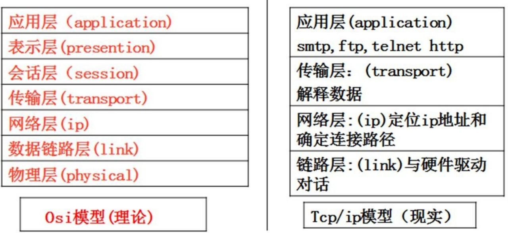

# 第16章 TCP编程

## 16.1 看两个实际应用


## 16.2 网络编程基本介绍

Golang 的主要设计目标之一就是面向大规模后端服务程序，网络通信这块是服务端 程序必不可少也是至关重要的一部分。

Ø 网络编程有两种:

1) TCP socket 编程，是网络编程的主流。之所以叫 Tcp socket 编程，是因为底层是基于 Tcp/ip 协议的. 比如: QQ 聊天 [示意图]

2) b/s 结构的 http 编程，我们使用浏览器去访问服务器时，使用的就是 http 协议，而 http 底层依旧是用 tcp socket 实现的。[示意图] 比如: 京东商城 【这属于 go web 开发范畴 】

### 16.2.1 网线,网卡,无线网卡

计算机间要相互通讯,必须要求网线,网卡,或者是无线网卡.

### 16.2.2 协议(tcp/ip)

TCP/IP（Transmission Control Protocol/Internet Protocol)的简写,中文译名为传输控制协议/因特网互联协议，又叫网络通讯协议，这个协议是 Internet 最基本的协议、Internet 国际互联网络的基础，简单地说，就是由网络层的 IP 协议和传输层的 TCP 协议组成的。


### 16.2.3 OSI 与 Tcp/ip 参考模型 (推荐 tcp/ip 协议 3 卷)




### 16.2.4 ip 地址

概述：每个 internet 上的主机和路由器都有一个 ip 地址，它包括网络号和主机号，ip 地址有 ipv4(32位)或者 ipv6(128 位).  可以通过 **ipconfig**  来查看

### 16.2.5 端口(port)-介绍

我们这里所指的端口不是指物理意义上的端口，而是特指 TCP/IP 协议中的端口，是逻辑意义上的端口。

如果把 IP 地址比作一间房子，端口就是出入这间房子的门。真正的房子只有几个门，但是一个 IP 地址的端口 可以有 65536（即：256×256）个之多！端口是通过端口号来标记的，端口号只有整数，范围是从 0  到 65535（256×256-1）


### 16.2.6 端口(port)-分类

Ø 0 号是保留端口.

Ø 1-1024 是固定端口(程序员不要使用)

​	又叫**有名端口**,即被某些程序固定使用,一般程序员不使用. 

​	22: SSH 远程登录协议	23: telnet 使用	21: ftp 使用

​	25: smtp 服务使用	80: iis 使用 7: echo 服务

Ø 1025-65535 是**动态端口**

​	这些端口，程序员可以使用.

### 16.2.7 端口(port)-使用注意

1) 在计算机(尤其是做服务器)要尽可能的少开端口
2) 一个端口只能被一个程序监听
3) 如果使用 netstat  –an  可以查看本机有哪些端口在监听
4) 可以使用 netstat  –anb  来查看监听端口的 pid,在结合任务管理器关闭不安全的端口

## 16.3 tcp socket 编程的客户端和服务器端

我们将 tcp socket 编程，简称 socket 编程.下图为 Golang socket 编程中客户端和服务器的网络分布


## 16.4 tcp socket 编程的快速入门

### 16.4.1 服务端的处理流程

1) 监听端口 8888

2) 接收客户端的 tcp 链接，建立客户端和服务器端的链接.

3) 创建 **goroutine**，处理该链接的请求(通常客户端会通过链接发送请求包)

### 16.4.2 客户端的处理流程

1) 建立与服务端的链接

2) 发送请求数据[终端]，接收服务器端返回的结果数据

3) 关闭链接

### 16.4.3 简单的程序示意图


### 16.4.4 代码的实现

Ø 服务器端功能:

编写一个服务器端程序，在 8888 端口监听可以和多个客户端创建链接

链接成功后，客户端可以发送数据，服务器端接受数据，并显示在终端上. 先使用 telnet  来测试，然后编写客户端程序来测试

```go
package main

import (
	"fmt"
	"net"
)

func process(conn net.Conn) {

	defer conn.Close()

	for true {
		// 创建一个新的切片
		buf := make([]byte, 1024)
		// 1. 等待客户端通过 conn 发送信息
		// 2. 如果客户端没有 write[发送]，那么协程就阻塞在这里
		fmt.Printf("服务器在等待客户端%s 发送信息\n", conn.RemoteAddr().String())
		n, err := conn.Read(buf)
		if err != nil {
			fmt.Printf("客户端退出 err=%v", err)
			return
		}

		// 3. 显示客户端发送的内容到服务器的终端
		fmt.Print(string(buf[:n]))
	}
}

func main() {
	fmt.Println("服务器开始监听	")
	// 1. tcp  表示使用网络协议是 tcp
	// 2. 0.0.0.0:8888 表示在本地监听 8888 端口
	listen, err := net.Listen("tcp", "0.0.0.0:8888")
	if err != nil {
		fmt.Println("listen err=", err)
		return
	}
	defer listen.Close() // 延时关闭 listen
	for true {
		fmt.Println("等待客户端来链接	")
		conn, err := listen.Accept()
		if err != nil {
			fmt.Println("Accept() err=", err)
		} else {
			fmt.Printf("Accept() suc con=%v 客户端 ip=%v\n", conn, conn.RemoteAddr().String())
		}
		//这里准备其一个协程，为客户端服务
		go process(conn)
	}
}
```

Ø 客户端功能:

1. 编写一个客户端端程序，能链接到 服务器端的 8888 端口

2. 客户端可以发送单行数据，然后就退出

3. 能通过终端输入数据(输入一行发送一行), 并发送给服务器端 []

4. 在终端输入 exit,表示退出程序.

```go
package main

import (
	"bufio"
	"fmt"
	"net"
	"os"
	"strings"
)

func main() {
	conn, err := net.Dial("tcp", "192.168.2.101:8888")
	if err != nil {
		fmt.Println("client dial err=", err)
		return
	}
	//功能一：客户端可以发送单行数据，然后就退出
	reader := bufio.NewReader(os.Stdin) //os.Stdin 代表标准输入[终端]
	for true {
		line, err := reader.ReadString('\n')
		if err != nil {
			fmt.Println("readString err=", err)
		}
		line = strings.Trim(line, "\r\n")
		if line == "exit" {
			fmt.Println("客户端退出")
			break
		}
		_, err = conn.Write([]byte(line + "\n"))
		if err != nil {
			fmt.Println("conn.Write err=", err)
		}
	}
}
```

