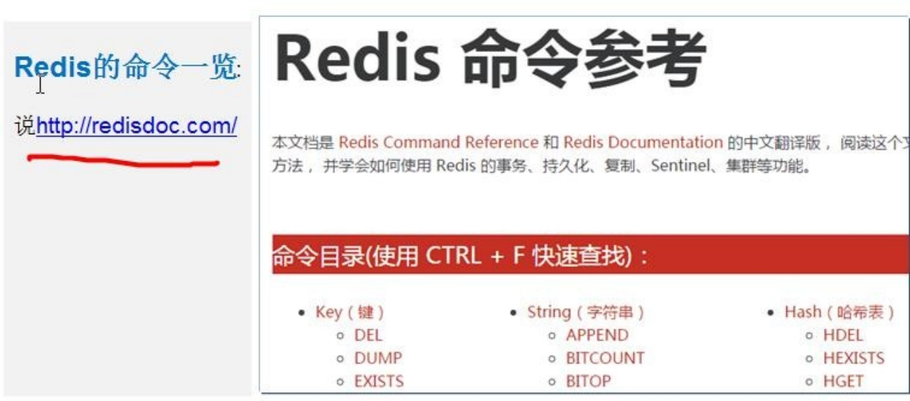
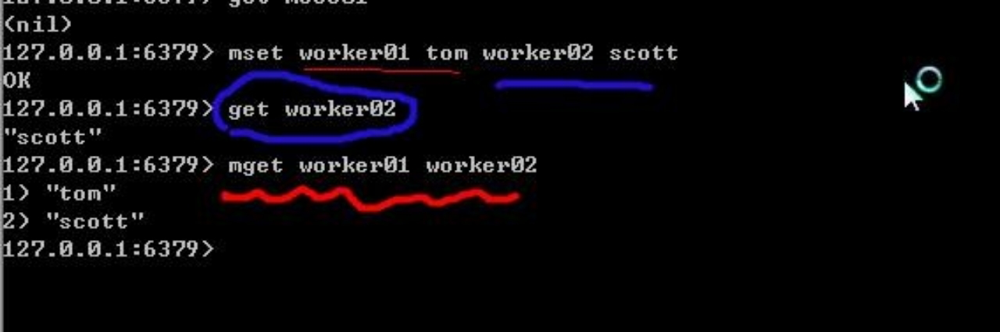

# 第17章 Redis的使用

## 17.1 Redis 基本介绍


### 17.1.1 Redis 的安装


### 17.1.2 Redis 操作的基本原理图


## 17.2 Redis 的安装和基本使用

### 17.2.1 Redis 的启动:


## 17.3 Redis 的操作指令一览



### 17.3.1 Redis 的基本使用:

说明: Redis  安装好后，默认有 16 个数据库，初始默认使用 0 号库,  编号是 0...15

1. 添加 key-val	[set]

2. 查看当前 redis 的 所有 key	[keys *]

3. 获取 key 对应的值. [get key]

4. 切换 redis  数据库 [select index]

5. 如何查看当前数据库的 key-val 数量 [dbsize]

6. 清空当前数据库的 key-val 和清空所有数据库的 key-val [flushdb flushall]

## 17.4 Redis 的 Crud 操作

### 17.4.1 Redis 的五大数据类型:

Redis 的五大数据类型是: String(字符串) 、Hash (哈希)、List(列表)、Set(集合)和 Zset(sorted set：有序集合)

### 17.4.2 String(字符串) -介绍

string 是 redis 最基本的类型，一个 key 对应一个 value。

string 类型是二进制安全的。除普通的字符串外，也可以存放图片等数据。

redis 中字符串 value 最大是 512M

Ø 举例,存放一个地址信息:

address 北京天安门说明 ：

key : address

value: 北京天安门


Ø String(字符串) -CRUD

举例说明 Redis 的 String 字符串的 CRUD 操作.

set[如果存在就相当于修改，不存在就是添加]/get/del


### 17.4.3 String(字符串)-使用细节和注意事项

Ø setex(set with expire)键秒值

Ø mset[同时设置一个或多个 key-value 对]

Ø mget[同时获取多个 key-val]



### 17.4.4 Hash (哈希，类似 golang 里的Map)-介绍

Ø 基本的介绍

​	Redis hash 是一个键值对集合。var user1 map[string]string

​	Redis hash 是一个 string 类型的 field 和 value 的映射表，hash 特别适合用于存储对象。

Ø 举例,存放一个 User 信息:(user1)

```go
user1 name "smith"	age 30 job "golang coder"
```


### 17.4.5 Hash（哈希，类似 golang 里的 Map）-CRUD

举 例 说 明 Redis 的 Hash 的 CRUD 的 基 本 操 作 .

 hset/hget/**hgetall**/**hdel**

演示添加 user 信息的案例 (name,age )


### 17.4.6 Hash-使用细节和注意事项

1. 在给 user 设置 name 和 age 时，前面我们是一步一步设置,使用 hmset 和 hmget 可以一次性来设置多个 filed  的值和返回多个 field 的值 。
2. hlen 统计一个 hash  有几个元素.
3. hexists key field 查看哈希表 key 中，给定域 field 是否存在


### 17.4.7 List（列表）-介绍

列表是简单的字符串列表，按照插入顺序排序。你可以添加一个元素到列表的头部（左边）或者尾部（右边）。

List 本质是个链表, List 的元素 是有序的，元素的值可以重复.

举例,**存放多个地址信息**: city	北京 天津	上海


### 17.4.8 List（列表）-CRUD

举例说明 Redis 的 List 的 CRUD 操作。

lpush/rpush/lrange/lpop/rpop/del/


### 17.4.9 List-使用细节和注意事项


### 17.4.10 Set(集合) - 介绍

1. Redis 的 Set 是 string 类型的无序集合。

2. 底层是 HashTable 数据结构, Set 也是存放很多字符串元素，字符串元素是无序的，而且元素的值不能重复

3. 举例,存放多个邮件列表信息:

   ```
   email	sgg@sohu.com tom@sohu.com
   说明 ：
   key : email
   ```

   

### 17.4.11 Set(集合)- CRUD

1. 举例说明 Redis 的 Set  的 CRUD 操作

   ```
   sadd
   smembers[取出所有值]
   sismember[判断值是否是成员] 
   srem [删除指定值]
   ```

   

   

## 17.5 Golang 操作 Redis

### 17.5.1 安装第三方开源Redis 库

1) 使用第三方开源的 redis 库: github.com/garyburd/redigo/redis

2) 在使用 Redis 前，先安装第三方 Redis 库，在 GOPATH 路径下执行安装指令: D:\goproject>go get github.com/garyburd/redigo/redis

3) 安装成功后,可以看到如下包

特别说明: 在安装 Redis 库前，确保已经安装并配置了 Git, 因为 是从 github 下载安装 Redis 库的， 需要使用到 Git。 如果没有安装配置过 Git，请参考:  如何安装配置 Git

### 17.5.2 Set/Get 接口

通过 Golang  添加和获取 key-value

```go

func main() {
	conn, err := redis.Dial("tcp", "127.0.0.1:6379")
	if err != nil {
		fmt.Println("redis.Dial err =", err)
		return
	}
	defer conn.Close()
	_, err = conn.Do("Set", "name", "tomjerry 猫猫")
	if err != nil {
		fmt.Println("set	err=", err)
		return
	}

	r, err := redis.String(conn.Do("Get", "name"))
	if err != nil {
		fmt.Println("set	err=", err)
		return
	}
	fmt.Printf("r type is %T \n", r)
	fmt.Println("操作 ok ", r)
}
```

### 17.5.3 操作Hash

通过 Golang 对 Redis 操作 Hash 数据类型

```go
package main

import (
	"fmt"
	"github.com/garyburd/redigo/redis"
)

func main() {
	conn, err := redis.Dial("tcp", "127.0.0.1:6379")
	if err != nil {
		fmt.Println("redis.Dial err =", err)
		return
	}
	defer conn.Close()
	// 通过 go 向 redis 写入数据 string [key-val]
	_, err = conn.Do("HSet", "user01", "name", "john")
	if err != nil {
		fmt.Println("hset	err=", err)
		return
	}
	_, err = conn.Do("HSet", "user01", "age", 18)
	if err != nil {
		fmt.Println("hset	err=", err)
		return
	}
	// 通过 go 向 redis 读取数据
	r1, err := redis.String(conn.Do("HGet", "user01", "name"))
	if err != nil {
		fmt.Println("hget	err=", err)
		return
	}

	r2, err := redis.Int(conn.Do("HGet", "user01", "age"))
	if err != nil {
		fmt.Println("hget	err=", err)
		return
	}

	fmt.Printf("操作 ok r1=%v r2=%v \n", r1, r2)
}
```

对 hash 数据结构，field-val  是批量放入和读取

```go
package main

import (
	"fmt"
	"github.com/garyburd/redigo/redis"
)

func main() {
	conn, err := redis.Dial("tcp", "127.0.0.1:6379")
	if err != nil {
		fmt.Println("redis.Dial err =", err)
		return
	}
	defer conn.Close()
	// 通过 go 向 redis 写入数据 string [key-val]
	_, err = conn.Do("HMSet", "user02", "name", "john", "age", 19)
	if err != nil {
		fmt.Println("HMSet	err=", err)
		return
	}
	// 通过 go 向 redis 读取数据
	r, err := redis.Strings(conn.Do("HMGet", "user02", "name", "age"))
	if err != nil {
		fmt.Println("hget	err=", err)
		return
	}
	for i, v := range r {
		fmt.Printf("r[%d]=%s\n", i, v)
	}
}
```

### 17.5.4 批量Set/Get 数据

通过 Golang 对 Redis 操作，一次操作可以 Set / Get 多个 key-val 数据核心代码:

```go
_, err = c.Do("MSet", "name", "尚硅谷", "address", "北京昌平~")
r, err := redis.Strings(c.Do("MGet", "name", "address"))

for _, v := range r { 
	fmt.Println(v)
}
```

### 17.5.5 给数据设置有效时间

通过 Golang 对 Redis 操作，给 key-value 设置有效时间

```go
// 给 name 数据设置有效时间为 10s
_, err = c.Do("expire", "name", 10)
```

### 17.5.6 操作List

通过 Golang 对 Redis 操作 List 数据类型

```go
_, err = c.Do("lpush", "heroList", "no1:宋江", 30, "no2:卢俊义", 28) 
r, err := redis.String(c.Do("rpop", "heroList"))
```

### 17.5.7 Redis 链接池

 通过 Golang 对 Redis 操作， 还可以通过 Redis 链接池,  流程如下：

1) 事先初始化一定数量的链接，放入到链接池

2) 当 Go 需要操作 Redis 时，**直接从** **Redis** **链接池取出链接**即可。

3) 这样可以节省临时**获取** **Redis** **链接**的时间，从而提高效率.

4) 示意图


```go
// 定义一个全局的 pool
var pool *redis.Pool

func init() {
	pool = &redis.Pool{
		MaxIdle:     8,   //最大空闲链接数
		MaxActive:   0,   //  表示和数据库的最大链接数， 0  表示没有限制
		IdleTimeout: 100, //  最大空闲时间
		Dial: func() (redis.Conn, error) {
			// 初始化链接的代码， 链接哪个 ip 的 redis
			return redis.Dial("tcp", "localhost:6379")
		},
	}
}
```

