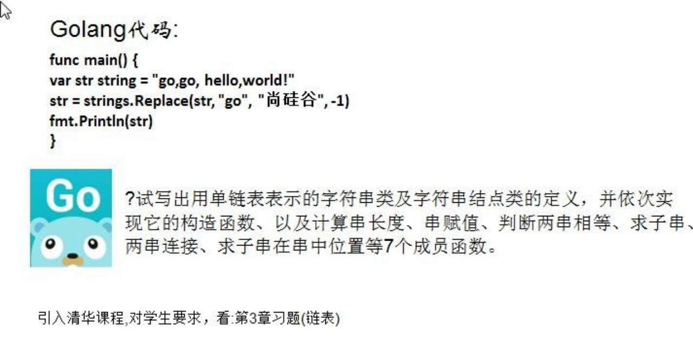
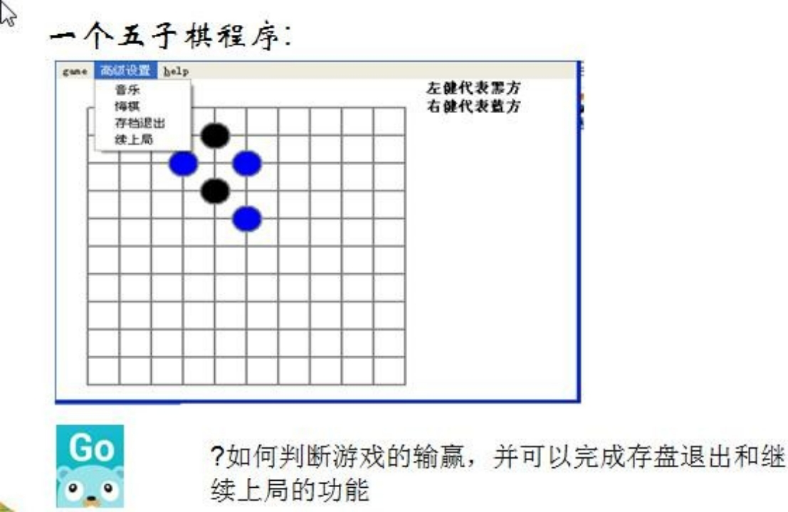
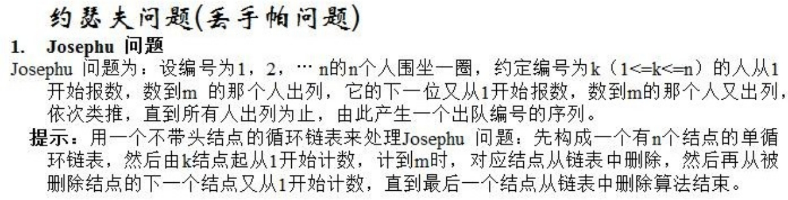
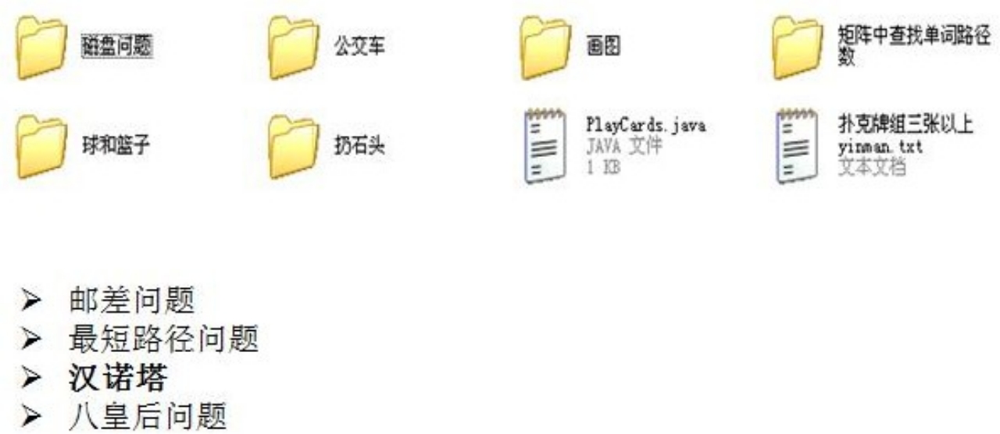
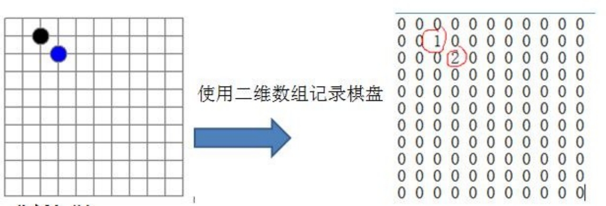
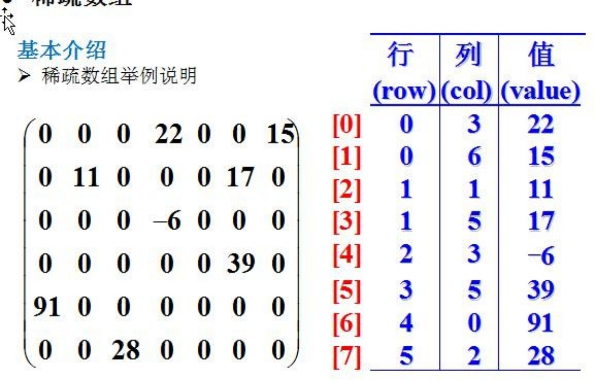
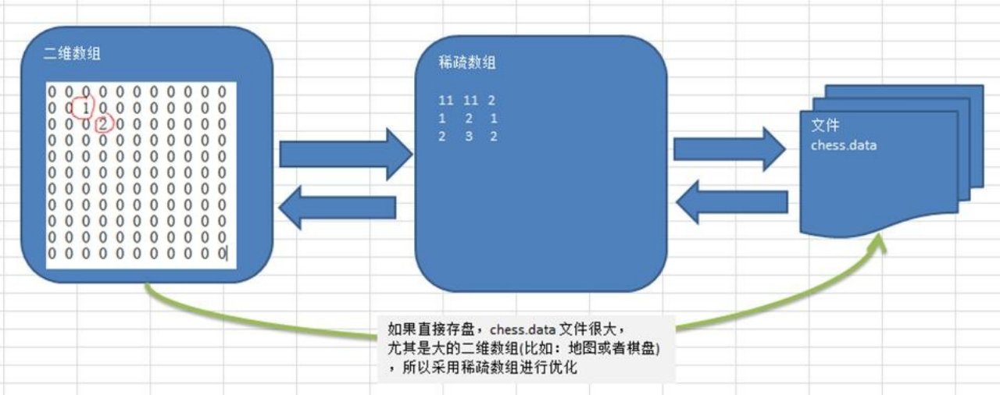

# 第18章 数据结构

## 18.1 数据结构(算法)的介绍

Ø 数据结构的介绍

1) 数据结构是一门研究算法的学科，只从有了编程语言也就有了数据结构.学好数据结构可以编写出更加漂亮,更加有效率的代码。

2) 要学习好数据结构就要多多考虑如何将生活中遇到的问题,用程序去实现解决.

3) 程序 = 数据结构 + 算法

## 18.2 数据结构和算法的关系

算法是程序的灵魂，为什么有些网站能够在高并发，和海量吞吐情况下依然坚如磐石,大家可能会说: 网站使用了服务器群集技术、数据库读写分离和缓存技术(比如 Redis 等),那如果我再深入的问一句，这些优化技术又是怎样被那些天才的技术高手设计出来的呢?

大家请思考一个问题，是什么让不同的人写出的代码从功能看是一样的，但从效率上却有天壤之别, 拿在公司工作的实际经历来说, 我是做服务器的，环境是 UNIX，功能是要支持上千万人同时在线， 并保证数据传输的稳定, 在服务器上线前，做内测，一切 OK,可上线后，服务器就支撑不住了,  公司的 CTO 对我的代码进行优化，再次上线，坚如磐石。那一瞬间,我认识到程序是有灵魂的，就是算法。如果你不想永远都是代码工人,那就花时间来研究下算法吧!

本章着重讲解算法的基石-数据结构。

## 18.3 看几个实际编程中遇到的问题

## 18.4 稀疏 sparsearray 数组

### 18.4.1 先看一个实际的需求

编写的五子棋程序中，有存盘退出和续上盘的功能

分析按照原始的方式来的二维数组的问题

因为该二维数组的很多值是默认值 0, 因此记录了很多没有意义的数据

### 18.4.2 基本介绍

当一个数组中大部分元素为０，或者为同一个值的数组时，可以使用稀疏数组来保存该数组。

稀疏数组的处理方法是:

1) 记录数组一共有几行几列，有多少个不同的值

2) 思想：把具有不同值的元素的行列及值记录在一个小规模的数组中，从而**缩小程序**的规模

### 18.4.3 稀疏数组举例说明

### 18.4.4 应用实例

1) 使用稀疏数组，来保留类似前面的二维数组(棋盘、地图等等)

2) 把稀疏数组存盘，并且可以从新恢复原来的二维数组数

3) 整体思路分析

