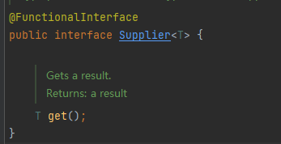

# 2 CompletableFuture

## 2.1 Future接口

Future接口（FutureTask实现类）定义了操作<font color='red'>异步任务</font>执行的一些方法，如获取异步任务的执行结果、取消异步任务的执行、判断任务是否被取消、判断任务是否执行完毕等。

举例：比如<font color='blue'>主线程让一个子线程</font>去执行任务，子线程可能比较耗时，启动子线程开始执行任务后，主线程就去做其他事情了，忙完其他事情或者先执行完，过了一会再才去获取子任务的执行结果或变更的任务状态（老师上课时间想喝水，他继续讲课不结束上课这个主线程，让学生去小卖部帮老师买水完成这个耗时和费力的任务）。


## 2.2 Future接口常用实现类FutureTask异步任务

### 2.2.1 Future接口能干什么

Future是JDK5新加的一个接口，它提供一种<font color='red'>异步并行计算</font>的功能，如果主线程需要执行一个很耗时的计算任务，我们会就可以通过Future把这个任务返稿异步线程中执行，主线程继续处理其他任务或者先行结束，再通过Future获取计算结果。

### 2.2.2 Future接口相关架构

- 目的：异步多线程任务执行且返回结果，三个特点：<font color='red'>多线程、有返回、异步任务</font>
- 代码实现：Runnable接口+Callable接口+Future接口和FutureTask实现类。


```java
/**
 * Copyright (C), 2017-2023, Maktub
 * Author: maktub
 * Date: 2023/4/23 16:23
 * FileName: FutureTaskDemo
 * Description: FutureTask
 */
public class FutureTaskDemo {

    public static void main(String[] args) throws ExecutionException, InterruptedException {
        FutureTask<String> futureTask = new FutureTask<>(new MyThread());
        // 开启一个异步线程
        Thread t1 = new Thread(futureTask);
        t1.start();
        System.out.println(futureTask.get());
    }
}

class MyThread implements Callable<String> {

    @Override
    public String call() throws Exception {
        System.out.println("--------come in");
        return "hello Callable";
    }
}
```

### 2.2.3 Future编码实战和优缺点分析

- 优点：Future+线程池异步多线程任务配合，能显著提高程序的运行效率。
- 缺点：
  - get()阻塞——一旦调用get()方法求结果，一旦调用不见不散，非要等到结果才会离开，不管你是否计算完成，如果没有计算完成容易程序堵塞。
  - isDone()轮询——轮询的方式会耗费无谓的CPU资源，而且也不见得能及时得到计算结果，如果想要异步获取结果，通常会以轮询的方式去获取结果，尽量不要阻塞。
- 结论：Future对于结果的获取不是很友好，只能通过阻塞或轮询的方式得到任务的结果。

```java
public class FutureApiDemo {

    public static void main(String[] args) throws ExecutionException, InterruptedException, TimeoutException {
        FutureTask<String> futureTask = new FutureTask<>(() -> {
            System.out.println(Thread.currentThread().getName() + "--------come in");
            TimeUnit.SECONDS.sleep(5);
            return "task over";
        });
        Thread t1 = new Thread(futureTask, "t1");
        t1.start();

        // 这样会有阻塞的可能，在程序没有计算完毕的情况下。
//        System.out.println(futureTask.get());
        // 只愿意等待三秒，计算未完成直接抛出异常
//        System.out.println(futureTask.get(3,TimeUnit.SECONDS));
        while (true) {//轮询
            if(futureTask.isDone()){
                System.out.println(futureTask.get());
                break;
            }else{
                TimeUnit.MILLISECONDS.sleep(500);
                System.out.println("正在处理中，不要催了，越催越慢");
            }
        }
    }
}

t1--------come in
正在处理中，不要催了，越催越慢
正在处理中，不要催了，越催越慢
正在处理中，不要催了，越催越慢
正在处理中，不要催了，越催越慢
正在处理中，不要催了，越催越慢
正在处理中，不要催了，越催越慢
正在处理中，不要催了，越催越慢
正在处理中，不要催了，越催越慢
正在处理中，不要催了，越催越慢
正在处理中，不要催了，越催越慢
task over

Process finished with exit code 0
```

### 2.2.4 完成一些复杂的任务

- 对于简单的业务场景使用Future完全ok
- 回调通知:
  - 应对Future的完成时间，完成了可以告诉我，也就是我们的<font color='red'>回调通知</font>
  - 通过轮询的方式去判断任务是否完成这样非常占CPU并且代码也不优雅
- 创建异步任务：<font color='red'>Future+线程池组合</font>
- 多个任务前后依赖可以组合处理：
  - 想将多个异步任务的结果组合起来，后一个异步任务的计算结果需要钱一个异步任务的值
  - 想将两个或多个异步计算合并成为一个异步计算，这几个异步计算互相独立，同时后面这个又依赖前一个处理的结果
- 对计算速度选最快的：
  - 当Future集合中某个任务最快结束时，返回结果，返回第一名处理结果

## 2.3 CompletableFuture

### 2.3.1 CompletableFuture为什么会出现

- - 

- get()方法在Future计算完成之前会一直处在<font color='red'>阻塞</font>状态下，<font color='red'>阻塞的方式和异步编程的设计理念相违背</font>。
- isDone()方法容易耗费cpu资源（cpu空转）。
- 对于真正的异步处理我们希望是可以<font color='red'>通过传入回调函数，在Future结束时自动调用该回调函数</font>，这样，我们就不用等待结果

JDK8设计出CompletableFuture，CompletableFuture提供了一种<font color='red'>观察者模式</font>类似的机制，可以让任务执行完成后通知监听的一方。

### 2.3.2 CompletableFuture和CompletionStage介绍

**类架构说明**：


- 接口CompletionStage
  - 代表异步计算过程中的某一个阶段，一个阶段完成以后可能会触发另外一个阶段。
  - 一个阶段的执行可能是被单个阶段的完成触发，也可能由多个阶段一起触发。
- 类CompletableFuture
  - 提供了非常强大的Future的扩展功能，可以帮助我们简化异步编程的复杂性，并且提供函数式编程的能力，可以通过<font color='red'>回调的方式处理计算结果</font>，也提供了转换和组合CompletableFuture的方法
  - 它可能代表一个<font color='red'>明确完成的Future</font>，也可能代表<font color='red'>一个完成阶段（CompletionStage）</font>，它支持在计算完成以后触发一些函数或执行某些动作

### 2.3.3 核心的四个静态方法，来创建一个异步任务

四个静态构造方法


对于上述Executor参数说明：若没有指定，则使用默认的ForkJoinPoolcommonPool（）作为它的线程池执行异步代码，如果指定线程池，则使用我们自定义的或者特别指定的线程池执行异步代码

```java
public class CompletableFutureBuildDemo {

    public static void main(String[] args) throws ExecutionException, InterruptedException {
        ExecutorService executorService = Executors.newFixedThreadPool(3);
        CompletableFuture<Void> completableFuture = CompletableFuture.runAsync(() -> {
            System.out.println(Thread.currentThread().getName());
            try {
                TimeUnit.SECONDS.sleep(1);
            } catch (InterruptedException e) {
                e.printStackTrace();
            }
        },executorService);
        System.out.println(completableFuture.get()); // null

        CompletableFuture<String> objectCompletableFuture = CompletableFuture.supplyAsync(()->{
            System.out.println(Thread.currentThread().getName());
            try {
                TimeUnit.SECONDS.sleep(1);
            } catch (InterruptedException e) {
                e.printStackTrace();
            }
            return "hello supplyAsync";
        },executorService);

        System.out.println(objectCompletableFuture.get()); // hello supplyAsync
        executorService.shutdown();
    }
}
```

CompletableFuture减少阻塞和轮询，可以传入回调对象，当异步任务完成或者发生异常时，自动调用回调对象的回调方法。

```java
public class CompletableFutureUseDemo {

    public static void main(String[] args) {
        ExecutorService executorService = Executors.newFixedThreadPool(3);
        CompletableFuture<Integer> completableFuture = CompletableFuture.supplyAsync(() -> {
            System.out.println(Thread.currentThread().getName() + "---come in");
            int result = ThreadLocalRandom.current().nextInt(10);
            try {
                TimeUnit.SECONDS.sleep(1);
            } catch (InterruptedException e) {
                e.printStackTrace();
            }
            // 模拟产生异常情况
            if (result > 5) {
                int i = 10 / 0;
            }
            System.out.println("----------1秒钟后出结果" + result);
            return result;
        }, executorService).whenComplete((result, exception) -> {
            if (exception == null) {
                System.out.println("计算完成 更新系统" + result);
            }
        }).exceptionally(exception -> {
            exception.printStackTrace();
            System.out.println("异常情况：" + exception.getCause() + " " + exception.getMessage());
            return null;
        });
        System.out.println(Thread.currentThread().getName() + "先去完成其他任务");
        executorService.shutdown();
    }
}


//无异常情况
pool-1-thread-1---come in
main先去完成其他任务
----------1秒钟后出结果4
计算完成 更新系统4

// 有异常情况
pool-1-thread-1---come in
main先去完成其他任务
java.util.concurrent.CompletionException: java.lang.ArithmeticException: / by zero
异常情况：java.lang.ArithmeticException: / by zero java.lang.ArithmeticException: / by zero
```

CompletableFuture优点：

- 异步任务**结束**时，会<font color='red'>自动回调</font>某个对象的方法
- 主线程设置好回调后，不用关心异步任务的执行，异步任务之间<font color='red'>可以顺序执行</font>
- 异步任务**出错**时，会<font color='red'>自动回调</font>某个对象的方法

## 2.4 案例精讲-从电商网站的比价需求展开

### 2.4.1 函数式编程已成为主流

Lambda表达式+Stream流式调用+Chain链式调用+Java8函数式编程

函数式接口：

- Runnable：无参数、无返回值


- Function：接受一个参数，并且有返回值


- Consumer：接受一个参数，没有返回值


- BiConsumer：接受两个参数，没有返回值


- Supplier：没有参数，有返回值



小结：


**chain链式调用：**

```java
public class ChainCallDemo {

    public static void main(String[] args) {
        // 链式调用
        Student student = new Student();
        student.setId(1).setStudentName("z3").setMajor("english");
    }
}

@AllArgsConstructor
@NoArgsConstructor
@Data
@Accessors(chain = true) // 开启链式调用
class Student {
    private Integer id;
    private String studentName;
    private String major;
}
```

### 2.4.2 大厂业务需求说明

电商网站比价需求分析：

1. 需求说明：

   1. 同一款产品，同时搜索出同款产品在各大电商平台的售价
   2. 同一款产品，同时搜索出本产品在同一个电商平台下，各个入驻卖家售价是多少

2. 输出返回：

   1. 出来结果希望是同款产品的在不同地方的价格清单列表，返回一个List<String>

   例如：《Mysql》 in jd price is 88.05  《Mysql》 in taobao price is 90.43

3. 解决方案，对比同一个产品在各个平台上的价格，要求获得一个清单列表

   1. step by step，按部就班，查完淘宝查京东，查完京东查天猫....
   2. all in，万箭齐发，一口气多线程异步任务同时查询

```java
public class CompletableFutureMallDemo {
    static List<NetMall> list = Arrays.asList(new NetMall("jd"), new NetMall("taobao"), new NetMall("dangdang"));

    /**
     * step by step
     * @param list
     * @param productName
     * @return
     */
    public static List<String> getPrice(List<NetMall> list, String productName) {
        return list.stream().map(netMall ->
                        String.format("《" + productName + "》" + "in %s price is %.2f",
                                netMall.getNetMallName(),
                                netMall.calcPrice(productName)))
                .collect(Collectors.toList());
    }

    /**
     * all in
     * 把list里面的内容映射给CompletableFuture()
     * @param list
     * @param productName
     * @return
     */
    public static List<String> getPriceByCompletableFuture(List<NetMall> list, String productName) {
        return list.stream().map(netMall ->
                CompletableFuture.supplyAsync(() ->
                        String.format("《" + productName + "》" + "in %s price is %.2f",
                netMall.getNetMallName(),
                netMall.calcPrice(productName))))
                .collect(Collectors.toList())
                .stream()
                .map(CompletableFuture::join).collect(Collectors.toList());
    }

    public static void main(String[] args) {
        long StartTime = System.currentTimeMillis();
        List<String> list1 = getPrice(list, "mysql");
        for (String element : list1) {
            System.out.println(element);
        }
        long endTime = System.currentTimeMillis();
        System.out.println("------costTime: " + (endTime - StartTime) + " 毫秒");

        long StartTime2 = System.currentTimeMillis();
        List<String> list2 = getPriceByCompletableFuture(list, "mysql");
        for (String element : list2) {
            System.out.println(element);
        }
        long endTime2 = System.currentTimeMillis();
        System.out.println("------costTime" + (endTime2 - StartTime2) + " 毫秒");
    }
}

@AllArgsConstructor
@NoArgsConstructor
@Data
class NetMall {
    private String netMallName;

    public double calcPrice(String productName) {
        try {
            TimeUnit.SECONDS.sleep(1);
        } catch (InterruptedException e) {
            e.printStackTrace();
        }

        return ThreadLocalRandom.current().nextDouble() * 2 + productName.charAt(0);
    }
}

《mysql》in jd price is 110.27
《mysql》in taobao price is 109.47
《mysql》in dangdang price is 110.03
------costTime: 3188 毫秒
《mysql》in jd price is 109.40
《mysql》in taobao price is 109.59
《mysql》in dangdang price is 110.43
------costTime1031 毫秒
```

### 2.4.3 CompletableFuture常用方法

- **获得结果和触发计算**
  - 获取结果
    - public T get()
    - public T get(long timeout,TimeUnit unit)
    - public T join() --->和get一样的作用，只是不需要抛出异常
    - public T getNow(T valuelfAbsent) --->计算完成就返回正常值，否则返回备胎值（传入的参数），立即获取结果不阻塞
  - 主动触发计算
    - public boolean complete(T value) ---->是否打断get方法立即返回括号值
- **对计算结果进行处理**
  - thenApply ——>计算结果存在依赖关系，这两个线程串行化---->由于存在依赖关系（当前步错，不走下一步），当前步骤有异常的话就叫停
  - handle ——>计算结果存在依赖关系，这两个线程串行化---->有异常也可以往下走一步

```java
public class CompletableFutureApiDemo {

    public static void main(String[] args) {
        ExecutorService threadPool = Executors.newFixedThreadPool(3);
        CompletableFuture<Integer> completableFuture = CompletableFuture.supplyAsync(() -> {
                    try {
                        TimeUnit.SECONDS.sleep(1);
                    } catch (InterruptedException e) {
                        e.printStackTrace();
                    }
                    return 1;
                }, threadPool).thenApply(f -> {
                    System.out.println("222");
                    return f + 2;
                }).handle((f, e) -> {
                    System.out.println("3333");
                    int i = 10 / 0;
                    return f + 2;
                })
                .whenComplete((result, exception) -> {
                    if (exception == null) {
                        System.out.println("----计算结果" + result);
                    }
                }).exceptionally(e -> {
                    e.printStackTrace();
                    System.out.println(e.getCause());
                    return null;
                });
        System.out.println(Thread.currentThread().getName() + "------主线程先去做其他事情");
    }
}
```

- **对计算结果进行消费**

- - 接受任务的处理结果，并消费处理，无返回结果
  - thenAccept

```java
public class CompletableFutureApi2Demo {
    public static void main(String[] args) {
        ExecutorService threadPool = Executors.newFixedThreadPool(3);
        CompletableFuture.supplyAsync(() -> {
            return 1;
        }, threadPool).thenApply(f -> {
            return f + 2;
        }).thenApply(f -> {
            return f + 2;
        }).thenAccept(r -> {
            System.out.println(r);//5
        });
    }
}
```

- - 对比补充

- - - thenRun(Runnable runnable) :任务A执行完执行B，并且不需要A的结果
    - thenAccept(Consumer action): 任务A执行完执行B，B需要A的结果，但是任务B没有返回值
    - thenApply(Function fn): 任务A执行完执行B，B需要A的结果，同时任务B有返回值

```java
public class CompletableFutureApi2Demo {
    public static void main(String[] args) {
        System.out.println(CompletableFuture.supplyAsync(() -> "result").thenRun(() -> {}).join());//null
        System.out.println(CompletableFuture.supplyAsync(() -> "result").thenAccept(r -> System.out.println(r)).join());//result null
        System.out.println(CompletableFuture.supplyAsync(() -> "result").thenApply(f -> f + 2).join());//result2
    }
}
```

- - CompletableFuture和线程池说明

- - - 如果没有传入自定义线程池，都用默认线程池ForkJoinPool
    - 传入一个线程池，如果你执行第一个任务时，传入了一个自定义线程池

- - - - 调用thenRun方法执行第二个任务时，则第二个任务和第一个任务时共用同一个线程池
      - 调用thenRunAsync执行第二个任务时，则第一个任务使用的是你自定义的线程池，第二个任务使用的是ForkJoin线程池

- - - 备注：可能是线程处理太快，系统优化切换原则， 直接使用main线程处理，thenAccept和thenAcceptAsync，thenApply和thenApplyAsync等，之间的区别同理。

- **对计算速度进行选用**

- - 谁快用谁
  - applyToEither

```java
public class CompletableFutureApiDemo {
    public static void main(String[] args) {
        ExecutorService threadPool = Executors.newFixedThreadPool(3);
        CompletableFuture<String> playA = CompletableFuture.supplyAsync(() -> {
            try {
                System.out.println("A come in");
                TimeUnit.SECONDS.sleep(2);
            } catch (InterruptedException e) {
                e.printStackTrace();
            }
            return "playA";
        }, threadPool);


        CompletableFuture<String> playB = CompletableFuture.supplyAsync(() -> {
            try {
                System.out.println("B come in");
                TimeUnit.SECONDS.sleep(3);
            } catch (InterruptedException e) {
                e.printStackTrace();
            }
            return "playB";
        }, threadPool);

        CompletableFuture<String> result = playA.applyToEither(playB, f -> {
            return f + " is winner";
        });

        /**
         * A come in
         * B come in
         * main-----------winner:playA is winner
         */
        System.out.println(Thread.currentThread().getName() + "-----------winner:" + result.join());
    }
}
```

- **对计算结果进行合并**

- - 两个CompletableStage任务都完成后，最终能把两个任务的结果一起交给thenCombine来处理
  - 先完成的先等着，等待其他分支任务

```java
public class CompletableFutureApi3Demo {
    public static void main(String[] args) {
        CompletableFuture<Integer> completableFuture1 = CompletableFuture.supplyAsync(() -> {
            System.out.println(Thread.currentThread().getName() + " 启动");
            try {
                TimeUnit.SECONDS.sleep(1);
            } catch (InterruptedException e) {
                e.printStackTrace();
            }
            return 10;
        });

        CompletableFuture<Integer> completableFuture2 = CompletableFuture.supplyAsync(() -> {
            System.out.println(Thread.currentThread().getName() + " 启动");
            try {
                TimeUnit.SECONDS.sleep(2);
            } catch (InterruptedException e) {
                e.printStackTrace();
            }
            return 20;
        });

        CompletableFuture<Integer> finalResult = completableFuture1.thenCombine(completableFuture2, (x, y) -> {
            System.out.println("----------开始两个结果合并");
            return x + y;
        });
        System.out.println(finalResult.join());

    }
}
```

