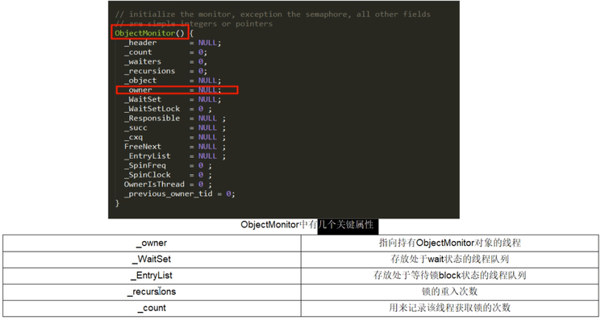
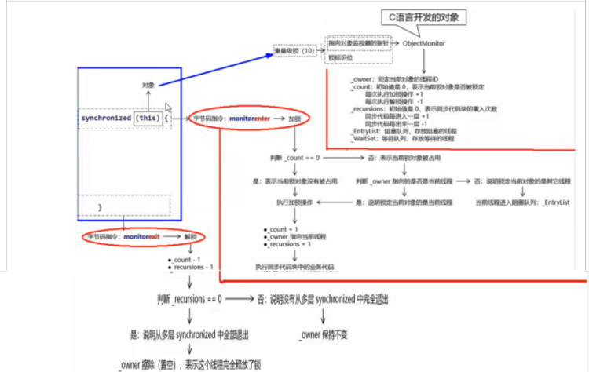
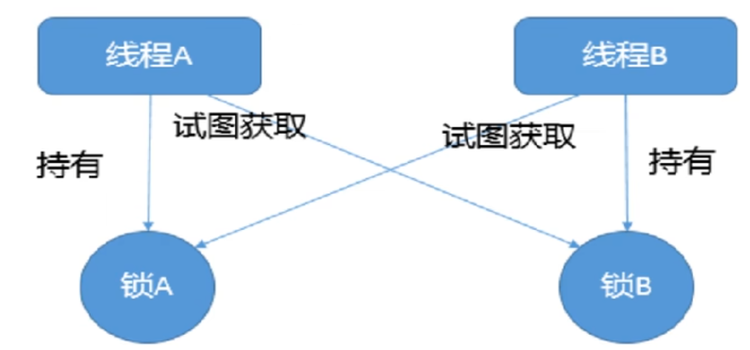
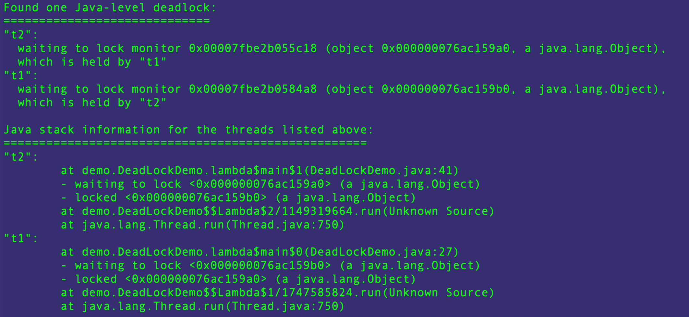

# 3 说说Java"锁"事

## 3.1 乐观锁和悲观锁

- 悲观锁：认为自己在使用数据的时候<font color='red'>一定有别的线程来修改数据</font>，因此在获取数据的时候会先加锁，确保数据不会被别的线程修改，synchronized和Lock的实现类都是悲观锁，<font color='red'>适合写操作多的场景</font>，先加锁可以保证写操作时数据正确，显示的锁定之后再操作同步资源——狼性锁
- 乐观锁：认为自己在使用数据的时候<font color='red'>不会有别的线程修改数据或资源</font>，不会添加锁，Java中使用<font color='blue'>无锁编程</font>来实现，只是在更新的时候去判断，之前没有别的线程更新了这个数据，如果这个数据没有被更新，当前线程将自己修改的数据成功写入，如果数据已经被其他线程更新，则根据不同的实现方式执行不同的操作，比如：放弃修改、重试抢锁等等。判断规则有：版本号机制Version，<font color='red'>最常用的是采用CAS算法，Java原子类中的递增操作就通过CAS自旋实现的。——适合读操作多的场景</font>，不加锁的特性能够使其读操作的性能大幅提升，乐观锁则直接去操作同步资源，是一种无锁算法，得之我幸不得我命---佛系锁

## 3.2 演示锁运行案例

通过8种情况演示锁运行案例，看看锁到底是什么 

### 3.2.1 锁相关的8种案例演示

```java
class Phone {
    public synchronized void sendEmail() {
        try {
            TimeUnit.SECONDS.sleep(3);
        } catch (InterruptedException e) {
            e.printStackTrace();
        }
        System.out.println("------sendEmail");
    }

    public synchronized void sendSMS() {
        System.out.println("------sendSMS");
    }

    public void hello() {
        System.out.println("------hello");
    }
}

/**
 * 现象描述：
 * 1 标准访问ab两个线程，请问先打印邮件还是短信？ --------先邮件，后短信  共用一个对象锁
 * 2. sendEmail钟加入暂停3秒钟，请问先打印邮件还是短信？---------先邮件，后短信  共用一个对象锁
 * 3. 添加一个普通的hello方法，请问先打印普通方法还是邮件？ --------先hello，再邮件
 * 4. 有两部手机，请问先打印邮件还是短信？ ----先短信后邮件  资源没有争抢，不是同一个对象锁
 * 5. 有两个静态同步方法，一步手机， 请问先打印邮件还是短信？---------先邮件后短信  共用一个类锁
 * 6. 有两个静态同步方法，两部手机， 请问先打印邮件还是短信？ ----------先邮件后短信 共用一个类锁
 * 7. 有一个静态同步方法 一个普通同步方法，请问先打印邮件还是短信？ ---------先短信后邮件   一个用类锁一个用对象锁
 * 8. 有一个静态同步方法，一个普通同步方法，两部手机，请问先打印邮件还是短信？ -------先短信后邮件 一个类锁一个对象锁
 */

public class Lock8Demo {
    public static void main(String[] args) {
        Phone phone = new Phone();
        new Thread(() -> {
            phone.sendEmail();
        }, "a").start();

        try {
            TimeUnit.MILLISECONDS.sleep(200);
        } catch (InterruptedException e) {
            e.printStackTrace();
        }

        new Thread(() -> {
            phone.sendSMS();
        }, "b").start();
    }

}
```

结论：

- 对于普通同步方法，锁的是当前实例对象，通常指this，所有的同步方法用的都是同一把锁--->实例对象本身
- 对于静态同步方法，锁的时当前类的Class对象
- 对于同步方法块，锁的时synchronized括号内的对象

### 3.2.2 synchronized有三种应用方式

- 作用于<font color='blue'>实例方法</font>，当前实例加锁，进入同步代码块前要获得当前实例的锁；
- 作用于<font color='blue'>代码块</font>，对括号里配置的对象加锁
- 作用于<font color='blue'>静态方法</font>，当前类加锁，进去同步代码前要获得当前类对象的锁

### 3.2.3 从字节码角度分析synchronized实现

- javap -c(v附加信息) ***.class 文件反编译

- synchronized同步代码块

  - 实现使用的是monitorenter和monitorexit指令

  

- synchronized普通同步方法

  - 调用指令将会检查方法的ACC_SYNCHRONIZED访问标志是否被设置，如果设置了，执行线程会将现持有monitor锁，然后再执行该方法，最后在方法完成（无论是否正常结束）时释放monitor

  

- synchronized静态同步方法

  - ACC_STATIC、ACC_SYNCHRONIZED访问标志区分该方法是否是静态同步方法

  

###  3.2.4 反编译synchronized锁的是什么

面试题：为什么任何一个对象都可以成为一个锁？

C++源码：ObjectMonitor.java--->ObjectMonitor.cpp--->ObjectMonitor.hpp

​		每个对象天生都带着一个对象监视器，每一个被锁住的对象都会和Monitor关联起来

总结：指针指向Monitor对象（也被称为管程或监视器）的真实地址。每个对象都存在着一个monitor与之关联，当一个monitor被某个线程持有后，它便处于锁定状态。在Java虚拟机（HotSpot）中，monitor是由OnjectMonitor实现的，其主要的数据结构如下（位于HotSpot虚拟机源码ObjectMonitor.hpp文件，C++实现）：





### 3.2.5 对于Synchronized关键字

后面章节详说

## 3.3 公平锁和非公平锁

### 3.3.1 何为公平锁/非公平锁

- 公平锁：是指多个线程按照申请锁的顺序来获取锁，这里类似于排队买票，先来的人先买，后来的人在队尾排队，这是公平的----- Lock lock = new ReentrantLock(true)---表示公平锁，先来先得。
- 非公平锁：是指多个线程获取锁的顺序并不是按照申请的顺序，有可能后申请的线程比现申请的线程优先获取锁，在高并发环境下，有可能造成优先级反转或者饥饿的状态（某个线程一直得不到锁）---- Lock lock = new  ReentrantLock(false)---表示非公平锁，后来的也可能先获得锁，<font color='red'>默认为非公平锁</font>。

面试题：

- <font color='red'>为什么会有公平锁/非公平锁的设计？</font>为什么默认非公平？
  - 恢复挂起的线程到真正锁的获取还是有时间差的，从开发人员来看这个时间微乎其微，但从CPU的角度来看，这个时间差存在的还是很明显的。<font color='red'>所以非公平锁能更充分地利用CPU的时间片，尽量减少CPU空闲状态时间</font>。
  - 使用多线程很重要的考量点是线程<font color='blue'>切换的开销</font>，当采用非公平锁时，<font color='red'>当一个线程请求锁获取同步状态，然后释放同步状态，所以刚释放锁的线程在此刻再次获取同步状态的概率就变得很大，所以就减少了线程的开销</font>
- 什么时候用公平？什么时候用非公平？
  - 如果<font color='red'>为了更高的吞吐量</font>，很显然非公平锁是比较合适的，因为节省了很多线程切换的时间，吞吐量自然就上去了；否则就用公平锁，大家公平使用。

### 3.3.2 预埋伏AQS

后续深入分析

## 3.4 可重入锁（递归锁）

### 3.4.1 概念说明

是指<font color='blue'>同一线程</font>在外层方法获取到锁的时候，在进入该线程的内层方法会<font color='blue'>自动获取锁</font>（前提：锁对象的是同一个对象），不会因为之前已经获取过还没释放而阻塞---------优点之一就是可一定程度避免死锁。

### 3.4.3 可重入锁种类

- 隐式锁（即synchronized关键字使用的锁），默认是可重入锁
  - 在一个synchronized修饰的方法或者代码块的内部调用本类的其他synchronized3修饰的方法或者代码块时，<font color='red'>是永远可以得到锁</font>。
- 显式锁（即Lock）也有ReentrantLock这样的可重入锁

```java
public class ReEntryLockDemo {

    public static void main(String[] args) {
        final Object o = new Object();
        new Thread(() -> {
            synchronized (o) {
                System.out.println("---------------外层调用");
                synchronized (o) {
                    System.out.println("---------------中层调用");
                    synchronized (o) {
                        System.out.println("---------------内层调用");
                    }
                }
            }
        }, "t1").start();
        Lock lock = new ReentrantLock();
        new Thread(() -> {
            lock.lock();
            try {
                System.out.println("---------------外层调用");
                lock.lock();
                try {
                    System.out.println("---------------中层调用");
                    lock.lock();
                    try {
                        System.out.println("---------------内层调用");
                    } finally {
                        lock.unlock();
                    }
                } finally {
                    lock.unlock();
                }
            } finally {
                lock.unlock();
            }
        }, "t2").start();
    }
}
```

## 3.5 死锁及排查

### 3.5.1 概念

死锁是指两个或两个以上的线程在执行过程中，因抢夺资源而造成的一种<font color='red'>互相等待</font>的现象，若无外力干涉，则它们无法再继续推进下去。

产生原因：

- 系统资源不足

- 进程运行推进顺序不合适

- 系统资源分配不当

  

### 3.5.2 死锁代码case

```java
public class DeadLockDemo {

    static Object a = new Object();
    static Object b = new Object();

    public static void main(String[] args) {
        new Thread(() -> {
            synchronized (a) {
                System.out.println("t1线程持有a锁，试图获取b锁");
                try {
                    TimeUnit.SECONDS.sleep(1);
                } catch (InterruptedException e) {
                    e.printStackTrace();
                }
                synchronized (b) {
                    System.out.println("t1线程获取到b锁");
                }
            }
        }, "t1").start();

        new Thread(() -> {
            synchronized (b) {
                System.out.println("t2线程持有a锁，试图获取a锁");
                try {
                    TimeUnit.SECONDS.sleep(1);
                } catch (InterruptedException e) {
                    e.printStackTrace();
                }
                synchronized (a) {
                    System.out.println("t2线程获取到a锁");
                }
            }
        }, "t2").start();
    }
}
```

### 3.5.3 如何排查死锁

- 纯命令
  - jps -l
  - jstack 进程编号



- 图形化
  - jconsole


## 3.6 写锁（独占锁）/读锁（共享锁）

深度源码分析见后面

## 3.7 自旋锁spinLock

深度源码分析见后面

## 3.8 无锁->独占锁->读写锁->邮戳锁

深度源码分析见后面

## 3.9 无锁->偏向锁->轻量锁->重量锁

深度源码分析见后面