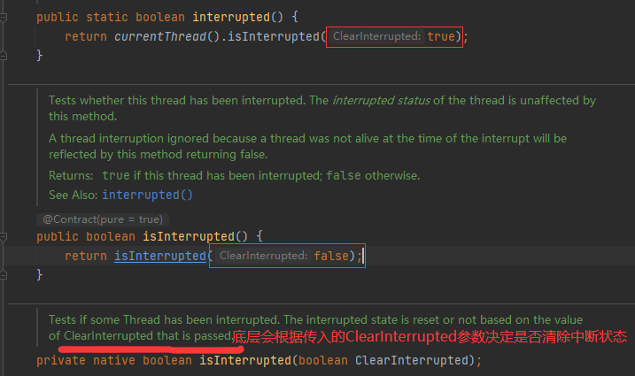

# 4.LockSupport与线程中断

## 4.1 线程中断机制

### 4.1.1 从阿里蚂蚁金服面试题讲起

Java.lang.Thread下的三个方法:


- 如何<font color='red'>中断</font>一个运行中的线程？
- 如何<font color='red'>停止</font>一个运行中的线程？

### 4.1.2 什么是中断机制

- 首先，一个 线程不应该由其他线程来强制中断或停止，而是应该由<font color='red'>线程自己自行停止</font>，自己来决定自己的命运，所以，Thread.stop,Thread.suspend,Thread.resume都已经被废弃了
- 其次，在Java中没有办法立即停止一条线程，然而停止线程却显得尤为重要，如取消一个耗时操作。因此，Java提供了一种用于停止线程的<font color='red'>协商</font>机制——中断，也即中断标识协商机制
  - <font color='red'>中断只是一种协作协商机制，Java没有给中断增加任何语法，中断的过程完全需要程序员自行实现</font>。若要中断一个线程，你需要手动调用该线程的interrupt方法，该方法<font color='red'>也仅仅是将该线程对象的中断标识设置为true</font>，接着你需要自己写代码不断检测当前线程的标识位，如果为true，表示别的线程请求这条线程中断，此时究竟应该做什么需要你自己写代码实现。
  - 每个线程对象都有一个中断标识位，用于表示线程是否被中断；该标识位为true表示中断，为false表示未中断；通过线程对象的interrupt方法将该线程的标识位设置为true；可以在别的线程中调用，也可以在自己的线程中调用。

### 4.1.3 中断的相关API方法之三大方法说明

- public void interrupt()
  - 实例方法 Just to set the interrupt flag
  - 实例方法仅仅是设置线程的中断状态为true，发起一个协商而不会立刻停止线程
- public static boolean interrupted()
  - 静态方法 Thread.interrupt();
  - 判断现场是否被中断并清楚当前中断状态（<font color='red'>做了两件事情</font>）
    - 1、返回当前线程的中断状态，测试当前线程是否已被中断
    - 2、将当前线程的中断状态清零并重新设置为false，清楚线程的中断状态
    - 这个方法有点不好理解在于如果连续两次调用此方法，则第二次返回false，因此连续调用两次的结果可能不一样
- public boolean isInterrupted()
  - 实例方法
  - 判断当前线程是否被中断（通过检查中断标志位）

### 4.1.4 大厂面试题中断机制考点

- 如何停止中断运行中的线程？

- - 通过一个volatile变量实现

    ```java
    /**
     * Copyright (C), 2017-2023, Maktub
     * Author: maktub
     * Date: 2023/4/26 10:50
     * FileName: InterruptDemo
     * Description: 使用volatile修饰一个标识符来决定是否结束线程
     */
    public class InterruptDemo {
    
        static volatile boolean isStop = false; // volatile表示的变量具有可见性
    
        public static void main(String[] args) {
            new Thread(() -> {
                while (true) {
                    if (isStop) {
                        System.out.println(Thread.currentThread().getName() + " isStop的值被改为true，t1程序停止");
                        break;
                    }
                    System.out.println("-----------hello volatile");
                }
            }, "t1").start();
            try {
                TimeUnit.MILLISECONDS.sleep(10);
            } catch (InterruptedException e) {
                e.printStackTrace();
            }
    
            new Thread(() -> isStop = true, "t2").start();
        }
    }
    ```

  - 通过AutomicBoolean

    ```java
    public class InterruptDemo {
    
        static AtomicBoolean atomicBoolean = new AtomicBoolean(false);
    
        public static void main(String[] args) {
            new Thread(() -> {
                while (true) {
                    if (atomicBoolean.get()) {
                        System.out.println(Thread.currentThread().getName() + " isStop的值被改为true，t1程序停止");
                        break;
                    }
                    System.out.println("-----------hello volatile");
                }
            }, "t1").start();
            try {
                TimeUnit.MILLISECONDS.sleep(10);
            } catch (InterruptedException e) {
                e.printStackTrace();
            }
    
            new Thread(() -> {
                atomicBoolean.set(true);
            }, "t2").start();
        }
    }
    ```

  - 通过Thread类自带的中断API实例方法实现----在需要中断的线程中<font color='red'>不断监听中断状态</font>，一旦发生中断，就执行相应的中断处理业务逻辑stop线程。

    ```java
    public class InterruptDemo {
    
    
        public static void main(String[] args) {
                Thread t1 = new Thread(() -> {
                    while (true) {
                        if (Thread.currentThread().isInterrupted()) {
                            System.out.println(Thread.currentThread().getName() + " isInterrupted()的值被改为true，t1程序停止");
                            break;
                        }
                        System.out.println("-----------hello isInterrupted()");
                    }
                }, "t1");
                t1.start();
            try {
                TimeUnit.MILLISECONDS.sleep(10);
            } catch (InterruptedException e) {
                e.printStackTrace();
            }
    
            //t2向t1放出协商，将t1中的中断标识位设为true，希望t1停下来
            new Thread(t1::interrupt, "t2").start();
    
            //当然，也可以t1自行设置
            t1.interrupt();
        }
    }
    ```

- 当前线程的中断标识为true，是不是线程就立刻停止？

  答案是不立刻停止，具体来说，当对一个线程，调用interrupt时

  - 如果现场处于<font color='red'>正常活动状态</font>，那么会将该线程的中断的标志设置为true，<font color='red'>仅此而已，被设置中断标志的线程将继续正常运行，不受影响</font>，所以Interrupt()并不能真正的中断线程，需要被调用的线程自己进行配合才行，对于不活动的线程没有任何影响。

  ```java
  public class InterruptDemo2 {
      public static void main(String[] args) {
          // 实例方法interrupt()仅仅是设置线程的中断状态位为true，不会停止线程
          Thread t1 = new Thread(() -> {
              for (int i = 1; i <= 300; i++) {
                  System.out.println("------: " + i);
              }
              System.out.println("t1线程调用interrupt()后的中断标志位02：" + Thread.currentThread().isInterrupted());
          }, "t1");
          t1.start();
          System.out.println("t1线程默认的中断标志位：" + t1.isInterrupted()); // false
  
          try {
              TimeUnit.MILLISECONDS.sleep(2);
          } catch (InterruptedException e) {
              e.printStackTrace();
          }
          t1.interrupt();
          System.out.println("t1线程调用interrupt()后的中断标志位01：" + t1.isInterrupted()); // true
  
          try {
              TimeUnit.MILLISECONDS.sleep(2000);
          } catch (InterruptedException e) {
              e.printStackTrace();
          }
          //2000毫秒后，t1线程已经不活动了，不会产生任何影响
          System.out.println("t1线程调用interrupt()后的中断标志位03：" + t1.isInterrupted()); // false
      }
  }
  ```

  - 如果线程处于阻塞状态（例如sleep，wait，join状态），在别的线程中调用当前线程对象的Interrupt方法，那么线程将<font color='red'>立即退出被阻塞状态（interrupt状态也将被清除）</font>，并抛出一个InterruptedException异常。

  ```java
  public class InterruptDemo3 {
      public static void main(String[] args) {
          Thread t1 = new Thread(() -> {
              while (true) {
                  if (Thread.currentThread().isInterrupted()) {
                      System.out.println(Thread.currentThread().getName() + " 中断标志位为：" + true + " 程序停止");
                      break;
                  }
                  // sleep方法抛出InterruptedException后，中断标识也被清空置为false，如果没有在
                  // catch方法中调用interrupt方法再次将中断标识置为true，这将导致无限循环了
                  try {
                      Thread.sleep(200);
                  } catch (InterruptedException e) {
                      Thread.currentThread().interrupt();
                      e.printStackTrace();
                  }
                  System.out.println("-------------hello InterruptDemo3");
  
              }
          }, "t1");
          t1.start();
  
          try {
              TimeUnit.SECONDS.sleep(1);
          } catch (InterruptedException e) {
              e.printStackTrace();
          }
  
          new Thread(t1::interrupt, "t2").start();
      }
  }
  ```

  对于第二种情况的源码分析如下；


<font color='red'>总之，需要记住的是中断只是一种协商机制，修改中断标识位仅此而已，不是立刻stop打断</font>

- 静态方法Thread.interrupted()，谈谈你的理解


对于静态方法Thread.interrupted()和实例方法isInterrupted()区别在于:

- 静态方法interrupted将会清除中断状态（传入的参数ClearInterrupted为true）
- 实例方法isInterrupted则不会（传入的参数ClearInterrupted为false）



### 4.1.5 总结

- public void interrupt() <font color='red'>是一个实例方法</font>，它通知目标线程中断，也仅仅是设置目标线程的中断标志位为true
- public boolean isInterrupted() <font color='red'>是一个实例方法</font>，它判断当前线程是否被中断（通过检查中断标志位）并获取中断标志
- public static boolean interrupted() <font color='red'>是一个静态方法</font>，返回当前线程的中断真实状态（boolean类型）后会将当前线程的中断状态设为false，此方法调用之后会清楚当前线程的中断标志位的状态（将中断标志置为false了），返回当前值并清零置为false。

## 4.2 LockSupport是什么

LockSupport是用来创建锁和其他同步类的基本线程阻塞原语，其中park()和unpark()的作用分别是阻塞线程和解除阻塞线程。

## 4.3 线程等待唤醒机制

### 4.3.1 三种让线程等待和唤醒方法

- 方式一：使用Object中的wait()让线程等待，使用Object中的notify()方法唤醒线程
- 方式二：使用JUC包中的Condition的await()让线程等待，使用signal()方法唤醒线程
- 方式三：LockSupport类可以阻塞当前线程以及唤醒指定被阻塞的线程

### 4.3.2 Object类中的wait和notify方法实现线程等待和唤醒

- wait和notify方法必须要在同步代码块或者方法里面，且成对出现使用
- 先wait再notify才ok

```java
public class LockSupportDemo {

    public static void main(String[] args) {
        Object objectLock = new Object();
        /**
         * t1	 -----------come in
         * t2	 -----------发出通知
         * t1	 -------被唤醒
         */
        new Thread(() -> {
            synchronized (objectLock) {
                System.out.println(Thread.currentThread().getName() + "\t -----------come in");
                try {
                    objectLock.wait();
                } catch (InterruptedException e) {
                    e.printStackTrace();
                }
                System.out.println(Thread.currentThread().getName() + "\t -------被唤醒");
            }
        }, "t1").start();

        try {
            TimeUnit.SECONDS.sleep(1);
        } catch (InterruptedException e) {
            e.printStackTrace();
        }

        new Thread(() -> {
            synchronized (objectLock) {
                objectLock.notify();
                System.out.println(Thread.currentThread().getName() + "\t -----------发出通知");
            }

        }, "t2").start();
    }
}
```

### 4.3.3 Condition接口中的await和signal方法实现线程的等待和唤醒

- Condition中的线程等待和唤醒方法，需要先获取锁
- 一定要先await后signal，不要反了

```java
public class LockSupportDemo {

    public static void main(String[] args) {
        Lock lock = new ReentrantLock();
        Condition condition = lock.newCondition();
        /**
         * t1	 -----------come in
         * t2	 -----------发出通知
         * t1	 -----------被唤醒
         */
        new Thread(() -> {
            lock.lock();
            try {
                System.out.println(Thread.currentThread().getName() + "\t -----------come in");
                condition.await();
                System.out.println(Thread.currentThread().getName() + "\t -----------被唤醒");
            } catch (InterruptedException e) {
                e.printStackTrace();
            } finally {
                lock.unlock();
            }
        }, "t1").start();

        try {
            TimeUnit.SECONDS.sleep(1);
        } catch (InterruptedException e) {
            e.printStackTrace();
        }

        new Thread(() -> {
            lock.lock();
            try {
                condition.signal();
                System.out.println(Thread.currentThread().getName() + "\t -----------发出通知");
            } finally {
                lock.unlock();
            }
        }, "t2").start();

    }
}
```

### 4.3.4 上述两个对象Object和Condition使用的限制条件

- 线程需要先获得并持有锁，必须在锁块（synchronized或lock）中
- 必须要先等待后唤醒，线程才能够被唤醒

### 4.3.5 LockSupport类中的park等待和unpark唤醒

- 是什么
  - LockSupport是用于创建锁和其他同步类的基本线程阻塞原语
  - LockSupport使用了一种名为Permit（许可）的概念来做到<font color='red'>阻塞和唤醒线程的功能</font>，每一个线程都有一个许可（Permit），<font color='red'>许可证只能有一个，累加上限是1</font>。
- 主要方法
  - 阻塞：Permit许可证默认没有不能放行，所以一开始调用park()方法当前线程会阻塞，直到别的线程给当前线程发放permit，park方法才会被唤醒。
    - <font color='red'>park/park(Object blocker)-------阻塞当前线程/阻塞传入的具体线程</font>
  - 唤醒：调用unpark(thread)方法后，就会将Thread线程的许可证permit发放，会自动唤醒park线程，即之前阻塞中的LockSupport.park()方法会立即返回。
    - <font color='red'>unpark(Thread thread)------唤醒处于阻塞状态的指定线程</font>
- 代码

```java
public class LockSupportDemo {

    public static void main(String[] args) {
        Thread t1 = new Thread(() -> {
            System.out.println(Thread.currentThread().getName() + "\t -----------come in");
            LockSupport.park();
            try {
                TimeUnit.SECONDS.sleep(3);
            } catch (InterruptedException e) {
                e.printStackTrace();
            }
            System.out.println(Thread.currentThread().getName() + "\t ----------被唤醒");
        }, "t1");
        t1.start();

        new Thread(() -> {
            LockSupport.unpark(t1);
            System.out.println(Thread.currentThread().getName() + "\t ----------发出通知");
        }, "t2").start();
    }
}
```

- <font color='red'>重点说明（重要）</font>
  - <font color='red'>LockSupport是用来创建锁和其他同步类的基本线程阻塞原语</font>，所有的方法都是静态方法，可以让线程在任意位置阻塞，阻塞后也有对应的唤醒方法。归根结底，LockSupport时调用Unsafe中的native代码
  - <font color='red'>LockSupport提供park()和unpark()方法实现阻塞线程和解除线程阻塞的过程</font>，LockSupport和每个使用它的线程都有一个许可（permit）关联，每个线程都有一个相关的permit，<font color='red'>permit最多只有一个，重复调用unpark也不会积累凭证</font>。
  - 形象理解：线程阻塞需要消耗凭证（Permit），这个凭证最多只有一个
    - 当调用park时，如果有凭证，则会直接消耗掉这个凭证然后正常退出。如果没有凭证，则必须阻塞等待凭证可用；
    - 当调用unpark时，它会增加一个凭证，但凭证最多只能有1各，累加无效。
- 面试题
  - 为什么LockSupport可以突破wait/notify的原有调用顺序？
    - 因为unpark获得了一个凭证，之后再调用park方法，就可以名正言顺的凭证消费，故不会阻塞，先发放了凭证后续可以畅通无阻。
  - 为什么唤醒两次后阻塞两次，但最终结果还会阻塞线程？
    - 因为凭证的数量最多为1，连续调用两次unpark和调用一次unpark效果一样，只会增加一个凭证，而调用两次park却需要消费两个凭证，证不够，不能放行。
    - - 

    - - 
  - - 

  - - 


