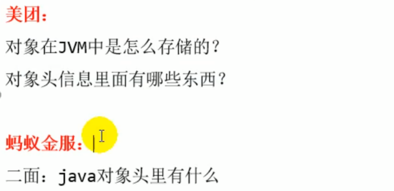
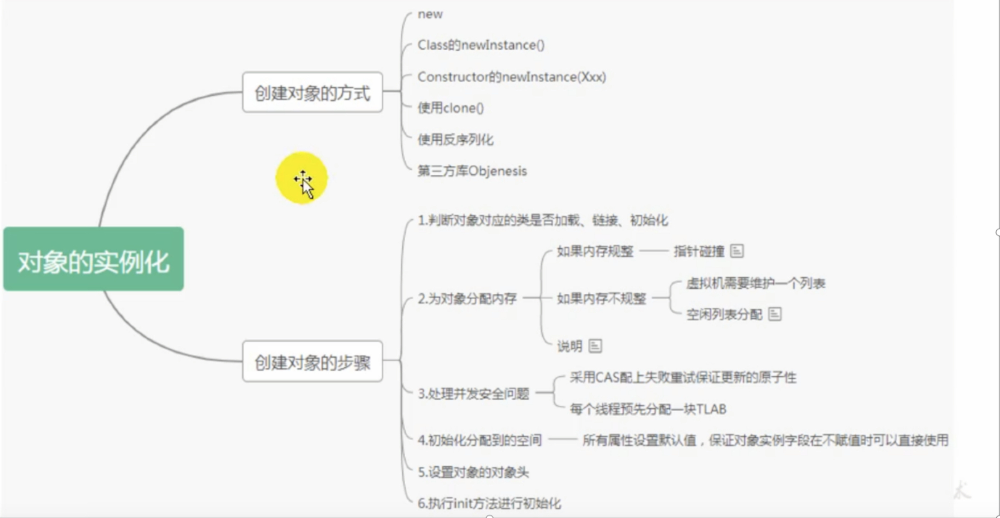
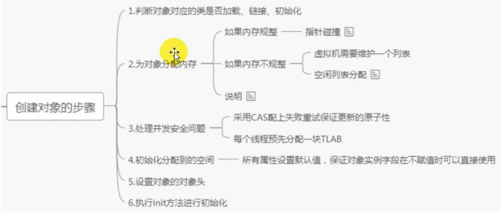
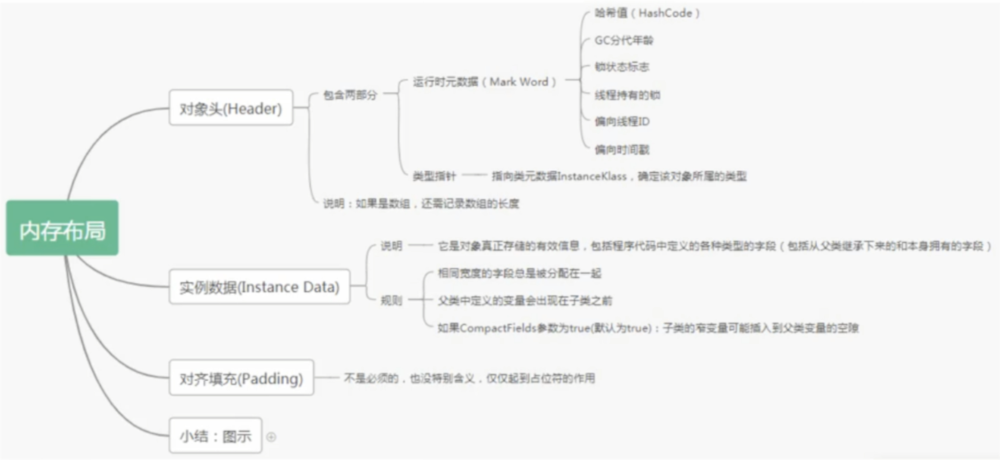
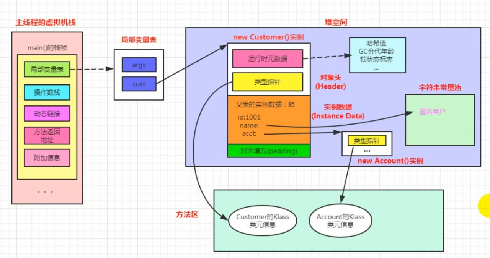
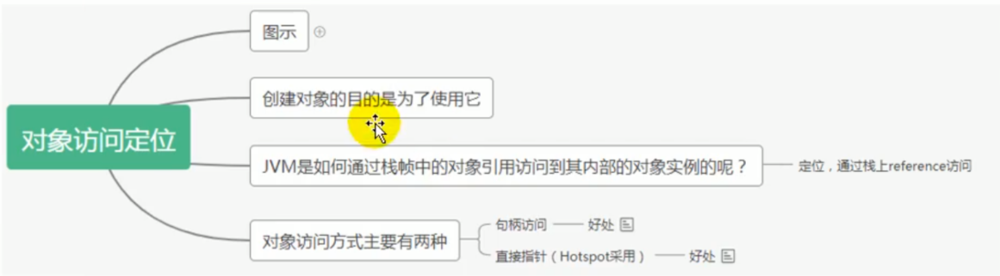
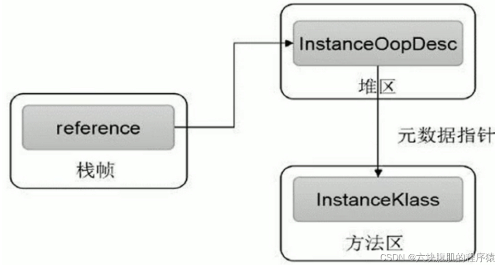
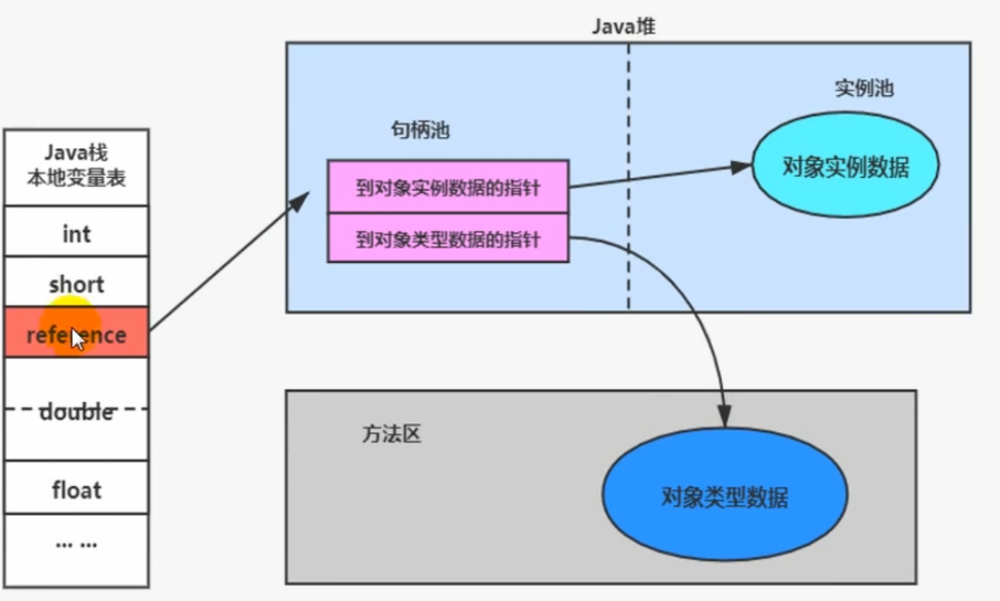
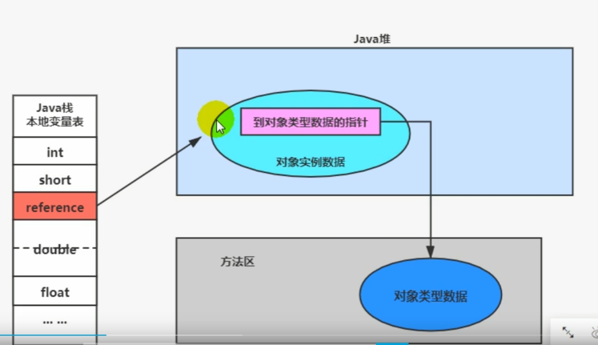

# 对象的实例化、内存布局与访问定位

## 1-对象的实例化

### 大厂面试题

### 对象实例化

### 对象创建方式

- new：最常见的方式、单例类中调用getInstance的静态类方法，XXXFactory的静态方法
- Class的newInstance方法：在JDK9里面被标记为过时的方法，因为只能调用空参构造器
- Constructor的newInstance(XXX)：反射的方式，可以调用空参的，或者带参的构造器
- 使用clone()：不调用任何的构造器，要求当前的类需要实现Cloneable接口中的clone接口
- 使用序列化：序列化一般用于Socket的网络传输
- 第三方库 Objenesis

### 创建对象的步骤

前面所述的是从字节码角度看待对象的创建过程，现在从执行步骤的角度来分析：

#### 判断对象对应的类是否加载、链接、初始化

虚拟机遇到一条new指令，首先去检查这个指令的参数是否能够在Metaspace的常量池中定位到一个类的符号引用，并且检查这个符号引用代表的类是否已经被加载，解析和初始化（即判断类元信息是否存在）。如果没有，使用当前类加载器以ClassLoader + 包名 + 类名为key进行查找对应的.class文件，如果没有找到文件，则抛出ClassNotFoundException异常，如果找到，则进行类加载，并生成对应的Class对象。

#### 为对象分配内存

首先计算对象占用空间的大小，接着在堆中划分一块内存给新对象。如果实例成员变量是引用变量，仅分配引用变量空间即可，即4个字节大小。

- 如果内存规整：指针碰撞

  - 如果内存是规整的，那么虚拟机将采用的是指针碰撞法（Bump The Point）来为对象分配内存。
  - **原理** ：用过的内存全部整合到一边，没有用过的内存放在另一边，中间有一个分界指针，只需要向着没用过的内存方向将该指针移动对象内存大小位置即可。
  - 使用该分配方式的 GC 收集器：Serial, ParNew

- 如果内存不规整

  - 虚拟表需要维护一个列表
  - 原理 ：虚拟机会维护一个列表，该列表中会记录哪些内存块是可用的，在分配的时候，找一块足够大的内存块儿来划分给对象实例，最后更新列表记录。
  - 使用该分配方式的 GC 收集器：CMS

- 说明

  选择哪种分配方式由Java堆是否规整所决定，而 Java 堆内存是否规整，取决于 GC 收集器的算法是"标记-清除"，还是"标记-整理"（也称作"标记-压缩"），值得注意的是，复制算法内存也是规整的。

#### 处理并发问题

在创建对象的时候有一个很重要的问题，就是线程安全，因为在实际开发过程中，创建对象是很频繁的事情，作为虚拟机来说，必须要保证线程是安全的，通常来讲，虚拟机采用两种方式来保证线程安全：

- **CAS+失败重试：** CAS 是乐观锁的一种实现方式。所谓乐观锁就是，每次不加锁而是假设没有冲突而去完成某项操作，如果因为冲突失败就重试，直到成功为止。**虚拟机采用 CAS 配上失败重试的方式保证更新操作的原子性**
- **TLAB：** 为每一个线程预先在 Eden 区分配一块儿内存，JVM 在给线程中的对象分配内存时，首先在 TLAB 分配，当对象大于 TLAB 中的剩余内存或 TLAB 的内存已用尽时，再采用上述的 CAS 进行内存分配

>  TLAB(本地线程分配缓冲; 线程私有的分配缓冲区; 堆中可能划分出多个线程私有的分配缓冲区)

#### 初始化分配到的内存

内存分配完成后，虚拟机需要将分配到的内存空间都初始化为零值（不包括对象头），这一步操作保证了对象的实例字段在 Java 代码中可以不赋初始值就直接使用，程序能访问到这些字段的数据类型所对应的零值。

1. 给对象属性赋值的操作
2. 属性的默认初始化
3. 显示初始化
4. 代码块中的初始化
5. 构造器初始化

#### 设置对象的对象头

初始化零值完成之后，**虚拟机要对对象进行必要的设置**，例如这个对象是哪个类的实例、如何才能找到类的元数据信息、对象的哈希码、对象的 GC 分代年龄等信息。 **这些信息存放在对象头中。** 另外，根据虚拟机当前运行状态的不同，如是否启用偏向锁等，对象头会有不同的设置方式。这个过程的具体设置方式取决于JVM实现。

#### 执行init方法进行初始化

在上面工作都完成之后，从虚拟机的视角来看，一个新的对象已经产生了，但从Java程序的视角看来，初始化才正式开始。初始化成员变量，执行实例化代码块，调用类的构造方法，并把堆内对象的首地址赋值给引用变量。

因此一般来说（由字节码中跟随invokespecial指令所决定），new指令之后会接着就是执行方法，把对象按照程序员的意愿进行初始化，这样一个真正可用的对象才算完成创建出来

#### 总结

**对象实例化的过程**：

1. 加载类元信息
2. 为对象分配内存
3. 处理并发问题
4. 属性的默认初始化（零值初始化）
5. 设置对象头信息
6. 属性的显示初始化、代码块中初始化、构造器中初始化

## 2-对象的内存布局

### 对象头

- 对象头包含了两部分，分别是 运行时元数据（Mark Word）和 类型指针
- 如果是数组，还需要记录数组的长度

#### 运行时元数据

- 哈希值（HashCode）
- GC分代年龄
- 锁状态标志
- 线程持有的锁
- 偏向线程ID
- 偏向时间戳

#### 类型指针

指向类元数据InstanceKlass，确定该对象所属的类型。类型指针指向对象的类元数据，虚拟机通过这个指针确定该对象是哪个类的实例。

#### 实例数据

程序代码中所定义的各种类型的字段内容(包含父类继承下来的和子类中定义的)。

#### 对齐填充

不是必然需要，主要是占位，保证对象大小是某个字节的整数倍。

#### 小结

## 3-对象的访问定位

JVM是如何通过栈帧中的对象引用访问到其内部的对象实例呢？

### 对象访问的两种方式

#### 句柄访问

句柄访问就是说，在栈的局部变量表中，记录对象的引用，然后在堆空间中开辟了一块空间，也就是句柄池

优点：reference中存储稳定的句柄地址，对象被移动（垃圾收集时移动对象很普遍）时只需要改变句柄中实例数据指针即可，reference本身不需要被修改。

#### 直接指针（HotSpot采用）

直接指针是局部变量表中的引用，直接指向堆中的实例，在对象实例中有类型指针，指向的是方法区中的对象类型数据

优点：直接指针访问的最大好处是速度快，节省了一次指针定位的时间开销。如果是对象频繁 GC 那么句柄方法好，如果是对象频繁访问则直接指针访问好。