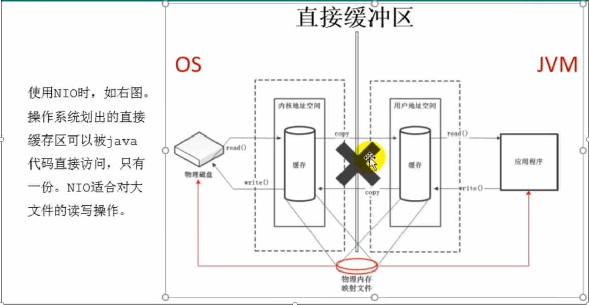
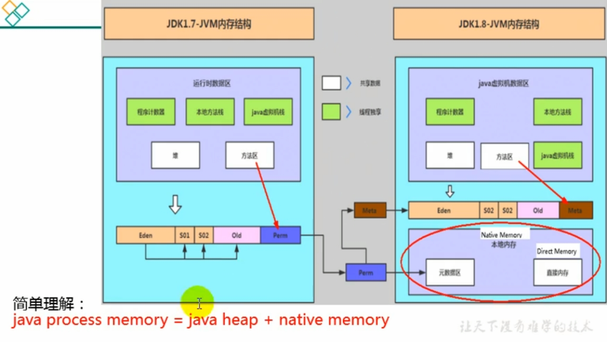

# 直接内存

## 概述

- 不是虚拟机运行时数据区的一部分，也不是《Java虚拟机规范》中定义的内存区域。
- 直接内存是在Java堆外的、直接向系统申请的内存区间。
- 来源于NIO，通过存在堆中的DirectByteBuffer操作Native内存。
- 通常，访问直接内存的速度会优于Java堆。即读写性能高。
  - 因此出于性能考虑，读写频繁的场合可能会考虑使用直接内存。
  - Java的NIO库允许Java程序使用直接内存，用于数据缓冲区。

**存在的问题**

- 也可能导致OutOfMemoryError异常
- 由于直接内存在Java堆外，因此它的大小不会直接受限于-Xmx指定的最大堆大小，但是系统内存是有限的，Java堆和直接内存的总和依然受限于操作系统能给出的最大内存。
- 缺点：
  - 分配回收成本较高
  - 不受JVM内存回收管理

> 直接内存大小可以通过MaxDirectMemorySize设置
>
> 如果不指定，默认与堆的最大值-Xmx参数值一致

