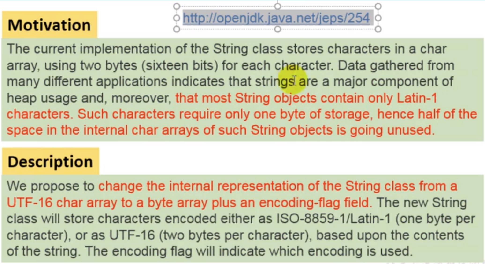
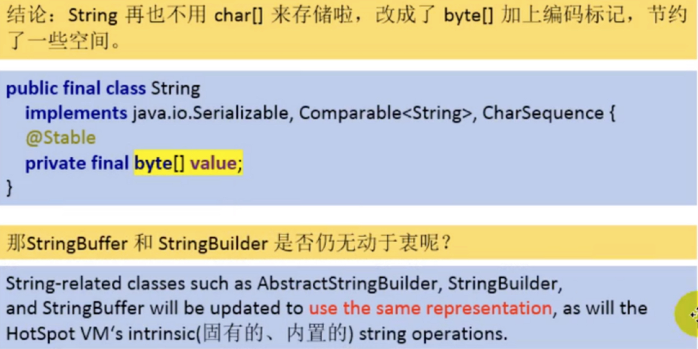
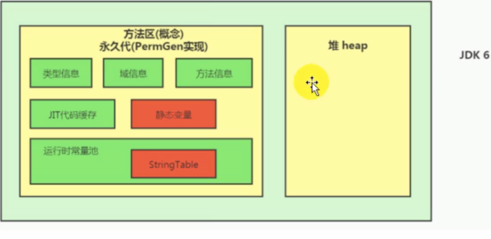
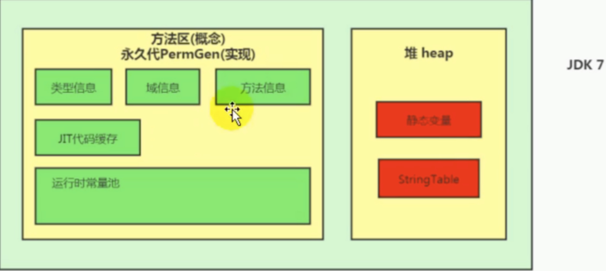
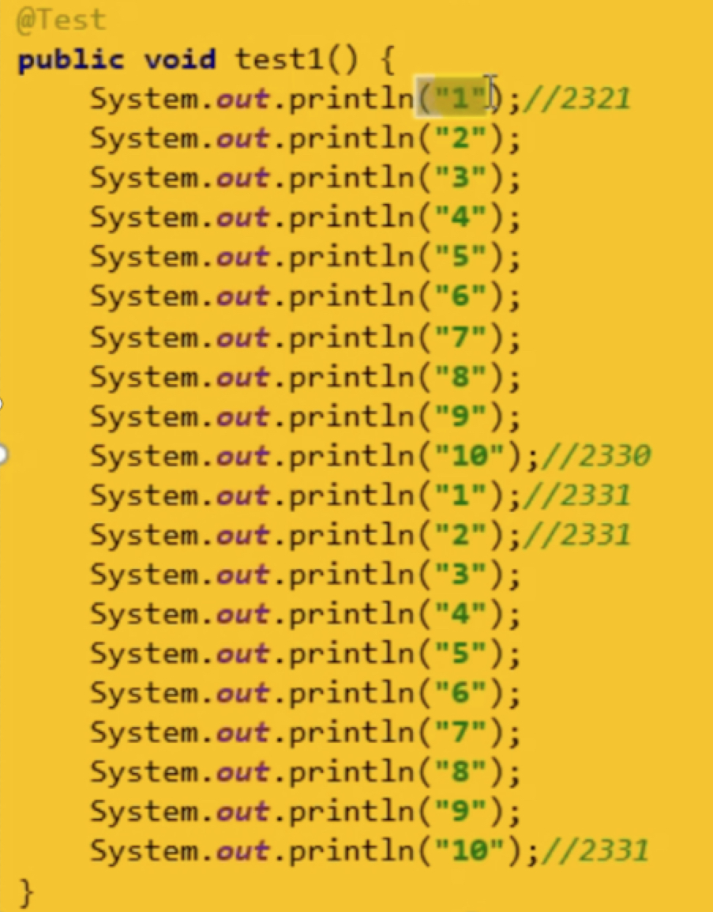
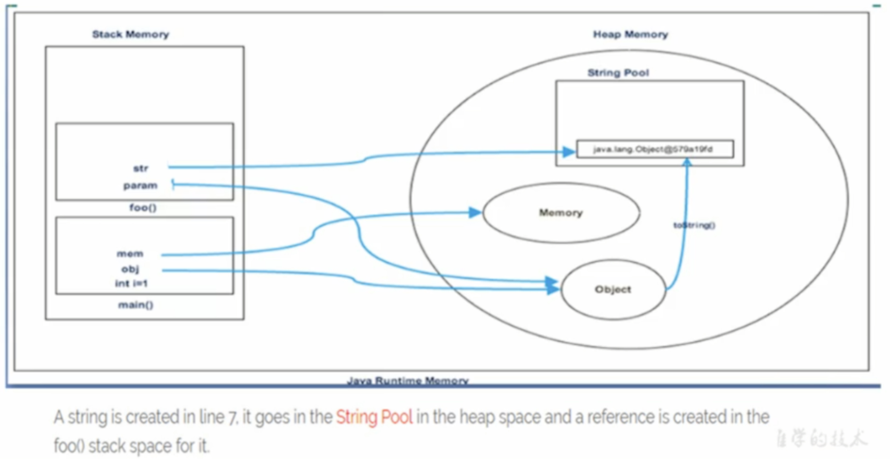
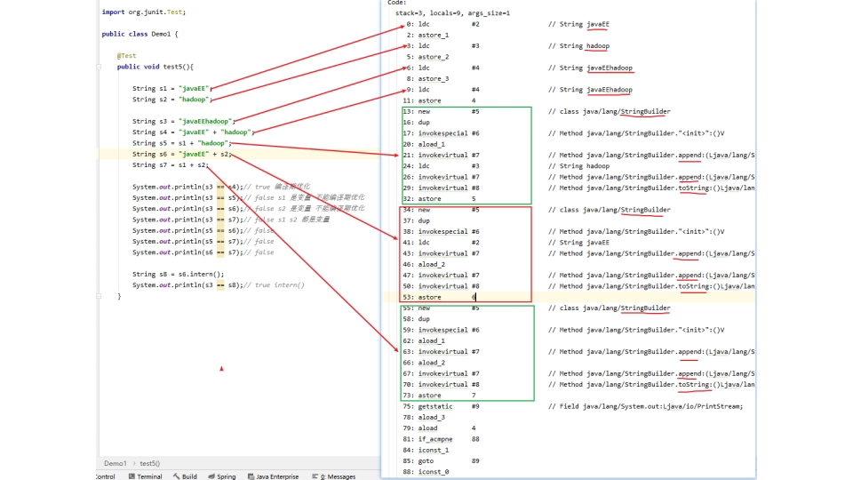
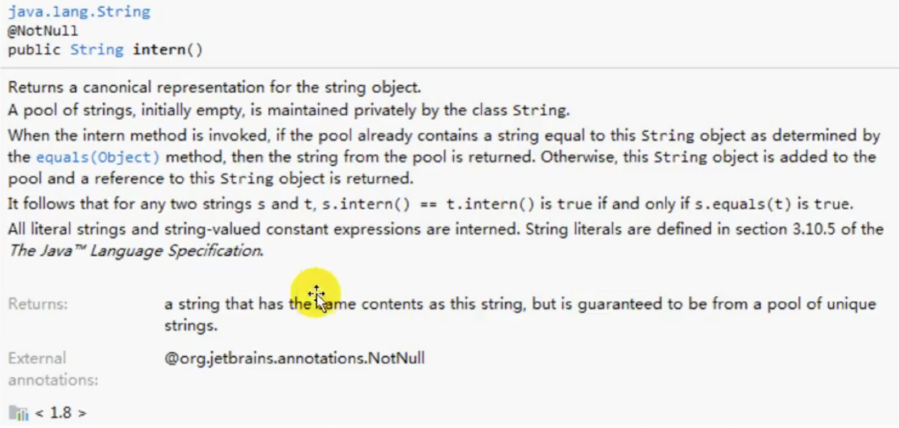
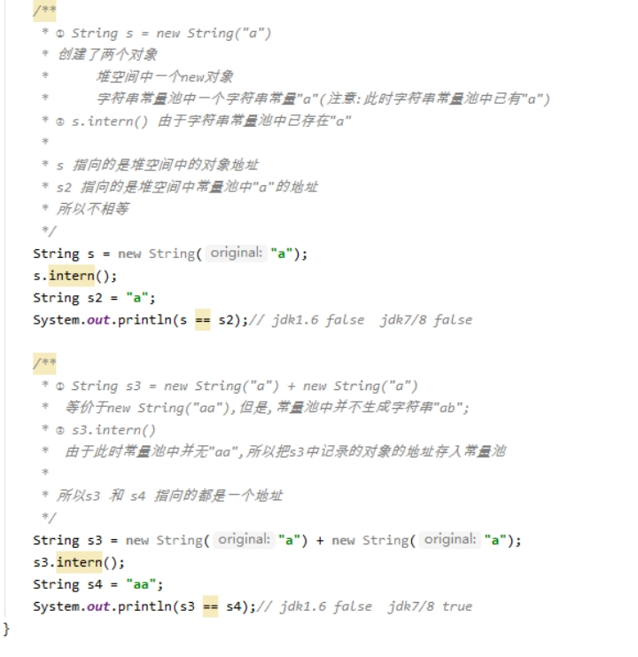

# 第13张 StringTable

## 1-StingTable的基本特性

- String：字符串，使用""引起来表示
- String声明为final，不可被继承
- String实现了Serializable接口：表示字符串是支持序列化的。实现了Comparable接口：表示String可以比较大小。
- String在JDK8及以前内部定义了final char[] value用于存储字符串数据，JDK9时改为byte[]





- String：代表不可变的字符序列。简称：不可变性。
  - 当对字符串重新赋值时，需要重写指定内存区域赋值，不能使用原有的value进行赋值。
  - 当对现有的字符串进行连接操作时，也需要重新指定内存区域赋值，不能使用原有的value进行赋值。
  - 当调用String的replace()方法修改指定字符或字符串时，也需要重新指定内存区域赋值，不能使用原有的value进行赋值。
- 通过字面量的方式(区别于new)给一个字符串赋值，此时的字符串值明在字符串常量池中。
- <font color='red'>字符串常量池中是不会存储相同内容的字符串的</font>。


- String的String Pool是一个固定大小的HashTable，默认值大小长度是1009.如果放进String Pool的String非常多，就会造成Hash冲突严重，从而导致链表会很长，而链表长了后直接会造成的影响就是当调用String.intern时性能会大幅下降。
- 使用<font color='blue'>-XX:StringTableSize</font>可设置StringTable的长度
- 在JDK6中StringTable是固定的，就是<font color='blue'>1009</font>的长度，所以如果常量池中的字符串过多就会导致效率下降很快。StringTableSize设置没有要求。
- 在JDK7中，StringTable的长度默认值是<font color='blue'>60013</font>，StringTableSize设置没有要求。
- JDK8开始，设置stringTable的长度的话，1009是可设置的最小值。

## 2-String的内存分配

- 在Java语言中有8种基本数据类型和一种比较特殊的类型String。这些类型为了使它们在运行过程中速度更快、更节省内存，都提供了一种常量池的概念。
- 常量池就类似一个Java系统级别提供的缓存。8种基本数据类型的常量池都是系统协调的，<font color='red'>String类型的常量池比较特殊。它的主要使用方法有两种。</font>
  - 直接使用双引号声明出来的String对象会直接存储在常量池中。
    - 比如：String info = "baidu.com";
  - 如果不是双引号声明的String对象，可以使用String提供的intern()方法。
- Java 6及以前，字符串常量池存放才永久代、
- Java 7中，Oracle的工程师对字符串池的逻辑做了很大的改变，即：将<font color='red'>字符串常量池的位置调整到Java堆内。</font>
  - 所有的字符串都保存在堆(Heap)中，和其他普通对象一样，这样可以让你在进行调优应用时仅需要调整堆大小就可以了。
  - 字符串常量池概念原本使用得比较多，但是这个改动使得我们有足够的理由让我们重新考虑在Java 7中使用String.intern()。





**StringTable为什么要调整位置**

JDK7将StringTable放到了堆空间中，因为永久代的回收效率很低，在Full GC的时候才会触发，而full gc的触发原因是是老年代空间不足。这样的设定导致StringTable在永久代回收效率不高，而在日常开发中会有大量的字符串被创建，回收效率低导致永久代内存不足。放到堆里，能够及时回收。

## 3-String的基本操作

Java语言规范里要求完全相同的字符串字面量，应该包含同样的Unicode字符序列(包含同一份码点序列的常量)，并且必须是指向同一个string类实例。



```java
public class Memory {

    public static void main(String[] args) {
        int i = 1;
        Object obj = new Object();
        Memory memory = new Memory();
        memory.foo(obj);
    }

    private void foo(Object param) {
        String str = param.toString();
        System.out.println(str);
    }
}
```



## 4-字符串拼接操作

1. 常量与常量的拼接结果在常量池，原理是编译期优化
2. 常量池中不会存在相同内容的常量
3. 只要其中有一个是变量，结果就在堆中。变量拼接的原理是StringBuilder
4. 如果拼接的结果调用intern()方法，则主动将常量池中还没有的字符串对象放入池中，并返回此对象地址。



## 5-intern()的使用



如果不是双引号声明的String对象，可以使用String提供的intern方法：intern方法会从字符串常量池中查询当前字符串是否存在，若不存在就会将当前字符串放入常量池中。

- 比如：String myInfo = new String("baidu.com").intern()；

也就是说，如果在任意字符串上调用String.intern方法，那么其返回结果所指向的那个类实例，必须和直接以常量形式出现的字符串实例完全相同。因此，下列表达式的值必定是true：

("a" + "b" + "c").intern() == "abc"

通俗点讲，Interned string就是确保字符串在内存里只有一份拷贝，这样可以节约内存空间，加快字符串操作任务的执行速度。注意，这个值会被存放在字符串内部池(String Intern Pool)。

