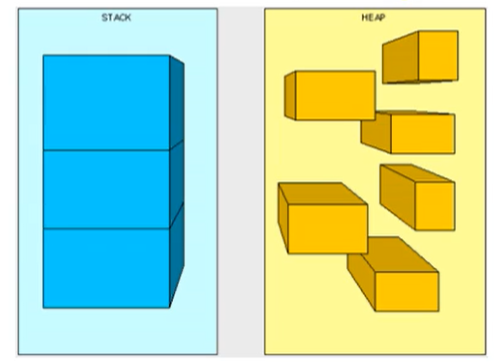
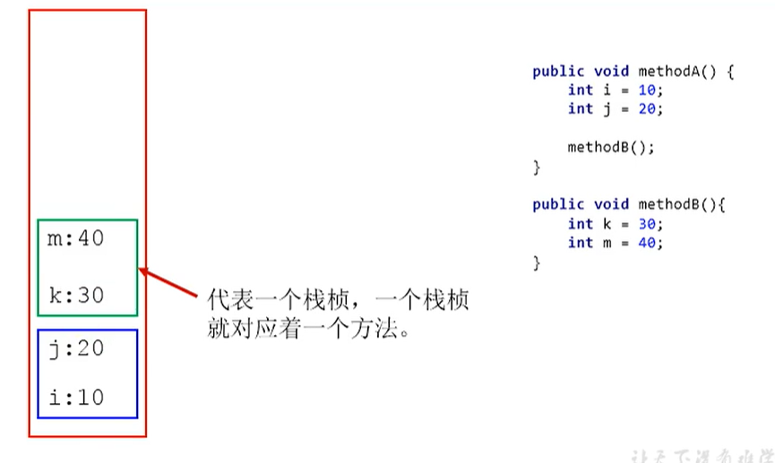
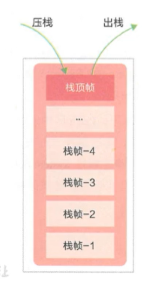
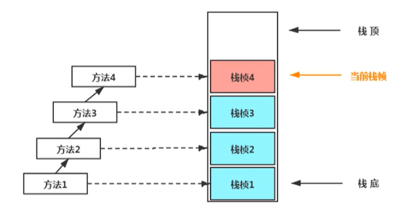
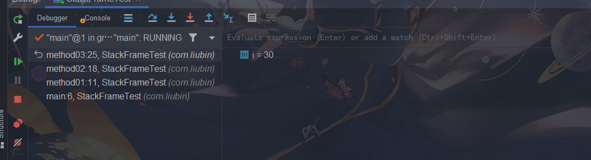
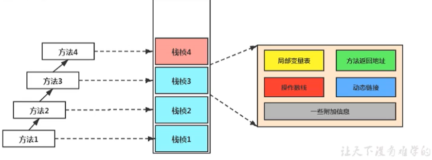
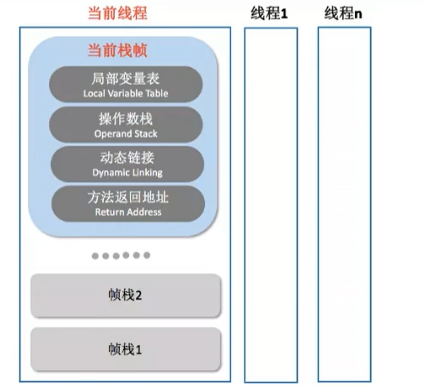
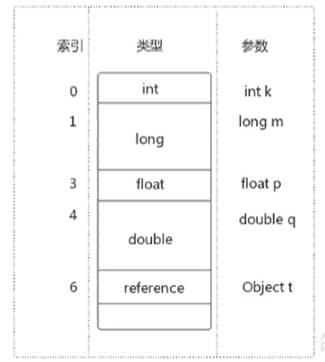
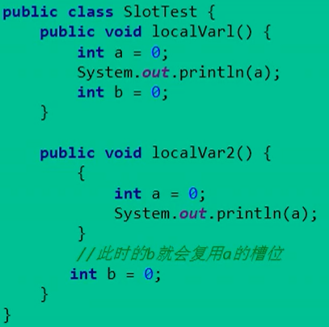
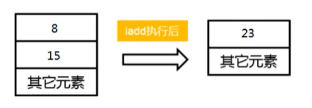

# 虚拟机栈

## 虚拟机栈概述

由于跨平台性的设计，Java的指令都是根据栈来设计的。不同平台的CPU架构不同，所以不能设计为基于寄存器的。

- <font color='red'>优点：跨平台，指令集小，编译器容易实现。</font>
- <font color='red'>缺点：性能下降，实现同样的功能需要更多的指令</font>

有不少Java开发人员一提到Java的内存结构，就会非常粗粒度地将JVM中的内存区理解为仅有Java堆（heap）和Java栈（stack）？为什么？

<font color='red'>首先栈是运行时的单位，而堆是存储的单位</font>

- 栈解决程序的运行问题，即程序如何执行，或着说如何处理数据。
- 堆是解决数据存储的问题，即数据怎么放，放哪里



### Java虚拟机栈是什么

Java虚拟机栈（Java Virtual Machine Stack）,早期也叫Java栈。每个线程在创建时都会创建一个虚拟机栈，其内部保存一个个的栈帧（Stack Frame），对应着一次次的Java方法调用。

> 是线程私有



### 生命周期

生命周期和线程一致，也就是线程结束了，该虚拟机栈也销毁了。

### 作用

主管Java程序的运行，它保存方法的局部变量、部分结果、并参与方法的调用和返回。

> 局部变量：它是相比于成员变量来说（或属性）
>
> 基本数据类型变量 VS  引用类型变量（类、数组、接口）

### 栈的特点

栈是一种快速有效的分配存储方式，访问速度仅次于程序计数器。JVM直接对Java栈的操作只有两个：

- 每个方法执行，伴随着进栈（入栈、压栈）
- 执行结束后的出栈工作

对于栈来说不存在垃圾回收的问题（栈存在溢出的情况）



### 开发中遇到哪些异常？

栈中可能出现的异常：

- <font color='red'>Java虚拟机规范允许Java栈的大小是动态或着固定不变的。</font>
- 如果采用固定大小的Java虚拟机栈，那每一个线程的Java虚拟机栈容量可以在线程创建的时候独立选定。如果线程请求分配的栈容量超过Java虚拟机栈允许的最大容量，Java虚拟机会抛出一个<font color='red'>StackOverFlowError</font>异常
- 如果Java虚拟机栈可以动态扩展，并且在尝试扩展的时候无法申请到足够的内存，或着在创建新的线程时没有足够的内存去创建对应的虚拟机栈，那么虚拟将会抛出一个<font color='red'>OutOfMemoryError</font>异常

```
public class StackErrorTest {
    private static int count = 1;
    public static void main(String[] args) {
        System.out.println(count++);
        main(args);
    }
}
```

当栈深度达到9803的时候，就出现栈内存空间不足

### 设置栈内存大小

我们可以使用参数 -Xss选项来设置线程的最大栈空间，栈的大小直接决定了函数调用的最大可达深度

```
-Xss1m
-Xss1k
```

## 栈的存储单位

### 栈中存储什么？

- 每个线程都有自己的栈，栈中的数据都是以<font color='red'>栈帧（Stack Frame）的格式存在的</font>。

- 在这个线程上 正在执行的每个方法都各自对应一个栈帧（Stack Frame）。

- 栈帧是一个内存区块，是一个数据集，维系着方法执行过程中的各种数据信息。

> OOP的基本概念：类和对象
>
> 类中基本结构：field（属性、字段、域）、method

JVM直接对Java栈的操作只有两个，就是对栈帧的<font color='red'>压栈</font>和<font color='red'>出栈</font>，<font color='orange'>遵循“先进后出”/“后进先出”原则</font>。

在一条活动线程中，一个时间点上，只会有一个活动的栈帧。即只有当前正在执行的方法的栈帧（栈顶栈帧是有效的），这个栈帧被称为<font color='red'>当前栈帧（Current Frame）</font>，与当前栈帧相对应的方法就是<font color='red'>当前方法（Current Method）</font>，定义这个方法的类就是<font color='red'>当前类（Current Class）</font>。

执行引擎运行的所有字节码指令只针对当前栈帧的操作。

如果在该方法中调用了其它方法，对应的新的栈帧会被创建出来，放在栈的顶端，成为新的当前帧。



下面写一个简单的代码

```
public class StackFrameTest {
    public static void main(String[] args) {
        method01();
    }

    private static int method01() {
        System.out.println("方法1的开始");
        int i = method02();
        System.out.println("方法1的结束");
        return i;
    }

    private static int method02() {
        System.out.println("方法2的开始");
        int i = method03();;
        System.out.println("方法2的结束");
        return i;
    }
    private static int method03() {
        System.out.println("方法3的开始");
        int i = 30;
        System.out.println("方法3的结束");
        return i;
    }
}
```

输出结果为

```
方法1的开始
方法2的开始
方法3的开始
方法3的结束
方法2的结束
方法1的结束
```

满足栈先进后出的概念，通过Idea的 DEBUG，能够看到栈信息



### 栈运行原理

不同线程中所包含的栈帧是不允许存在相互引用的，即不可能在一个栈帧中引用另外一个线程的栈帧。

如果当前方法调用了其他方法，方法返回之际，当前栈帧会传回此方法的执行结果给前一个栈帧，接着，虚拟机会丢弃当前栈帧，使得前一个栈帧重新成为当前栈帧。

Java方法有两种返回函数的方式，<font color='red'>一种是正常的函数返回，使用return指令；另一种是抛出异常。不管使用哪种方式，都会导致栈帧被弹出。</font>

### 栈帧的内部结构

每个栈帧中存储着：

- <font color='red'>局部变量表（Local Variables）</font>
- <font color='red'>操作数栈（operand stack）（或着表达式栈）</font>
- 动态链接（Dynamic Linking）（或着指向运行时常量池的方法引用）
- 方法返回地址（Return Address）（或方法正常退出或者异常退出的定义）
- 一些附加信息



并行每个线程下的栈的都是私有的，因此每个线程都有自己各自的栈，并且每个栈里面都有很多栈帧，栈帧的大小主要由局部变量表和操作数栈决定的



## 局部变量表

局部变量表：Local Variables，被称之为局部变量数组或本地变量表。

<font color='red'>定义为一个数字数组，主要用于存储方法参数和定义在方法体内的局部变量</font>。这些数据类型包括各类基本数据类型，对象引用（reference），以及Return Address类型。

由于局部变量表是建立在线程的栈上，是线程私有的数据，因此<font color='red'>不存在数据安全问题</font>。

<font color='red'>局部变量表所需的容量大小是在编译期确定下来的</font>，并保存在方法的Code属性的maximum local variables数据项中。在方法运行期间是不会改变局部变量表的大小的。

<font color='red'>方法嵌套调用的次数由栈的大小决定</font>。一般来说，<font color='red'>栈越大，方法嵌套调用的次数越多</font>。对一个函数而言，它的参数和局部变量越多，使得局部变量表膨胀，它的栈帧就越大，以满足方法调用所需传递的信息增大的需求。进而函数调用就会有占用更多的栈空间，导致其嵌套调用次数就会减少。

<font color='red'>局部变量表中的变量只在当前方法调用中有效</font>。在方法执行时，虚拟机通过使用局部变量表完成参数值到参数表变量列表的传递过程。<font color='red'>当方法调用结束后，随着方法栈帧的销毁，局部变量表也会随之销毁。</font>

### 关于Slot的理解

参数值的存放总是在局部变量数组的index0开始，到数组长度-1的索引结束。

局部变量表，最基本的存储单元是Slot（变量槽）。局部变量表中存放编译器可知的各种基本数据类型（8种），引用类型（reference），ReturnAddress类型的变量。

在局部变量表里，<font color='red'>32位以内的类型只占用一个Slot（包括ReturnAddress类型），64位的类型（long和double）占用两个Slot</font>。

> byte、short、char在存储前被转换为int，boolean也被转换成int，0表示false，非0表示true。
>
> long和double则占据两个Slot。

JVM会为局部变量表中的每一个Slot都分配一个访问索引，通过这个索引即可成功访问到局部变量表中指定的局部变量值。

当一个实例方法被调用的时候，它的方法参数和方法体内部定义的局部变量将会<font color='red'>按照顺序被复制</font>到局部变量表中的每一个Slot上。

如果需要访问局部变量表中一个64bit的局部变量值时，只需要使用前一个索引即可。（比如：访问long或double类型变量）。

如果当前帧是由构造方法或者实例方法创建的，那么该<font color='red'>对象引用this将会存放在index为0的Slot处</font>，其余参数按照参数表的顺序排列。



### Slot的重复利用

<font color='red'>栈帧中的局部变量表中的槽位是可以重用的</font>，如果一个局部变量过了其作用域，那么在其作用域之后申明的新的局部变量就很有可能会复用过期局部变量的槽位，<font color='red'>从而达到节省资源的目的</font>。



### 静态变量与局部变量对比

变量的分类：

- 按数据类型分类：基本数据类型、引用数据类型
- 按类中声明的位置分：成员变量（类变量，实例变量）、局部变量
    - 类变量：Linking的Preparation阶段，给类变量默认赋值，init阶段给类变量显示赋值即静态代码块。
    - 实例变量：随着对象创建，会在堆空间中分配实例变量空间，并进行默认赋值。
    - 局部变量：在使用之前必须进行显示赋值，不然编译不通过。

参数表分配完毕之后，再根据方法体内定义的变量的顺序和作用域分配。

我们知道类变量表有两次初始化的机会，第一次是在“准备阶段”，执行系统初始化，对类变量设置零值；另一次则是在“初始化”阶段，赋予程序员在代码中定义的初始值。

和类变量初始化不同的是，局部变量表不存在系统初始化的过程，这意味着一旦定义了局部变量则必须人为的初始化，否则无法使用。

在栈帧中，与性能调优关系最为密切的部分就是前面提到的局部变量表。在方法执行时，虚拟机使用局部变量表完成方法的传递。

<font color='red'>局部变量表中的变量也是重要的垃圾回收的根节点，只要被局部变量表中直接或着间接引用的对象都不会被回收。</font>

## 操作数栈

操作数栈：Operand Stack

### 概念

每一个独立的栈帧除了包含局部变量表，还包含一个后进先出（Last—In—First—Out）的**操作数栈**，也可以称之为**表达式栈**（Expression Stack）

<font color='red'>操作数栈，在方法执行过程中，根据字节码指令，往栈中写入数据或提取数据，即入栈（push）和出栈（pop）</font>

- 某些字节码指令将值压入操作数栈，其余的字节码指令将操作数取出栈。使用它们再把结果压入栈。
- 比如：执行复制、交换、求和等操作。



代码举例

```
 public void testAddOperation() {
        byte i = 15;
        int j = 8;
        int k = i + j;
}
```

字节码指令信息

```
public void testAddOperation();
    descriptor: ()V
    flags: ACC_PUBLIC
    Code:
      stack=2, locals=4, args_size=1
         0: bipush        15
         2: istore_1
         3: bipush        8
         5: istore_2
         6: iload_1
         7: iload_2
         8: iadd
         9: istore_3
        10: return
```

操作数栈，主要用于保存计算过程的中间结果，同时作为计算过程中变量临时的存储空间。

操作数栈就是JVM执行引擎的一个工作区，当一个方法开始执行的时候，一个新的栈帧也会随之被创建出来，这个方法的操作数栈是空的。

> 这个时候数组是有长度的，因为数组一旦创建，那么就是不可变的

每一个操作数栈都会拥有一个明确的栈深度用于存储数值，其所需的最大深度在编译期就定义好了，保存在方法的Code属性中，为maxstack的值。

栈中的任何一个元素都可以是任意的Java数据类型

- 32bit的类型占用一个栈单位深度
- 64bit的类型占用两个栈单位深度

操作数栈并非采用访问索引的方式来进行数据访问的，而是只能通过标准的入栈和出栈操作来完成一次数据访问。

如果被调用的方法带有返回值的话，其返回值会被压入当前栈帧的操作数栈中，并更新PC寄存器中下一条需要执行的字节码指令。

操作数栈中的元素的数据类型必须与字节码指令的序列严格匹配，这由编译器在编译期间进行验证，同时在类加载过程中的类检验阶段的数据流分析阶段要再次验证。
