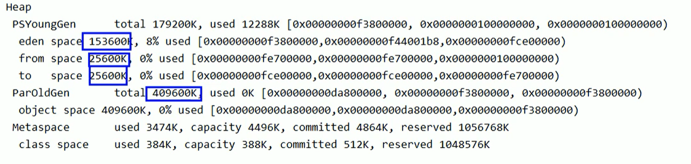

# 堆

## 堆的核心概念

堆针对一个JVM进程来说是唯一的，也就是一个进程只有一个JVM，但是进程是包含多个线程，它们是共享同一堆空间的。


- 一个JVM实例只存在一个堆内存，堆也是Java内存管理的核心区域。
- Java堆区在JVM启动时即被创建，其空间大小也就确定了，是JVM管理的最大的一块内存空间。
    - 堆内存的大小是可以调节的。
- 《Java虚拟机规范》规定，堆可以处于物理上不连续的内存空间中，但在逻辑上它应该被视为连续的。
- 所有的线程共享Java堆，在这里还可以划分线程私有的缓冲区（Thread Local Allocation Buffer，TLAB）。

> -Xms10m：最小堆内存
>
> -Xmx10m：最大堆内存

下图就是使用：Java VisualVM查看堆空间的内容


- 《Java虚拟机规范》中对Java堆的描述是：**所有的对象实例以及数组都应当在运行时分配在堆上**。（The heap is the run-time data area from which memory for all class instances and arrays is allocated）
    - “几乎”所有的对象实例都在这里分配内存。—从实际使用角度看的。
- 数组和对象可能永远不会存储在栈上，因为栈帧中保存引用，这个引用指向对象或着数组在堆中的位置。
- 在方法结束后，堆中的对象不会马上被移除，仅仅在垃圾收集的时候才会被移除。
- 堆，是GC（Garbage Collection，垃圾收集器）执行垃圾回收的重点区域。


### 堆内存细分

- Java7及之前堆内存逻辑上分为三部分：**新生区**+**养老区**+<font color='red'>永久区</font>

    | 名称                    |                                        |            |
    | ----------------------- | -------------------------------------- | ---------- |
    | Young Generation Space  | 新生区（又被划分为Eden区和Survivor区） | Young/New  |
    | Tenure Generation Space | 养老区                                 | Old/Tenure |
    | Permanent Space         | 永久区                                 | Perm       |

- Java 8及之后堆内存逻辑上分为三部分：**新生区**+**养老区**+<font color='red'>元空间</font>

    |                         |                                        |            |
    | ----------------------- | -------------------------------------- | ---------- |
    | Young Generation Space  | 新生区（又被划分为Eden区和Survivor区） | Young/New  |
    | Tenure Generation Space | 养老区                                 | Old/Tenure |
    | Meta Space              | 元空间                                 | Meta       |

约定：新生区<=>新生代<=>年轻代 养老区<=>老年区<=>老年代  永久区<=>永久代


堆空间内部结构，JDK1.8之前从永久代  替换成 **元空间**


## 设置堆内存大小与OOM

- Java堆区用于存储Java对象实例，那么堆的大小在JVM启动的时候就已经设定好了，大家可以通过选项"-Xmx"和"-Xms"来进行设置。
    - "-Xms"用于表示堆的起始内存，等价于-XX:InitialHeapSize
    - "-Xmx"则用于表示堆的最大内存，等价于-XX:MaxHeapSize
- 一旦堆区中的内存大小超过"-Xmx"所指定的最大内存时，将会抛出OutOfMemoryError异常。
- 通常会将 -Xms 和 -Xmx两个参数配置成相同的值，<font color='red'>其目的是为了能够在Java垃圾回收机制清理完堆区后，不需要重新分隔计算堆区大小，从而提高性能。</font>
- 默认情况下：
    - 初始内存大小：物理电脑内存大小 / 64
    - 最大内存大小：物理电脑内存大小 / 4

```java
/**
 * -Xms 用来设置堆空间（年轻代+老年代）的初始内存大小
 *  -X：是jvm运行参数
 *  ms：memory start
 * -Xmx：用来设置堆空间（年轻代+老年代）的最大内存大小
 *
 * @author: 陌溪
 * @create: 2020-07-06-20:44
 */
public class HeapSpaceInitial {
    public static void main(String[] args) {
        // 返回Java虚拟机中的堆内存总量
        long initialMemory = Runtime.getRuntime().totalMemory() / 1024 / 1024;
        // 返回Java虚拟机试图使用的最大堆内存
        long maxMemory = Runtime.getRuntime().maxMemory() / 1024 / 1024;
        System.out.println("-Xms:" + initialMemory + "M");
        System.out.println("-Xmx:" + maxMemory + "M");
    }
}
```

如何查看堆内存的内存分配情况

```
jps  ->  jstat -gc 进程id
```


```
-XX:+PrintGCDetails
```



### OutOfMemory举例


我们简单的写一个OOM例子

```java
/**
 * OOM测试
 *
 * @author: 陌溪
 * @create: 2020-07-06-21:11
 */
public class OOMTest {
    public static void main(String[] args) {
        List<Integer> list = new ArrayList<>();
        while(true) {
            list.add(999999999);
        }
    }
}

```

然后设置启动参数

```
-Xms10m -Xmx:10m
```

运行后，就出现OOM了，那么我们可以通过 VisualVM这个工具查看具体是什么参数造成的OOM


## 年轻代与老年代

- 存储在JVM中的Java对象可以被划分为两类：
    - 一类是生命周期较短的瞬时对象，这类对象的创建和消亡都非常迅速。
    - 另外一类对象的生命周期却非常长，在某些极端的情况下还能够与JVM的生命周期保持一致。
- Java堆区进一步细分的话，可以划分为年轻代（YoungGen）和老年代（OldGen）
- 其中年轻代又可以划分为Eden空间、Survivor0空间和Survivor1空间（有时也叫做from区、to区）。

下面这参数开发中一般不会调：


- Eden：From（S0）：to（S1） ->  8:1:1
- 新生代：老年代  - >  1 : 2

配置新生代与老年代在堆结构的占比。

- 默认-XX:NewRatio=2，表示新生代占1，老年代占2，新生代占整个堆的三分之一
- 可以修改-XX:NewRatio=4，表示新生代占1，老年代占4，新生代占整个堆的五分之一

> 当发现在整个项目中，生命周期长的对象偏多，那么就可以通过调整 老年代的大小，来进行调优

- 在HotSpot中，Eden空间和另外两个survivor空间缺省所占的比例是8：1：1，当然开发人员可以通过选项“-xx:SurvivorRatio”调整这个空间比例。比如-xx:SurvivorRatio=8
- <font color='red'>几乎所有</font>的Java对象都是在Eden区被new出来的。
- 绝大部分的Java对象的销毁都在新生代进行了。（有些大的对象在Eden区无法存储时候，将直接进入老年代）
    - IBM公司的专门研究表明，新生代中80%的对象都是“朝生夕死”的。
- 可以使用选项“-Xmn”设置新生代最大内存大小
    - 这个参数一般使用默认值就可以了


## 图解对象分配过程

### 概念

为新对象分配内存是一件非常严谨和复杂的任务，JVM的设计者们不仅需要考虑内存如何分配、在哪里分配等问题，并且由于内存分配算法与内存回收算法密切相关，所以还需要考虑GC执行完内存回收后是否会在内存空间中产生内存碎片。

1. new的对象先放伊甸园区。此区有大小限制。
2. 当伊甸园区的空间填满时，程序又需要创建对象，JVM的垃圾回收器将伊甸园区进行垃圾回收（Minor GC），将伊甸园区中的不再被其它对象所引用的对象进行销毁。再加载新的对象放到伊甸园区。
3. 然后将伊甸园区中的剩余对象移动到幸存者0区。
4. 如果再次触发垃圾回收，此时上次幸存下来的放到幸存者0区的对象，如果没有回收，就会放到幸存者1区。
5. 如果再次经历垃圾回收，此时会重新放回幸存者0区，接着再去幸存者1区。
6. 啥时候能去养老区呢？可以设置次数。默认是十五次。
    - <font color='red'>可以设置参数：-XX:MaxTenuringThreshold=<N>进行设置</font>
7. 在养老区，相对悠闲。当养老区内存不足时，再次触发GC：Major GC，进行养老区的内存清理。
8. 若养老区执行了Major GC之后发现依然无法进行对象的保存，就会产生OOM异常


### 图解过程

我们创建的对象，一般都是存放在Eden区的，当我们Eden区满了后，就会触发GC操作，一般被称为 YGC / Minor GC操作


当我们进行一次垃圾收集后，红色的将会被回收，而绿色的还会被占用着，存放在S0（Survivor From）区。同时我们给每个对象设置了一个年龄计数器，一次回收后就是1。

同时Eden区继续存放对象，当Eden区再次存满的时候，又会触发一次Minor GC操作，此时GC将会把Eden和Survivor From中的对象进行一次收集，把存活的对象放到Survivor To区，同时让年龄加1


我们继续不断地进行对象生成和垃圾回收，当Survivor中的对象年龄达到15的时候，将会触发一次Promotion晋升操作，也就是将年轻代中的对象晋升到老年代中


### 思考：幸存区区满了之后？

特别注意，<font color='red'>在Eden区区满了之后，才会触发Minor GC操作，而幸存区满了之后，不会触发Minor GC操作</font>。

如果Survivor区满了之后，将会触发一些特殊规则，也就是可能直接晋升老年代。

> 举例：以当兵为例，正常人的晋升可能是 ：  新兵 -> 班长 -> 排长 -> 连长
>
> 但是也有可能有些人因为做了非常大的贡献，直接从  新兵 -> 排长

### 总结

- <font color='red'>针对幸存者S0，S1区的总结：复制之后有交换，谁空谁是To。</font>
- <font color='red'>关于垃圾回收：频繁地在新生区收集，很少在老年区收集，几乎不在永久区/元空间收集。</font>

### 对象分配的特殊情况


### 代码演示对象分配过程

我们不断的创建大对象

```java
/**
 * 代码演示对象创建过程
 *
 */
public class HeapInstanceTest {
    byte [] buffer = new byte[new Random().nextInt(1024 * 200)];
    public static void main(String[] args) throws InterruptedException {
        ArrayList<HeapInstanceTest> list = new ArrayList<>();
        while (true) {
            list.add(new HeapInstanceTest());
            Thread.sleep(10);
        }
    }
}
```

然后设置JVM参数

```bash
-Xms600m -Xmx600m
```

然后cmd输入下面命令，打开VisualVM图形化界面

```bash
jvisualvm
```

然后通过执行上面代码，通过VisualGC进行动态化查看


最终，在老年代和新生代都满了，就出现OOM

```java
Exception in thread "main" java.lang.OutOfMemoryError: Java heap space2    
	at com.atguigu.java.chapter08.HeapInstanceTest.<init>(HeapInstanceTest.java:13)3    
	at com.atguigu.java.chapter08.HeapInstanceTest.main(HeapInstanceTest.java:17)
```

### 常用的调优工具

- JDK命令行
- Eclipse：Memory Analyzer Tool
- Jconsole
- Visual VM（实时监控  推荐~）
- Jprofiler（推荐~）
- Java Flight Recorder（实时监控）
- GCViewer
- GCEasy