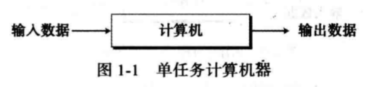
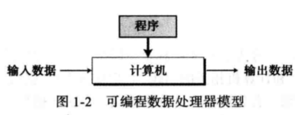
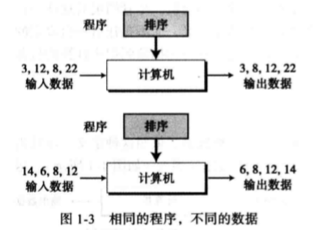
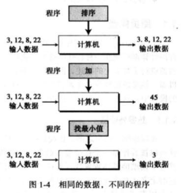
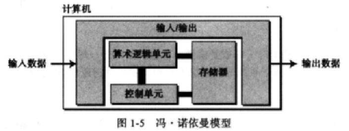

# 第一章 绪论

- 图灵模型
- 冯-诺依曼模型
- 计算机三大部分：硬件、数据和软件
- 计算机硬件
- 计算机数据
- 计算机软件

- 计算机简史
- 计算机的社会问题和职业道德问题

## 1、图灵模型

### 图灵机：什么是图灵机？

- Alan Turing（阿兰·图灵）1937年首次提出通用计算机设想：所有计算都可以在一种特殊的机器上执行

- 是一种数学上的描述
- 不是一台真实的机器

### 数据处理器

首先暂且把计算机可以看作一种接收数据输入、处理数据并产生数据输出的黑盒

问题：没有确定计算机能处理的数据是什么

### 可编程数据处理器

图灵模型：可编程计算机

程序：告诉计算机对数据处理的指令集合

### 可编程数据处理器——输出数据

输出数据：根据输入数据+程序，得到输出数据

- 相同程序，不同输入数据：输出不同数据
- 相同输入数据，不同程序：输出数据不同
- 相同输入数据，相同程序：输出数据相同

### 通用图灵机

通用图灵机是对现代计算机的首次描述，该机器只要提供合适的程序就能做任何运算。

## 2、冯-诺依曼模型

### 什么是冯-诺依曼模型

- 由科学家冯-诺依曼提出的理论模型
- 基于通用图灵机建造的计算机都是在存储器上存储数据
- 鉴于程序和数据在逻辑上是相同的，因此程序也能存储在计算机的存储器中

### 冯-诺依曼模型——4个子系统

- 存储器：用来存储数据和程序的区域
- 算术逻辑单元（ALU）：用来计算和逻辑运算的地方
- 控制单元：对存储器、算术逻辑单元、输入/输出等子系统进行控制操作
- 输入/输出单元：输入子系统负责从计算机外部接收输入数据，输出子系统负责从计算机处理结果输出到计算机外部

### 冯-诺依曼模型——存储程序概念

- 冯-诺依曼模型要求程序也必须存储在存储器（内存）中
- 现代计算机的存储单元用来存储程序和数据，这意味着程序和数据应该有相同的格式，实际上它们都是以位模式（0和1序列）存储在内存中
- 什么是位模式？

### 冯-诺依曼模型——指令执行顺序

- 冯-诺依曼模型中的一段程序是由数量有限的指令组成。
- 控制单元从内存中提取一条指令，解释指令，接着执行指令，也就是说指令是一条接着一条顺序执行的

## 3、计算机组成部分

### 计算机由三大部分组成

- 计算机硬件
- 计算机数据
- 计算机软件

先来了解一下计算机数据和软件

### 计算机组成部分——数据

**冯-诺依曼将计算机定义为一台数据处理机，它接收输入数据，处理数据，最后输出数据**

- 存储数据：计算机是一台电子设备，最好的数据存储方式应该是电子信号，以电子信号的出现和消失（位模式）来存储数据，即以两种状态之一来存储数据。但是日常生活中的数据（文本、图像、声音、视频等）不是以位模式来存储的，不能直接存储到计算机中，需要将这类数据转换为位模式

为什么使用位模式？因为电子设备对位模式的实现简单（通电或不通电，高电压和低电压...）

- 组织数据：在数据存储到计算机之前，需要合理有序的组织成不同的格式。将数据从计算机中输出也需要表现不同的形式。

### 计算机组成部分——软件

#### 算法

程序按一系列的指令执行使得编程成为可能，程序员通过指令集中的指令组合完成特定的运算任务，按照有序指令解决问题的的方法就是算法。

#### 语言

- 机器语言：程序员编写位模式（0和1的组合）的指令来完成任务

- 符号语言：随着任务的复杂性越来越高，科学家研究使用符号来表示位模式指令，这样计算机编程语言就诞生了

#### 软件工程

软件工程指结构化程序的设计和编写，为高效的程序开发而诞生的一门理论体系，这部分后面会讲到

#### 操作系统

这部分内容在后面会讲到