# 第二章 数字系统

- 数字系统的概念
- 位置化和非位置化数字系统
- 十进制系统（以10为底）
- 二进制系统（以2为底）
- 十六进制系统（以16为底）
- 八进制系统（以8为底）
- 二进制、八进制、十六进制转为十进制
- 十进制转为二进制、八进制、十六进制
- 二进制和八进制相互转换
- 二进制和十六进制相互转换

## 1、数字系统

### 什么是数字系统？

定义了用独特的符号（数码）来表示一个数字，在不同的系统中，一个数字有不同的表示方法。使用有限的数字符号来表示数字。

比如：

- 阿拉伯数字系统：0 1 2 3 4 5 6 7 8 9 

- 罗马数字系统：I II III IV V VI VII......

### 数字系统分类

位置化系统（主要讲解） 和 非位置化系统（不讲解）

### 位置化数字系统

在位置化数字系统中，数字符号所占据的位置决定了其表示的值。

在该系统中，数字这样表示：

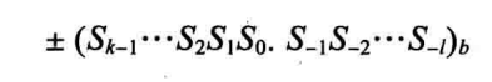

它的值是：

其中：S是一套符号集，b是底（或基数），b=S符号集中的符号总数，+/-表示数字为正或负

## 2、十进制系统（以10为底）

- **符号集S={0,1,2,3,4,5,6,7,8,9}**

- **底b=10**

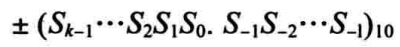

为了简便，通常省略括号、底、和正号。如+（552.31）写成552.31，底和加号是隐含的。

注意：

1. 这些符号不能直接存储在计算机中
2. 计算机存储正负数的方式不同（这个后面会讲到）

### 整数

在十进制系统中，**整数**（没有小数部分的整型数字）是我们所熟悉的，我们在日常生活中使用整数。实际上，我们使用它已经习以为常。我们把整数表示为±Sk-1...S2S1S0,其值计算为：

##### 

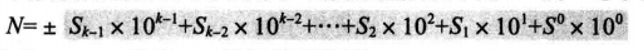

其中,Sk是一个数码，b=10是底，k是数码的常量。

#### 位置量表示

另一种在数字系统中显示一个整数的方法使用**位置量**，即用10的幂（100，101，...，10k-1）表示十进制数字。下图显示了在十进制系统中使用位置量表示一个整数。

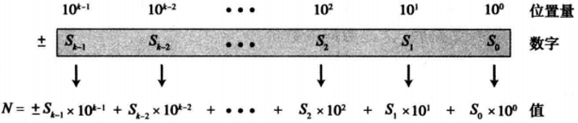

- 以下显示了在十进制系统中使用位置量表示整数+224。

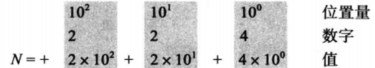

注意：在位置1的数码2值为20，但是在位置2的同一个数码其值为200.还要注意通常我们省略调的正号，实际上是隐含的。

- 以下显示了在十进制系统中使用位置量表示整数-7508。我们已经用1，10，100和1000来代替10的幂

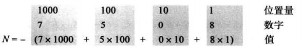

#### 最大值

有时我们需要知道可以用码数k表示的十进制整数的最大值。答案是Nmax=10k-1。例如，如果k=5，那么这个最大值就是Nmax=105-1=99999。

### 实数

在十进制系统中，**实数**（带有小数部分的数字）也是我们所熟悉的。例如，使用该系统来表示元和分（$23.40）整数，我们可以把实数表示为±Sk-1...S1S0.S-1...S-l，其值计算为

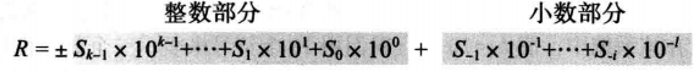

其中，Si是一个数码，b=10是底，k是整数部分数码的数量，l是小数部分数码的数量。十进制小数点使我们用于分割整数部分和小数部分的。

以下显示了实数+24.13的位置量。

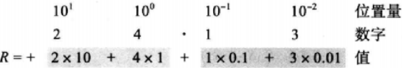

## 3、二进制系统（以2为底）

- **符号集S={0,1}**

- **底b=2**

该系统中的符号常被称为二进制数码或位（位数码）

数据和程序是以二进制模式（即位模式），存储在计算机中的，这是因为计算机由电子开关制成，它们仅有开和关两种状态，1和0分别表示两种不同的状态。

### 整数

我们可以把整数表示为±(Sk-1...S1S0)2。其值计算为：

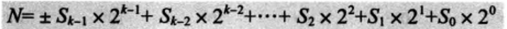

其中，Si是1个数码，b=2是底，k是数码的数量。

#### 位置量表示

另一种表示二进制数的方法是使用位置量（20，21，...，2k-1）。下图显示了在二进制系统中使用位置量表示一个数。

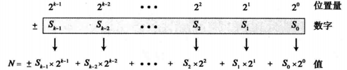

以下显示了与十进制数25等值的二进制数(11001)2。下标2表示底是2。

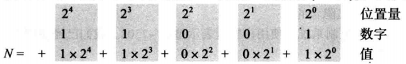

注意：相等的十进制数为N=16+8+0+0+1=25。

#### 最大值

数码k表示的二进制整数的最大值是Nmax=2k-1。例如，如果k=5，那么这个最大值就是Nmax=25-1=31。

### 实数

在二进制系统中，一个实数（可带有小数部分的数字）可以由左边的k位和右边的l位组成，±(Sk-1...S1S0.S-1...S-l)2，其值计算为：

其中，Si是1个位，b=2是底，k是小数点左边位的数量，l是小数点右边位的数量。注意k从0开始，而l从-1开始。最高的幂是k-1且最低的幂是-l。

以下显示了与十进制数5.75等值的二进制数(101.11)2。

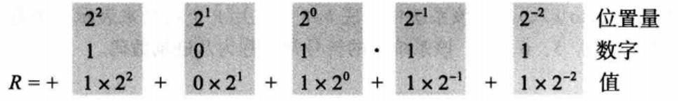

注意，相等的十进制数为R=4+0+1+0.5+0.25=5.75。

## 4、十六进制系统（以16为底）

### 为什么需要16进制系统？

尽管二进制系统用于存储计算机数据，但是不便于在计算机外部表示数字，因为与十进制相比，二进制符号过长。但是十进制不能直接存储在计算机中，在二进制和十进制数字之间没有显然的关系，而且它们直接的转换也不快捷。

为了克服这个问题，发明了两种位置化系统：十六进制和八进制

- 符号集S={0,1,2,3,4,5,6,7,8,9,A,B,C,D,E,F}
- 底b=16

说明A,B,C,D,E,F分别对应十进制中的10,11,12,13,14,15。不区分字母大小写  

### 整数

我们可以把整数表示为±Sk-1...S1S0，其值计算为

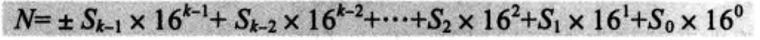

其中，Si是一个数码，b=16是底，k是数码的数量。

#### 位置量表示

另一种表示16进制数的方法是使用位置量（160，161，...，16k-1）。下图显示了在16进制系统中使用位置量表示一个数。

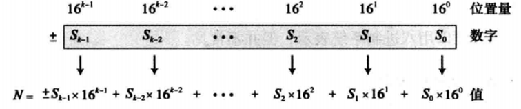

以下显示了与十进制数686等值的十六进制数(2AE)16。

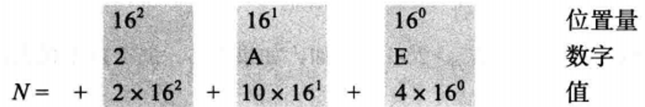

注意：相等的十进制数N=512+160+14=686。

#### 最大值

数码k表示的十六进制整数的最大值是Nmax=16k-1。例如，如果k=5，那么这个最大值就是Nmax=165-1=1 048 575。

### 实数

尽管一个实数可以用十六进制系统表示，但并不常见。

## 5、八进制系统（以8为底）

- **符号集S={0,1,2,3,4,5,6,7}**

- **底b=8**

八进制系统用于二进制系统的计算机外部表现形式

### 整数

我们可以把整数表示为±Sk-1...S1S0，其值计算为：

其中，Si是一个数码，b=8是底，k是数码的数量。

#### 位置量表示

另一种表示8进制数的方法是使用位置量（80，81，...，8k-1）。下图显示了在8进制系统中使用位置量表示一个数。

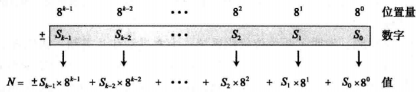

以下显示了与十进制686等值的八进制数(1256)8。

注意：相等的十进制数N=512+126+40+6=686。

#### 最大值

数码k表示的十六进制整数的最大值是Nmax=8k-1。例如，如果k=5，那么这个最大值就是Nmax=85-1=32767。

### 实数

尽管一个实数可以用八进制系统表示，但并不常见。

## 6、四种位置数字系统小结

#### 4种位置化数字系统小结

| 系统     | 底   | 符号                                | 例子                  |
| -------- | ---- | ----------------------------------- | --------------------- |
| 十进制   | 10   | 0,1,2,3,4,5,6,7,8,9                 | 2345.56               |
| 二进制   | 2    | 0,1                                 | (1011.11)2 |
| 八进制   | 8    | 0,1,2,3,4,5,6,7                     | (156.23)8  |
| 十六进制 | 16   | **0,1,2,3,4,5,6,7,8,9,A,B,C,D,E,F** | (A2C.A1)16 |

#### 4种位置化数字系统中的数字比较

| 十进制 | 二进制 | 八进制 | 十六进制 | 十进制 | 二进制 | 八进制 | 十六进制 |
| ------ | ------ | ------ | -------- | ------ | ------ | ------ | -------- |
| 0      | 0      | 0      | 0        | 8      | 1000   | 10     | 8        |
| 1      | 1      | 1      | 1        | 9      | 1001   | 11     | 9        |
| 2      | 10     | 2      | 2        | 10     | 1010   | 12     | A        |
| 3      | 11     | 3      | 3        | 11     | 1011   | 13     | B        |
| 4      | 100    | 4      | 4        | 12     | 1100   | 14     | C        |
| 5      | 101    | 5      | 5        | 13     | 1101   | 15     | D        |
| 6      | 110    | 6      | 6        | 14     | 1110   | 16     | E        |
| 7      | 111    | 7      | 7        | 15     | 1111   | 17     | F        |

## 7、进制转换

### 什么是进制？

- 十进制逢十进一

- 二进制逢二进一

- 八进制逢八进一

- 十六进制逢十六进一

### 其它进制转换为十进制

其它进制转换为十进制是简单而迅速的，将数码乘以其在源系统中的位置量并求和便得到十进制中的数

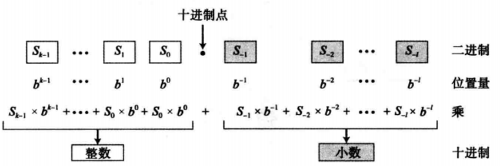

#### 二进制转换为十进制

下面显示如何将二进制数(110.11)2转换为十进制数6.75。

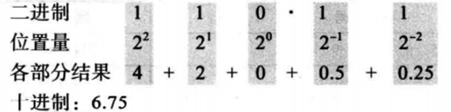

#### 十六进制转换为十进制

下面显示如何将十六进制数(1A.23)16转换为十进制数。

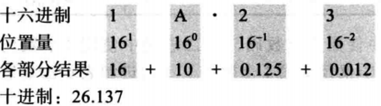

注意：这个十进制表示并不精确，因为3 x 16-2=0.01 171 875。四舍五入成3位小数(0.012)，也就是说，3 x 16-2 ≈0.012。数字转换时我们需要指明允许保留几位小数。

#### 八进制转换为十进制

下面显示如何将八进制数(23.17)8转换为十进制数。

在十进制中(23.17)8≈19.234。再一次，我们把7 x 8-2 = 0.109 375四舍五入。

### 十进制转换其它进制

可以将十进制转换为与它等值的其它进制，需要两个过程：

- 转换整数部分
- 转换小数部分

1. 转换整数部分

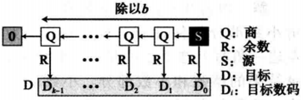

例1：下面演示如何将十进制数35转换为二进制数。我们从这个十进制数开始，一边连续寻找除以2得到的商和余数，一边左移。结果是35=(100011)2。

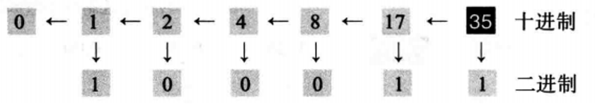

例2：下面演示如何将十进制数126转换为八进制数。我们一边连续寻找除以8得到的商和余数，一边左移。结果是126=(176)8。

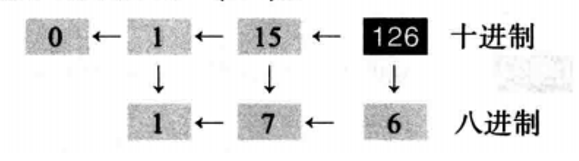

例3：下面演示如何将十进制数126转换为十六进制数。我们一边连续寻找除以8得到的商和余数，一边左移。结果是126=(7E)16。

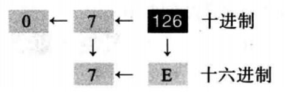

2.转换小数部分

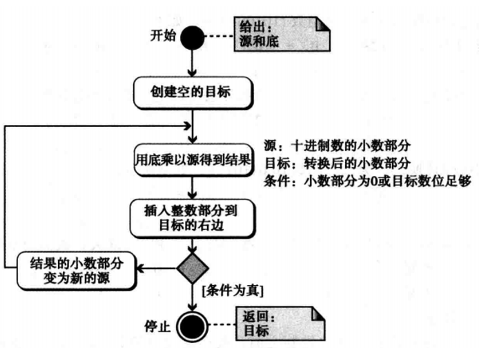

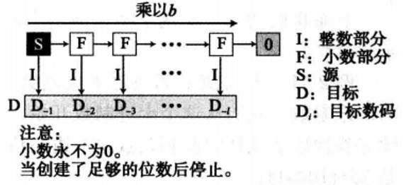

例1：将十进制数0.625转换为二进制数。

解	因为0.625没有整数部分，该例子显示小数部分如何计算。这里是以2为底。在左边一角写上这个十进制数。连续乘2，并记录结果的整数和小数部分。小数部分移到右边，整数部分写在每次运算的下面。当小数部分为0，或达到足够的位数时结束。结果是0.625=(0.101)2。

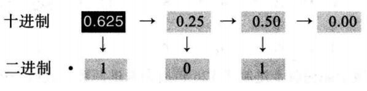

例2：下面演示如何将0.634转换为八进制数且精确到4位小数。结果是0.634=(0.5044)8。

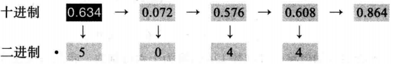

例3：下面演示如何将十进制数178.6转换为十六进制数且精确到1位小数。结果是178.6=(B2.9)16。注意，以16为底时除或乘以16。

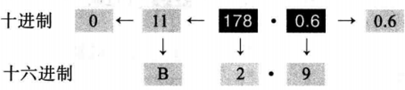

### 二进制&十六进制互转

我们能轻松将数字从二进制转换到十六进制，反之亦然。这是因为在这两个底之间存在一种关系：二进制中的4位恰好是十六进制中的1位。下图显示了该转换是如何进行的：

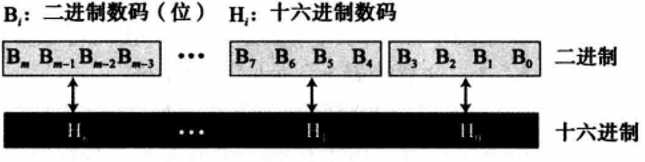

#### 二进制转十六进制

例：下面演示如何将二进制数(10011100010)2转换为十六进制数。

解	我们先将二进制数排位4位一组的形式：100 1110 0010。注意最左边一组可能是1到4位不等。我们根据之前的表格对照每组转换得到十六进制数(4E2)16。

#### 十六进制转二进制

例：与十六进制数(24C)16相等的二进制数是多少？

解	将每个十六进制数码转换成4位一组的二进制数：2-->0010,4-->0100,以及C-->1100。该结果就是(001001001100)2。

### 二进制&八进制互转

我们能轻松将数字从二进制转换到十六进制，反之亦然。这是因为在这两个底之间存在一种关系：二进制中的3位恰好是十六进制中的1位。下图显示了该转换是如何进行的：

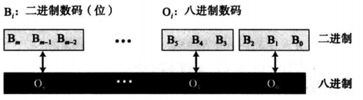

#### 二进制转八进制

例：下面演示如何将二进制数(101110010)2转换为八进制数。

解	每3位一组转换为1位八进制数码。根据之前表格所示的值对照每3位一组等量转换得到八进制数结果是(562)8。

#### 八进制转二进制

例：与(24)8相等的二进制数是多少？

解	将每个八进制数写成对等的二进制位组，得到(010100)2。

### 八进制&十六进制互转

- 八进制转十六进制，可以先转为二进制，再转为十六进制

- 十六进制转八进制，可以先转为二进制，再转为八进制

  

  