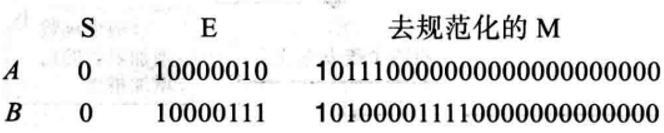

# 第四章 数据运算

- 列出在数据上进行的三类运算；
- 在位模式上进行一元和二元逻辑运算；
- 区分逻辑移位运算和算术移位运算；
- 在位模式上进行逻辑移位运算；
- 在以二进制补码形式存储的整数上进行算术移位运算;
- 在以二进制补码形式存储的整数上进行加法和减法运算;
- 在以符号加绝对值形式存储的整数上进行加法和减法运算;

- 在以浮点格式存储的实数上进行加法和减法运算;
- 理解逻辑和移位运算的一些应用,如置位、复位和指定位的反转等。

## 逻辑运算

逻辑运算是指那些应用于模式中一个二进制位，或在两个模式中相应的两个二进制位的相同基本运算

- 位层次上的逻辑运算
- 模式层次上的逻辑运算

模式层次上的逻辑运算是具有相同类型的位层次上的n个逻辑运算，这里的n就是模式中的位的数目

### 位层次

一个位可以是0或1，“0”代表逻辑“假”，“1”代表逻辑“真”，使用布尔代数的定义去操作二进制位

4种用来操作二进制位的位层次上的运算：

- 非（NOT）
- 与（AND）
- 或（OR）
- 异或（XOR）

#### 非，NOT

NOT运算符是一元操作符

只有一个输入，输出位是输入位的相反，如果输入0，则输出1；如果输入1，则输出0

#### 与，AND

AND运算符是二元操作符

有两个输入，如果输入都是1，则输出1；其它3种情况，输出都是0

#### 或，OR

OR运算符时二元操作符

有两个输入，如果输入都是0，则输出0；其它3种情况，输出都是1

#### 异或，XOR

XOR运算符是二元操作符

有两个输入，如果输入相同，则输出0；如果输入不同，则输出1

### 模式层次

相同的4个运算符（NOT，AND，OR，XOR）被应用到n位模式

例1：用NOT（非）运算符来计算位模式10011000。

解	把每个1变成0，每个0变成1。

例2：用AND（与）运算符来计算位模式10011000和00101010。

解	输入中相应的位都为1，输出为1

例3：对位模式数值10011001和00101110应用OR（或）运算。

解	输入中相应的位都为0，输出为0

例4：使用XOR（异或）运算符对10011001和00101110位运算。

解	10110111

### 复位（掩码）

对指定的位复位

- AND指定的位通过掩码 复位---0
- OR指定的位通过掩码 复位---1
- XOR指定的位通过掩码 复位---取反

### 移位运算

移位运算移动模式中的位，改变位的位置。它们能向左或向右移动位。我们可以把移位运算分成两大类：逻辑移位运算和算术移位运算。

#### 逻辑移位

逻辑移位运算应用于不带符号位的数的模式。原因是这些移位运算可能会改变数的符号,此符号是由模式中最左位定义的。我们区分两类逻辑移位运算,如下面描述。

1.逻辑移位
		逻辑右移运算把每一位向右移动一个位置。在n位模式中,最右位丢失,最左位填0。逻辑左移运算把每一位向左移动一个位置。在n位模式中,最左位丢失,最右位填0。图4-3显示了对一个8位模式的逻辑右移和逻辑左移。

2.循环移位运算

循环移位运算(旋转运算)对位迹行移位,但没有位被丢弃或增加。循环右移(或右施转)把每一位向右移动一个位置,最右位被回环,成为最左位。循环左移(或左旋转)把每一位向左移动一个位置,最左位被回环,成为最右位。图4-4显示了循环左移和循环右移运算。

例1：对位模式10011000使用逻辑左移运算。

解	如下所示，最左位被丢弃，0作为最右位被插入。

例2：对位模式10011000使用循环左移运算。

解	最左位被回环，成为最右位。

#### 算术移位

**算术移位运算**假定位模式是用二进制补码格式表示的带符号位的整数。算术右移被用来对整数除以2；而算术左移被用来对整数乘以2（后面讨论）。这些运算不应改变符号位（最左）。

算术右移保留符号位，单同时也把它复制，放入相邻的右边的位中，因此符号被保存。

算术左移丢弃符号位，接受它左边的位作为符号位。如果新的符号位与原先的相同，那么运算成功，否则发生上溢或下溢，结果是非法的。图4-5显示了这两种运算。

例1：对位模式10011001使用算术右移，模式是二进制补码格式的整数

解	如下所示，最左位被保留，被复制到相邻的右边的位中。

原始数是-103，新的数是-52，它是-103被除以2并取整的结果

例2：对位模式11011001使用算术左移，模式是二进制补码格式的整数。

解	如下所示最左位被丢弃，0作为最右位被插入。

原始数是-39，新的数是-78，原始数被乘以2。因为没有下溢发生，所以运算合法。

例3：对位模式01111111使用算术左移，模式是二进制补码格式的整数。

解	如下所示，最左位被丢弃，0作为最右位被插入。

原始数是127，新的数是-2.因为上溢发生，所以结果非法。期望答案是127 x 2=254，这个数不能用8位模式表示。

例4：逻辑运算和逻辑移位运算给我们提供了操纵位模式的工具。假设一个模式，在判断过程中需要使用此模式的第三位（从右起），需要知道这特殊的位是0或1。下面显示如何找出这位。

我们先对模式进行两次右移，这样目标位置被移到最右的位置。然后通过最右位为1其余为0的掩码和AND运算就能得出结果。结果是有7个0，目标位在最右位的模式。然后可以测试结果：如果它是无符号的整数1，那么目标位就是1；而如果结果是无符号的整数0，那么目标位就是0。

### 算术运算

#### 整数

- 算术运算包括加、减、乘、除，适用于整数和浮点数

过程如下：

1. 如果运算是减法，我们取第二个整数的二进制补码格式，否则转下一步
2. 两个整数相加

例1：以二进制补码格式存储两个整数A和B，显示B是如何被加到A上的。

​		A=(00010001)2	B=(00010110)2

解	运算是相加，A被加到B上，结果存储在R中。

用十进制检查结果：17+22=29

例2：以二进制补码格式存储两个整数A和B，显示B是如何被加到A上的。

​		A=(00011000)2	B=(11101111)2

解	运算是相加，A被加到B上，结果存储在R中。注意，最后的进位被舍弃，因为存储器大小只有8位。

用十进制检查结果：24+（-17）=7

例3：以二进制补码格式存储两个整数A和B，显示如何从A中减去B。

​		A=(00011000)2	B=(11101111)2

解	运算是相减的，A被加到B的补码上，结果存储在R中。

用十进制检查结果：24-（-17）=41。

例4：以二进制补码格式存储两个整数A和B，显示如何从A中减去B。

​		A=(11011101)2	B=(00010100)2

解	运算是相减的，A被加到B的补码上，结果存储在R中。

用十进制检查结果：（-35）-（+20）=（-55）。注意舍弃最后的进位。

例5：以二进制补码格式存储两个整数A和B，显示B是如何被加到A上的。

​		A=(01111111)2	B=(00000011)2

解	运算是相加，A被加到B上，结果存储在R中。

我们期望的结果是127+3=130，但是答案是-126。错误是由于上溢，因为期望的答案（+130）不在范围-128~127之间。

#### 实数

实数的加减法，以浮点数存储的加法和减法被简化为小数点对齐以后以符号加绝对值（符号和尾数的组合）存储的两个整数的加法和减法

简化过程如下：

1. 如果两个数（A或B）中任一一个为0，那令结果等于B或A，过程终止。

2. 如果运算是减法，那么改变第二个数（B）的符号来模拟加法。

3. 通过在尾数中包含隐含的1和增加指数，两个数去规范化。此时尾数部分看做一个整数。

4. 然后统一指数，这意味着我们增加较小的指数，移位相应的尾数，直到两个数具有相同的指数。例如，如果有：

   ​				1.11101 x 24 + 1.01 x 22

   那么需要把两个指数都变成4：

   ​				1.11101 x 24 + 0.0101 x 24

5. 现在，把每个数的符号和尾数的组合看成一个符号加绝对值格式的整数。像本章前面介绍的一样，相加这两个整数。

6. 最后，再次规范化数，变成1.000111 x 25

   

例1：显示计算机是如何计算结果的：（+5.75）+ （161.875）=（+167.625）

解	正如我们第三章看到的，以两个浮点数格式存储，如下所示。但是我们需要记住每个数字有隐含的1（它只是假设的，没有被存储）。注意，在这里S代表符号，E代表只是，M代表尾数。

UML图（图4-8）中的前几步是不需要的，我们进入去规范化，给尾数增加隐含的1，增加指数进行去规范化。现在两个去规范化的尾数都是24位，包含了隐含的1。它们应该被存储在有24位的存储单元中。每个指数都被增加了。

现在我们对齐尾数，需要增加第一个指数，右移它的尾数。我们把第一个指数改为(10000111)2，所以需要把第一个尾数右移5位。

现在进行符号加绝对值加法，把每个数的符号和尾数看成是符号加绝对值表示的整数。

在尾数中没有溢出，所以我们规范化。

尾数只要23位，不需要四舍五入。E=(10000110)2=134,M=0100111101。换言之，结果是(1.0100111101)2 x 2134-127=167.625。

例2：显示计算机是如何计算结果的：(+5.75) + (-7.023 437 5)=(-1.273 437 5)。

解	这两个数以浮点数格式存储，如下所示。

 

去规范化的结果为：

对齐是不需要的（两指数是相同的），所以我们在符号和尾数的组合上应用加法运算，结果显示如下，其中结果的符号是负的：

现在我们需要规范化，降低指数三次，左移去规范化尾数三位：

尾数现在是24位，所以四舍五入到23位。

结果是R=-2127-127 x 1.0100011=-1.273 437 5，正是所期望的。
