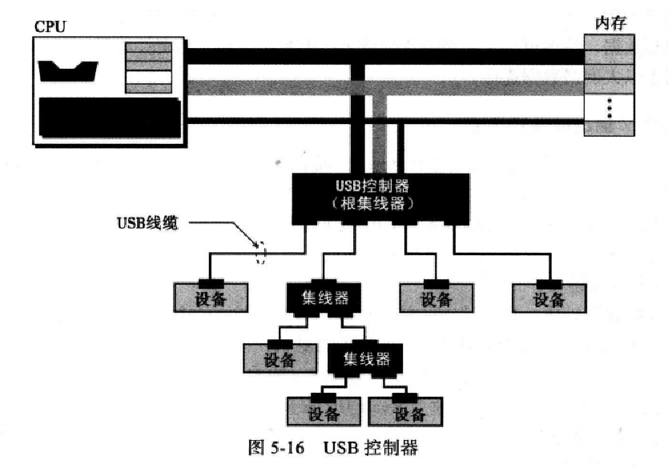
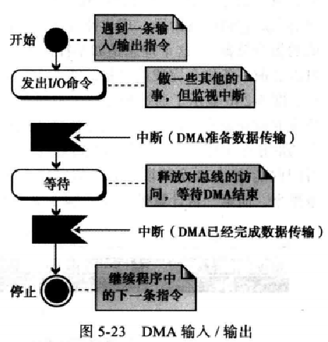
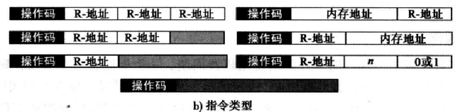
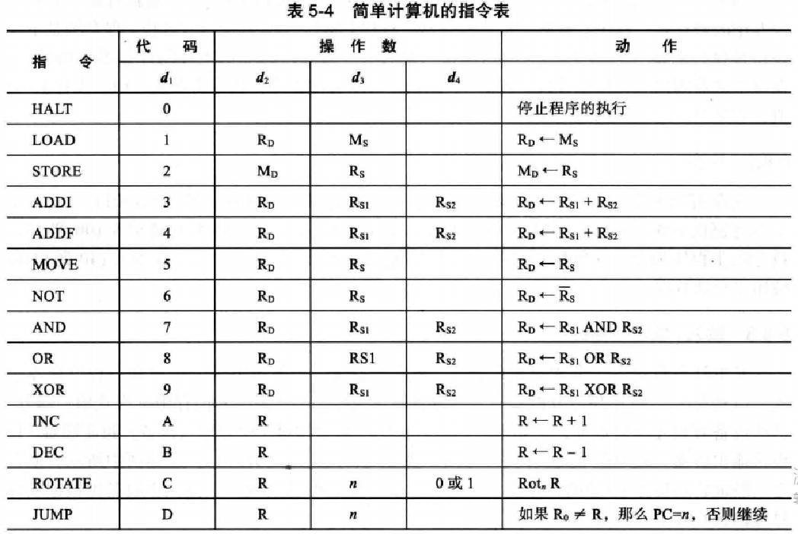
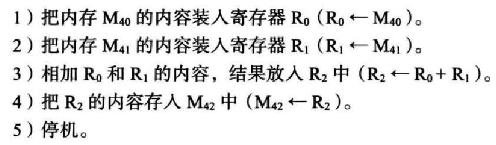

# 第五章 计算机组成

- 计算机的3个子系统
- 计算机中央存储器的作用
- 计算机中央处理单元（CPU）的作用
- 计算机中指令周期的取指令-译码-执行阶段
- 主存与地址空间
- 区分主存和缓存
- 输入/输出子系统
- 子系统间的相互连接，及总线系统
- 输入/输出编址的不同方法
- 区分计算机体系结构的两种主要趋势
- 计算机是如何通过管道改善吞吐量的
- 并行处理是如何改善吞吐量的

## 计算机组成部件

计算机组成部件可以分为三大类（或子系统）

- 中央处理单元（CPU）
- 主存储器
- 输入/输出子系统

### 中央处理单元（CPU）

CPU用于数据的运算

- 算术逻辑单元（ALU）
- 控制单元
- 寄存器组

#### CPU中的算术逻辑单元

算术逻辑单元

对数据进行逻辑、移位和算术运算

1. 逻辑运算：非、与、或、异或，这些运算把输入数据作为二进制位模式，运算结果也是二进制位模式
2. 移位运算：逻辑移位运算和算术移位运算
3. 算术运算：整数和实数的加减运算

#### CPU中的寄存器

寄存器：

用来存放临时数据的高速独立存储单元

数据存储器：保存运算的中间结果，命名为R1 ~ Rn

指令存储器（IR）：CPU从内存中逐条的取出指令，并存储在指令存储器中，解释并执行指令

程序计数器（PC）：保存当前正在执行的指令地址，当指令执行完成后，计数器自动加1，指向下一条指令的内存地址

#### CPU的控制单元

控制单元：控制各个子系统的操作，控制是通过从控制单元到其他子系统的信号来进行的

### 主存储器（内存）

- 内存是存储单元的集合，每个存储单元都有唯一标识，称为地址
  - 数据以字的形式在内存中传入传出，字是以8位、16位、32位、64位。如果字是8位，一般称为一个字节

#### 地址空间

- 所有在存储器中标识的独立的地址单元的总数地址空间。例如，一个64 KB。字长为1个字节的内存地址空间的范围为0~65535

- 内存地址用无符号二进制整数定义

例1：一台计算机有32 MB（兆字节）内存。需要多少位来寻址内存中的任意一个字节？

解	内存地址空间是32 MB，即225（25 x 220）。这就意味着需要log2225（25位）来标识每一个字节。

例2：一台计算机有128 MB内存。计算机字节长为8字节，需要多少位来寻址内存中任意一个单字？

解	内存地址空间是128 MB，即227，但是每个字是8（23）字节，这意味着需要224个字，也就是说你要log2224（24位）来标识每一个字。

#### 存储器类型

主要有两种类型的存储器：RAM和ROM

- 随机存取存储器（RAM）：

特点：易失性，系统断电后，信息（程序或数据）丢失。

- 只读存储器（ROM）

里面的数据由制造商写进去的，用户只能读不能写。

特点：非易失性，系统断电数据不会丢失。常用来存储那些在开机时运行的程序

#### 层次结构

#### 高速缓冲存储器

存取数据的速度比主存快，但比寄存器慢。通常容量较小，被置于CPU和主存之间。

### 存储设备

#### 磁介质

使用磁性来存储位数据，如果一个点有磁性则表示1，没有磁性则表示0

常见的磁介质设备：

- 磁盘
- 磁带

#### 磁介质存储设备（磁盘）

磁盘是由一张一张的磁片叠加而成的，信息是通过盘上的每个磁片的读/写磁头读写磁介质表面来进行数据存取。

- 表面结构

  - 为了将数据存储在磁盘的表面，每个盘面都被划分为磁道，每个磁道又分成若干个扇区。磁道间通过磁道内部间隔隔开，扇区之间通过扇区内部间隔隔开。

- 数据存取

  - 磁盘是一个随机存取设备，在某一时间点可以读取的最小存储区域只能是一个扇区。数据块可以存储在一个扇区或多个扇区上

- 性能

  取决几个因素：角速度、寻道时间和传送时间

  - 角速度定义了磁盘的旋转速度
  - 寻道时间定义了读/写磁头寻找数据所在磁道的时间
  - 传送时间定义了将数据从磁盘移到CPU/内存所需要的时间

#### 光存储设备

- 光存储设备使用激光技术来存储和读取数据
- 只读光盘（CD-ROM）
- 可刻录光盘（CD-R）
- 可重写光盘（CD-RW）
- 数字多功能光盘（DVD）

#### 光存储设备（CD-ROM）

## 计算机组成——子系统互联

CPU、主存储器、输入/输出子系统的信息交换

- CPU和存储器的连接
- I/O设备的连接

### CPU和存储器的连接

CPU与存储器之间通常由称为总线的三组线路进行连接。它们分别是：数据总线、地址总线、控制总线

### CPU与主存的连接

- 数据总线

由多根线组成，每根线每次传送1个位的数据。线的数量取决于计算机字的大小。

例如，计算机的字是32位（4字节），那么需要32根线的数据总线，以便同一时刻同时传送32位的数据。

- 地址总线

允许访问存储器中某个字的，地址总线的线数取决于存储空间的大小。

例如，存储器容量为2的n次方个字，那么地址总线一次需要传送n位的地址数据，因此需要n根线。

- 控制总线

负责在中央存储器和内存之间传送信息。

例如，必须有一个代码从CPU发送到内存，用于指定进行的是读还是写操作。控制总线的线数取决于计算机所需要控制的命令总数。如果计算机由2的m次方条控制命令，那么控制总线就需要有m根，因为m位可以定义2的m次个不同的操作

### I/O设备的连接

输入/输出设备不能直接与连接CPU和内存的总线相连，因为输入/输出设备本质与CPU和内存的本质不同，输入/输出设备都是磁性或光学设备，而CPU和内存是电子设备。与CPU和内存相比。输入/输出设备的数据读取速度要慢的多，因此必须要有一个中介来处理这种差异。

- 输入/输出控制器

连接输入/输出设备到总线上，每一个输入/输出设备都有一个特定的控制器。

#### 控制器

控制器清除了输入/输出设备与CPU内存在本质上的障碍，控制器可以是串行或并行的设备。

- 串行控制器
  - 只有一根数据线连接到设备上
- 并行控制器
  - 有多根数据线连接到设备上，一次能同时传送多个位
- 常用控制器
  - SCSI、火线、USB和HDMI

#### 控制器（SCSI）

小型计算机系统接口（SCSI）

是一个8、16或32根线的并行接口，它提供了菊花链连接，连接链的两端都必须有终结器，并且每一个设备都必须有唯一的地址（即目标ID）。

#### 控制器（火线）

火线

IEEE标准1394规定的串行接口，俗称火线，它是一种高速的串行接口，数据采用数据包的形式传送，数据的传输速度高达50 MB/S，它可以在一条菊花链或树形连接（只用一根线）上连接多达63个设备。和SCSI相比，不需要终结器。

#### 控制器（USB）

通用串行总线（USB）

用以连接与计算机相连的一些低速或高速设备。

- 多个设备可以被连接到一个USB控制器上，这个USB控制器也称为根集线器
- USB-2（USB版本2.0）允许多达127个设备组成的树状拓扑结构连接到一个USB控制器上，其中控制器作为树的根，集线器作为中间节点，设备作为末端节点。控制器（根集线器）与其他集线器的不同之处在于控制器能感知到树中其他集线器的存在，而其他集线器是被动的设备，它们只能简单地传输数据。
- 设备可以不关闭计算机就很容易被移除或连接到树中，这称为热交换。当集线器从系统中移除时，于此集线器相连的所有设备也被移除。

- USB-2

提供三种传送速率：1.5Mbps（每秒兆位）、12Mbps和480Mbps。低速率可以用于低速设备，如键盘鼠标，中速率用于打印机，高速率用于大容量的存储设备。

- USB3.0

是对计算机连接方对通用串行总线（USB）标准的再一次修订，增加了一个新的叫做“SuperSpeed”（超感）传输模式，可以将数据传输速率提升至4.8Gbit/s，根据承诺，USB 3.0的速率将更新至10Gbit/s

#### 控制器（HDMI）

高清清晰度多媒体接口（HDMI）

是现有视频模拟标准的数字化代替品，它可以用来从一个资源向另一个兼容的计算机显示器、视频投影仪、数字电视或数字音像设备传输视频数据和数字音像数据。

### 输入/输出设备的寻址

通常CPU使用相同的总线在主存和输入/输出设备之间读写数据。唯一不同的是指令。如果指令涉及到主存中的字，那么数据就会在主存和CPU之间传输。如果指令涉及到输入/输出设备，那么数据会在输入/输出设备和CPU之间传输。

**有两种方式用来对输入/输出设备进行寻址**：

- I/O独立寻址
- I/O存储器映射寻址

#### I/O独立寻址

用来读写内存的指令与用来读写输入/输出设备的指令是完全不同的，有专门的指令完成对输入/输出设备的操作，每个输入/输出设备有自己的地址。输入/输出设备地址可以和内存地址相同。

#### I/O存储器映射寻址

- I/O存储器映射寻址

CPU将输入/输出控制器中的每个寄存器都看作内存中的某个存储字。

- 优点

CPU有较小的指令集，对内存操作的指令也可以操作输入/输出设备

- 缺点

输入/输出控制器也占用了一部分内存地址

## 计算机组成——程序执行

通用计算机使用程序的一系列指令来处理数据，通过执行程序，将输入数据转换为输出数据。程序和数据都放在内存中。

- 机器周期
- 输入/输出操作

### 程序周期

- CPU利用重复的机器周期来执行程序中的指令，一步一条，从开始到结束
- 一个周期包括3步：取指令-->译码-->执行

### 机器周期

- 取指令

CPU的控制单元命令系统将下一条将要执行的指令复制到CPU的指令寄存器中，被复制的指令地址保存到程序计数器中，复制完成后，程序计数器自动加1指向内存中的下一条指令

- 译码

当指令置于指令寄存器后，该指令将由控制单元负责译码，指令译码的结果是产生一系列系统可执行的二进制代码

- 执行

指令译码完毕后，控制单元发送任务命令到CPU的某个部件，例如，控制单元告知系统，让它从内存中读取数据。这就是执行阶段

### 输入/输出操作

- 计算机需要通过命令把数据从I/O设备传输到CPU和内存，因为I/O设备的运行速度比CPU慢得多，因此CPU的操作在某种程度上必须和I/O设备同步
- 有三种方法被设计用于同步
  - 程序控制输入/输出
  - 中断控制输入/输出
  - 直接存储器存取（DMA）

#### 程序控制输入/输出

- 程序控制输入/输出采用最简单的同步：CPU等待I/0设备
- 缺点：CPU需要不时地检查设备状态，影响	CPU的性能

#### 中断控制输入/输出

首先CPU告知I/O设备即将开始数据传输，但是CPU不需要不停地检查I/O设备状态，当I/O设备准备好时，I/O设备通知（中断）CPU，这个过程中CPU可以做其他工作

优点：CPU时间没有被浪费

#### 直接存储器存取（DMA）

由DMA控制器来承担CPU的一些功能，主要用于高速I/O设备传输大量的数据，如硬盘

优点：CPU工作效率很高

缺点：需要增加DMA控制硬件

## 计算机组成——不同的体系结构

- CISC（复杂指令集计算机）体系结构
    - 设计策略：是使用大量指令，包括复杂指令
    - 优点：程序设计更容易，因为每个简单的或复杂的任务都有一条对应的指令。程序员不需要写一大堆的指令去完成复杂的任务
    - 缺点：指令集的复杂性使得CPU和控制单元电路非常复杂
    - 优化方案：程序在两个层面上运行，CPU不直接执行机器语言指令，CPU只执行被称为微操作的简单操作，复杂指令被转化为一系列简单操作后由CPU执行，使用微操作的程序设计被称为微程序设计
    - 应用：英特尔公司开发的奔腾系列CPU
- RISC（精简指令集计算机）体系结构
    - 设计策略：是使用少量的指令font>完成最少的简单操作
    - 缺点：程序设计更难，复杂指令需要用简单指令模拟
- 流水线
    - 计算机对每条指令使用取指令、译码和执行三个阶段，早期计算机每条指令的这三个阶段需要串行完成，现代计算机使用流水线技术改善吞吐量（单位时间内完成的指令总数）。
    - 如果控制单元能同时执行两个或三个阶段，那么下一条指令就可以在前一条指令完成前开始

- 并行处理

    - 计算机传统上有单个控制单元、单个算术逻辑单元、单个内存单元。现代计算机有多个控制单元、多个算术逻辑单元、多个内存单元，每一个控制单元都能单独处理指令，这种思想称为并行处理，并行处理能改善吞吐量。

    - 并行处理可以发生在数据流、指令流或两者都有。

    - 并行处理把计算机的组织（从数据处理来看）分成4类

        - SISD组织
        - SIMD组织
        - MISD组织 
        - MIMD组织 

        

        

- SISD组织（单指令流，单数据流）：表示计算机有一个控制单元、一个算术逻辑单元和一个内存单元，指令被顺序执行，每条指令可以存取数据流中的一个或多个数据项

- SIMD组织（单指令流，多数据流）：表示计算机有一个控制单元、多个算术逻辑单元和一个内存单元，所有处理器单元从控制单元接收相同的指令，但在不同的数据项上操作

- MISD组织（多指令流，单数据流）：多指令流的多个指令作用于相同的数据项，MISD组织从未被实现

- MIMD组织（多指令流，多数据流）：多指令流的多个指令作用于多个数据流（每条指令作用于一个数据项）——MIMD组织被现代计算机实现

## 计算机组成——简单计算机

为了解释计算机的体系结构和指令处理，引入一台简单（非真实）计算机

简单计算机有三部分组成

1. CPU
2. 存储器
3. 输入/输出子系统

### 简单计算机（CPU）

- 数据寄存器：16个16位的数据寄存器R0到R15
- 控制单元：有两个专用寄存器，程序计数器PC和指令寄存器IR
  - 程序计数器PC：只含有8位，保存的是下一条被执行的指令的内存存储单元地址，在每一个机器周期后，程序计数器加1，指向另一条指令
  - 指令寄存器IR：含有16位，保存当前机器周期译码的指令

### 简单计算机（主存）

主存

- 有256个16位的存储单元，二进制的地址空间为(00000000~11111101)2或是十六进制的(00~FD)16
- 主存中既有数据又有程序，前64个存储单元(00~3F)16被专用于程序指令，任何程序的程序指令存储在连续的内存单元中，内存单元(40~FD)16用来存储数据

### 简单计算机(输入/输出子系统)

输入/输出子系统

子系统由一个键盘和显示器组成，子系统通过内存映射地址（I/O存储器映射寻址），它们的地址分别为(FE)16和(FF)16

### 简单计算机（指令集）

指令集

- 有16条指令集合的能力，每条计算机指令由两部分组成：操作码（opcode）和操作数（operand）
- 操作码：在操作数上执行的操作类型
- 每条指令由16位组成，被分为4个4位的域，最左边的域含有操作码，其它三个域含有操作数或操作数的地址

指令表：

### 简单计算机（处理指令）

简单计算机使用机器周期（取指令、译码和执行）

- 取指令阶段：其地址由PC决定的指令从内存中得到，装入IR中，然后PC加1，指向下一条指令
- 译码阶段：IR中的指令被译码，所需的操作数从寄存器或内存中取到
- 执行阶段：指令被执行，结果被放入合适的内存单元或寄存器中

一旦第三个阶段结束，控制单元又开始新的机器周期，现在PC是指向下一条指令的，处理过程一直继续，直到CPU遇到HALT指令

### 简单计算机（示例）

如何进行整数A和B相加，结果为C，假定整数是二进制补码格式

​					C=A + B

先把A、B存放在寄存器R0和R1中，操作的结果存在R2中

ALU只能操作存储在CPU数据寄存器中的数据，但是在CPU中只有有限的寄存器，如果数据量很大，并且数据在程序执行过程中应该保留在计算机中，比较好的方法是把它们存在内存中，临时地把它们调入寄存器中

假定A、B存储在内存单元地址(40)16和(41)16，结果C被存在内存单元(42)16，则A、B需要被调入CPU中，结果C存在内存中

完成这个简单的加法需要5条指令

5条指令被译码为

### 简单计算机（存储程序和数据）

为了遵循冯-诺依曼模型，把程序和数据存储在内存中

- 程序存储在内存单元地址(00)16到(04)16，共5行指令
- 数据存储在内存单元地址(40)16、(41)16和(42)16中

### 简单计算机（指令周期）

周期1：

开始时，PC指向程序的第一条指令，它在内存单元(00)16中，控制单元经历3个步骤：

- 取出存储在内存单元(00)16中的指令，放入到IR中，PC的值加1
- 译码指令(1040)16为R0 <--M40
- 执行指令，存储在内存单元(40)16中的整数的副本被装入寄存器R0中

周期2：

开始时，PC指向程序的第二条指令，它在内存单元(01)16中，控制单元经历3个步骤:

- 取出存储内存单元(01)16中的指令，放入到IR中，PC的值加1
- 译码指令(1141)16为R1<-- M41
- 执行指令，存储在内存单元(41)16中的整数的副本被装入寄存器R1中

周期3：

开始时，PC指向程序的第三条指令，它在内存单元(02)16中，控制单元经历3个步骤

- 取出存储内存单元(02)16中的指令，放入到IR中，PC的值加1
- 译码指令(3201)16为R2<--R0+R1
- 执行指令，寄存器R0的内容被加到寄存器R1的内容上（由ALU完成），结果放在R2中

周期4：

开始时，PC指向程序的第四条指令，它在内存单元(03)16中，控制单元经历3个步骤

- 取出存储内存单元(03)16中的指令，放入IR中，PC的值加1
- 译码指令(2422)16为M42<--R2
- 执行指令，寄存器R2中整数的副本被存储到内存单元(42)16中

周期5：

开始时，PC指向程序的第五条指令，它在内存单元(04)16中，控制单元经历3个步骤

- 取出存储内存单元(04)16中的指令，放入到IR中，PC的值加1
- 译码指令(0000)16为HALT
- 执行指令，计算机停止

### 简单计算机(可重用性)

与不可编程的计数器相比，计算机的一个优点是我们能反复使用相同的程序。

运行程序多次，每次输入不同的数据，得到不同的输出。