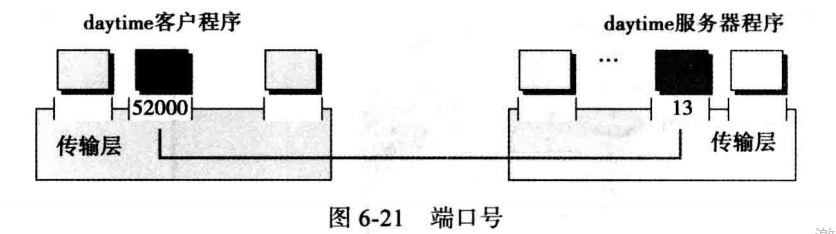
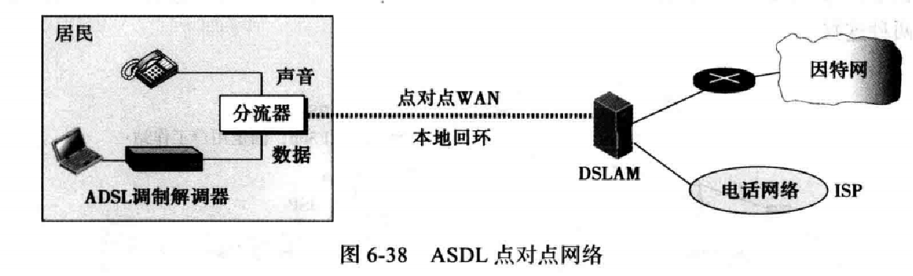

# 第六章 计算机网络和因特网

- 局域网和广域网（LAN和WAN）
- 因特网和互联网
- 因特网网络模型的TCP/IP协议族
- TCP/IP协议族中的各层及它们的关系
- 从应用层面描述一些应用
- 传输层协议提供的服务
- 网络层协议提供的服务
- 数据链路层使用的不同协议
- 物理层的责任
- 网络的传输媒介

## 计算机网络和因特网——网络

网络：是一系列可用于通信的设备相互连接构成的

设备：

- 主机（终端），如台式机、笔记本电脑、工作站、手机等
- 连接设备：
  - 路由器：将一个网络与另一个网络相连
  - 交换机：将不同设备连接在一起
  - 调制调节器：可以改变数据形式

### 局域网

- 局域网（LAN）通常是与单个办公室、建筑或校园内的几个主机相连的私有网络
- 在一个局域网中，每台主机都有作为这台主机在局域网中唯一定义的一个标识和一个地址
- 一台主机向另一台主机发送的数据包中包括源主机和目标主机的地址

### 广域网

- 局域网的大小通常是受限的，跨越一个办公室、一座大楼或一个校园，而广域网的地理跨度更大，可以是一个城镇、一个州、一个国家，甚至横跨世界
- 局域网将主机相连，广域网则将交换机、路由器或调制调节器之类的连接设备互连
- 局域网为机构私有，广域网则有通信公司创建并运营

- 点对点广域网：通过传输媒介（电缆或无线）连接两个通信设备的网络
- 交换广域网：至少两个端的网络，交换广域网用于当今全球通信的骨干网，是几个点对点广域网通 过开关连接产生的结合体

### 互联网络

两个或多个网络（通常是局域网和广域网）相互连接时，它们构成一个互联网络（网际网）

### 因特网

成千上万个互联网络组成因特网

- 骨干网：在顶层，为通信公司拥有，通过一些复杂的交换系统相互连接，这些交换系统称为网络对等汇点
- 供应商网络：在第二层，规模较小的网络，付费使用骨干网上的一些服务，与骨干网相连，	有时也连接其他供应商网络
- 客户网络：在边缘，真正使用基于因特网服务的网络，向供应商网络付费得到服务
- 骨干网和供应商网络也被称为因特网服务供应商（ISP），骨干网被称为国际因特网服务供应商，供应商网络被称为国内或地域性因特网服务供应商

## 计算机网络和因特网——协议分层

- 协议：定义了发送器、接收器以及所有中间设备必须遵循的以保证有效通信的规则

- 协议分层：简单的通信可能只需要一条简单的协议，当通信变得复杂，可能需要将任务分配到不同的协议层，那么在每一个协议层都需要一个协议

1、情景

- 协议分层可以将大任务简化成几个更小、更简单的任务

优点：可以将服务和实施分开，每层使用更低层的服务，并向较高一层提供服务

### 协议分层的原则

- 第一条原则：想要达到双向通信，需要保证每一个协议层都可以进行两个对立且方向相反的工作
- 第二条原则：两个站点中每一层的两个对象必须完全相同，如两个站点中第三层的对象都是明文信件，第二层对象都是密文信件，第一层都是一封信

### 逻辑连接

发送该协议层创建的对象是基于每层的逻辑（假想的）连接，逻辑连接可以帮助我们更好地理解在数据通信和建立数据关系网络中遇到的分层工作

### TCP/IP协议族

- 因特网中使用的协议集（一组通过不同分层进行组织的协议）被称为TCP/IP协议族

- TCP/IP协议族是一个分层协议，由特定功能的交互式模块组成，层次这个术语说明每一个高层协议都基于一个或多个底层协议提供服务

#### TCP/IP协议族（分层架构）

为了展示TCP/IP协议族中的分层是如何在两台主机通信中的作用，我们假设使用一个由3个LAN构成的小网络，且链路层开关与每个LAN相连，同时这些链接都与同一个路由器相连

- 计算机A与计算机B通信，共有5个设备：源主机A、链接1中的链路层开关、路由器、链接2中的链路层开关、目标主机B
- 每个设备涉及的层组都由其在网络上扮演的角色所涉及的层组决定，两台主机涉及5个协议层，源主机A在应用层创建消息通过协议层向下发送到物理层，目标主机B在物理层接收消息，通过其他协议层发送至应用层
- 路由器只涉及3个层，路由器只用来路由，没有传输层和应用层
- 链路层开关只涉及2个层：数据链路层和物理层

#### TCP/IP协议族（地址和数据包名称）

任何涉及两步校验的通信需要两个地址：源地址和目标地址

每一个协议层都需要一组地址，但物理层不需要地址，因为物理层的数据交换单位是位，无法得到地址

- 应用层：使用名称来定义提供服务的站点，如baidu.com或邮箱地址等
- 传输层：地址被称为端口号，端口号作用是在源和目标之间定义应用层程序，通过各程序的本地地址来区分多个同时运行的本地程序
- 网络层：在整个因特网范围是全球化的，独一无二地定义了该设备与因特网的连接
- 数据链路层：有时称为MAC地址，每个链路层地址在计算机网络中定义一个特定的主机或路由器

## 计算机网络和因特网——应用层

应用层向用户提供服务，通信有逻辑连接提供，也就是说，两个应用层之间假想的直接发送和接收消息

- 提供服务

应用层是协议层中的最高层，应用层不向其他协议层提供服务，只接收传输层协议提供的服务

### 应用层模式

应用层模式

- 客户机—服务器模式（Client/Server模式）

万维网（WWW、web）和它的超文本传输协议（HTTP）、文件传输协议（FTP）、安全外壳协议（SSH）、邮件服务等	

- 端到端模式（P2P模式）

#### 应用层模式（传统模式：C/S模式）

特点：

- 服务器端程序需要一直运行，客户端程序只在需要的时候运行
- 客户端不能提供服务
- 服务器端通信负荷压力大，服务器费用昂贵

#### 应用层模式（新模式：P2P模式）

font color='red'>

特点:

- 不需要一个一直运行并等待客户端程序连接的服务器程序
- 终端可以同时提供服务也可以接收服务
- 易于扩展，不需要专门的服务器，分散服务器压力，成本低
- 安全性相对要差
- 适应性差，并不是所有的应用都可以使用端对端模式

### 标准化C/S应用

- 万维网（WWW或Web）和超文本传输协议（HTTP）
- 文件传输协议（FTP）
- 电子邮件TELNET
- 安全外壳（SSH ）

#### 万维网和超文本传输协议

万维网（WWW或Web）：具有连接分布在世界各地的文档中的存储库

- 分布式：分布在世界上的每一个Web服务器都可以往这个存储库中添加新的网页
- 超文本：文档中链接的另一个文档，可以检索到被链接的文档，编辑这种文档的语言称为HTML（超文本标记语言）
- 站点：客户通过浏览器访问服务器的服务，提供的服务分布在许多地方，称为站点
- 网页：每个站点存储一个或多个文档称为网页，每个网页之间可以通过超文本进行链接

- 客户端（浏览器）
    - 浏览器由三部分组成：
        - 控制器：接收键盘或鼠标的输入，使用客户端程序存取文档，在文档被存取后，控制器使用一个解释器在屏幕上显示文档
        - 客户端协议：HTTP协议、FTP协议等
        - 解释器：HTML、Java、JavaScript等

- 服务器：存储网页，每当客户端请求到达时，相应的文档会发送至客户端

- 统一资源定位器（URL）：作为文件，网页需要唯一的标识来区分

    - URL的4个标识符：
        - 协议：HTTP、FTP等
        - 主机：服务器的IP地址或域名
        - 端口号：服务器应用程序的预定义的16位整数
        - 路径：在服务器操作系统中文件目录和名字
    - 统一资源定位器（URL）使用3种不同的分隔符将4个部分分隔
        - protocol://host/path			大多数情况使用
        - protocol://host:port/path		当需要端口号时使用
    - URL示例
        - http://redirect.simba.taobao.com/rd
        - https://www.sogou.com/sgo

- 超文本传输协议（HTTP）：

    是用来定义如何编写C/S程序以便于从网络中检索网页的协议，HTTP客户端发送请求，服务端返回响应，服务端使用的默认端口号为80，而客户端使用临时端口。

#### 文件传输协议

文件传输协议（FTP）：是TCP/IP提供的标准协议，用于从一台计算机复制文件到另一台计算机

- 客户端有三部分组成：用户接口、客户端控制进程、客户端数据传输进程
- 服务端有两部分组成：服务器控制进程、服务器数据传输进程
- 服务端有两部分组成：服务器控制进程、服务器数据传输进程

命令和数据的分开传输使得FTP效率更高。控制连接使用非常简单的通信规则，一次只需传输一行命令或一行响应。另一方面，数据连接需要更复杂的规则，因为传输的数据是多种多样的。

- 两个连接有不同的生命周期
    - 控制连接在整个交互式FTP会话中都保持打开
    - 数据连接为每个文件传输打开和关闭，每次涉及使用文件传输命令时，它就打开，文件传输结束后，它就关闭

#### 电子邮件

#### TELNET和SSH

- TELNET（Terminal Network）
    - 终端网络，最早的远程登录协议之一
    - TELNET以明文的（没有加密）发送所有数据，包括密码，不安全
- SSH（安全外壳）
    - 是一个可以用作多个目的（如远程登录和文件传输）的安全应用程序
    - 最初是为了替代TELNET而设计

#### 域名系统（DNS）

- 使用IP地址唯一标识主机与网络之间的连接，但是我们更愿意使用名字而不是数字化的地址，需要一个可以将名称映射到地址的目录系统
- 中央目录系统
    - 早期中央目录系统承担所有的映射工作，随着计算机网络的发展，中央目录系统压力很大，一旦出现故障，整个通信网络就会瘫痪。
- 分布式目录系统
    - 将目录映射的工作分布到世界上的很多专门的计算机上

- 命名空间：可以把每一个IP地址映射到一个唯一的名称上，因为IP地址是唯一的，所以名称也必须唯一，这些名称通过分层进行组织

- 分层的命名空间

    - 第一部分定义组织的本质
    - 第二部分定义组织的名称
    - 第三部分定义组织中的部门
    - ......

- 网络中的域名系统

    在网络中，域名空间（树）分为三个不同部分：	

    一般域	

    国家域	

    反向域：作用是设置IP地址时找到该主机的名称，由于随着网络的快速发展，跟踪反向域变得极为困难，已不再使用

    - 一般域：根据注册主机的一般行为对它们进行定义，树上的每个节点定义一个域，一般域的第一层允许14个可能的标签

        

    - 一般域标签

        

    - 国家域：使用两个字符组成的国家缩写（如us为United States缩写，ch为China的缩写）

    - 第二个标签是可以编制的，也可以是更特定的国别称号，如美国用州的缩写作为国别缩写us的细分（如ca.us）

## 计算机网络和因特网——传输层

- 端口号作用

是用于区分进程，在TCP/IP协议中端口号范围是0~65535（16位）

- 本地主机、本地进程、远程主机、远程进程

- 用户数据报协议（UDP协议）

不可靠的无连接传输协议，是一个极其简单同时开销最少的协议。

- 用户数据报

​	有一个固定大小为8字节的头，由于UDP用户数据报是存储在总长度为65535字节的IP数据报中的，所以整体长度比较短

- 传输控制协议（TCP协议）

面向连接的可靠协议，明确定义了连接设施、数据传输和连接拆卸段以提供面向连接的服务	

面向连接的服务：来自应用层的同一消息中所以数据包（段）之间有连接（关联）	

TCP使用序列号来定义段的顺序，序列号与的每一段的字节数有关

- **段**

TCP协议将一些字节组合成一个叫做段的数据包，在每一段之前加上一个头（目的是方便控制），并将这些段发送到网络层进行传输，这些段都封装在IP数据报里

## 计算机网络和因特网——网络层

负责源主机到目的主机的数据传输

所有的路由器都涉及网络层

- 打包：在源主机的网络层数据包中封装有效负荷（从上一层接收的数据），并且从来自目的主机网络层的数据包中解封有效负荷
- 负责将数据包从发送者送至接收者，同时保证数据包的内容不被改变
- 传输层的有效负荷可以封装在几个网络层数据包中

数据包传递

- 不可靠传递
- 无连接传递

- 路由
    - 网络层为将数据包从源主机传输到目的主机负责
    - 网络层在可能的路由路线中找到最优路线，需要一些特定的策略来定义最优路线

- 网络层协议
    - 网络层有很多协议，但最主要的协议是网际协议（IP协议），其他协议都是辅助协议，帮助IP完成职责
    - 两类网络协议：IPv4和IPv6

### IPv4协议

第4版网际协议（IPv4）

- IPv4地址：用来标记每个设备和互联网之间的连接的标识符，也叫作网络地址，是一种32位的地址，唯一但又通用地定义了主机或路由器与网络之间的连接
- IP地址是连接的地址而非主机或路由器的地址，当一个设备移到另外的网络中，它的IP地址可能会改变
- Pv4地址是独一无二的，每个地址定义一个且只有一个与网络之间的连接，如果一个设备（如路由器）有多个网络连接，那么就有多个IPv4地址。
- IPv4地址的三种表示法
    - 以二进制表示法
    - 带点的十进制表示法
    - 十六进制表示法

- IPv4地址的分级
    - 地址的第一部分叫做前缀，定义网络
    - 地址的第二部分叫做后缀，定义节点（设备和网络的连接）
    - 前缀和后缀的长度取决于网络（组织）的站点

- IPv4数据报
    - IP使用的数据包叫做数据报，数据报是一种长度不一的数据包
- 数据包包括两部分：
    - 头：长度是20~60字节，包含路由和传递时必要的信息
    - 有效负荷（数据）

### IPv6协议

第6版网际协议（IPv6）

扩大IPv4的地址空间，同时重新设计IP数据包的格式，并修改一些辅助性协议

- IPv6地址

为了防止地址耗尽，IPv6使用128位来定义任何连接到网络中的设备

地址显示为二进制或冒号十六进制的格式

- 二进制用于计算机的存储
- 十六进制用于人们的使用

- IPV6地址分级：站点（组织）、子网、连接（到主机的连接）

## 计算机网络和因特网——数据链路层

- TCP/IP协议没有定义数据链路层中的任何协议
- 源和目标主机只包含一个数据链路层，每个路由器有两个数据链路层

### 节点和链接

节点和链接

- 节点：主机和路由器
- 链接：节点之间的网络看作链接

数据链路层的通信是节点对节点的

### 局域网

- 局域网可以是有线或无线网络

#### 有线LAN

- 有线LAN：以太网
  - 以太网的发展经历了4个阶段：标准以太网（10Mbps，每秒一千万位）、快速以太网（100Mbps）、千兆以太网（1Gbps）和万兆以太网（10Gbps），数据数率（每秒传输的位数），每一阶段都增加了10倍
  - 这些位不是一个接一个发送的，每组数据都被打包起来称为帧
  - 帧：包含负荷（数据）、源地址（6字节）、目的地址（6字节）、数据类型（2字节）、循环校验位（4位，校验数据完整性）

#### 无线LAN

- 无线LAN
  - 使用空气作为传输媒介，通过电磁波传播
  - 有两种技术：无线以太网和蓝牙
    - 无线以太网（WiFi，wireless fidelity）定义了两种服务：基本服务集（BSS）和扩展服务集（ESS）
    - 蓝牙
      - 用于连接不同功能的设备，如电话、笔记本、照相机、打印机等
      - 蓝牙发覆盖范围有限
      - 应用：无线鼠标、无线键盘、蓝牙音箱等

### 广域网

#### 有线WAN

- 点对点有线WAN
- 拨号上网服务
  - 拨号网络或连接使用电话网络提供的服务来传输数据
  - 对数字化数据通信的需求导致了拨号调制解调器的发明
  - 调制调节器：信号调制器和信号解调器，调制器通过数据制造信号，解调器从调制信号中恢复数据

- 数字用户线路（DSL）在传统调制解调器达到它们的最高数据速率后，电话公司开发出的另一种技术，来提供高速网络连接
- DSL技术是一系列通过不同的首字母区分的技术（ADSL、VDSL、HDSL和SDSL），这个系列通常用xDSL表示（x用A、V、D、S来表示）
- ADSL（非对称数字用户线路）：在下游方向（从网络到居民）比在上游方向（从居民到网络）提供更快的速度

#### 无线WAN

WiMax（全球互联接入）

- 是DSL或通过电缆连接因特网的无线版，它提供两种服务（固定WiMax）将主要工作站与固定工作站或移动电话之类的移动工作站相连接

- 手机网络
- 卫星网络

## 计算机网络和因特网——物理层

从数据链路层接收的位转换成用于传输的电磁信号，信号通过媒介进行传输

### 数据和信号

数据和信号

在物理层的通信是节点对节点的，但是节点交换的是电磁信号

模拟数据和数字数据

数字化传输

数数转换技术：将数字数据转换为数字信号的方法

模数转换技术：将模拟数据转换为数字信号的方法

数模转换技术：基于数字数据的信息改变模拟信号的某个特征的过程

模模转换技术：基于模拟数据的信息改变模拟信号的某个特征的过程

### 传输介质

在物理层产生的电子信号需要传输介质来从一端传输到另一端。传输介质通常在物理层之下，并且受到物理层的直接控制

传输介质大致定义为任何可以将信号从源传输到目标的介质

在电信中，传输介质分为两大类：

- 导向介质：双绞线、同轴电缆、光纤
- 无导向介质：自由空间（电磁波）

导向介质

无导向介质	

不通过物理上的导体来传播电磁波，即无线通信，信号通常在自由空间中传播，任何有能接收信号的设备都能使用	

