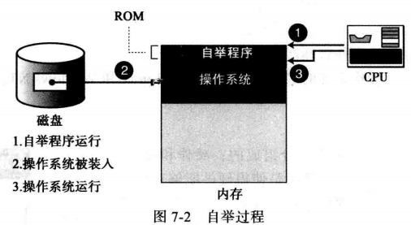
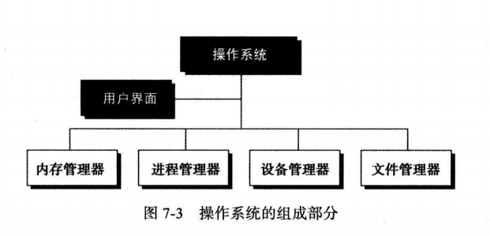
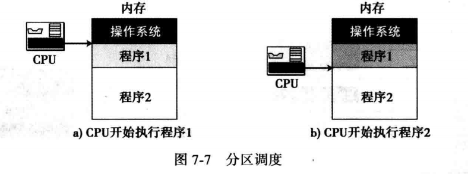
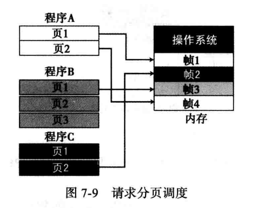
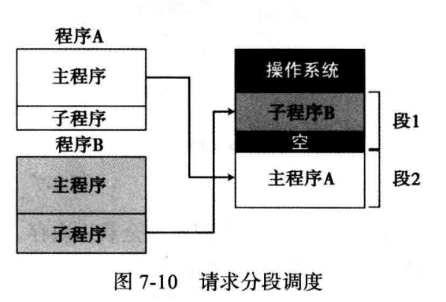
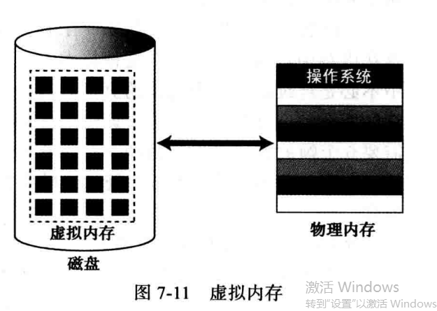
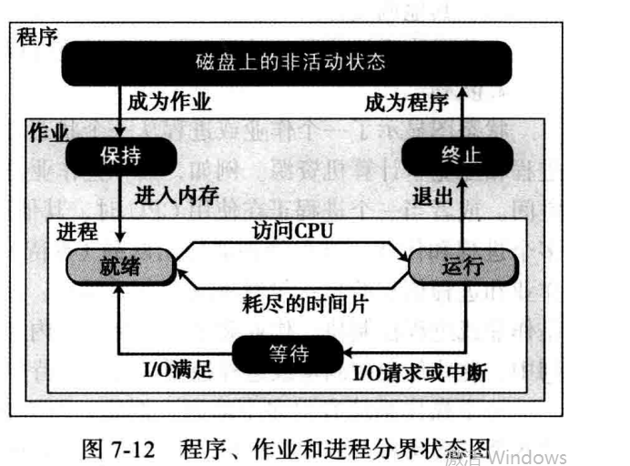
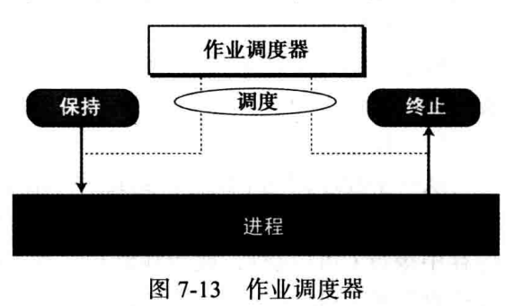
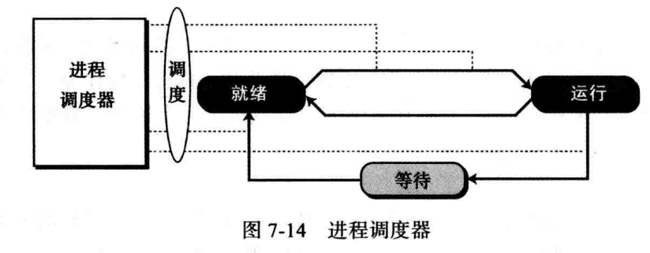
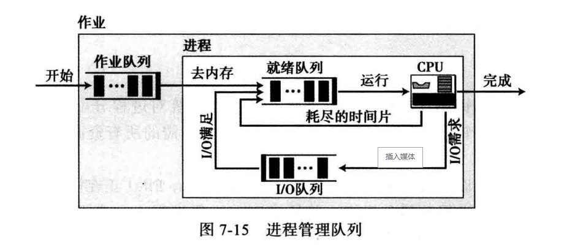

# 第7章 操作系统

- 理解操作系统在计算机中的作用
- 操作系统的定义
- 操作系统调入内存的自举过程
- 操作系统的组成部分
- 操作系统中内存管理的作用
- 操作系统中进程管理的作用
- 操作系统中设备管理的作用
- 常见的操作系统

## 操作系统

计算机系统由两个主要部分组成：硬件和软件

- 硬件：计算机物理设备
- 软件：使硬件能够正常工作的程序集合
  - 操作系统：控制计算机系统用户对硬件的访问
  - 应用程序：使用计算机硬件来解决用户问题

定义：操作系统是计算机硬件和用户（程序和人）的一个接口，它使得其他程序更加方便有效地运行，并能方便地对计算机硬件和软件资源进行访问

操作系统的两个主要目标

- 有效使用硬件
- 有效使用资源

## 操作系统——自举过程

操作系统负责把其他程序装入内存，以便运行，但是操作系统本身也是程序，也需要装入内存和运行，这个问题如何解决？

使用ROM技术把操作系统存储（由制造商完成）在内存中，即可解决。

## 操作系统——演化

-->批处理系统	

​		-->分时系统		

​			-->个人系统			

​				-->并行系统				

​					-->分布式系统					

​							-->实时系统

### 演化（批处理系统）

早期的操作系统，用穿孔卡进行输入数据，行式打印机输出结果，磁带作为存储设备

每一个要运行的程序叫做一个作业

它们保证计算机所有资源从一个作业转换到另一个作业

### 演化（分时系统）

为了有效的使用资源，多道程序的概念被引入。它可以将多个作业同时装入内存，并且仅当该资源可用时分配给需要它的作业。

- 多道程序的分时概念：资源可以被不同的作业分享。每个作业可以分到一段时间来使用资源。
- 调度：给不同的程序分配资源并决定哪一个程序什么时候使用哪一种资源
- 进程：一个作业是一个要运行的程序，一个进程则是在内存中等待分配资源的程序

### 演化（个人系统）

当个人计算机产生后，需要有一类适合这类计算机的操作系统，于是，单用户操作系统应运而生，如DOS（磁盘操作系统）

### 演化（并行系统）

在同一计算机中安装了多个CPU，每个CPU可以处理一个程序或者一个程序的一部分，意味着很多任务可以并行处理而不再是串行处理，当然比单CPU的操作系统复杂得多。

### 演化（分布式系统）

网络和互联网的发展，扩大了操作系统的内涵，一个运行的作业可以由相隔千里的多台计算机共同完成

程序可以在一台计算机上运行一部分而在另一台计算机上运行另一部分

### 演化（实时系统）

指在特定时间限制内完成任务。

## 操作系统——组成部分

- **用户界面**
- **存储管理**
- **进程管理**
- **设备管理**
- **文件管理**

### 组成部分（用户界面）

用来接收用户（程序）的输入并向操作系统解释这些请求的程序

一些操作系统（如Unix、Linux）的用户界面，被称作命令解释程序（Shell），在Windows中则称为窗口

### 组成部分（存储管理）

内存管理器

- 分为两大类：单道程序和多道程序

    - 单道程序：大多数内存用来装载单一的程序，整个程序装入内存运行，运行结束后，程序区域由其他程序取代

        问题：

        - 程序必须能够载入内存，如果内存容量比程序小，程序无法运行
        - 当一个程序正在运行时，其他程序不能运行，一个程序经常需要从输入设备得到数据，并且把数据发送至输出设备。但输入/输出设备的速度远远小于CPU，当输入/输出设备运行时，CPU处于空闲状态，而此时其他程序不在内存中，CPU不能为其服务，性能很低

    - 多道程序：同一时刻可以装入多个程序到内存，并且能同时被执行CPU轮流为其服务

    - 多道程序的分类

        - 非交换：程序在运行期间始终驻留在内存中
            - 分区调度
            - 分页调度
        - 交换：在运行过程中，程序可以在内存和硬盘之间多次交换数据
            - 请求分页调度
            - 请求分段调度
            - 请求分页和分段调度

**分区调度**：内存被分为不定长的几个分区，每个分区保存一个程序，CPU在各个程序间交替服务

每个程序完全载入内存，并占用连续的地址，分区调度改进了CPU的执行效率，但还有以下问题：

- 分区大小必须由内存管理器预先决定，分区小了程序装不进，分区大了出现空闲区
- 即使分区在刚开始分配合理，但随着新程序的交换载入内存后可能出现空闲区
- 当空闲区过多时，内存管理器能够紧缩分区并删除空闲去和创建新区，但会增加系统额外开销

**分页调度**：内存被分成大小相等的若干个部分，称为帧，程序被分为大小相等的部分，称为页，通常帧和页的大小一样

- 程序在内存中不必是连续的
- 问题：分页调度在一定程度上提高了效率，但整个程序仍然需要全部载入内存运行

**请求分页调度**：程序被分成页，但页可以依次载入内存运行和替换，程序不需要全部载入内存

- 来自同一个程序的连续页可以不必载入同一个帧，一个页可以载入任何一个空闲帧

**请求分段调度**：程序通常由主程序和子程序组成，程序将按程序员的角度划分为段，它们载入内存中执行，然后被来自同一程序或其他程序的模块所替代

**请求分页和分段调度**：结合了两者的优点以提高系统效率。

- 一个段可能太大而不能载入内存中的空闲区，内存可以分成很多帧，一个模块可以分成很多页，依次装入内存执行
- 虚拟内存：在请求分页调度和请求分段调度时，一部分程序驻留在内存中，一部分程序则放在硬盘上

### 组成部分（进程管理）

程序、作业和进程

- 程序：是由程序员编写的一组稳定的指令，存在磁盘上，它可能会也可能不会成为作业
- 作业：从一个程序被选中执行，到其运行结束并再次成为一个程序的这段过程中，该程序称为作业
- 进程：是一个运行中的程序，该程序开始运行但还未结束，只要作业装入内存就成为进程
- 程序、作业和进程之间的状态图

- 调度器：将一个作业或进程从一个状态改变为另一个状态，进程管理器使用了两个调度器

    - 作业调度器：将一个作业从保持状态转入就绪状态，或从运行状态转入终止状态

    

    - 进程调度器

- 队列：很多作业和进程相互竞争计算机资源，为处理多个进程和作业，进程管理器使用队列（等待列表）
- 与每个作业或进程相关的是存有这些作业和进程信息的作业控制块和进程控制块
- 队列中存的不是作业和进程本身，而是作业块或进程块，作业或进程仍保存在内存或硬盘中
- 操作系统可以有多个队列，如作业和进程在三个队列里循环：作业队列、就绪队列、和I/O队列
    - 作业队列：保存等待内存的作业
    - 就绪队列：保存已在内存中准备好运行但在等待CPU的进程
    - I/O队列：保存正在等待I/O设备的进程（可以有多个I/O队列）
- 进程管理器可以用多种策略从队列中选择下一个作业或进程执行，可以是先入先出（FIFO）、最短时间优先、最高优先级等

- 进程同步
    - 有进程管理的思想都是使的拥有不同资源的不同进程同步，只要资源可以被多个进程同时使用，那么它就可能有两种有问题的状态：死锁和饿死
    - 死锁
        - 发生在操作系统允许一个进程运行，而不用首先检查它所需资源是否准备好，是否允许这个进程占有资源直到它不需要为止