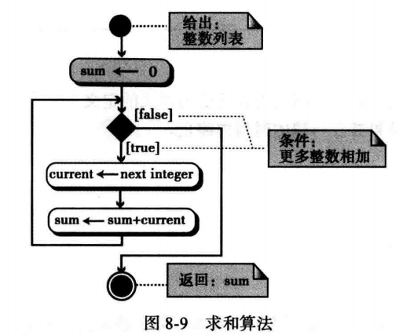

# 第8章 算法

- 定义算法
- 定义三种结构（顺序、选择和循环）
- 描述UML图和当表示算法时它们是如何使用的
- 描述伪代码和当表示算法时它们是如何使用的
- 列出基本算法和它们的应用
- 描述排序的概念，理解三种原始排序算法的机制
- 描述搜索的概念，理解两种常见搜索算法的机制
- 定义子算法和它们与算法的关系
- 区分迭代和递归算法

## 算法（简单定义）

### 概念

算法的概念

- <font color='red'>非正式定义：</font>是一种<font color='red'>逐步</font>解决问题或完成任务的<font color='red'>方法</font>，按照这种定义，算法完全独立于计算机系统
- 计算机算法接收一组输入数据，同时产生一组输出数据


### 示例

求5个正整数的最大值


定义动作


细化


泛化


### 三种结构

计算机专家为结构化程序或算法定义了三种结构，这种想法认为程序必定是由<font color='red'>顺序</font>、<font color='red'>判断</font>（选择）和<font color='red'>循环</font>组成，已经证实其它结构是不必要的


### 算法的表示

- 使用<font color='red'>UML和伪代码</font>来表示算法

- UML（统一建模语言）是算法的图形表示法，使用图的形式掩盖了算法的所有细节，只显示算法从开始到结束的整个流程

    

- 伪代码是算法的一种类似英语的表示法，到现在还没有伪代码的标准


例 8.1：用伪代码写出求两个整数之和的算法

解	这个简单的问题只要使用顺序结构就可以解决。注意，同时还给该算法命名，定义算法的输入，并在结尾用一条返回指令来返回和。

​																	算法8.1	计算两个整数之和	

> ​	算法：SumOfTwo(first, second)
>
> ​	目的：求两个整数之和
>
> ​	前提：给定两个整数（first和second）
>
> ​	后续：无
>
> ​	返回：和的值
>

```
{
	sum <- first + second
	return sum
}
```

例 8.2：编写可以把一组不同的成绩分成及格或不及格的算法

解	这个问题如果仅用顺序结构将无法完成，另外还需要判断结构。计算机给出0~100之间的一个数，如果这个数大于或等于70则返回“及格”（pass），如果小于70则返回“不及格”（nopass）。

​																	算法8.2	及格/不及格分级

> ​	算法：Pass/Nopass(score)
>
> ​	目的：给定分数，创建及格/不及格等级
>
> ​	前提：给定要被改成等级的分数
>
> ​	后续：无
>
> ​	返回：等级
>

```
{
	if(score ≥ 70)	grade <- "pass"
	else			grade <- "nopass"
	return grade
}
```

例 8.3：编写将数字型成绩（整数）变为字母等级成绩的算法。

解	这个问题需要多个判断。算法8.3中的伪代码显示的是一种解决方法（并不是最好的方法，但却是最容易理解的方法）。同样，计算机给出0~100之间的任意一个数，算法必须把它划分到正确的字母等级中去（A、B、C、D、或F）。

​																	算法8.3	赋予字母等级成绩

> 算法：LetterGrade(score)
>
> 目的：给定分数，找到相应的字母等级
>
> 前提：给定数字分数
>
> 后续：无
>
> 返回：字母等级

```
{
	if (100 ≥ score ≥ 90)	grade <- 'A'
	if (89 ≥ score ≥ 80)	grade <- 'B'
	if (79 ≥ score ≥ 70)	grade <- 'C'
	if (69 ≥ score ≥ 60)	grade <- 'D'
	if (59 ≥ score ≥ 0)	grade <- 'F'
}
```

例 8.4： 编写从一组整数中求最大数的算法，该组整数的数目事先并不知道。

解	使用图8-5中介绍的概念编写出解决该问题的算法（见算法8.4）

​																	算法8.4	求一组整数中的最大值

> 算法：FindLargest(list)
>
> 目的：求一组整数中的最大值
>
> 前提：给定一组整数
>
> 后续：无
>
> 返回：最大整数

```
{
	largest <- -∞
	while (more integers to check)
	{
		current <- nextinteger
		if (current > largest)	largest <- current
	}
	return largest
}
```

例 8.5：编写从一组整数前1000个整数中求最小值的算法。

解	这里需要用一个计数器来计数。把这个计数器初始化为1，每循环一次就对它加1。当计数器大于1000时，退出循环（参见算法8.5）。注意，列表中有超过1000个整数，但是我们需要求前1000个整数中的最小值。

​																	算法8.5	求前1000个整数中的最小整数

> 算法：FindSmallest(list)
>
> 目的：求前1000个整数中的最小整数，并返回
>
> 前提：给定一组超过1000个整数
>
> 后续：无
>
> 返回：最小整数

```
{
	smallest <- +∞
	counter <- 1
	while (counter ≤ 1000)
	{
		current <- nextinteger
		if (current < smallest)
		smallest <- current
		counter <- counter + 1
	}
	return smallest
}
```

## 算法

- 更正式的定义：算法是一组<font color='red'>明确</font>步骤的<font color='red'>有序集合</font>，它产生结果并在<font color='red'>有限的时间</font>内终止
- 算法必须是一组<font color='red'>定义良好（最优算法）</font>且有序的指令集合

### 基本算法

- 求和：对一组数据求和
    - 将和（sum）初始化
    - 循环，在每次迭代中将一个新数加到sum上
    - 退出循环后返回结果



- 乘积：对一组数据的乘积
    - 将乘积（product）初始化
    - 循环，在每次迭代中将一个新的数与product相乘
    - 退出循环后返回结果


- 最大和最小：求一组数据的最大和最小值

- 排序：根据一组数据的值对它们进行排序

    - 选择排序
    - 冒泡排序
    - 插入排序

    > 这三种排序方法是当今计算机科学中使用的快速排序的基础

### 选择排序

数字列表可分成<font color='red'>两个子列表</font>（已排序和未排序），它们通过假想的一堵墙分开。求未排序子列表中<font color='red'>最小</font>的元素并把它和

