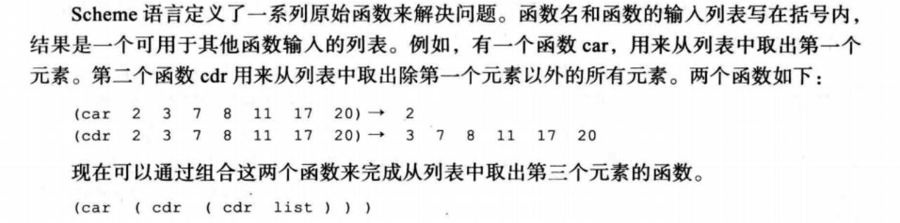

# 第9章 程序语言设计

- 描述从机器语言到高级语言的编程语言<font color='red'>演化</font>
- 理解如何使用解释器和编译器将高级语言中的程序<font color='red'>翻译</font>成机器语言
- 区分4种计算机语言<font color='red'>模式</font>
- 理解<font color='red'>过程模式</font>和在模式中程序单元与数据项间的交互
- 理解<font color='red'>面向对象模式</font>和在这种模式中程序单元与对象间的交互
- 定义<font color='red'>函数式模式</font>，理解它的应用
- 定义<font color='red'>声明式模式</font>，理解它的应用
- 定义过程式和面向对象语言中的常见概念

## 程序语言设计——演化

### 机器语言

- <font color='red'>计算机语言</font>是指编写程序时，根据事先定义的规则（语法）而写出预定语句集合
- 机器语言：计算机发展早期，唯一的 程序设计语言是<font color='red'>机器语言</font>，每一台计算机有其自己的机器语言，这种机器语言由0和1序列组成
- 计算机<font color='red'>唯一</font>能识别的语言是机器语言
- 机器语言缺点：
  - 依赖于计算机
  - 编写程序容易出错 


### 汇编语言

- 汇编语言：<font color='red'>带符号或助记符</font>的指令和地址代替二进制码的机器语言，这些语言首先被称为<font color='red'>符号语言</font>，这些助记符语言后来被称为<font color='red'>汇编语言</font>
- <font color='red'>汇编语言最终要翻译成机器语言执行</font>


### 高级语言

- 高级语言：汇编语言虽然提高了编程效率，但仍然需要程序员在所使用的硬件上花费大量的精力，为了提高程序员的编程效率，促进了高级语言的发展
- 高级语言可以移植到不同的机器上
- 高级语言和汇编语言有一个<font color='red'>共性</font>：<font color='red'>必须转化为机器语言</font>，这个转化过程称为<font color='red'>解释或编译</font>
- BASIC   	COBOL	Pascal		Ada	C	C++	Java


## 程序语言设计——翻译

- 当今程序通常是用一种高级语言来编写，为了能够在计算机上运行程序，程序要被<font color='red'>翻译</font>成它要运行在计算机的机器语言
- 高级语言程序被称为<font color='red'>源程序</font>，被翻译成的机器语言称为<font color='red'>目标程序</font>
- 有两种方法用于翻译：<font color='red'>编译和解释</font>

### 编译

<font color='red'>编译程序（编译器）</font>通常把<font color='red'>整个源程序翻译成目标程序</font>

### 解释

- 解释：有些高级编程语言使用<font color='red'>解释器</font>把源程序翻译成目标程序
- 解释是指把源程序中的<font color='red'>每一行翻译成</font>目标程序中相应的行，并执行它的过程
- 解释中的两种趋势
  - 在Java语言之前被有些程序使用的解释
  - Java使用的解释

------

- 解释的第一种方法：

  - 源程序的每一行被翻译成被其使用的计算机上的 机器语言，该机器语言被<font color='red'>立即执行</font>

  - 如果在翻译和执行中有任何错误，过程就显示消息，其余过程就被终止，程序需要被改正，再次从头解释和执行

  - 第一种方法被看成是一种<font color='red'>慢</font>的过程，这就是大多数语言使用编译而不是解释的原因

- 解释的第二种方法：
  - 随着Java的到来，一种新的解释过程被引入。Java语言能向任何计算机移植，为了<font color='red'>取得可移植性</font>，源程序到目标程序的翻译分成两步进行：编译和解释
  - Java源程序首先被编译成Java的<font color='red'>字节码</font>，字节码看起来像机器语言中的代码，但不是任何特定计算机的目标代码，它是一种虚拟机的目标代码，该虚拟机称为<font color='red'>Java虚拟机（JVM）</font>
  - 字节码能被任何运行JVM的计算机编译和解释

#### 翻译过程

编译和解释的不同在于，<font color='red'>编译在执行前翻译整个源代码</font>，而<font color='red'>解释一次只翻译和执行源代码中的一行</font>，但编译和解释都遵循相同的翻译过程


- 词法分析器：
  - 一个符号接一个符号地读源代码，创建源程序中的<font color='red'>助记符表</font>
  - 如5个符号w、h、i、l、e被读入，组合起来就形成了C、C++或Java中的助记符while
- 语法分析器：
  - 分析一组助记符，找出指令
  - 如语法分析器使用助记符 “x”、“=”、“0”创建C语言中的赋值语句“x=0”
- 语义分析器：检查语法分析器创建的句子，确保它们<font color='red'>不含二义性</font>
- 代码生成器：在无二义性指令被语义分析器创建之后，每条指令将转化为一组要在其上运行的计算机的机器语言

## 程序语言设计——编程模式

模式是计算机语言<font color='red'>看待</font>要解决问题的一种方式

计算机语言可以分成4种模式：

- 过程性（强制性）
- 面向对象
- 函数式
- 说明式


### 过程性

- 过程式模式：把程序看成是<font color='red'>操纵被动对象的主动主体</font>
- 一个被动对象本身不能发出一个动作，但它能从主动主体接收动作
- 过程式模式下，程序就是主动主体，该主体使用称为数据或数据项的被动对象，作为被动对象的数据项存储在计算机内存中，程序操纵它们
- 为了操纵数据，主动主体（程序）发出动作，称之为<font color='red'>过程</font>
- 在过程模式中，对象和过程是完全独立分开的实体


过程式模式中程序由三部分构成：

- 对象创建部分
- 一组过程调用
- 每个过程的一组代码


### 面向对象

面向对象模式：处理<font color='red'>活动</font>对象，而不是被动对象，在这些对象上执行的动作都包含在这些对象中，对象只需要接收合适的<font color='red'>外部刺激</font>来执行其中的一个动作


- 面向对象模式中的程序中仅仅向对象发送相应的请求，对象做出对应的反应。
- <font color='red'>方法</font>被相同类型的所有对象共享，也被从这些对象<font color='red'>继承</font>的其他对象共享
- 过程模式中的过程是独立的实体，面向对象模式中的方法是属于对象的

------

- 类：相同类型的对象需要一组方法，这些方法显示了这类对象对来自对象外的刺激反应，为了创建这些方法，面向对象语言，如C++、Java使用<font color='red'>称为类的单元</font>


- 方法：方法格式与有些过程式语言中用的函数非常相似，每个方法有它的头、局部变量和语句
- 对过程式语言所讨论的大多数特性都可以应用在为面向对象程序所写的方法上
- 继承性：在面向对象模式中，作为本质，<font color='red'>一个对象能从另一个对象继承</font>。这个概念被称为继承性
- <font color='red'>多态性：</font>意思是“许多形状”，在面向对象模式中的多态性是指我们可以定义一些具体相同名字的操作，而这些操作在相关类中做不同的事情
- 一些面向对象的语言：C++、Java等

### 函数式

函数式模式：程序被看成是一个<font color='red'>数学函数</font>，函数是把一组输入映射到一组输出的<font color='red'>黑盒子</font>

主要实现以下功能:

- 函数式语言<font color='red'>预定义</font>一系列可供任何程序员调用的<font color='red'>原始（原子）函数</font>
- 函数式语言允许程序员通过若干个原始函数的组合创建新的函数


一些函数式语言

- LIST：表处理解释语言，是一种把表作为处理对象的语言
- Scheme：定义了一系列原始函数来解决问题。函数名和函数的输入列表写在括号内，结果是一个可用于其他函数输入的列表



### 说明式

说明式模式：依据<font color='red'>逻辑推理</font>的原则响应查询

说明性语言有自生的缺憾，就是有关特殊领域的程序由于要收集<font color='red'>大量的事实</font>信息而变得非常庞大。

说明性语言迄今为止只局限于<font color='red'>人工智能领域</font>


## 程序语言设计——共同概念

### 标识符

所有计算机语言的共同特点之一就是都具有**标识符**，即对象的名称。标识符允许给程序中对象命名。例如，计算机中每一个数据都存储在一个唯一的地址中。如果没有标识符来符号化代表数据的位置，你就不得不去了解并直接使用数据的地址来操纵它们。取而代之，只要简单给出数据的名字就可以让编译器去跟踪数据实际存放的物理地址。

### 数据类型

<font color='red'>数据类型：</font>定义了一系列值以及应用于这些值的一系列操作。每种数据类型值的集合称为数据类型的域。

大多数语言都定义了两类数据类型

- 简单数据类型
- 复合数据类型

<font color='red'>简单数据类型</font>：（有时称为原子类型、<font color='red'>基本类型</font>）是不能分解成更小数据类型的数据类型

强制性语言已经定义了一些简单数据类型

- 整数类型：不包括小数部分的整数
- 实数类型：带小数部分的数字
- 字符类型：被语言使用的潜在字符集（ASCII或Unicode）中的符号
- 布尔类型：只取两个值（真或假）的数据类型

复合数据类型：是<font color='red'>一组</font>元素，其中每个元素都是简单数据类型或复合数据类型

- <font color='red'>数组</font>：是一组元素，其中每个元素具有<font color='red'>相同类型</font>
- 记录：是一组元素，其中的元素<font color='red'>可以具有不同类型</font>

### 变量

​	变量：是存储单元的名字，每个内存单元在计算机中都有一个地址，虽然计算机内部使用地址，但对程序员而言却不方便，使用变量来代替地址，<font color='red'>变量具有数据类型</font>

### 变量声明

大多数过程式语言和面向对象语言要求变量在<font color='red'>使用前</font>被声明，声明警告计算机被赋予名字和类型的变量将在程序中使用。计算机预留出要求的存储区域，并命名它

如在C、C++、Java等语言中可以定义三种变量数据类型：字符、整数和实数

- char c；		声明一个具有字符类型的变量c
- int num；		声明整数类型变量num
- double result；	声明实数类型变量result

### 变量初始化

允许变量在声明时进行初始化，初始化就是在变量中存储一个值，如

- char c = 'Z';
- int num = 123;
- double result = 256.782

### 字面值

字面值是程序中使用的预定义的值。

例如，当半径存储在变量r中，需要计算圆的面积时，可以使用表达式3.14 * r<sup>2</sup>，其中，其中π（pi）的近似值就是被用作字面值。

在大多数程序设计中，可以有整数、实数、字符和布尔字面值。还可以有字符串字面值。为了把字符和字符串字面值从变量名和其他对象中区分开，大多数语言要求字符字面值被括在单引号中，如'A'，而字符串字面值被括中双引号，如"Anne"。

### 常量

<font color='red'>常量</font>：是一个可以存储值的命名的位置，但常量在程序开始处被定义后就不能改变


注意，常量（像变量一样）有类型，当常量被声明时，要定义它的类型

### 输入和输出

输入和输出：几乎所有的程序都需要输入或输出数据，大多数程序设计语言使用一些<font color='red'>预先定义</font>好的函数完成输入和输出

**输入**：数据通过语句或者预先定义的函数来完成输入。C语言有几个输入函数。如<font color='red'>scanf函数</font>用来从键盘读取数据并格式化，把它存储在一个变量中

- sacnf("%d", &num);	&地址符

当程序遇到该函数指令时，程序等待用户输入一个整数，然后将这个值存储在num中，%d告诉用户程序需要一个整型数据,%d是一个占位符

**输出**：数据通过语句或者<font color='red'>预先定义</font>的函数完成输出。C语言有几个输出函数。如<font color='red'>printf</font>函数能够在显示器上输出一个字符串

- printf(“The value of the number is : %d” , num);
- 表示在文本字符串的末尾显示一个变量的值
- The value of the number is : 1

### 表达式

<font color='red'>表达式：</font>是由一系列操作数和运算符简化后的一个单一数值，如2 * 5 + 3 

### 运算符

<font color='red'>运算符：</font>是用来完成一个动作的特定语言的语法记号，最熟悉的一些运算符都是从数学中得到，如乘法（*）是一个运算符，表示两个数相乘。每种语言都有运算符，并且它们在语法或规则等方面的使用是<font color='red'>严格定义</font>的

<font color='red'>算术运算符</font>被用在大多数语言中，如C、C++、Java中的算术运算符


<font color='red'>关系运算符</font>用于比较两个数的大小关系，关系运算符的结果是逻辑值（true或false），如C、C++、Java中的6种关系运算符


<font color='red'>逻辑运算符</font>是逻辑值（true或false）组合后得到的一个新值，C语言中使用的3种逻辑运算符


操作数接收一个运算符的动作，对于任何一个运算符可能有1个或多个操作数，如除法运算的操作数是被除数和除数。

### 语句

<font color='red'>语句：</font>每条语句都使程序执行一个相应<font color='red'>动作</font>。它被直接翻译成一条或多条计算机可执行的指令

- <font color='red'>赋值语句：</font>给变量赋值，它存储一个值在变量中，该变量是声明部分已经被创建的。在我们的 算法中，使用符号“<--”定义赋值。大多数语言（如C、Java等）使用“=”来赋值，其他语言（如Ada或Pascal）使用“:=”来赋值
- <font color='red'>复合语句：</font>是一个包含0个或多个语句的代码单元。它也被称为块。复合语句成为一个整体。复合语句包括<font color='red'>一个左大括号、一个可选语句段以及一个右大括号</font>，如

```
{
  x = 1；
  y = 20；
}

```

- <font color='red'>控制语句：</font>是语句的集合，在过程式语言中作为一个程序执行。语句通常是一行接一行执行的，但是有时候需要<font color='red'>改变执行顺序</font>，如：去重复执一行或一组语句，两组语句的执行依赖于布尔值

  > 大多数强制性语言都有两路和多路选择语句。两路选择通过if-else语句取得，多路选择通过switch（或case）语句取得


- <font color='red'>循环语句：</font>大多数强制性语言定义了1-3个能实现重复的循环语句。
- C语言中主要的重复语句是while循环。while循环是一个<font color='red'>预先检查</font>的循环，它检查测试表达式的值。如果值为真，则进入循环迭代一次，然后再检测。while循环被认为是<font color='red'>事件控制</font>循环。循环将一直持续到一个事件的发生，即被检查的表达式的值为假时，退出循环。
- <font color='red'>for循环</font>也是一个先测试循环，它是一个计数器控制循环，计数器被初始化为一个初始值，然后每一次循环中增加（或减少），当计数器的值达到预定值时退出循环。
- <font color='red'>do循环</font>也是一个事件控制循环，它是一个<font color='red'>后测试循环</font>。循环首先进行一次迭代后，测试表达式的值。如果是假，则终止，如果是真，就再进行一次循环而后再测试。


### 子程序

<font color='red'>子程序：</font>那些完成单一任务的这些过程的子集能集合在一起，放在它们自己的程序单元中，也就是子程序，子程序使得程序变得<font color='red'>更结构化</font>

完成特定任务的子程序能<font color='red'>一次编写，多次调用</font>


<font color='red'>局部变量</font>：在过程式语言中，就像主程序一样，子程序能调用预定义的过程，在局部对象上操作。当子程序每次调用时，这些局部对象或局部变量被创建，当控制从子程序返回时被销毁，局部对象属于子程序

参数：主程序调用子程序使用<font color='red'>参数</font>传递一些数据，在主程序中称为<font color='red'>实际参数</font>，在子程序中称为<font color='red'>形式参数</font>。

> 主程序可以通过两种方式来给子程序传递参数
>
> - 传值
> - 传引用

<font color='red'>参数传值：</font>在传值参数中主程序和子程序创建两个不同对象（变量）。在主程序中创建的对象属于主程序，在子程序中创建的对象属于子程序。因为作用域不同，所以相同的对象可以有相同的名字或不同的名字。

> 主程序和子程序的通信是<font color='red'>单方向的</font>，从主程序到子程序。主程序传递实际参数的值，存储到子程序中相应的形式参数中。从子程序到主程序没有参数的通信


​	<font color='red'>参数传引用：</font>引用传递被设计来允许子程序改变主程序中变量的值。在引用传递中，变量（实际上它时内存的地址）被主程序和子程序共享。相同的变量可能在主程序和子程序中有不同的名字，但是两个名字是指向同一个变量。

> 我们可以形象地把引用传递看成是有两个门的盒子，一个开在主程序；另一个开在子程序。主程序可以把值留在盒子里给子程序，子程序可以改变这个原始的值，并留个新值给主程序。


返回值：子程序可以被设计成返回一个值或者几个值。这是预定义过程被设计的方法。当使用表达式C <- A + B时，实际调用过程add(A,B)，该过程返回一个值，并存储在变量C中。

实现：子程序概念在不同的语言中被不同地实现。在C和C++中，子程序被实现为**函数**。