# 第10章 软件工程

- 理解软件工程中的软件生命周期的概念
- 两种主要的开发过程模型：瀑布模型和增量模型
- 理解分析阶段，分析阶段的两种独立方法：面向过程和面向对象分析
- 理解设计阶段，设计阶段的两种独立方法：面向过程和面向对象设计
- 描述实现阶段，识别该阶段中的质量问题
- 描述测试阶段，区分白盒测试和黑盒测试
- 文档的重要性，区分用户文档、系统文档和技术文档

------

软件工程是建立在这样一个基础上，即利用合理的工程方法和原则来获得在真实机器上工作的可靠软件

## 软件工程——软件生命周期

软件生命周期：

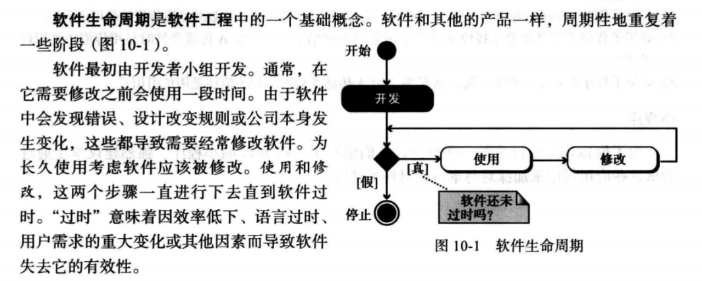

## 软件工程——开发过程模型

开发过程模型

- 开发过程包括4个阶段：分析、设计、实现和测试
- 最常见的两种开发过程模型
  - 瀑布模型
  - 增量模型（迭代模型）

### 瀑布模型

瀑布模型：开发过程只有一个方向的流动，这意味着前一个阶段不结束，后一个阶段不能开始

- 优点：在下一个阶段开始前每个阶段已经完成
- 缺点：如果过程中一部分有问题，必须检查整个过程

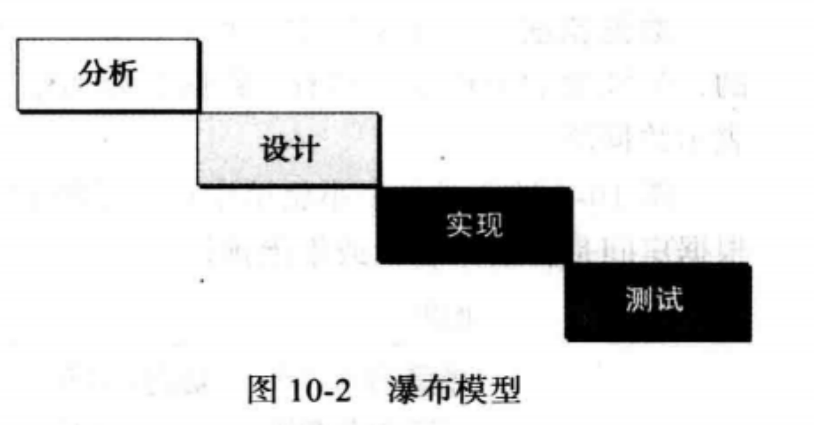

### 增量模型

增量模型（迭代）：软件的开发要经历一系列步骤。开发者首先完成整个系统的一个简化版本，这个版本表示了整个系统，但不包括具体的细节

第二个版本中，更多的细节被加入，而有些还没完成，然后再次测试系统。如果这时有问题，开发者知道问题出于新功能。直到现有系统工作正确后，才增加新的功能，这个过程一直继续下去，直到所有功能全部被加入

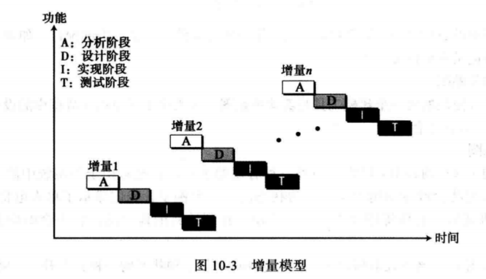

## 软件工程——分析阶段

分析阶段：整个开发过程始于分析阶段，这个阶段生成规格说明文档，这个文档说了软件要做什么，而没有说明如何去做

分析阶段的两种独立方法：

- 面向过程分析：依赖于实现阶段使用过程编程语言
- 面向对象分析：依赖于实现阶段使用面向对象编程语言

### 面向过程分析

面向过程分析：如果实现阶段使用过程式语言，那么面向过程分析（也称为结构化分析或经典分析）就是分析阶段使用的方法。

这种情况下的规格说明有使用多种建模工具

- 数据流图

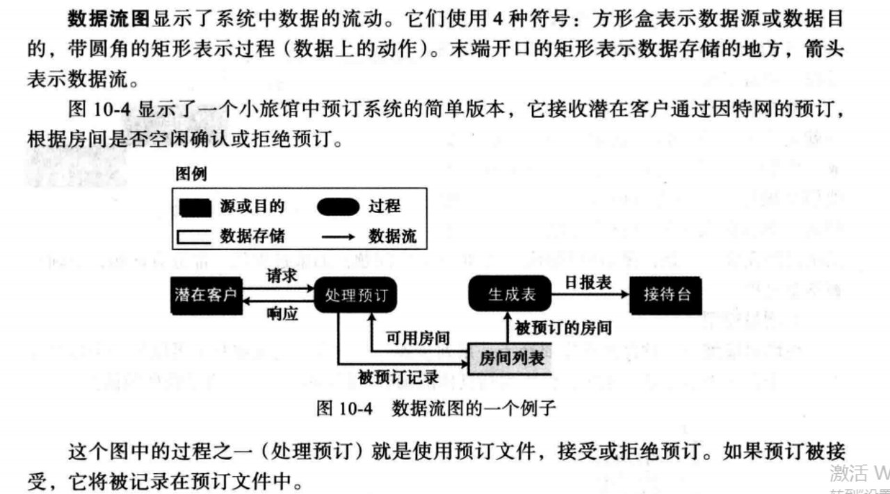

- 实体关系图（在第12章再讨论）
- 状态图

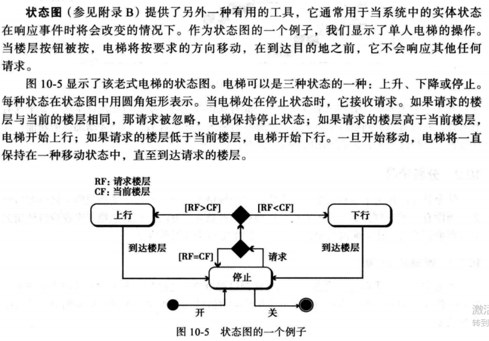

### 面向对象分析

面向对象分析：如果实现阶段使用面向对象语言，那么面向对象分析就是分析阶段使用的方法。

- 用例图

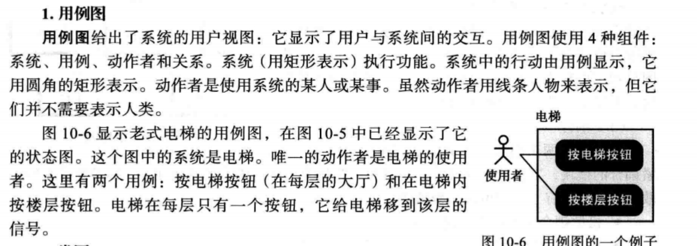

- 类图

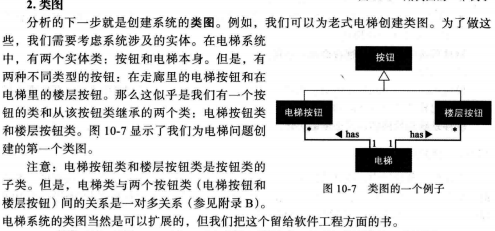

- 状态图

## 软件工程——设计阶段

设计阶段定义系统如何完成在分析阶段所定义的需求。在设计阶段，系统所有的组成部分都被定义

面向过程设计中，既要设计过程，也要设计数据，整个系统被分解成一组过程或模块

- 结构图：说明模块间关系的常用工具

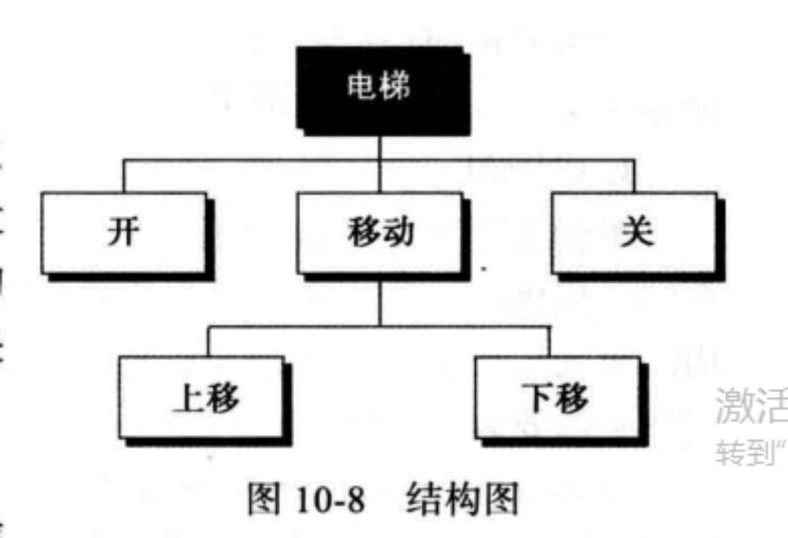

### 面向过程设计

面向过程设计

- 模块化：将大项目分解成较小的部分，以便能容易理解和处理，当系统被分解成模块时，主要关心两点：耦合和内聚
  - 耦合：是对两个模块相互绑定紧密程度的度量，越紧耦合的模块，独立性越差，所以设计时，尽量松散耦合
    - 松散耦合的模块更可能被重用
    - 松散耦合的模块不容易在相关模块中产生错误
    - 系统需要修改时，松散耦合只需要修改一部分模块，而不影响其他模块
- 内聚：是程序中处理过程相关紧密度的度量

> 软件系统中模块间的耦合必须最小化
>
> 软件系统模块间的内聚必须最大化
>
> 高内聚松耦合

### 面向对象设计

面向对象设计：在面向对象设计中，设计阶段通过详细描述类的细节来继续

- 类是由一组变量（属性）和一组方法组成，面向对象设计阶段列出这些属性和方法细节

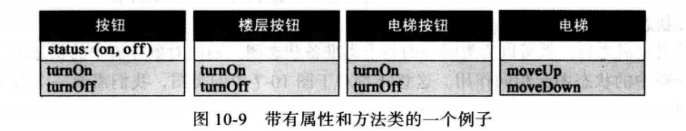

## 软件工程——实现阶段

- 语言的选择
- 软件质量

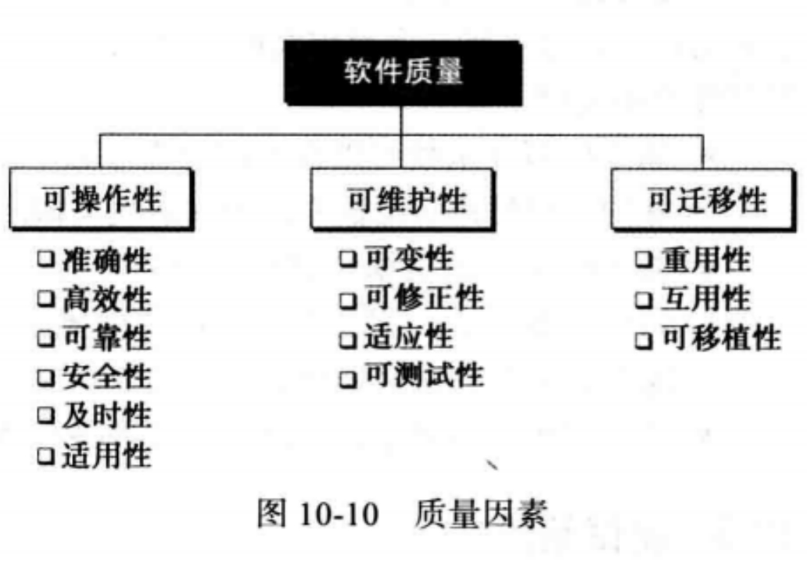

## 软件工程——测试阶段

测试阶段的目的就是发现错误（bug），良好的测试策略能发现最多的错误。

测试的两种方式：

- 白盒测试
- 黑盒测试

### 白盒测试

白盒测试（或玻璃盒测试）是基于知道软件内部结构的。测试目的是检查软件所有部分是否全部设计出来，白盒测试假定测试者知道有关软件的一切，程序就像一个玻璃盒子，其中的每件事情都是可见的。

白盒测试的四个标准：

- 每个模块中的所有的独立路径至少被测试过一次
- 所有的判断结构（两路或多路的）每个分支都被测试
- 每个循环都被测试
- 所有的数据结构都被测试

基本路径测试是一种软件中每条语句至少被执行一次的方法

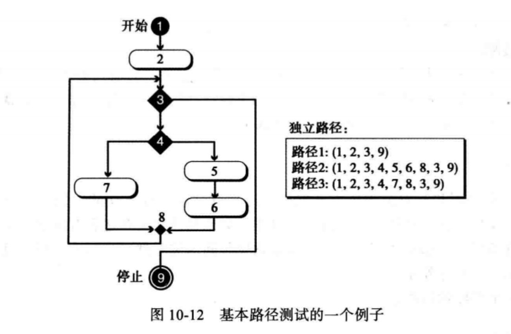

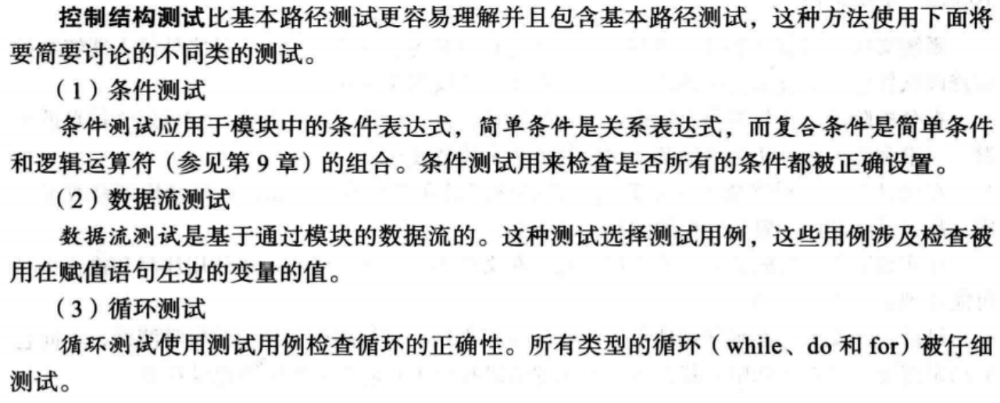

### 黑盒测试

黑盒测试：在不知道程序的内部也不知道程序是怎么工作的情况下测试程序，程序就像一个内部看不见的黑盒，黑盒测试按照软件应该完成的功能来测试

几种黑盒测试的方法：

- 穷尽测试：最好的黑盒测试方法就是输入域中的所有可能的值去测试软件
- 随机测试：选择输入域的值的子集来测试，子集的选择方式是非常重要的
- 边界测试