# 第11章 数据结构

- 定义数据结构
- 把数组定义为数据结构，并说明它是如何存储数据项列表的
- 区分数组的名称和数组中元素的名字
- 描述为数组定义的操作
- 把记录定义为数据结构，并说明它是如何用于存储属于单个数据元素的属性
- 区分记录的名称和它的域的名字
- 把链表定义为数据结构，并说明它是如何用指针来实现的
- 理解数组中节点的存储机制
- 描述为链表定义的操作
- 比较和区分数组、记录和链表
- 说明数组、记录和链表的应用

## 数组

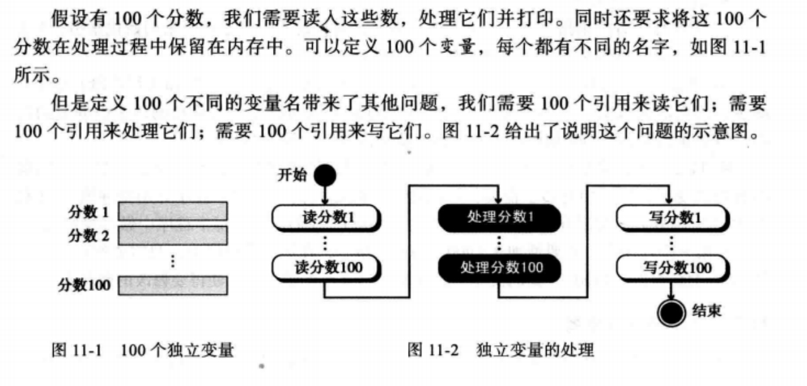

数组是元素的顺序集合，通常这些元素具有相同的数据类型

索引表示元素在数组中的顺序号，顺序号从数组开始处计数

数组元素通过索引被独立给出了地址，数组整体上有一个名称，但每个元素利用数组的的索引来单独访问

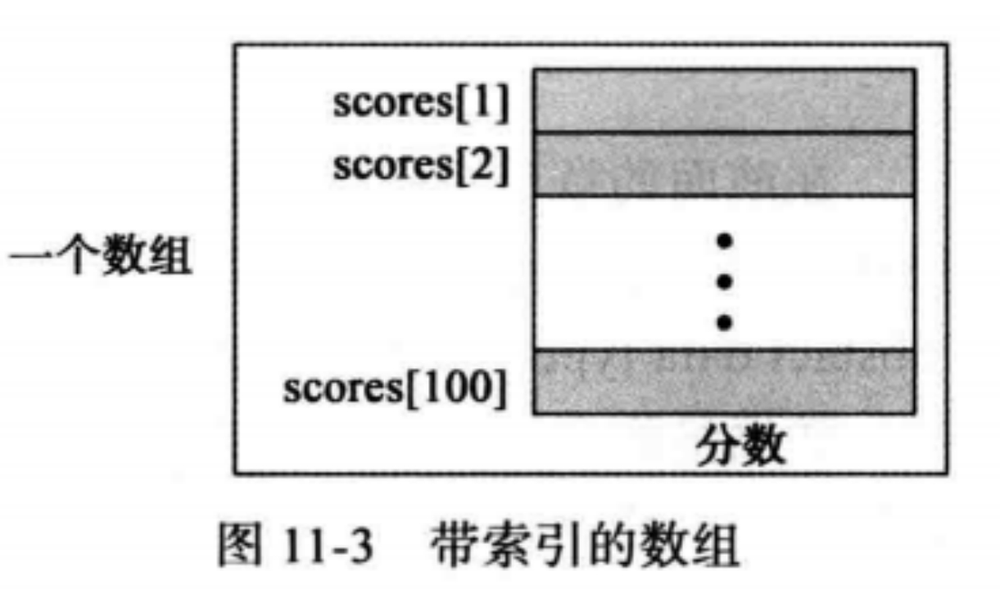

数组名和元素名：在一个数组中，有两种标识符：数组的名字和各个元素的名字。数组名是整个结构的名字，而元素名允许我们访问这个元素

数组名：如scroes

元素名：数组名后面跟一个索引号，如scores[1],scores[2]

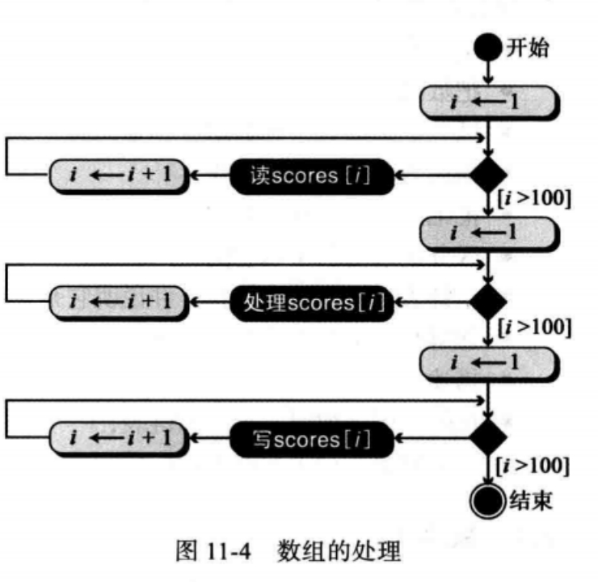

**多维数组**

- 一维数组
- 二维数组
- 多维数组

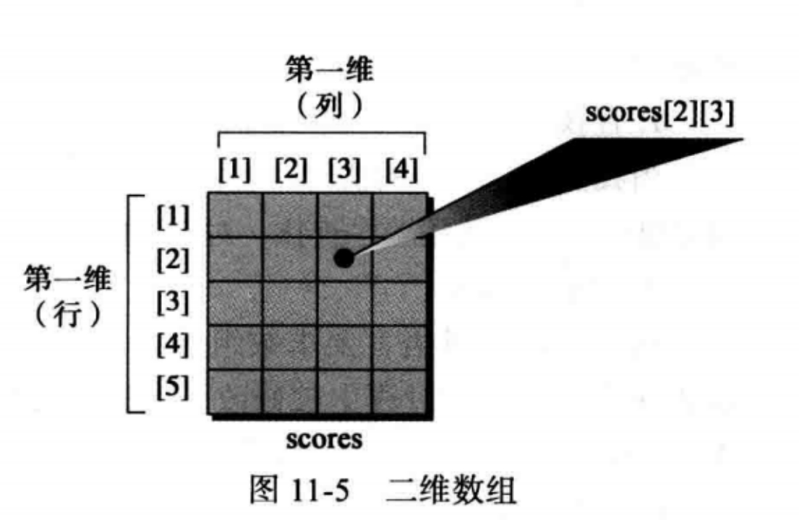

- 存储配置：一维数组的索引直接定义了元素在实际存储上的相对位置。但是二维数组表示行和列
- 在内存中如何存储每个元素取决于计算机，大多数计算机使用行主序存储，其中数组的一个整行在内存上存储在下一个行之前，但是计算机也可以使用列主序存储，其中一个整列在内存上存储在下一个列之前

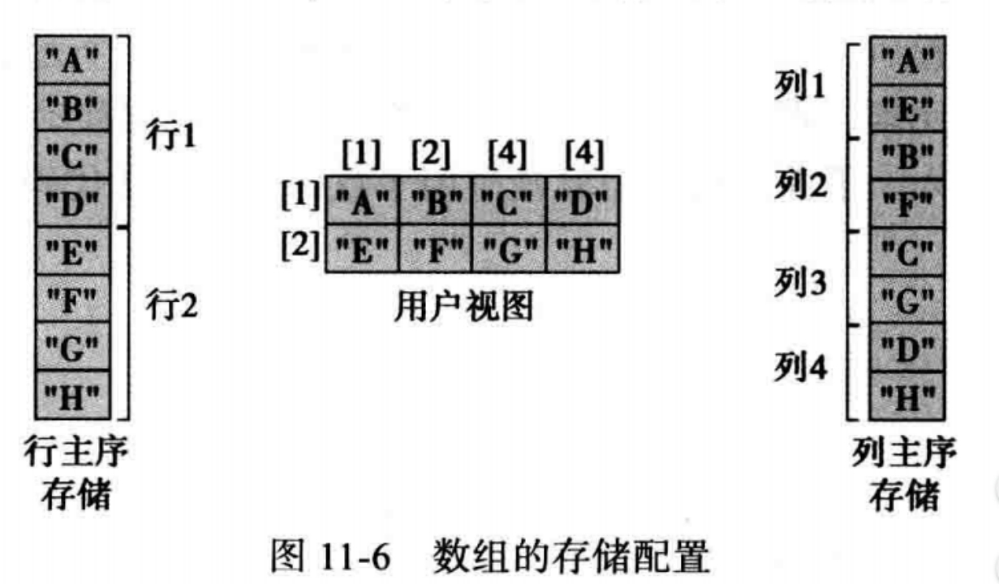

### 数组操作

数组操作：常用操作有查找、插入、删除、检索和遍历

- 查找元素：根据元素的值，找到元素的序号，顺序查找和折半查找
- 元素的插入：通常计算机语言要求数组的的大小，在被定义的时候不能修改
  - 尾部插入
  - 开始或中间插入
- 元素的删除
- 元素检索：根据数组的索引对元素进行存取
- 数组的遍历：被应用于每个元素上的操作
- 数组的应用：当需要进行的插入和删除操作数目较少，而需要大量的查找和检索操作时，数组是合适的结构

## 记录

记录是一组相关元素的集合，它们可能是不同的类型，但整个记录有一个名称。记录中的每个元素称为域（属性、字段），域是具有含义的最小命名数据，它有类型且存在于内存中。它能被赋值，反之也能被选择和操纵。域不同变量主要在它是记录的一部分。

在记录中的元素可以是相同类型或不同类型，但记录中的所有元素必须是有所关联的

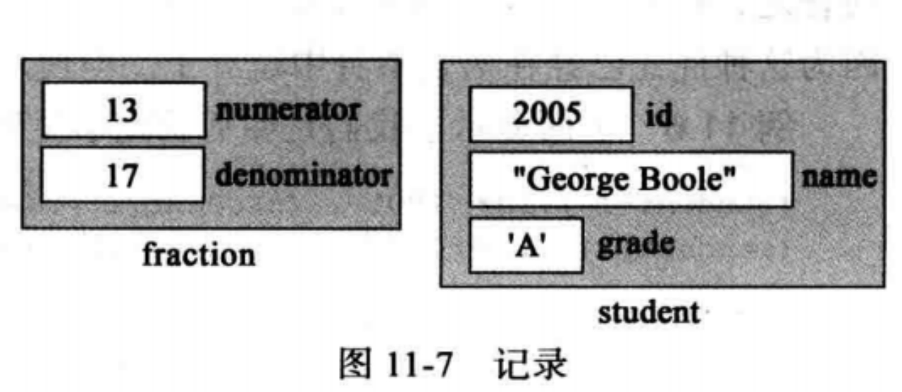

记录名与域名

- 记录的名字是整个结构的名字，而每个域的名字允许我们存取这些域
- 记录的名字是student，域的名字是student.id，student.name和student.grade，大多数编程语言使用点（.）来分隔记录名和它域的名字

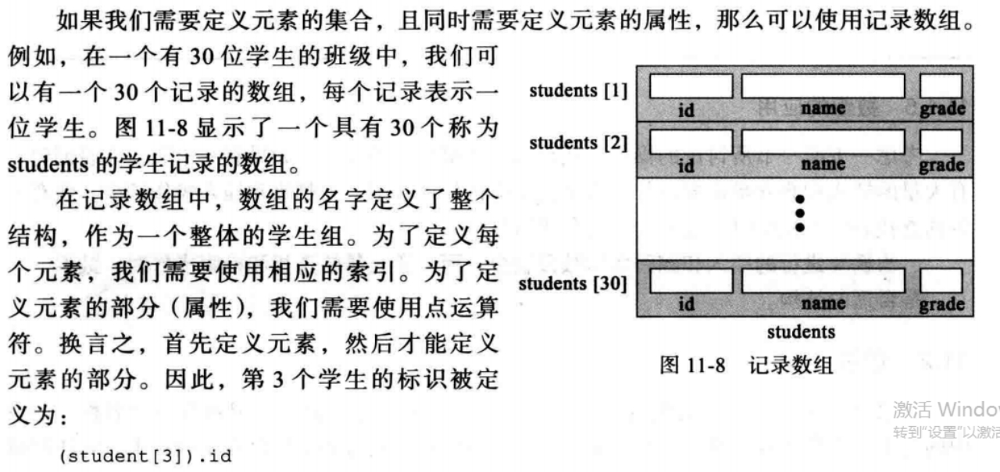

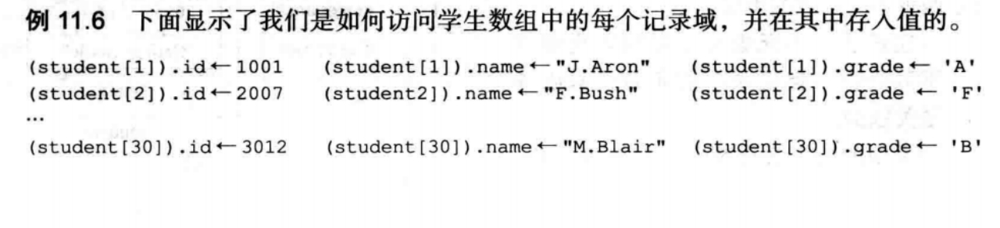

## 链表

链表是一个数据的集合，其中每个元素包含下一个元素的地址，每个元素包含两部分：

- 数据：包含可用信息，并被处理
- 链：将数据连在一起，包含一个指向链表中下一个元素的指针（地址）

一个指针变量标识标识该链表中的第一个元素，链表的名字就是该指针变量的名字

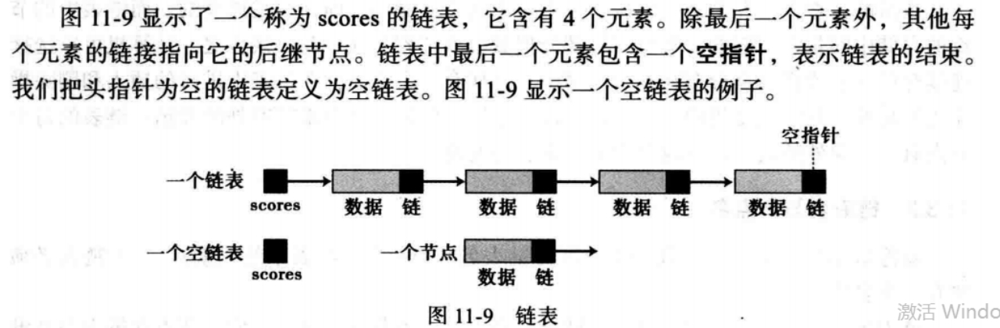

- 节点：链表中的元素称为节点，节点至少包含两个域的记录：一个包含数据，另一个包含链表下一个节点的地址

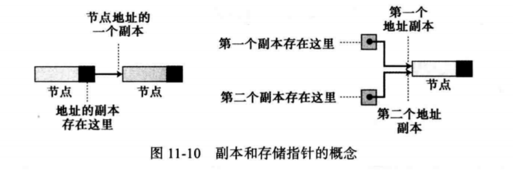

数组与链表的比较

- 数组与链表都能表示内存中的数据项列表
- 数组通过索引（角标）来连接
- 链表通过指向下一个元素的链（地址）来连接
- 数组在内存中的存储空间是连续的，且定义数组之前大小固定
- 链表在内存中的存储空间可以是不连续的，链表大小可扩展

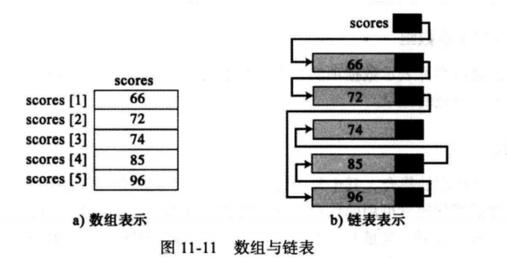

链表名和节点名

- 链表名是头指针的名字，该头指针指向表中第一个节点
- 节点在链表中并没有明显的名字，有的只是隐含的名字，节点的名字与指向节点的指针有关
- 指针：指向节点的指针称为p，则称节点为*p，因为节点是一个记录，使用节点的名字来存取节点中的域

### 链表操作

- 查找链表

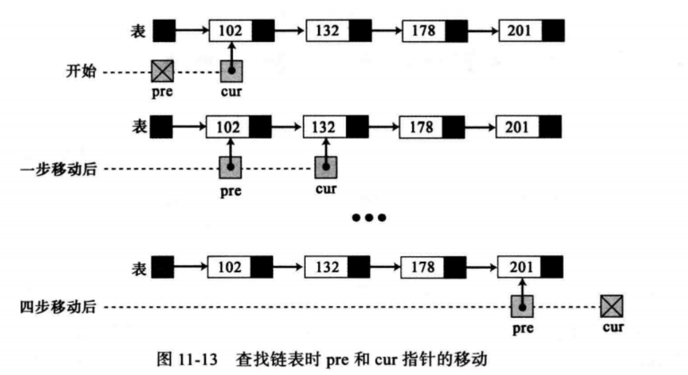

- 插入节点：从开始处插入

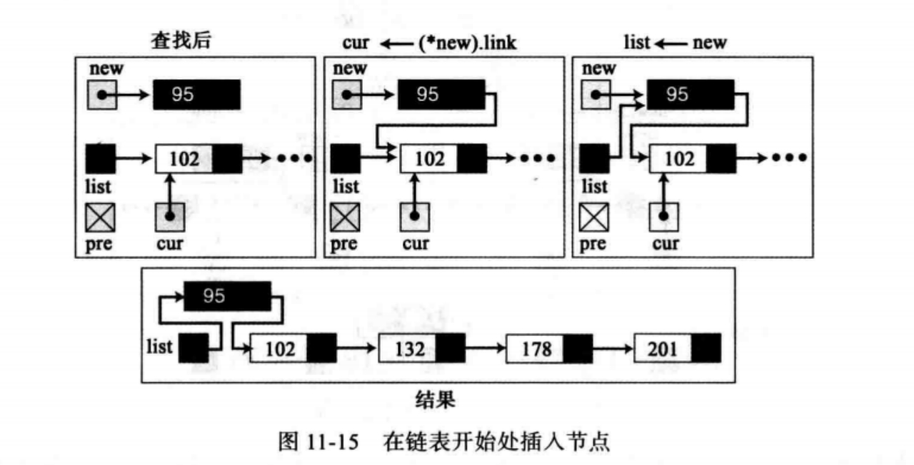

- 插入节点：末尾处插入

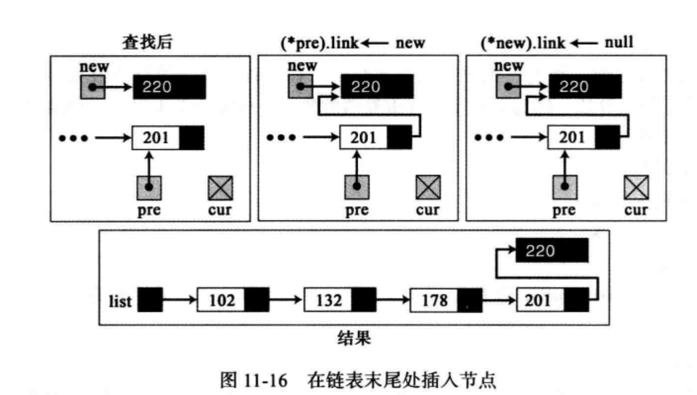

- 插入节点：中间插入

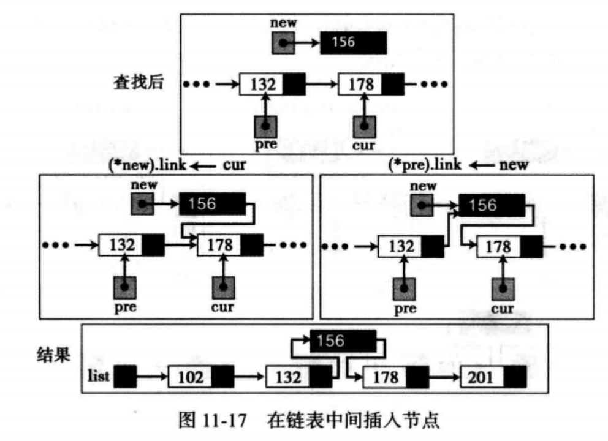

- 删除节点：删除首节点

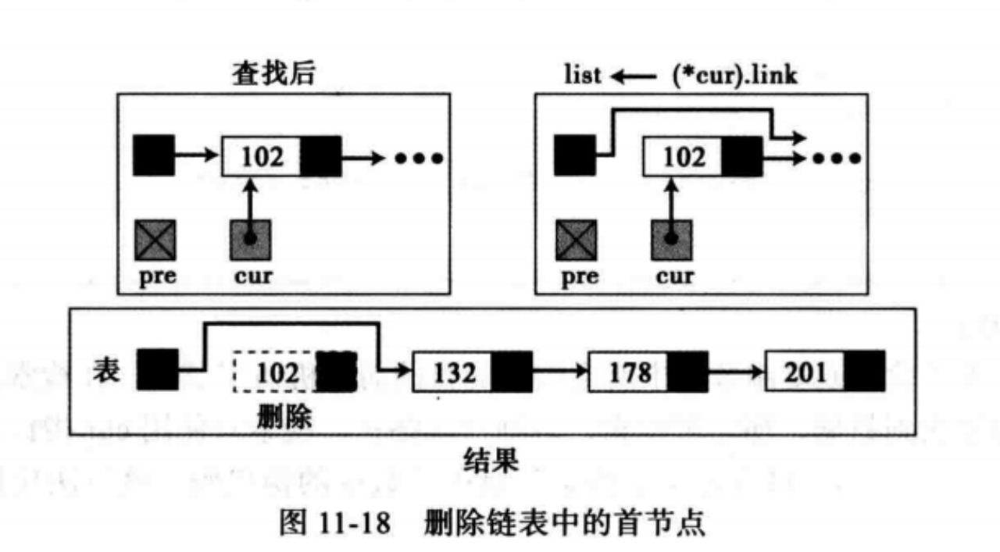

- 删除节点：删除中间或末尾节点

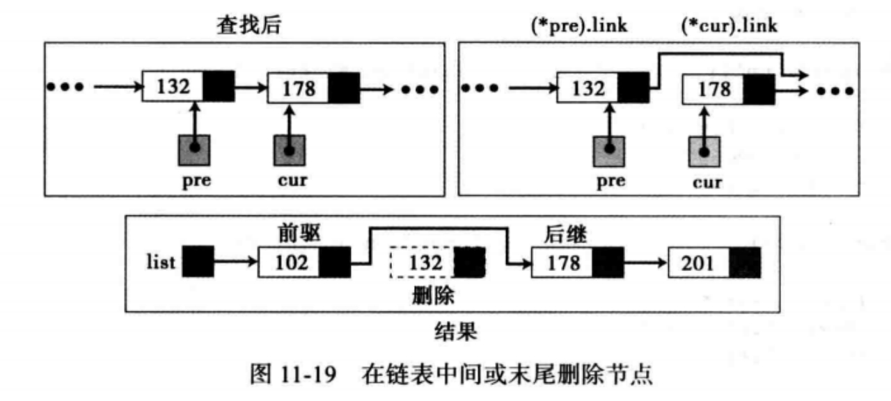

- 遍历链表

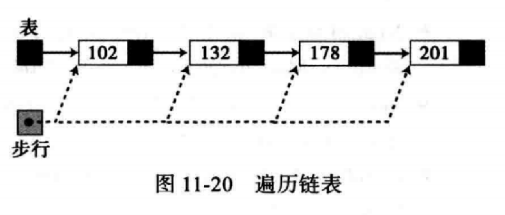

### 链表的应用

如果需要大量的插入和删除，那么链表是合适是结构，但查找一个链表比查找一个数组要慢