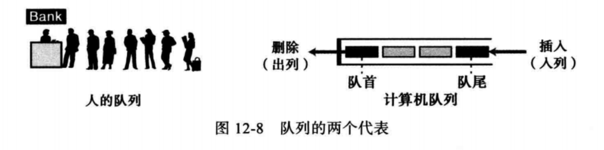

# 第12章 抽象数据类型

- 抽象数据类型（ADT，Abstract Data Type）的概念
- 说明栈、栈上的基本操作、应用和实现
- 说明队列、队列上的基本操作、应用和实现
- 说明广义线性表、广义线性表上的基本操作、应用和实现
- 说明一般树和它的应用
- 说明二叉树和它的应用
- 说明二叉搜索树（BST）和它的应用
- 说明图和它的应用

## 背景

抽象数据类型（ADT，Abstract Data Type）：定义数据类型和对数据的操作，包含了一组对数据操作的定义，而数据和操作的实现是隐藏的（封装）

- 简单抽象数据类型：如整数的ADT，对整数的加减乘除操作

- 复杂抽象数据类型

抽象数据类型的模型

## 栈

栈是一种限制线性表，该类列表的添加和删除操作，只能在一端实现，称为“栈顶”

栈的特点：后进先出（LIFO，last in first out）或先进后出（FILO，first in last out）

### 栈的操作

栈的操作：基本操作有：创建栈、入栈、出栈和判空

- 建栈：创建一个空栈

- 入栈：在栈顶添加新元素

- 出栈：将栈顶的元素的移走

### 栈的实现

栈的实现：栈抽象数据类型可以使用数组或链表来实现

## 队列

队列是一种线性列表，该表中的数据只能在尾部插入，只能在头部删除

队列是先进先出（FIFO，first in first out）结构

### 队列的操作

队列的操作：基本操作：创建队列、入列、出列、判空

- 创建队列：创建一个空队列

- 入列：在队列尾部插入一个数据

- 出列：删除队列头部的数据

### 队列的实现

队列的实现：队列抽象数据类型可以通过数组或链表实现

## 广义线性表

栈和队列都是限制线性表，广义线性表插入、删除等操作可以在其中任何地方进行，可以在表头、表中间或表尾

广义线性表特征

- 元素具有相同的类型
- 元素顺序排序，意味着有第一个元素和最后一个元素
- 除第一个元素外，每个元素都有唯一的前驱，除最后一个元素外，每个元素都有唯一的后继
- 每个元素是一个带有关键字段的记录
- 元素按关键字值排序

### 广义线性表的操作

广义线性表的操作：创建表、插入、删除、检索、遍历和判空

- 创建表：创建一个空表
- 插入操作：由于广义线性表中的数据是有序的，那么插入元素必须保持顺序

- 删除操作

- 检索操作：对单个元素的存取

### 广义线性表的实现

广义线性表的实现：广义线性表抽象数据类型可以通过数组或链表来实现

## 树

树包括一组有限的元素，称为节点，同时包括一组有限的有向线段，用来连接节点，称为弧

没有进入弧的节点称为根

树中的其他节点都可以沿着从根开始的唯一路径到达

### 二叉树

二叉树：没有一个节点所含的子树个树超过两个的树

二叉树是一棵空树或由一个根节点和两棵子树构成，每棵子树也是二叉树

二叉树的操作：创建树（创建一棵空树）、插入、删除、检索、判空、遍历

书籍只讨论二叉树的遍历

#### 二叉树的遍历

二叉树的遍历：按照预定的顺序处理每个节点且仅处理一次，两种遍历次序是深度优先和广度优先

##### 深度优先遍历

- 前序遍历：根被首先访问，接着是左子树，最后是右子树
- 中序遍历：先处理左子树，接着是根，最后是右子树
- 后序遍历：先处理左子树，接着是右子树，最后是根

##### 广度优先遍历

广度优先遍历：一层一层的遍历

#### 二叉树的应用

- 赫夫曼编码
- 表达式树

#### 二叉树的实现

可以使用数组和链表实现，对于删除和插入操作，链表实现的效率要高，所以更常用

### 二叉搜索树

二叉搜索树（BST，Binary Search Tree）：每个节点的关键字值大于左子树中的所有的节点的关键字值，而小于右子树中所有节点关键字值

- BST中序遍历得到一个升序列表
- 可以进行折半查找
- BST的实现

## 图

图是由一组节点（称为顶点）和一组顶点间的连线（称为边或弧）构成的一种抽象的数据类型，图中的一个顶点可以与多个顶点相连

- 有向图：连接两个顶点的边都有从一个顶点到另一个顶点的方向
- 无向图：边是没有方向的

