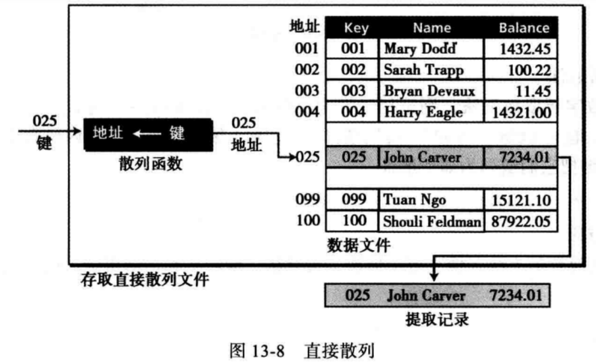

# 第13章 文件结构

- 定义两类存取方法：顺序存取和随机存取
- 理解顺序文件的结构和它们是如何更新的
- 理解索引文件的结构和索引文件与数据文件之间的关系
- 理解散列文件背后的概念
- 描述散列地址冲突是如何解决的
- 定义目录和它们是如何来组织文件的
- 区分文本文件和二进制文件

## 引言

文件存储在辅助存储设备或二级存储设备中，如磁盘和磁带等。

在设计一个文件时，关键问题是如何从文件中检索信息（一个特定的记录），有时需要一个接一个处理记录，有时需要快速存取特定数据

存取方法：

- 顺序存取
  - 如果需要顺序存取记录（一个接一个，从头到尾），使用顺序文件结构
- 随机存取
  - 如果需要存取某一个特定记录而不用检索之前的所有记录，则使用随机存取的文件结构
  - 有两种文件结构都允许随机存取：索引文件和散列文件

## 顺序文件

顺序文件：记录只能按照顺序从头到尾一个接一个地进行存取

EOF：文件末尾标志

更新顺序文件：顺序文件需要定期更新，以反映信息的变化

需要更新的文件：和更新相关的4个文件

- 新主文件：新的永久数据文件
- 旧主文件：需要更新的永久文件
- 事务文件：包含对主文件的改变
  - 添加事务：包含将要追加到主文件中的新数据
  - 删除事务：将要从文件中删除的记录标记出来
  - 更改事务：包含对文件特定记录的修改
- 错误报告文件：文件更新过程中出现的错误清单

键：文件中一个或多个能唯一标识数据的字段

文件更新过程：要使文件更新过程有效率，所有文件都必须按同一个键排序，步骤：

1. 如果事务文件的键小于主文件的键，事务就是增加（A），则将事务增加到新文件中
2. 如果事务文件的键与主文件相同，则
   1. 如果事务是修改（C）则修改主文件数据
   2. 如果事务是删除（D）则将数据从主文件中删除
3. 如果事务文件的键大于主文件的键，将旧文件记录写入新主文件
4. 错误报告：事务添加新文件的键已存在旧文件，事务修改或删除的键不存在旧文件

## 索引文件

在文件中随机存取记录，需要知道记录的地址

索引文件由数据文件组成，它是带索引的顺序文件，索引本身非常小，只占两个字段：顺序文件的键和磁盘的相应记录的地址

## 散列文件

散列文件用一个数学函数（散列函数/哈希函数）来完成映射，用户给出一个键（Key），函数将键映射成地址

散列文件无需额外的索引文件

### 散列方法

直接散列法：键是未经算法处理的数据文件地址

缺点：地址空间浪费

求模法（除余散列法）：用文件大小去除键后，将余数加1作为地址

​					address = (key  mod  listSize ) + 1

尽量使用素数作为列表的大小，将产生更少的冲突

数字析取散列法：选择键中析取的数字作为地址，如从6位的学号中析取3位地址（000~999），可以选择（从左数）第一、第三和第四位数作为地址

​		125870 --> 158

​		122801 --> 128

### 冲突

冲突：冲突的产生是在散列算法为插入键产生地址时，发现该地址已被占用。

### 解决冲突

开放寻址：把要插入的数据存储在下一个地址（地址+1）

链表解决法：

桶散列法：

## 目录

目录是大多数操作系统提供的，用来组织文件

在大多数操作系统中，目录被组织成像树的抽象数据类型（ADT）

UNIX中操作系统中的目录

- 根目录：文件系统层次结构最高层
- 主目录：每个用户都有一个主目录
- 工作目录：即当前目录
- 父目录：是工作目录的直接上层目

路径和路径名：文件系统的每个目录和文件都必须有一个名字

有些文件与其他目录的文件具有相同的名字，为了唯一的标识一个文件，需要指明从根目录到文件的文件路径

- 绝对路径：根目录到文件的文件路径
- 相对路径：相对于工作目录的文件路径
  - 如工作目录是staff，joan目录下的files3的绝对路径和相对路径为

## 文本文件和二进制文件

文本文件：通过字符集解析

二进制文件：图像、音频、视频、文本等

