# 第14章 数据库

- 说明数据库和数据库管理系统（DBMS），并描述DBMS的组成
- 基于ANSI/SPARC定义的DBMS的体系结构
- 说明三种传统的数据库模型：层次、网络和关系
- 描述关系模型和关系
- 理解关系数据库中的操作，这些操作在SQL中相应的命令
- 描述数据库设计的步骤
- 说明ERM和E-R图
- 列出除关系模型外的其他数据库类型

## 引言

数据存储在传统上是使用单独的没有关联的文件，称为平面文件

定义：数据库是一个组织内被应用程序使用的逻辑相一致的相关数据的集合

数据库的优点：

- 冗余少
- 避免数据的不一致
- 效率
- 数据完整性
- 机密性

## 数据库管理系统

DBMS（DataBase Manager System）是定义、创建、维护数据库的一种工具，DBMS允许用户来控制数据库中数据的存取

DBMS由5部分组成

- 硬件：物理上存取数据的计算机硬件
- 软件：用户存取、维护和更新物理数据的实际程序
- 数据（库）：数据是独立于软件的一个实体
- 用户
  - 最终用户：数据库管理员DBA和普通用户
  - 应用程序
- 规程

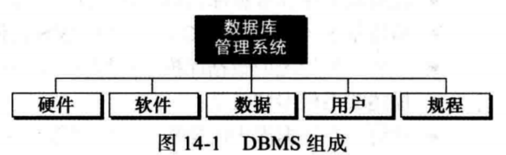

## 数据库体系结构

美国国家标准协会/标准计划和需求委员会（ANSI/SPARC）为数据库管理系统建立了三层体系结构：内层、概念层和外层

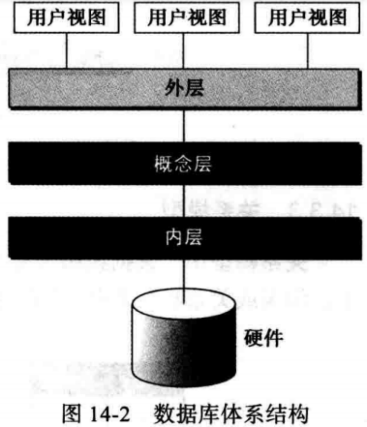

- 内层：决定了数据在存储设备中的实际位置，处理底层的数据存取方法和如何在存储设备间传输字节，内层直接与硬件交互
- 概念层：定义数据的逻辑视图DBMS的主要功能（如增删改查）都在该层，概念层是中介层，使得用户不必与内层打交道
- 外层：直接与用户（最终用户或应用程序）交互，将来自概念层的数据转化为用户熟悉的格式和视图

## 数据库模型

数据库模型定义了数据的逻辑设计，描述了不同数据之间的联系。在数据库发展史中，使用过三种数据库模型：

1. 层次模型
2. 网状模型
3. 关系模型

层次模型：数据被组织成一颗倒置的树，每个实体可以有不同的节点，但只能有一个双亲，层次的最顶端有一个实体，称为根。

层次模型已过时，不再描述

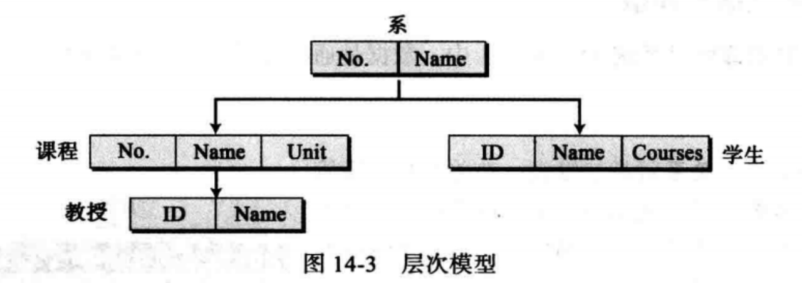

网状模型：实体通过图来组织。图中的部分实体可以通过多条路径来访问

网状模型已过时，不再描述

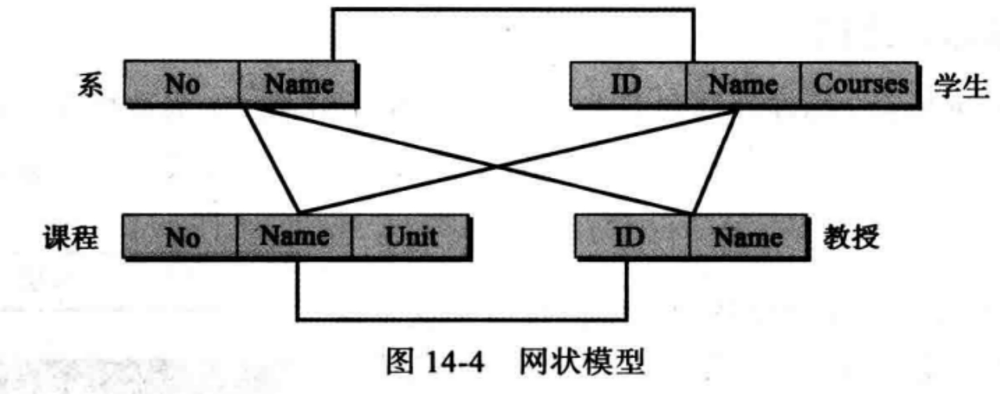

## 关系数据库模型

在关系数据库模型中，数据是通过关系的集合来表示的，从表面上看，关系就是二维表，数据的外部视图是关系和表的集合，但不代表数据以表的形式存储，数据的物理存储与数据的逻辑组织方式毫无关系

关系的特征：

- 名称：每种关系都有唯一的名称
- 属性：关系中的每一列都称为属性，属性在表中是列的头，关系中属性的总数称为关系的度
- 元组：关系中的行叫做元组，元组定义了一组属性值

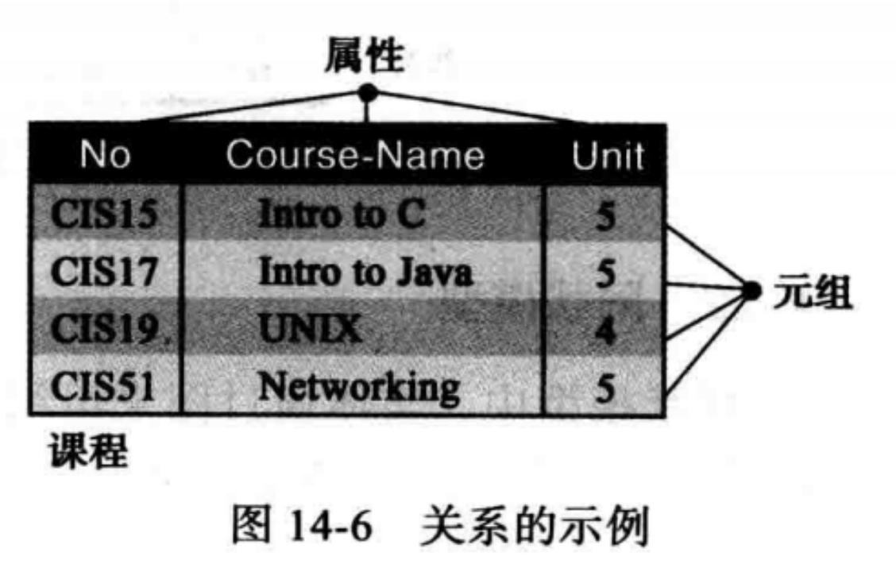

关系的操作

- 插入、删除、更新、选择/查询、投影、连接、并、交、差
- 这些操作通过数据库查询语言SQL（结构化查询语言）来定义

结构化查询语言（SQL）

- SQL是ANSI/ISO用于关系数据库上的标准化语言，是一种描述性的语言
- MYSQL   
- SQLServer 
- Oracle
- ......

插入：是一元操作，应用于一个关系，作用是在表中插入新的元组

- 格式：insert into RELATION-NAME values(xxx,xxx,xxx)

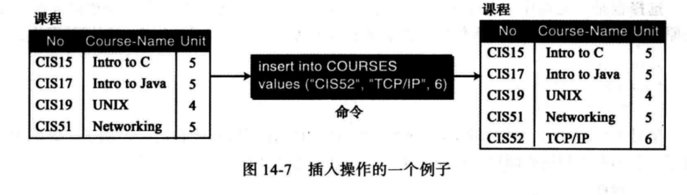

删除：是一元操作，根据要求删除表中相应的元组。

- 格式：delete from  RELATION-NAME where criteria

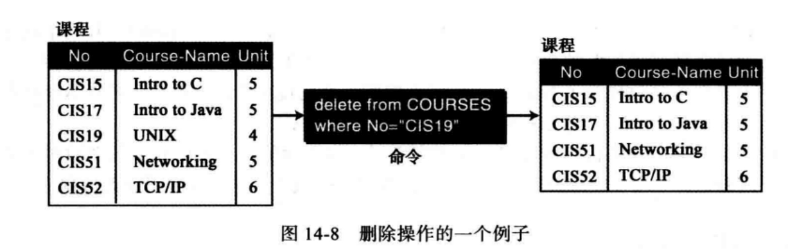

更新：是一元操作，用来更新元组中的部分属性值

- 格式：update  RELATION-NAME   set attribute1 = value1 ,attribute2 = value2, ......  where criteria

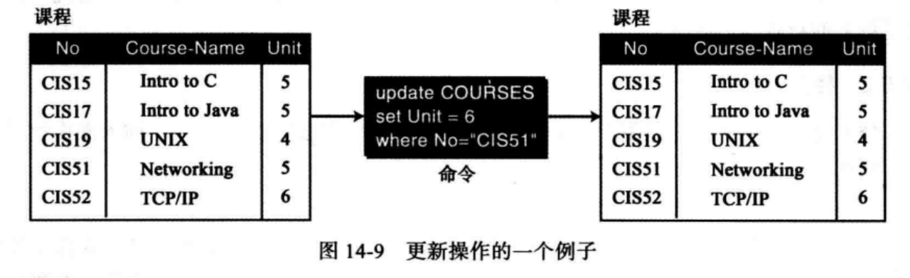

选择/查询：是一元操作，用于一个关系并产生另外一个新关系，新关系中的元组（行）是原关系元组的子集

- 格式：select  *  from RELATION-NAME  where criteria

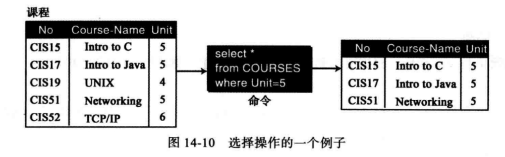

投影：是一元操作，用于一个关系并产生另外一个新关系，新关系中的属性（列）是原关系元组的子集

- 格式：select attribute-list from RELATION-NAME

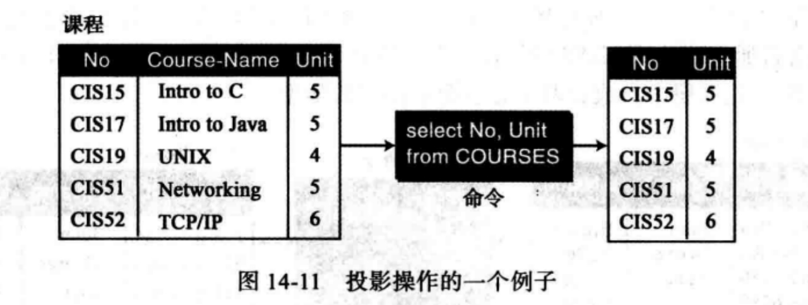

连接：是二元操作，基于共有的属性把两个关系组合起来

- 格式：select attribute-list fromRELATION1，RELATION2     where criteria

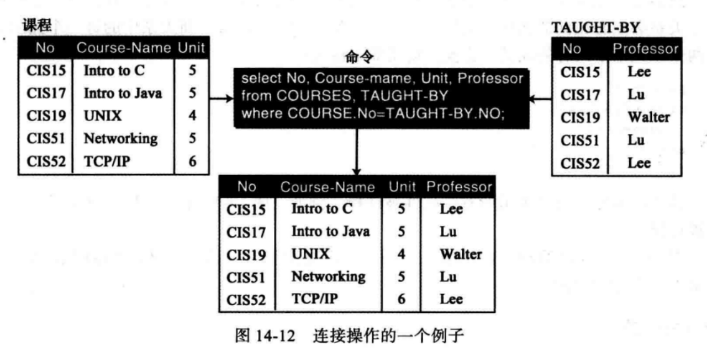

并：是二元操作，将两个关系合并成一个新的关系，有一个限制是两个关系中必须有相同的属性

- 格式：select * from RELATION1 union select * from RELATION2

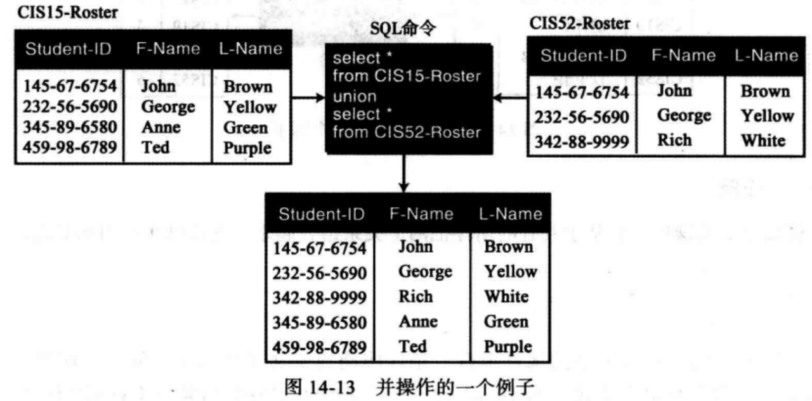

差：是二元操作，应用于具有相同属性的两个关系，生成的关系中的元组是那些存在与第一个关系中而不存在于第二个关系中的元组

- 格式：select * from RELATION1 minus select * from RELATION2

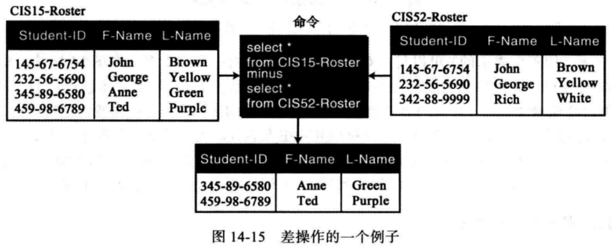

## 数据库设计

实体关系模型（ERM，Entity Relationship Model）：定义了需要维护的实体以及实体的属性，实体和实体之间的关系

实体关系图（E-R图）：使用图形的方式来表示ERM

- 矩形：表示实体集
- 椭圆形：表示属性
- 菱形：表示关系
- 集线：连接属性和实体以及连接实体集和关系集

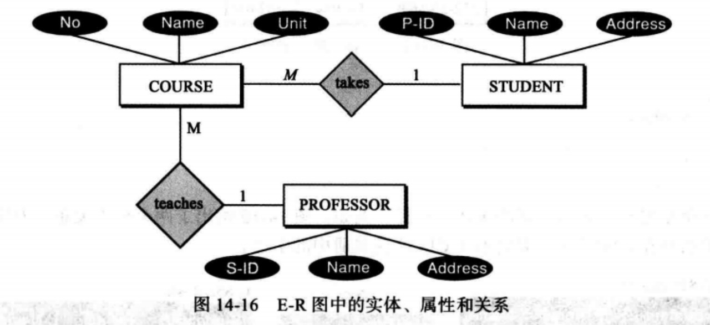

E-R图上的关系

- 实体集上的关系

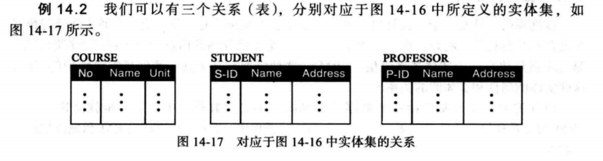

- 关系集上的关系

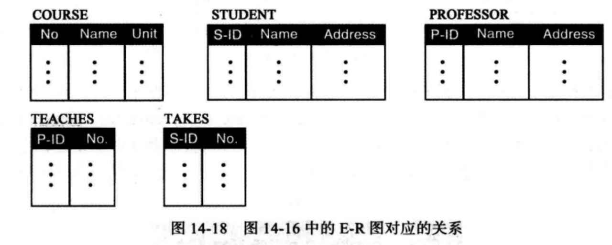

规范化：规范表设计中的一些规则，使得表结构设计更加合理

范式：规范化定义了一组层次范式（NF），包括1NF、2NF、3NF、BCNF（Boyce-Codd范式）、4NF、PJNF、5NF等

- 第一范式（1NF）
- 第二范式（2NF）
- 其他数据库模型
  - 面向对象数据库
