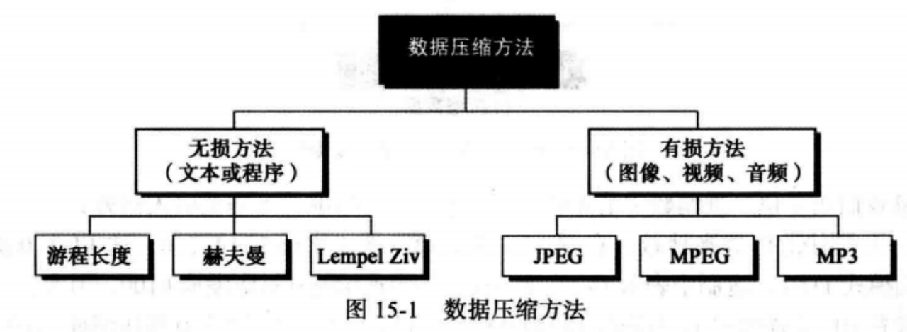
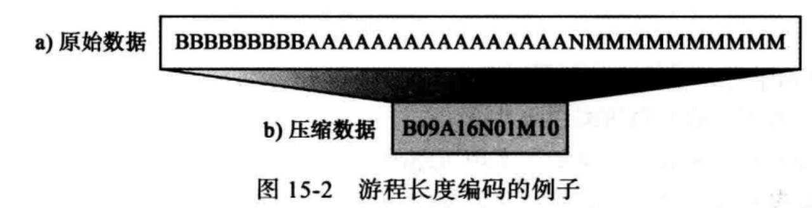
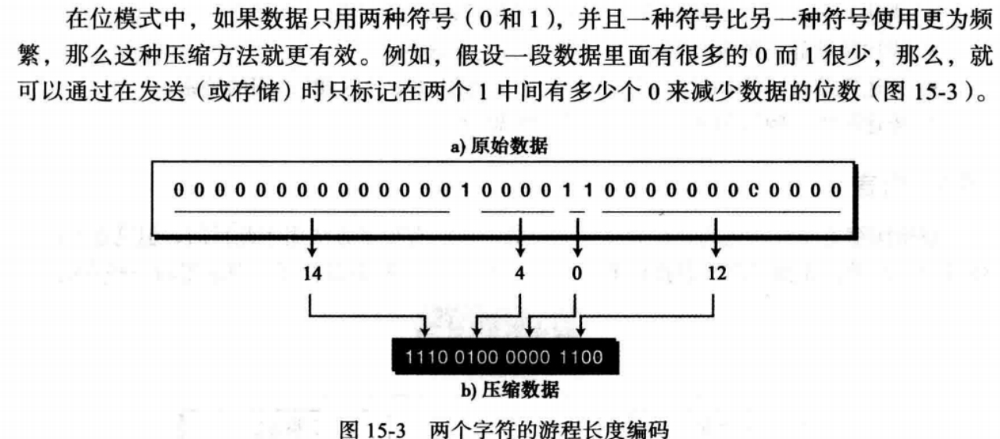
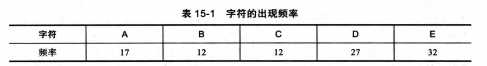
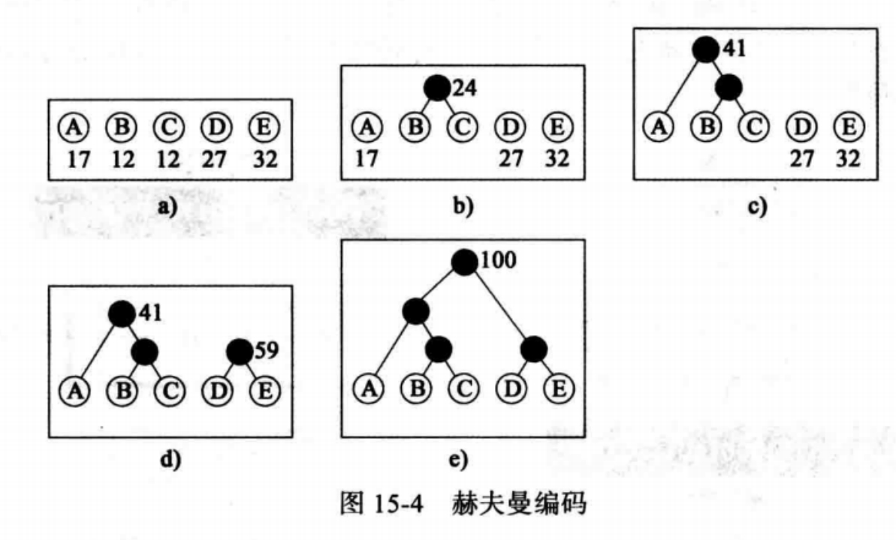
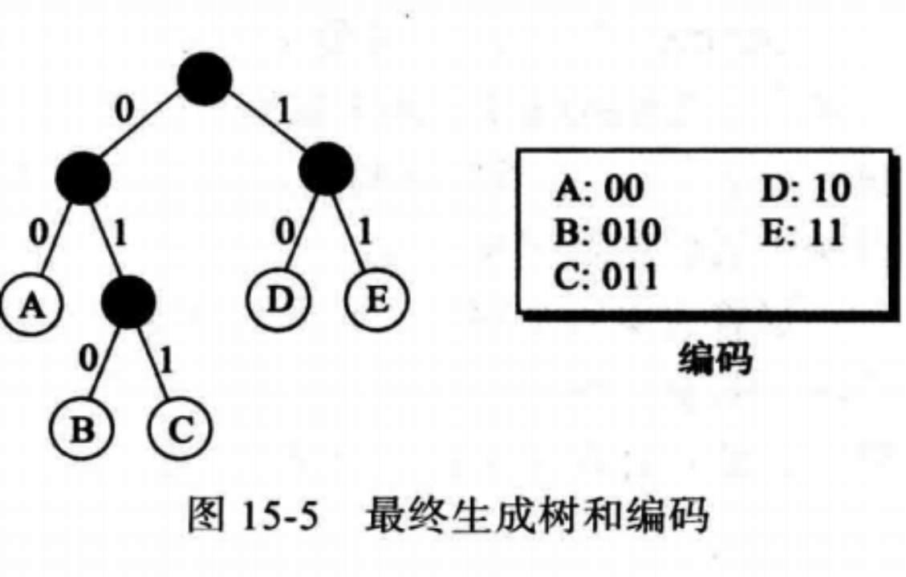
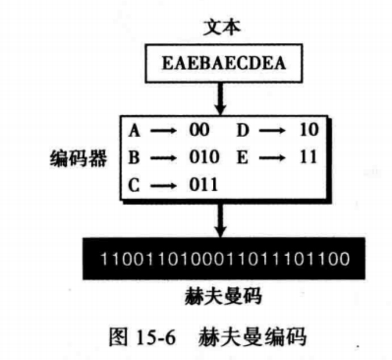
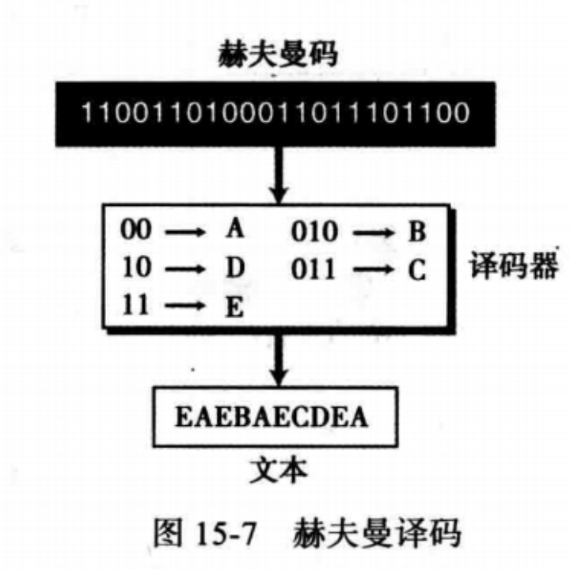

# 第15章 数据压缩

- 区分有损压缩和无损压缩
- 描述游程长度编码和它是如何实现压缩的
- 描述赫夫曼编码和它是如何实现压缩的
- 描述LZ编码以及字典在编码和译码中的作用
- 描述压缩静止图像的JEPG标准背后的主要思想
- 描述压缩视频的MPEG标准背后的主要思想以及它与JPEG间的关系
- 描述压缩音频MP3标准背后的主要思想

## 数据压缩

数据压缩：通过部分消除数据中内在的冗余来减少发送或存储的数据量

压缩的方法分为无损压缩和有损压缩

## 无损压缩

在无损压缩中，数据的完整性是受到保护的，原始数据与压缩和解压后的数据完全一样

压缩和解压算法是完全相反的两个过程，在处理过程中没有数据丢失，冗余数据在压缩时被删除，在解压时再被加回去

三种无损压缩方法：游程长度编码、赫夫曼编码、LZ算法

### 游程长度编码

游程长度编码：用来压缩由任何符号组成的数据，当数据中由0和1表示时十分有效

思想：将数据中连续重复出现的符号用一个字符和这个字符重复的次数来代替，如AAAAAAAA用A08来代替

### 赫夫曼编码

赫夫曼编码：对出现更为频繁的字符分配较短的编码，对出现较少的字符分配较长的编码

示例：假设一篇文章只有ABCDE五个字符组成

步骤

1. 构造赫夫曼树

   找出权值最小的两个节点合成第三个节点

   

2. 给各个字符分配编码，从根开始，给左分支分配0，右分支分配1

   这个编码系统中，没有一个编码是其他编码的前缀（无二义性）

   

3. 编码

   

4. 译码

   赫夫曼编码是一种即时编码

### LZ编码

Lempel Ziv编码：（由Abraham Lempel和Jacob Ziv命名）是基于字典的编码，在通信的时候它将产生一个字符串字典（一个表），如果接受和发送双方都有这样的字典，那么字符串可以由字典中的索引代替，以减少通信的数据传输量

示例：对字符串BAABABBBAABBBBAA进行LZ编码

Lempel Ziv压缩：需要建立字典索引和压缩字符串。

- 算法从未压缩的字符串中选取最小的字符字串，这些字符子串在字典中不存在
- 然后将子字符串复制到字典中并分配索引值
- 压缩时，除了最后一个字母外，其他所有字符被字典中的索引替代
- 然后将索引和最后一个字母插入压缩字符串