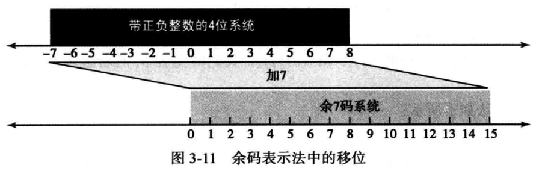

# 第三章 数据存储

- 计算机中的5中不同的数据类型
- 不同的数据类型如何以位模式存储在计算机内部
- 整数如何以无符号格式存储在计算机中
- 整数如何以符号加绝对值格式存储在计算机中
- 整数如何以二进制补码格式存储
- 实数如何以浮点格式存储在计算机中
- 文本如何存储在计算机中
- 音频如何存储在计算机中
- 图像如何存储在计算机中
- 视频如何存储在计算机中

## 数据类型

计算机中使用“多媒体”来定义包含数字、文本、音频、图像、视频的信息

## 计算机内部数据格式

- 位（bit，binary digit缩写）是存储在计算机中的最小单位：0或1，代表设备的某一种状态。

- 位模式（位流）：表示数据的不同类型，多个位组成一个位模式，由16个位组成的位模式，如图：

  

  如果我们需要存储1000个位模式，每个16位，需要16000个开关

- 字节：长度为8的位模式，称为1字节

- 字：指代更长位模式，比如可以表示1个字 = 2字节  或 1个字 = 4字节 等等

正如下图所示，属于不同类型的数据可以以同样的模式存储于内存中。

## 存储数字

在存储到计算机内存之前，数字被转换成二进制系统，但是：

1. 如何存储数字的正负符号
2. 如何显示小数点

### 存储整数

整数是完整的数字（即没有小数部分）。例如，134和-125是整数，而134.23和-0.235则不是。整数可以被当作小数点位置固定的数字：小数点固定在最右边。因此，定点表示法用于存储整数，如下图所示。在这种表示法中，小数点是假定的，但并不存储。

整数通常使用定点表示法存储字内存中。

#### 无符号表示法

**无符号整数**是只包括零和整数的非负整数。它的范围介于0到无穷大之间。然而，由于计算机不可能表示这个范围的所有整数，通常，计算机都定义了一个常量，称为***最大无符号整数***，它的值是（2n-1）。这里的n就是计算机中分配用于表示无符号整数的二进制位数。

存储无符号整数：

输入设备存储无符号整数使用以下步骤：

1. 首先将整数变成二进制数。
2. 如果二进制数不足n位，则在二进制数的左边补0，使它的总位数为n位。如果位数大于n，该整数无法存储。导致***溢出***的情况发生，我们后面要讨论。

#### 无符号表示法示例

例1：将7存储在8位存储单元中，使用无符号表示法。

解	首先将数字转换为二进制数(111)2。加5个0使之总的位数变成8位，即(00000111)2。再将该整数保存在存储单元中。

注意：右下角的2用于强调该整数是二进制的，并不存储在计算机中。

例2：将258存储在16位存储单元中。

解	首先把数字转换为二进制数(100000010)2。加7个0使总位数变成16位，记得到(000000100000010)2。再将该整数存储在存储单元中。

#### 译解无符号整数

输出设备译解内存中位模式的位串并转换为一个十进制的无符号整数。

例：当译解作为无符号整数保存在内存中的位串00101011时，从输出设备返回什么？

解	使用第2章的解题过程，二进制整数转换为十进制无符号整数43。

#### 溢出

因为存储单元位的数量限制，可以表达的整数范围是有限的，在n位存储单元中，可以存储的无符号整数的范围仅为（0～2n-1）。

#### 无符号整数的应用

无符号整数表示法可以提高存储效率，因为不必存储整数的符号。这就意味着所有分配的存储位单元都可以用来存储数字。只要用不到负整数，都可以用无符号整数表示法。具体情况如下：

- **计数**：当我们计数时，不需要负数。可以从1（有时0）开始增长。
- **寻址**：有些计算机语言，在一个存储单元中存储了另一个存储单元的地址。地址都是从0（存储器的第一个字节）开始到整个存储器的总字节数的正数。在这里同样也是不需要用到负数。因此无符号整数可以轻松地完成这个工作。
- **存储其它数据类型**：我们后面将谈到的其它数据类型（文本、图像、音频和视频）是以位模式存储的，可以翻译为无符号整数。

#### 符号加绝对值表示法

用于无符号整数的有效位置（0～2n-1）被分成两个相等的子范围，前部分表示整数，后部分表示负数

- 该系统中有两个0：正0(0000),负0(1000)
- 符号加绝对值存储一个整数时，需要用一个二进制位表示符合（0表示正，1表示负）
- 在最左位用于符号定义（0表示正，1表示负）

#### 符号加绝对值表示法示例

例1：用符号加绝对值表示法将+28存储在8位存储单元中。

解	先把该整数转换成7位的二进制数。最左边位置0，即存储为8位数。

例2：用符号加绝对值表示法将-28存储在8位存储单元中。

解	先把该整数转换成7位的二进制数。最左边位置1，即存储为8位数。

例3：将用符号加绝对值表示法存储的01001101复原成整数。

解	因为最左位是0，符号为负。其余位（1001101）转换成十进制数为77。加上符号为+77。

例4：将用符号加绝对值表示法存储的10100001复原成整数。

解	因为最左位是1，符号为负。其余位（0100001）转换成十进制数为33。加上符号为-33。

#### 符号加绝对值表示法溢出

正负溢出两种情况：

#### 二进制补码表示法

几乎所有的计算机都使用二进制补码表示法来存储n位存储单元中有符号整数

在二进制补码表示法中，最左位决定符号，如果是0，该整数为正，如果是1，该整数为负

反码

简单反转各个位，即把0变成1，把1变成0，该运算不区分正负数。

例1：下面显示我们如何取整数00110110的反码。

例2：下面显示我们如果进行两次反码运算，就可以得到原先的整数

补码（有两种运算方式）

1. 首先，从右边位复制，直到有1被复制，接着反转其余位。
2. 先取整数的反码，再加1（取反加1）

例1：下面显示我们如何取整数00110100的补码。

例2：下面显示我们如果进行两次补码运算，就可以得到原先的整数。

以二进制补码格式存储整数

以二进制补码格式存储整数，计算机遵循以下步骤：

- 将整数变为n位的二进制数
- 如果整数是整数或0，以其原样存储；如果是负数，计算机取其补码存储。

从二进制补码格式还原整数

从二进制补码格式还原整数，计算机遵循以下步骤：

- 如果最左位是1，计算机取其补码。如果最左位是0，计算机不做操作
- 计算机将该整数转换为十进制

例1：用二进制补码表示法将整数28存储在8位存储单元中。

解	该整数是正数（无符号意味正数），因此把该整数从十进制转换成二进制后不再需要其他操作。注意：3个多余的0加到该整数的左边使其成为8位

例2：用二进制补码表示法将整数-28存储在8位存储单元中。

解	该整数是负数，因此在转换成二进制后计算机对其进行补码运算。

例3：将用二进制补码表示法存储在8位存储单元中的00001101还原成整数。

解	最左位是0，因此符号为正。该整数需要转换为十进制并加上符号即可。

例4：将用二进制补码表示法存储在8位存储单元中的11000110还原成整数。

解	最左位是1，因此符号为负。在整数转换为十进制前进行补码运算。

#### 二进制补码表示法溢出

### 存储实数

#### 定点表示法

实数是带有整数部分和小数部分的数字

在十进制系统中，假定我们用一种小数点右边两个码数，左边14个码数，总共16个码数的定点表示法。那么如果试图表示十进制数1.00234，该系统的实数精度就会受损。该系统把这个数字存储为1.00。

在十进制系，假定用一种小数点右边6个码数，左边10个码数，总共16个码数的定点表示法。那么如果试图表示十进制数236 154 302 345.00，该系统实数精度就会受损。该系统就会把这个数字存储为6 154 302 345.00。整数部分比实际小了很多。

带有很大的整数部分或很小的小数部分的实数不应该用定点表示法存储

#### 浮点表示法

用于维持正确度或精度的解决方法是使用**浮点表示法**。该表示法允许小数点浮动：我们可以在小数点的左右有不同数量的数码。使用这种方法极大地增加了可存储的实数范围：带有很大的整数部分或很小的小数部分的实数可以存储在内存中了。在浮点表示法中，无论十进制还是二进制，一个数字都由3部分组成，如图

第一部分是符号，可正可负。第二部分显示小数点应该左右移动构成实际数字的位移量。第三部分是小数点位置固定的定点表示法

浮点表示法在科学中用于表示很小或很大的十进制数。在称作***科学计数法***的表示法中，定点部分在小数点左边只有1个数码而且位移量是10的幂次。

例1：下面演示科学计数法（浮点表示法）表示的十进制数7 425 000 000 000 000 000 000.00。

解	

例2：用科学计数法表示数字-0.000 000 000 000 03 2。

解	使用前例同样的方法，将小数点移到数码2之后，如下所示：

#### 规范化

为了使表示法的固定部分统一，科学计数法（用于十进制）和浮点数表示法（用于二进制）都在小数点左边使用了唯一的非零数码，这称为规范化。十进制系统中的数码可能是1~9，而二进制系统中该数码是1。在下面，d是非零数码，x是一个数码，y是0或1。

#### 符号、指数和尾数

在一个二进制数规范化后，我们只存储了一个数的三部分信息：符号、指数和尾数（小数点右边的位）。例如，+1000111.0101规范化后变成为：

**注意：小数点和定点部分左边的位1并没有存储，它们是隐含的**

#### 余码系统

尾数可以作为无符号数存储。指数（即显示多少位小数点应该左移或右移的幂次）是有符号的数。尽管这可以用二进制补码表示法来存储，但被一种称为余码系统的新的表示法取而代之。在该余码系统中，正的和负的整数都可以作为无符号数存储。为了表示正的或负的整数，一个正整数（**称为一个偏移量**）加到每个数字中，将它们统一移到非负的一边。这个偏移量的值是2m-1，m是内存单元存储指数的大小。

例：我们可以用4位存储单元在数字系统中表示16个整数。使用一个单元作为0，分开其它15个（不等地）我们可以在-7~8的范围中表示整数，如图3-11所示。在该范围中增加7个单位到每个整数中，可以统一把所有整数向右移，使其均为整数而无需改变这些整数的相对位置，避免了相互调整，如图3-11所示。新系统称为余7，或着偏移量为7的偏移表示法。

这种新的方法与移位前的表示法相比，其优点在于在余码系统中的所有整数都是正数，当我们对这些整数进行比较或运算时不需要考虑符号。对于4位存储单元，如我们希望的那样，偏移量是24-1-1=7。

#### 余码系统单精度

**IEEE标准**

电气和电子工程师协会（IEEE）已定义几种存储浮点数的标准。这里我们讨论其中两种最常用的——单精度和双精度。该格式如图3-12所示。方框上的数就是每一项的位数。

单精度格式采用总共32位来存储一个浮点表示法的实数。符号占用1位（0为正，1为负），指数占用8位（使用偏移量127），尾数使用23位（无符号数）。该标准有时称为余127码（Excess_127），因为偏移量是127。

#### 余码系统双精度

双精度数格式采用总共64位来存储一个浮点表示法的实数。符号占用1位（0为正，1为负），指数占用11位（使用偏移量1023），尾数使用52位。该标准有时称为余1023码（Excess_1023），因为偏移量是1023。表3-2总结了这两种标准的规格。

​																		**表3-2	两种IEEE浮点标准的规格**

| 参数                 | 单精度 | 双精度 |
| -------------------- | ------ | ------ |
| 内存单元大小（位数） | 32     | 64     |
| 符号大小（位数）     | 1      | 1      |
| 指数大小（位数）     | 8      | 11     |
| 尾数大小（位数）     | 23     | 52     |
| 偏移量（整数）       | 127    | 1023   |

#### 余码系统存储实数

参照表3-12，使用以下步骤，一个实数可以存储为IEEE标准浮点格式：

1. 在S中存储符号（0或1）。
2. 将数字转换为二进制。
3. 规范化
4. 找到E和M的值
5. 连接S、E和M

- 例1：写出十进制数5.75的余127码（单精度）表示法。

解：

1. 符号为正，所以S=0。
2. 十进制转换为二进制：5.75=(101.11)2。
3. 规范化：(101.11)2=(1.0111)2x22。
4. E=2+127=129=(10000001)2，M=(0111)2，我们需要在M的右边增加19个0使之成为23位。
5. 该表示法如下所示：

存储在计算机中的数字是01000000101110000000000000000000

- 例2：写出十进制数 -161.875的余127码(单精度)表示法 。

解：

1. 符号为负，所以S=1。
2. 十进制转换为二进制：161.875=(10100001.111)2。
3. 规范化：(10100001.111)2=(1.0100001111)2x27。
4. E=7+127=134=(10000110)2，M=(0100001111)2。
5. 该表示法如下所示：

存储在计算机中的数字是11000011010000111100000000000000。

- 例3：写出十进制数-0.0234375的余127码（单精度）表示法。

解：

1. S=1（负数）
2. 十进制转换为二进制：0.0234375=(0.0000011)2。
3. 规范化：(0.0000011)2=(1.1)2x2-6。
4. E=-6+127=121=(01111001)2，M=(1)2。
5. 该表示法如下所示：

存储在计算机中的数字是10111100110000000000000000000000。

#### 余码系统实数还原

一个以IEEE浮点格式之一存储的数字可以用以下步骤方法还原：

1. 找到S、E和M的值。
2. 如果S=0，将符号设为正号，否则设为负号。
3. 找到位移量（E-127）。
4. 对尾数去规范化。
5. 将去规范化的数字变为二进制以求出绝对值。
6. 加上符号。

例：位模式(11001010000000000111000100001111)。以余127码格式存储于内存中,求该数字十进制计数法的值。

解：

1. 首位表示S，接下来8位是E，剩下23位是M。
2. 符号为1，为负号。
3. 位移量=E-127=148-127=21。
4. 将(1.00000000111000100001111)2x221去规范化。
5. 二进制数是(1000000001110001000011.11)2。
6. 绝对值是2104378.75。
7. 该数字是-2104378.75。

### 存储文本

#### 编码表

**ASCII**

美国国家标准协会(ANSI)开发了一个被称为美国信息交换标准码(ASCIID)的代码。该代码使用7位表示每个符号。即该代码可以定义2“=128种不同的符号。用于表示ASCII码的完整位模式可见附录A。如今ASCII是Unicode的一部分,下面将要讨论。

**Unicode**

硬件和软件制造商联合起来共同设计了一种名为Unicode的代码,这种代码使用32位并能表示最大达2“=4294967296个符导。代码的不同部分被分配用于表示来自世界上不同语言的符号。其中还有些部分被用于表示图形和特殊符号。Unicode符号的简集见附录A。如今ASCII是Unicode的一部分。

**其它编码**

最近几十年来,其他编码不断发展。鉴于Unicode的优势,这些编码变得不太流行。我们把了解这些编码作为练习。

### 存储音频

音频表示声音或音乐。音频本质上与我们讨论到现在的数字和文本是不同的。文本由可数的实体(文字)组成:我们可以数出文本中文字的数量。文本是数字数据的一个例子。相反,音频是不可数的。音频是随时间变化的实体,我们只能在每一时刻度量声音的密度。当我们讨论用计算机内存存储声音时,我们的意思是存储一个音频信号的密度,例如,每隔一段时间(一秒钟,一小时)来自麦克风的信号。

音频是模拟数据的例子。即使我们能够在一段时间度量所有的值,也不能把它全部存在计算机内存中,因为可能需要无限数量的内存单元。图3-15显示了一个模拟信号随时间变化的本质,如音频。

#### 采样

如果我们不能记录一段间隔的音频信号的所有值,至少我们可以记录其中的一些。采样意味着我们在模拟信号上选择数量有限的点来度量它们的值并记录下来。图3-16显示了从这样的信号上选择10个样本:我们可以记录这些值来表现模拟信号。

#### 量化

从每个样本测量来的值是真实的数字。这意味着我们可能要为每一秒的样本存储40 000个真实的值。但是,为每个样本使用一个无符号的数(位模式)会更简便。量化指的是将样本的值截取为最接近的整数值的一种过程。例如,如果实际的值为17.2,就可截取为17;如果值为17.7,就可截取为18。

#### 编码

下面的任务是编码。量化的样本值需要被编码成位模式。一些系统为样本赋正值或负值,另一些仅仅移动曲线到正的区间从而只赋正值。换言之,一些系统使用无符号整数来表示样本,而另一些使用有符号的整数来做。但是,有符号的整数不必用在二进制补码中,它们可以是符号加绝对值的值。最左边的位用于表示符号(0表示正值,1表示负值),其余的位用于表示绝对值。

- 每样本位

对于每个样本系统需要决定分配多少位。尽管在过去仅有8位分配给声音样本,现在每样本16、24甚至32位都是正常的。每样本位的数量有时称为位深度。

- 位率

如果我们称位深度或每样本位的数量为B,每秒样本数为5,我们需要为每秒的音频存傅5 x 8位。该乘积有时称为位率R。例如,如果我们使用每秒40 000个样本以及每样本16位,位率是R=40 000 x 16= 640 000 b/s = 640 KB/s。

### 存储图像

#### 光栅图

当我们需要存储模拟图像(如照片)时,就用到了**光栅图(或位图)**。一张照片由模拟数据组成,类似于音频信息。不同的是数据密度(色彩)因空间变化,而不是因时间变化。这意昧着数据需要采样。然而,这种情况下采样通常被称作扫描。样本称为**像素(代表图像元素)**。换言之,整个图像被分成小的像素,每个像素假定有单独的密度值。

- 解析度

就像音频采样那样,在图像扫描中,我们要决定对于每英寸的方块或线条需要记录多少像素。在图像处理中的扫描率称为**解析度**。如果解析率足够高,人眼不会看出在重现图像中的不连续。

- 色彩深度

用于表现像素的位的数量,即色彩深度,依赖于像素的颜色是如何由不同的编码技术来处理的。对颜色的感觉是我们的眼普如何对光线的响应。我们的眼睦有不同类型的感光细胞:一些响应红、黄、蓝三原色(也叫RGB),而另一些仅仅响应光的密度。

1）真彩色

用于像素编码的技术之一称为真彩色,它使用24位来编码一个像素。在该技术中,每个三原色(RGB)都表示为8位。因为该技术中8位模式可以表示0一255之间的一个数,所以每种色彩都由0一255之间的三维数字表示。表3-4显示了该技术中用于一些颜色的3个值。表3-4定义为真彩色的一些颜色

注意:真彩色模式可以编码224或16777216种颜色。换言之,各个像素的色彩深度是这些值的其中之一。

2）索引色

真彩色模式使用了超过1600万种的颜色。许多应用程序不需要如此大的颜色范围。索引色(或调色板色)模式仅使用其中的一部分。在该模式中,每个应用程序从大的色彩集中选择一些颜色(通常是256种)并对其建立索引。对选中的颜色赋一个0一255之间的值。这就类似艺术家可能在他们的画室用到很多种颜色,但一次
仅用到他们调色板中的一些。

图3-17示意了索引色的思路。

对索引的使用喜少了需要存储一个像素所需要的位的数量。例如,真彩模式需要24位来储存一个像素,索引色模式通常使用256个索引,这需要8位来存储同样的像素。例如,一部高质量的数码相机要用几乎3百万像素拍摄一张3X5英寸的相片。以下显示使用各种模式存储所需要的位的数量。

- 图像编码标准

几种用于图像编码的实际标准正在使用中。JPEG(联合图像专家组)使用真彩色模式,但压缩图像来减少位的数量(参见第15章)。古一方面,GIF(图形交换格式)使用索引色模式。

#### 矢量图

光栅图有两个缺点,即文件体积太大和重新调整图像大小有麻烦。放大光栅图像意味着扩大像素,所以放大后的图像看上去很粗糙。但是,矢量图图像编码方法并不存储每个像素的位模式。一个图像被分解成儿何图形的组合,例如,线段、矩形或圆形。每个几何形状由数学公式表达。例如,线段可以由它端点的坐标描述,圆可以由它的圆心坐标和半径长度来描述。矢量图是由定义如何绘制这些形状的一系列命令构成的。

当要显示或打印图像时,将图像的尺寸作为输入传给系统。系统重新设计图像的大小并用相同的公式画出图像。在这种情况下,每一次绘制图像,公式也将重新估算一次。因此,矢量图也称为几何模型或面向对象图形。

例如，考虑半径为r的圆形。程序需要绘制该圆的主要信息如下:

- 一个圆的半径r。

- 圆心的位置。

- 绘制的线型和颜色。

- 填充的类型和颜色。

当该圆的大小改变时,程序改变半径的值并重新计算这些信息以便再绘制一个圆。改变图像大小不会改变绘图的质量。

#### 光栅图&矢量图对比

- 光栅图

  优点：可以存储图片的精细部分

  缺点：文件体积大、重新调整图片大小影响图片画质

- 矢量图

  优点：文件体积小

  缺点：存储的图片不精细

### 存储视频

视频是图像(称为帧)在时间上的表示。一部电影就是一系列的帧一张接一张地播放而形成运动的图像。换言之,视频是随空间(单个图像)和时间(一系列图像)变化的信息表现。所以,如果知道如何将一幅图像存储在计算机中,我们也就知道如何存储视频;每一幅图像或帧转化成一系列位模式并储存。这些图像组合起来就可表示视频。需要注意现在视频通常是被压缩存储的。在第15章,我们将讨论MPEG,这是一种常见的视频压缩技术